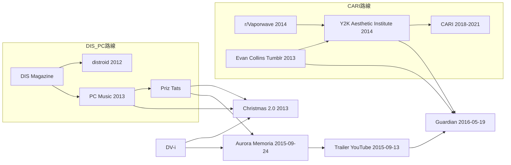

# CARI 横断調査ノート

> 作成日：2026年6月  
> 目的：CARI 前史（Evan Collins・Y2K 美学）と、DIS Magazine／PC Music 系譜の**遠回りな接続**を記録する。年表の正本は [`CARIの歴史.md`](./CARIの歴史.md)（cari.institute 由来）。本ノートは草稿第5章 `## CARIの起源`（L780 付近）への追記候補を整理する。  
> **タスク**：調査＝[`next_tasks.md`](./next_tasks.md) **cari-inv**／草稿反映＝**cari-draft**（**src-2・src-4 後**）。結論の問いかけ＝**concl-1**。  
> 方針：因果を断定せず、時期・媒体・人物の接点として記録。正文反映時は公開 URL のみ。

---

## 目次

1. [Evan Collins の年齢（Guardian 2016）](#1-collins年齢)
2. [Guardian「Y2K aesthetic」記事（2016-05-19）](#2-guardian-y2k)
3. [Priz Tats（オンラインレーベル）](#3-priz-tats)
4. [Christmas 2.0（2013-12-18）— DIS × PC Music × Priz Tats](#4-christmas-20)
5. [Aurora Memoria（2015）— Neo-Y2K と Guardian での再登場](#5-aurora-memoria)
6. [接続の整理：CARI 路線と DIS／PC Music 路線](#6-接続整理)
7. [草稿への組み込みメモ](#7-草稿メモ)
8. [要確認](#8-要確認)
9. [Facebook グループと制度化の段階](#9-facebook-制度化)

---

## 1. Evan Collins の年齢（Guardian 2016）

[The Guardian（Leigh Alexander）「The Y2K aesthetic: who knew the look of the year 2000 would endure?」](https://www.theguardian.com/technology/2016/may/19/year-2000-y2k-millennium-design-aesthetic)（2016年5月19日）では、Y2K 美学 Facebook コミュニティのキュレーターとして建築家 **Evan Collins, 26** と紹介されている。

| 年 | Collins の推定年齢 |
|---|---|
| 2013年9月（Tumblr 着想投稿） | **23歳前後**（2016年時点で26歳なら、2013年は23歳） |
| 2014年9月（r/Vaporwave 投稿） | 24歳前後 |
| 2016年5月（Guardian 掲載） | 26歳（記事本文） |

**コメント**：[`CARIの歴史.md`](./CARIの歴史.md)・草稿 L782 の 2013-09-30 起点と照合すると、Collins の個人アーカイブは**大学院／初期キャリア期の副業**に近いタイミングで始まっている。CARI 制度化（2017〜2021）までの「個人→コミュニティ」期と年齢層が重なる。

---

## 2. Guardian「Y2K aesthetic」記事（2016-05-19）

| 項目 | 内容 |
|---|---|
| URL | https://www.theguardian.com/technology/2016/may/19/year-2000-y2k-millennium-design-aesthetic |
| 著者 | Leigh Alexander |
| 日付 | 2016年5月19日（Technology 欄） |

### 記事が位置づけるもの

- **Y2K aesthetic**：2000年前後のテクノ楽観主義のビジュアル文化（金属調素材、インフレータブル家具、バブルポップ SE、Matrix 的 UI など）
- **vaporwave**：「mid to late-1990s desktop software and the early web」を世代の記憶から再構成する音楽／デジタルアートの動きとして言及
- **Evan Collins**：Facebook グループのキュレーション、建築・工業デザイン・ファッション横断のアーカイブ。vaporwave が「prior eras」を探索する方法に触発され、**late 1990s–early 2000s が vaporwave シーンで十分に掘られていない**ことに気づいた、と記事は Collins の言葉として紹介する
- **Neo-Y2K**：2016年時点で Y2K 美学の再訪。記事は **PC Music（SOPHIE & QT）**、Matrix 風ファッションショー、DOSSWORLD 等のサイトリデザインを例に挙げる

### vaporwave 段落と Collins の「隙間」論（記事の要部）

記事は vaporwave を、Y2K 美学コミュニティの**方法論的モデル**として先に位置づける。続けて Collins の発言で、**vaporwave が十分に掘っていない時代層**を Y2K 側が埋める、という論理を組み立てる。

> "A robust music and digital art movement known as vaporwave examines the aesthetics of mid to late-1990s desktop software and the early web from the perspective of a generation barely old enough to remember them."

> "Inspired by the way vaporwave summons a time period by sourcing specific materials, Collins says: 'I realised that the late 1990s and early 2000s hadn't been explored or researched in the vaporwave scene as much as prior eras.'"

**編集上の含意**：

1. **vaporwave＝先行する美学考古学**、**Y2K／CARI＝その隙間の充填**という叙述が、2016年時点ですでにメディア化されていた
2. 草稿 L788「起点は r/Vaporwave」と整合するが、Guardian は Collins の動機を **vaporwave 全体の方法**（特定素材の収集で時代を召喚する）として説明している。**Reddit 投稿は発火点、vaporwave は参照枠**という二層
3. 「prior eras」対「late 1990s–early 2000s」の対比は、vaporwave が 80年代商業文化・初期ウェブを主戦場にしていたという当時の共通認識を反映する。CARI の制度化（命名・サブジャンル分割）は、この**未探索層を意図的に掘る**活動として読める

### Neo-Y2K の再来：PC Music（SOPHIE & QT）

Y2K 美学の「復活」節で、記事は Collins の言葉を通じて **PC Music** を Neo-Y2K の音楽例として挙げる。SOPHIE & QT に言及する。

> "Although it was short-lived, the Y2K aesthetic could be on its way back, as fans in the online creative community rediscover the appeal of the time period – now, with even fewer limitations on the design goals of the time."

> "'It's interesting right now to look at ridiculous imagery and concepts, the excessively blobby electronics, or predictions of endless prosperity,' Collins says. 'The record label PC Music, particularly SOPHIE & QT, seems very inspired by the bouncy, blippy sounds of Y2K-era pop music. There even was a Matrix-inspired fashion show a few years back incorporating Y2K looks and motifs. In addition, the revival of futuristic web design can be seen at sites like DOSSWORLD.'"

**接続の整理**：

| 要素 | 記事内の位置づけ | 草稿との関係 |
|---|---|---|
| PC Music（SOPHIE & QT） | Y2K ポップの「バウンシーでブリッピーな音」の再来 | 第2章 `## PC Musicという継承`（L456 付近）と**同一年のメディア並置** |
| Matrix 風ファッションショー | ビジュアル復活の例 | CARI 節とは独立。Neo-Y2K の広がりの一例 |
| DOSSWORLD | futuristic web design の復活 | サイトリデザインとして言及のみ |

**注意**：Collins が PC Music を「Y2K ポップに触発された」と読んだのは**彼の解釈**であり、AG Cook／SOPHIE 側の自己記述ではない。草稿では「Guardian 2016 が vaporwave 系アーカイブ（Collins）と PC Music を同一の Neo-Y2K 表層で並べた」事実として書くのが妥当（§6 の遠回り接続）。Christmas 2.0（2013）が DIS × PC Music × Priz Tats で既に接点を作っていたこととも、**時期の重なり**として並記できる。

### Neo-Y2K「より true」論（Aurora Memoria への橋渡し）

記事は技術条件の変化（高速インターネット、レンダリングソフトの低価格化）を経て、新しい Neo-Y2K 作品が**模倣対象より「より true」に感じられる**ことがある、と述べる。続けて Aurora Memoria トレーラー等を例示する（§5 参照）。

> "Now with faster internet, a robust community infrastructure online, and more rendering software available at lower prices, artists are able to revisit the Y2K aesthetic and go even further with it – fascinatingly, some of these new pieces feel more 'true' than the more constrained works they emulate."

**コメント**：「Neo-Y2K」は単なるノスタルジーの反復ではなく、**制約の少ない再実装**として書かれている。Priz Tats／DV-i の Aurora Memoria が Collins ギャラリー画像を借用した事例として同じ段落に入るのは、この「より true」論の具体例として機能する。

### 結論部の問いかけ

記事末尾は、Y2K 美学の議論から**現在進行形の時代診断**へ視点を広げる。

> "Perhaps in the future people will be able to suss out the threads of American election anxiety, global refugee crisis, or the dark comedy of Silicon Valley culture in the music, architecture and design of today. Do the streamlined, android-inspired fashion trends seen at the 2016 Met Gala point to an imminent boom for cybernetics, virtual reality and AI? What will the aesthetics of this period of time look like with a decade's hindsight – and what might they reveal about us that we can't see in the present?"

**編集上の含意**：

1. タイトル（*who knew the look of the year 2000 would endure?*）と対応し、美学研究を**未来の回望**へ接続する締め方
2. Collins／Facebook グループの「discuss and define」と同型で、**現在のデザインから時代の不安や欲望を読み解く**という CARI 的野心が、記事全体のフレームになる
3. 草稿第5章や序文の「美学の制度化」論に、**結論1文**として取り込む余地がある（分量は最小限）。本文では 2016 Met Gala や VR ブーム等の個別検証は不要

### Aurora Memoria の言及（Neo-Y2K 例）

記事は Neo-Y2K デジタルアートの例として、**Aurora Memoria** のトレーラーを挙げる（「album that is also a visual novel」）。トレーラー映像は Collins のオンラインギャラリーから借用された画像で構成されている、と記事は述べる。対応する YouTube 映像は [§5-1](https://www.youtube.com/watch?v=FV4RxtxVOEk)（2015-09-13 公開）と整合。

> "The stamp of Neo-Y2K digital artists can be seen in the intro to this trailer for Aurora Memoria, an album that is also a visual novel, in the portfolio for Valeris Media, and in some collages made by Terrell Davis, a member of the Y2K Facebook group. This music video is composed of images borrowed from Collins' online gallery, and video clips curated from the time."

**コメント**：Guardian 記事は、**Collins の Y2K キュレーション**と**Aurora Memoria（Priz Tats／DV-i）**を同一の「Neo-Y2K」文脈で並置している。草稿が CARI を「vaporwave コミュニティからの分類活動」として書くとき、この 2016 年記事は**メディアがすでに vaporwave と Y2K 再訪を同じ表層で接続していた**例として使える。詳細は §5。

### 出自（Tumblr・Reddit）と、記事が強調する Facebook

CARI 前史の**発火点**は Tumblr 個人ブログ（2013）と r/Vaporwave 投稿（2014）だが、Guardian 記事は Collins を **「Facebook コミュニティの主宰（heading up the Facebook community）」**として前面に出す。Tumblr は「数千人のフォロワー」と並記される二次チャネルに留まる。

記事は Facebook グループの参加を、単なるノスタルジー以上の活動として肯定的に位置づける。

> "It's definitely nostalgic, but participation actively aims beyond simple 'remember this?' memes – the goal is to discuss and define, through aesthetics, a sense of the values of the time."

Collins 自身も、Facebook グループ内の共有・議論・実験が、ミームに閉じた他のオンライン・サブカルチャーより深い理解を育てた、と述べる。

> "The sharing, discussion and experimentation I've seen in the Facebook group has fostered a deeper understanding and appreciation of that era than some other online subcultures, which sometimes get stuck on a few highly circulated memes and entertaining novelties."

> "The fact that we constantly have in-depth discussions … helps us to understand the 'why' better, and artists gain a better understanding of the zeitgeist."

**編集上の含意**：一次年表上の出自は Tumblr／Reddit だが、**2016年時点のメディア正当化**は Facebook グループを「議論し定義する場」として描いている。制度化の叙述では、Discord の前に Facebook を独立した段階として厚く書く根拠になる（§9）。

---

## 3. Priz Tats（オンラインレーベル）

| 項目 | 内容 |
|---|---|
| 種別 | オンラインレーベル／企画単位 |
| 活動期間（目安） | **2012年頃〜2015年頃**（ユーザー調査メモ。一次資料で開始・終了年を要確認） |
| itch.io | https://priztats.itch.io/ |
| SoundCloud | https://soundcloud.com/priz-tats |

### 特徴

- ビジュアルノベルと音楽を一体の「コンセプトリリース」として流通させる（後述 Aurora Memoria）
- **DIS Magazine** および **PC Music** との協業実績あり（Christmas 2.0）
- 公式サイト（当時）：http://aurora2093.info/
- YouTube チャンネル：**priz tats**（[トレーラー](https://www.youtube.com/watch?v=FV4RxtxVOEk) 掲載）
- itch.io 上の Aurora Memoria ページにはタグ **`vapor-wave`** 等が付与されている（[aurora-memoria-2093](https://priztats.itch.io/aurora-memoria-2093)）

**コメント**：Priz Tats は草稿第2章で既に厚く扱っている **DIS Magazine** ネットワークと、同章後半の **PC Music** 前史のあいだに立つ**第三者のオンラインレーベル**として位置づけられる。SuperSuper!（物理誌）や Bandcamp レーベルとは別系統の「コンセプト流通」。

---

## 4. Christmas 2.0（2013-12-18）— DIS × PC Music × Priz Tats

| 項目 | 内容 |
|---|---|
| タイトル | Christmas 2.0 |
| 日付 | **2013年12月18日** |
| 企画 | [DIS Magazine](https://dismagazine.com/disco/56660/christmas-2-0/) — クレジット表記 **「PC Music X Priz Tats」** |
| Wayback（掲載当時） | https://web.archive.org/web/20140207233137/http://dismagazine.com/disco/mixes/56660/christmas-2-0/ |
| 説明文（Wayback 要約） | "Bored of Christmas 1.0? Starting this year, Priz Tats and PC Music have redesigned the formula." |
| SoundCloud | [Christmas 2.0 [Priz Tats x PC Music]](https://soundcloud.com/priz-tats/sets/christmas-2-0-forever) |

### DV-i の関与

コンピレーションに **DV-i** のトラック **「Shenzhen Miracle」** が含まれる（ユーザー調査・SoundCloud プレイリスト索引。トラックリストの全文は §8 で要確認）。

### 時系列上の位置

| 日付 | 出来事 |
|---|---|
| 2012-07 | DMY「vaporwave」「distroid」記事（草稿 L418–444） |
| 2013-06-25 頃 | PC Music レーベル設立（草稿 L458 付近・要一次確認） |
| **2013-09-30** | Evan Collins Tumblr 着想投稿 |
| **2013-12-18** | **Christmas 2.0**（DIS × PC Music × Priz Tats、DV-i 参加） |
| 2014-09-26 | Collins r/Vaporwave 投稿 |
| **2015-09-13** | **Aurora Memoria トレーラー**（YouTube／Priz Tats） |
| **2015-09-24** | Aurora Memoria 発売（予定日） |
| **2016-05-19** | Guardian がトレーラーを Neo-Y2K 例として引用 |

**コメント**：Christmas 2.0 は、Collins が Tumblr で Y2K 調査を始めた**同年**に、DIS／PC Music 側が Priz Tats 経由でリリースしたホリデー企画である。直接の共関係は未確認だが、**同じ 2013 年に「ミレニアム前後の企業テック／ポップの再編」が複数回路で並走**していた。Guardian はその約2年半後、Priz Tats／DV-i のトレーラーを Collins のギャラリーと結びつけて報じた。

---

## 5. Aurora Memoria（2015）— Neo-Y2K と Guardian での再登場

| 項目 | 内容 |
|---|---|
| 正式題 | Aurora Memoria: Philosophical Data Session 2093 |
| トレーラー公開 | **2015年9月13日**（[YouTube](https://www.youtube.com/watch?v=FV4RxtxVOEk)） |
| 発売予定／発売 | **2015年9月24日**（トレーラー・[itch.io](https://priztats.itch.io/aurora-memoria-2093) 告知） |
| 公式サイト（当時） | http://aurora2093.info/ |
| レーベル | **Priz Tats**（http://priztats.com/ ／ [@priztats](https://twitter.com/priztats)） |
| 制作（クレジット表記） | **Created / Designed / Directed / Coded by DV-i**（トレーラー説明文） |
| 脚本 | **Callie Beusman**（[calliebeusman.com](http://calliebeusman.com/) ／ [@cal_beu](https://twitter.com/cal_beu)） |
| 音楽 | **DV-i**（[@physicallydv](https://twitter.com/physicallydv)） |
| 媒体 | ビジュアルノベル＋5曲 EP（SD カード／3D プリントケース等の物質性もコンセプト） |

### 5-1. YouTube トレーラー（2015-09-13）

| 項目 | 内容 |
|---|---|
| URL | https://www.youtube.com/watch?v=FV4RxtxVOEk |
| タイトル | Aurora Memoria - Philosophical Data Session 2093 • Trailer |
| チャンネル | **priz tats** |
| 公開日 | 2015年9月13日（説明欄・ユーザー目視） |
| 再生数 | 23,064 回（ユーザー調査時点・変動する） |

説明欄の要点（Priz Tats 公式コピー、itch.io と同一文面）：

- 「Coming September 24th, 2015 on Priz Tats」
- DV-i クレジット：Created/Designed/Directer/Coded（原文の綴り）
- DV-i 自己記述（Sony 的ライフスタイル・ surveillance society・IDM／Technopop 等）を全文掲載
- リンク：[priztats.itch.io/aurora-memoria-2093](https://priztats.itch.io/aurora-memoria-2093)

**コメント**：トレーラーは本編リリース（9月24日）の**11日前**に公開されている。Guardian（2016年5月）はこのトレーラーを Neo-Y2K の例として引用する（§5-2）。

### DV-i による自己記述（itch.io／YouTube 説明欄・同一）

> "Aurora Memoria is a comprehensive multimedia exploration of science fiction, japanese anime, corporate audio-logos and the studio ghibli-blue-and-green optimism of a Sony-developed speculative lifestyle. Punctuated by the very real fears of a post-climate change, mass data-culled surveillance society, Aurora Memoria is fused together by a combination of IDM, Japanese Technopop, drum-n-bass and Yamaha digital synths (with a sprinkling of fictionalized teenage angst)."

### 5-2. Guardian（2016-05-19）との接続

[Guardian 記事](https://www.theguardian.com/technology/2016/may/19/year-2000-y2k-millennium-design-aesthetic)（Leigh Alexander）は Neo-Y2K の節で次を述べる。

> "The stamp of 'Neo-Y2K' digital artists can be seen in the **intro to this trailer for Aurora Memoria**, an album that is also a visual novel, in the portfolio for Valeris Media, and in some collages made by Terrell Davis, a member of the Y2K Facebook group. **This music video is composed of images borrowed from Collins' online gallery, and video clips curated from the time.**"

記事本文にはトレーラー埋め込みあり（見出し：「The stamp of Neo-Y2K digital artists can be seen in the trailer for Aurora Memoria」）。Guardian が参照した映像源は、ユーザー調査で特定した [YouTube トレーラー](https://www.youtube.com/watch?v=FV4RxtxVOEk) と整合する。

**接続の意味**：

1. **DV-i／Priz Tats** の作品（2015）が、**Evan Collins** の Y2K 画像アーカイブを素材として組み込んだ（または Guardian はそう読んだ）Neo-Y2K 事例としてメディア化された
2. 同記事は **vaporwave** と **Y2K aesthetic** を並列し、Collins が vaporwave の方法に触発されて late 1990s–early 2000s を掘った、と紹介している——CARI 前史（r/Vaporwave 2014）と**同じ記事内で接続**されている
3. 記事は **PC Music（SOPHIE & QT）** も Y2K ポップの再来として言及——§4 Christmas 2.0 との遠回り接続を補強する

### Callie Beusman（脚本）の位置づけ

DIS Magazine コレクティブのメンバーではない（[DIS About](https://dismagazine.com/about/)）。当時は NYC 系カルチャー記者・編集者（のち Broadly、The Cut 等）。Aurora Memoria では**ビジュアルノベル脚本**としてクレジットされ、DIS ネットワークとの**直接所属関係は未確認**。接続は DV-i／Priz Tats／PC Music 側が中心。

---

## 6. 接続の整理：CARI 路線と DIS／PC Music 路線

### 二つの回路（並行・遠回りな交差）

### 接続の要点（草稿用・断定を避ける書き方）

1. **CARI 路線**：vaporwave コミュニティ（r/Vaporwave）を起点のひとつとする Y2K／ミレニアム美学の**命名・アーカイブ**（草稿 L788 既述）
2. **DIS／PC Music 路線**：seapunk 節・distroid 節・PC Music 節で既述の**批評ハブ→レーベル**の系譜
3. **Priz Tats**：両者のあいだの**小さなオンラインレーベル**。2013年 Christmas 2.0 で DIS／PC Music と協業、2015年 Aurora Memoria で DV-i のコンセプト作品を流通
4. **DV-i**：Christmas 2.0（2013）と Aurora Memoria（2015）の**共通参加者**。Guardian（2016）は [トレーラー](https://www.youtube.com/watch?v=FV4RxtxVOEk) を Neo-Y2K 例とし、**Collins のオンラインギャラリー画像の借用**と述べた
5. **時期の重なり**：Collins 着想（2013）→ Christmas 2.0（2013末）→ r/Vaporwave（2014）→ トレーラー（2015-09-13）→ Guardian（2016-05-19）が**約3年のメディア化の連鎖**

**注意**：Collins と Priz Tats／DV-i の**直接の共著・共関係は本調査では未確認**。接続は Guardian 記事と DIS 企画を介した**メディア・レーベル網の交差**として書くのが妥当。

### 草稿でのおそらくの行先

| 内容 | 行先候補 |
|---|---|
| r/Vaporwave 起点・Collins 個人アーカイブ | 第5章 `## CARIの起源`（現行文の補強） |
| Guardian 2016・vaporwave と Y2K のメディア接続 | 同上、1段落 |
| Priz Tats／Christmas 2.0／DV-i | 第2章 `## PC Musicという継承` 末尾 **または** 第5章 CARI 節の「遠回りな接続」として1〜2文 |
| Aurora Memoria・Neo-Y2K | 第5章のみ（第2章に入れると時系列が2015–2016で飛ぶ） |

---

## 7. 草稿への組み込みメモ

1. **既述との重複を避ける**：distroid・#HDBOYZ・AG Cook の Gamsonite は草稿 L434–458 に既出。Priz Tats は**新規固有名詞**として足す余地が大きい
2. **1段落の核（案）**：「vaporwave コミュニティから生まれた Y2K 美学のアーカイブ（のちの CARI）と、DIS Magazine 周辺の PC Music 系譜は、直接つながったわけではない。しかし Priz Tats や DV-i を介した 2013–2016 のリリースと、2016年の Guardian 記事は、**ミレニアム前後の企業テック想像**を vaporwave／Neo-Y2K として並列表示する回路を示す」
2b. **vaporwave 隙間論（§2）**：Collins の *prior eras* 対 *late 1990s–early 2000s* は、CARI 前史の動機を説明する**メディア化済みの引用**として使える。r/Vaporwave 投稿（2014）と併記するとよい
2c. **SOPHIE & QT（§2）**：第2章 PC Music 節への逆参照は不要。第5章 CARI 節では「Guardian が PC Music を Neo-Y2K 音楽例として Collins 経由で言及」程度に留める
2d. **結論の問いかけ**：本論考の `## クロニクルの終わりにあたって` または `## ＜後記＞` への借用候補。**タスク**：[`next_tasks.md`](./next_tasks.md) **concl-1**（記事をさらりと明示。1段落以内）
3. **Collins 年齢**：正文に入れる必要性は低い。調査ノート・執筆メモ用
4. **分量**：編集方針上、第5章 CARI 節への**1段落追記**が上限目安。第2章への分散は任意
5. **Facebook 制度化（§9）**：L803「命名する意志」と L807「Facebookグループ、Discord、公式サイト」のあいだに、**Facebook が制度化の第一層**だったことを1文足す余地がある。L839「Discordが承認プロセスになる」は Aesthetics Wiki（2020）の話であり、CARI 路線の Facebook 段階と混同しない

**1段落案（Facebook 制度化・任意追記）**：

「r/Vaporwave での反響は個人アーカイブの拡大を促したが、組織化の第一歩は 2014年12月の Facebook グループ設立だった。McBling の投票（2017）や Frutiger Aero グループの名称試行（2018）が示すように、CARI 系の『命名』は Discord 以前から Facebook 上の半公開コミュニティで行われていた。2016年の Guardian 記事も Collins を Facebook コミュニティの主宰として紹介し、単なる『覚えてる？』ミームを超えて美学を通じて時代の価値を議論・定義する場だと述べている。」

---

## 8. 要確認（2026-06-17 更新）

| 項目 | 状態 | 確認内容 |
|---|---|---|
| Christmas 2.0 の DV-i トラック名 | **☑ 確認済** | **「Shenzhen Miracle」**。FADER 2014-10-02 が明記（[The FADER](https://www.thefader.com/2014/10/02/system-focus-high-speed-internet-hardcore-cuteness-cloud)）。草稿 L992 に反映済 |
| Priz Tats の拠点・性格 | **☑ 一部確認** | Vice 2013 記事で **「Chicago の cultural producers」** と紹介。開始年は 2013年以前（Aurora Memoria は 2013年に告知、2015年リリース）。終了年は未確認 |
| PC Music レーベル設立日 | **△ 不一致** | Wikipedia infobox「**June 25, 2013**」、本文「June 2013」、A.G. Cook 記事本文「August 2013」。草稿は infobox 準拠で「2013年6月25日」 |
| DV-i と D.V. Caputo | **☑ 確認済** | **同一人物。Valerie Caputo**（DV-i = Valerie Caputo）。FLOOD 2024 / Substack 2023 / ポートフォリオサイト dv.dvihypermedia.net で確認。草稿 L992 に反映済 |
| Collins ギャラリーの具体的 URL | ☐ 未確認 | Collins Tumblr／Imgur アルバムとトレーラー映像の照合が必要 |
| トレーラー映像内の Collins 由来画像の特定 | ☐ 未確認 | [YouTube](https://www.youtube.com/watch?v=FV4RxtxVOEk) フレーム確認が必要 |
| Collins と Terrell Davis の関係 | ☐ 未確認 | Guardian 記事本文のみ（Facebook グループメンバーと記述） |
| Valeris Media（Neo-Y2K 例） | **☑ 参照済** | Instagram/Vimeo 確認。草稿 L994 で既述 |

---

## 9. Facebook グループと制度化の段階

### なぜ Discord の「前」に Facebook を置くか

本文全体では、2020年前後の「分類・保存」に **Discord** が強く結びついている（草稿 L750–758、L839–847：Dismiss Yourself、Aesthetics Wiki）。しかし **CARI 系譜**に限れば、制度化の連鎖は次の順で読む方が一次資料と整合する。

| 段階 | 時期（目安） | 媒体 | 機能 |
|---|---|---|---|
| 個人アーカイブ | 2013–2014 | Tumblr | 着想・収集の起点 |
| 拡散・フィードバック | 2014-09 | Reddit（r/Vaporwave） | 「もっと見たい」→ Imgur 化 |
| **組織化・議論の場** | **2014-12-11〜** | **Facebook グループ**（Y2K Aesthetic Institute） | CARI **前身**。共有・議論・キュレーション |
| サブジャンル分化 | 2016–2018 | Facebook グループ複数 | Post-Y2K／McBling、Global Village Coffeehouse、Frutiger Aero |
| **命名の制度化** | 2017–2018 | Facebook（投票・グループ名変更） | McBling 投票（2017-01-05）、Frutiger Aero 名称試行（2018-01-18） |
| 統合ハブ | 2017-11-27〜 | Discord | Y2K Aesthetic Institute 名義のサーバー → cari.institute へ |
| 公式化 | 2018–2021 | Web／講演 | cari.institute、Seattle Design Festival、公式パブリックサイト |

Facebook は Tumblr からの「移行先」というより、**命名・投票・サブコミュニティ分割**が起きた制度化レイヤー。Discord はその上に載った統合・運営基盤として後から加わる。

### CARI 前身＝Facebook グループ

- **2014-12-11**：[`Y2K Aesthetic Institute` Facebook グループ](https://web.archive.org/web/20200618165810/https://www.facebook.com/groups/y2kaesthetic/)設立（[`CARIの歴史.md`](./CARIの歴史.md)）
- 同名 Tumblr は **2015-12-04**（Facebook の約1年後）
- 草稿 L786 はこの順序を既に記しているが、L788 の「起点は r/Vaporwave」との関係を一文補強すると、**Reddit＝拡散、Facebook＝組織化**の分担が明確になる

### Frutiger Aero と Facebook

Frutiger Aero の**語の着想**は Sofi Lee と Froyo Tam の DM（2017）だが、**制度化**は Facebook グループ上で起きた。

- 2018-01-18：Froyo Tam がグループ開設（当初「Fruitger Colorful」→ 数時間で「Frutiger Aero」へ改名、草稿 L801）
- グループ名の試行錯誤は、投稿画像（KDE UI、dynabook、PS3 XMB 等）と名称イメージのずれを**公開議論の中で調整**した痕跡として読める
- McBling も Facebook 投票（2017-01-05）で確定。民主投票の結果を覆した逸話は、Facebook が「命名の承認場」だったことを示す

→ **Frutiger Aero も「Facebook グループでの議論が重要」**というユーザ指摘は、一次年表・草稿 L796–801 と一致する。

### Guardian 2016 とメディア叙述のずれ

| 一次年表上の出自 | メディア（Guardian 2016）の強調 |
|---|---|
| Tumblr 個人ブログ（2013） | 背景としてのギャラリー |
| r/Vaporwave 投稿（2014） | vaporwave との接続（Collins の発言として） |
| Facebook グループ（2014–） | **コミュニティの中心**。議論・定義の場として肯定的に描写 |

記事は vaporwave が prior eras を探索する方法に Collins を触発した、と書きつつ、**正当化の語り口**は Facebook グループの「discuss and define」を前面に出す。Tumblr／Reddit 起源と Facebook 制度化のあいだの**緊張**は、第5章で意図的に書ける論点。

### 横断比較：seapunk も Facebook グループが早い

CARI だけの話ではない。seapunk も 2011年夏に Ultrademon の**秘密 Facebook グループ**が実体化の場になった（草稿 L264、L280）。Interview Magazine は 2012年の Rihanna 事件を「Tumblr と closed Facebook groups から釣り上げられた」ビジュアルとして記す（草稿 L308）。

| 美学 | Facebook グループの役割 | Discord の登場 |
|---|---|---|
| seapunk | 2011：内輪の closed group、定義争い | 本稿の制度化主軸では後段 |
| CARI／Y2K | 2014–：前身・命名・サブジャンル分化 | 2017-11-27〜 |
| Aesthetics Wiki | — | 2020-05：承認プロセスのサンドボックス |

**結論**：美学ミームの制度化を「Tumblr → … → Discord → Wiki」と一本化する叙述は、2020年代の事例（Dismiss Yourself、Aesthetics Wiki）には合う。しかし **2010年代前半〜中期**には、**Facebook グループが Discord 以前の semi-closed な議論・命名・承認の層**として繰り返し機能している。第5章 CARI 節では L807 の一文を維持しつつ、L803 前後で Facebook 段階を厚くするのが自然。

### 草稿改稿の当たり所（未反映）

| 現行 | 提案 |
|---|---|
| L803「CARIはTumblrのフォークソノミーとは質的に異なる」 | Facebook グループでの投票・改名を、フォークソノミーとの対比の**具体例**として1文追加 |
| L805–807 Discord → cari.institute の列挙 | 「2014年から Facebook 上でサブジャンルごとにグループが分岐し、命名が試行された」のような中間句 |
| L839「Discordが承認プロセスになる」 | 冒頭に「2020年、Aesthetics Wiki では」のような時期限定の但し書き（CARI の Facebook 段階と混同防止） |

---

## 関連ファイル

- [`CARIの歴史.md`](./CARIの歴史.md) — CARI 公式年表の和訳・整理
- [`草稿.md`](./草稿.md) — 第5章 L780–805、第2章 distroid／PC Music
- [`supersuper.md`](./supersuper.md) — PC Music 前史（SuperSuper! 経由の AG Cook）
- [`docs/編集方針.md`](docs/編集方針.md)
- [`next_tasks.md`](./next_tasks.md) — Global Village Coffeehouse と CARI
