# インターネット美学のクロニクル

## 序文

### 「インターネット美学」とは何か

「インターネット美学（internet aesthetic）」は、インターネット上で生まれた新しい概念だ。ここでの「美学（aesthetic）」は、ある雰囲気や見た目をひとつの言葉でくくった様式そのものを指す。インターネットそのものの美しさを指す言葉ではない。「インターネット美学」とは、そうした様式群を総称する言葉になる。視覚的なムーブメントである以上、言葉だけでは説明しきれない。しかし日本語圏でもすでにいくつかの場所で定義が試みられている。

日本語版Wikipedia「[インターネット・エスセティック](https://ja.wikipedia.org/wiki/%E3%82%A4%E3%83%B3%E3%82%BF%E3%83%BC%E3%83%8D%E3%83%83%E3%83%88%E3%83%BB%E3%82%A8%E3%82%B9%E3%82%BB%E3%83%86%E3%82%A3%E3%83%83%E3%82%AF)」は、これを「視覚芸術における様式を指す言葉」とし、「いくつかの特徴によって定義づけられる美意識」で、「ファッションや音楽などのサブカルチャーを伴うことが多い」と説明する。2010年代から2020年代にかけてSNSで広まった。いまではこの言葉は学術的な起源から切り離され、「Dark Academia」、「Cottagecore」、「Weirdcore」など、多くが Tumblr 発のスタイルを指す形容詞として使われているという。

アニヲタWiki（仮）「[インターネット美学](https://w.atwiki.jp/aniwotawiki/pages/60593.html)」は「インターネット上で体系化された視覚・感性・雰囲気・世界観」と定義したうえで、実際にはネット世界に留まらない事柄まで含むのが一般的だと注記する。過去の遺物への懐古趣味や消費社会への皮肉、得体の知れない不安感を内包する点を特徴に挙げている。

[hazuqu](https://x.com/HAZUQU)は、 Cosense の公開プロジェクト「[美学ウィキ](https://scrapbox.io/AestheticsWiki/)」を運営している。そのページ「[美学ミーム](https://scrapbox.io/AestheticsWiki/%E7%BE%8E%E5%AD%A6%E3%83%9F%E3%83%BC%E3%83%A0)」は、 Aesthetics Wiki の創始者 fairypage が[2021年のブログ](https://web.archive.org/web/20210422162558/https://fairypage.com/2021/02/17/i-spoke-too-soon-the-fact-of-my-creating-the-aesthetics-wiki-has-vanished-into-dust-what-is-an-aesthetic-anyway/)で示した定義を引いている。

fairypage のブログによれば、美学とは「特定の（多くの場合、空想的な）生活・世界（life-world）に基づいた、一貫したマルチモーダルな枠組み」で、特定の要素が欠けていてもビジュアルに対してその名を主張できるという。

Aesthetics Wiki 自体の[記事作成基準](https://aesthetics.fandom.com/wiki/Aesthetics_Wiki:Allowed_Pages#%F0%9F%93%9D_Minimum_Page_Requirements)（特筆性）では、SNSのトレンドや複数ユーザーによる複数のアーカイブが必須とされ、「視覚的多様性（Visual Diversity）」のポリシーとして「複数の媒体（mediums）にわたって表現できるほど幅広くなければならない」と定められている。

ここでは、複数の媒体を並行して同時に占めること自体が、美学として成立するための条件になっている。音楽ジャンルとして生まれ、のちに美学のひとつとなった vaporwave を例にとれば、それは音楽ジャンルであると同時に、色調やコラージュ技法を特徴とするビジュアルスタイルでもある。これらは順番に切り替わるのではなく、同時に重なって存在している。

もう一つ、美学は名前を持つということも欠かせない特徴だ。実態そのものと同時に、名前自体が重要な役割を果たす。本稿では個々の様式を「美学」と呼び、名づけを通じてその美学を作り出していくインターネット上の動きを「美学ミーム」と呼ぶ。そうして生まれた美学の総体を指すのが「インターネット美学」だ。「-core」「-wave」といった接尾辞（サフィックス）を使って新しい名前を作り出す手法は、美学ミームの命名でよく使われるパターンのひとつだ。ひとつの言葉でひとつの美学を名指すという、ラベルの経済性もインターネット美学を特徴づけている。

### 充填、フォークソノミー、横断性

ラベルへの使用の蓄積が、そのラベルの意味を充填していく過程が見て取れる。「Frutiger Aero」という名称は2010年代に付けられたものだが、それが指す視覚スタイルは2005年頃からすでに存在していた。命名によって、それ以前の現象が「まとまり」として遡行的に確定される。

この動きを加速したのが、利用者自身がラベルを付けて分類していく仕組み、すなわちフォークソノミー的なインフラだ。 Tumblr のタグはその典型で、意味は先に定義されて後から使われるのではなく、使われることで事後的に固まっていく。

### 系譜の空白と本稿の射程

「美学」という言葉自体は古く一般的で、特定のテーマでプレイリストやムードボードを作る実践も珍しくない。しかし、個々の美学の紹介記事は多い一方で、美学それぞれの系譜や、「インターネット美学」そのものの系譜に関する記述は少ない。系譜を直接遡ると、その前提や文脈があまり語られていないことに気づく。

この文章では、「インターネット美学」が生まれ発展した経緯を、プラットフォームのアーキテクチャ（技術的構造）に注目しながら追う。この30年ほどの変遷が射程だ。以下の二つの投稿が、執筆のきっかけとなった。

2026年3月17日、アーティストの布施琳太郎が、近年の liminal space のような流行は2010年代前半の Tumblr 的な美学の焼き直しに見えてしまう、という感覚を「インターネット老人会」という言葉とともに[X上にポスト](https://x.com/rintarofuse/status/2033847882596634889)した。

2か月後の5月27日、音楽ジャンル vaporwave に触発された活動を行うネットレーベル Local Visions を主宰する捨て垢（sute_aca）が、インターネット美学について[X上にポスト](https://x.com/sute_aca_/status/2059523562562879780)した。ポストの内容は次の通りだ。Y2K や Frutiger Aero のようなインターネット美学と vaporwave の結びつきは具体的に語られていない。Y2K 美学を体系化した CARI（消費者美学研究所）はもともと Reddit の vaporwave サブレディットから始まった（捨て垢は同年2月にも[vaporwaveについての記事](https://note.com/sute_aca/n/n7b9fe27ae4b2)を書いている）。

2010年代前半の Tumblr 的な美学は、フォークソノミー的なインフラの中で加速した。では、Tumblr のフォークソノミー的なインフラとはどんなものだろうか。Tumblr 的な美学はどのように形成されたのだろうか。音楽ジャンルに数えられる vaporwave とインターネット美学との関わりはどういうものだろうか。

第一章では、Tumblr 的な美学が形成される土壌となった要素を見る。

# 第1章　土壌——Tumblrとフォークソノミー

**時間軸：1994〜2013年ごろ**

## GeoCitiesという楽園と、その消滅

第1章の中心は Tumblr だが、その個人サイト文化の前史として GeoCities から見る。

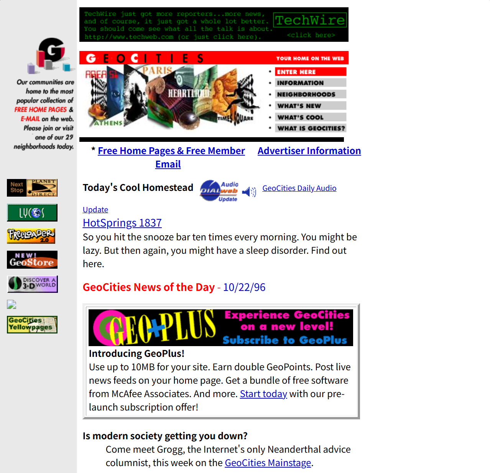

1994年、David Bohnettが立ち上げたウェブサービス「Beverly Hills Internet」は、翌年「[GeoCities](https://web.archive.org/web/19961022173245/http://www.geocities.com/)」と名を変えた。コンセプトはシンプルで、専門知識なしに誰でも無料でウェブページを持て、HTMLを少し覚えれば世界に向けて自分のページを公開できるというものだった。

GeoCitiesは街の構造を模した。ページは「[Neighborhood（近隣）](https://web.archive.org/web/19961219233921/http://www.geocities.com/homestead/homedir.html)」に分類され、[Hollywood（芸能）](https://web.archive.org/web/19961221001820/http://www.geocities.com/Hollywood/)、[Wall Street（金融）](https://web.archive.org/web/19961221002104/http://www.geocities.com/WallStreet/)、[SiliconValley（テクノロジー）](https://web.archive.org/web/19961221001928/http://www.geocities.com/SiliconValley/)、[Heartland（アメリカ的価値観）](https://web.archive.org/web/19961221001810/http://www.geocities.com/Heartland/)など、テーマごとの「地区」があった。ユーザーはその地区の「住人」となり、自分のページに固有の「番地」を持った。

その住人たちが作ったページは、今の眼から見れば奇妙に賑やかだ。テキストを追いかけるマウスカーソル、自動再生のMIDI音楽、「工事中」を示すオレンジのコーンのアニメーションGIF、虹色に輝く区切り線、来訪者カウンターなどが組み合わさっていた。デジタル研究者の[Olia Lialina](https://art.teleportacia.org/)はこれを「[ヴァナキュラーウェブ（vernacular web）](https://art.teleportacia.org/observation/vernacular/)」と呼んだ。専門家ではなく素人が、自分の言葉で、自分の美意識で作り上げたウェブの民俗で、無計画で過剰だが奇妙な生気に満ちていた。

[1999年](https://internet.watch.impress.co.jp/www/article/1999/0129/yahgeo.htm)、GeoCitiesはYahoo!に約35億7,000万ドルで[買収](https://web.archive.org/web/19990427050311/http://www.wired.com/news/news/business/story/17597.html)された。Yahoo!はGeoCitiesを収益化しようとしたが、うまくいかなかった。ページ数だけは膨らみ続け、ピーク時には3,800万以上のページが存在したとされる。しかし[2009年10月26日](https://web.archive.org/web/20090702225445/http://geocities.yahoo.com/)、[Yahoo!はGeoCitiesを閉鎖](https://web.archive.org/web/20091026144427/http://geocities.yahoo.com/)した。短い猶予期間の後、3,800万のページは消えた。GeoCities Archive ProjectやInternet Archiveがその一部を保存したが、大半は永遠に失われた。

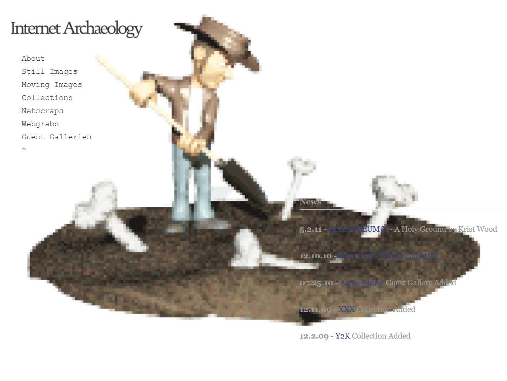

その応答のひとつが、デジタルアーティスト Ryder Ripps による [Internet Archaeology](https://web.archive.org/web/20090810192122/http://www.internetarchaeology.org/index.htm) だった。

2009年6月、Ryder Ripps は GeoCities 閉鎖のニュースを知り、[ほとんど報道されないまま数百万の個人サイトが消えることに衝撃を受けた](https://techcrunch.com/2009/10/10/internet-archaeology-in-which-the-sordid-past-of-the-internet-is-preserved-forever/)という。同年に立ち上げたプロジェクトは、初期インターネット文化の[グラフィック・アーティファクトを探索・回収・アーカイブ・展示することを掲げた](https://boingboing.net/2009/10/23/internet-archaeology.html)。Internet Archive が網羅的に保存するのに対し、Ryder Ripps の仕事はキュレーションだった。何を見せるかを選び、失われゆくヴァナキュラーウェブの表情を再提示する。

別の応答は、Olia Lialina と Dragan Espenschied による [One Terabyte of Kilobyte Age](https://web.archive.org/web/20110202173853/http://contemporary-home-computing.org/1tb/) だった。[Archive Team](https://wiki.archiveteam.org/) が救出した [GeoCities データの torrent](https://thepiratebay.org/description.php?id=5923737) を入手し、[2011年から調査を始めた](https://blog.geocities.institute/about)。2013年2月からは Tumblr ブログ [One Terabyte of Kilobyte Age Photo Op](http://oneterabyteofkilobyteage.Tumblr.com/) が、当時のブラウザ環境で再構成した GeoCities ページの[スクリーンショットを20分ごとに自動投稿](http://anthology.rhizome.org/one-terabyte-of-kilobyte-age)した。

Ryder Ripps によるキュレーションと、Olia Lialina と Dragan Espenschied による機械的な自動投稿とが、GeoCities 閉鎖への応答として並んだ。

---

## mp3ブログ——音楽を配り、選ぶ場

GeoCities が個人サイトの更新を支えていた一方、音楽はそれとはすこし別の形でウェブを巡っていた。

2000年代の前半、「[mp3ブログ](https://en.wikipedia.org/wiki/MP3_blog)」と呼ばれる音楽ブログが相次いで現れる。こうしたブログは、楽曲のファイルをダウンロードできる形で公開し、短い紹介文を添える。レーベルや大手メディアが拾う前に、無名のアーティストが聴き手と出会う場になった。

初期の代表的なひとつが、Matthew Perpetua が2002年に始めた [Fluxblog](https://www.fluxblog.org/about/) だ。[LCD Soundsystem をまだ無名のうちに紹介した](https://www.timeout.com/newyork/festivals/fluxblog-live-10-years-of-perfect-tunes-at-housing-works)ことで知られる（[2003年12月の記事](https://www.fluxblog.org/2003/12/478/)）。Matthew Perpetua はその後、Fluxblogを運営しつつ Pitchfork や Rolling Stone などのメディアでライターとして活動する。

2003年に始まった [Said the Gramophone](https://en.wikipedia.org/wiki/Said_the_Gramophone) はモントリオールから Arcade Fire や Wolf Parade を最初期に取り上げたという。現在まで音楽メディアとして続く [Stereogum](https://stereogum.com/) も元は 2002年1月に mp3 ブログとしてはじまった。これらのいずれも、何を聴くべきかを個人の耳で選び、短い言葉を添えて紹介するブログだった。

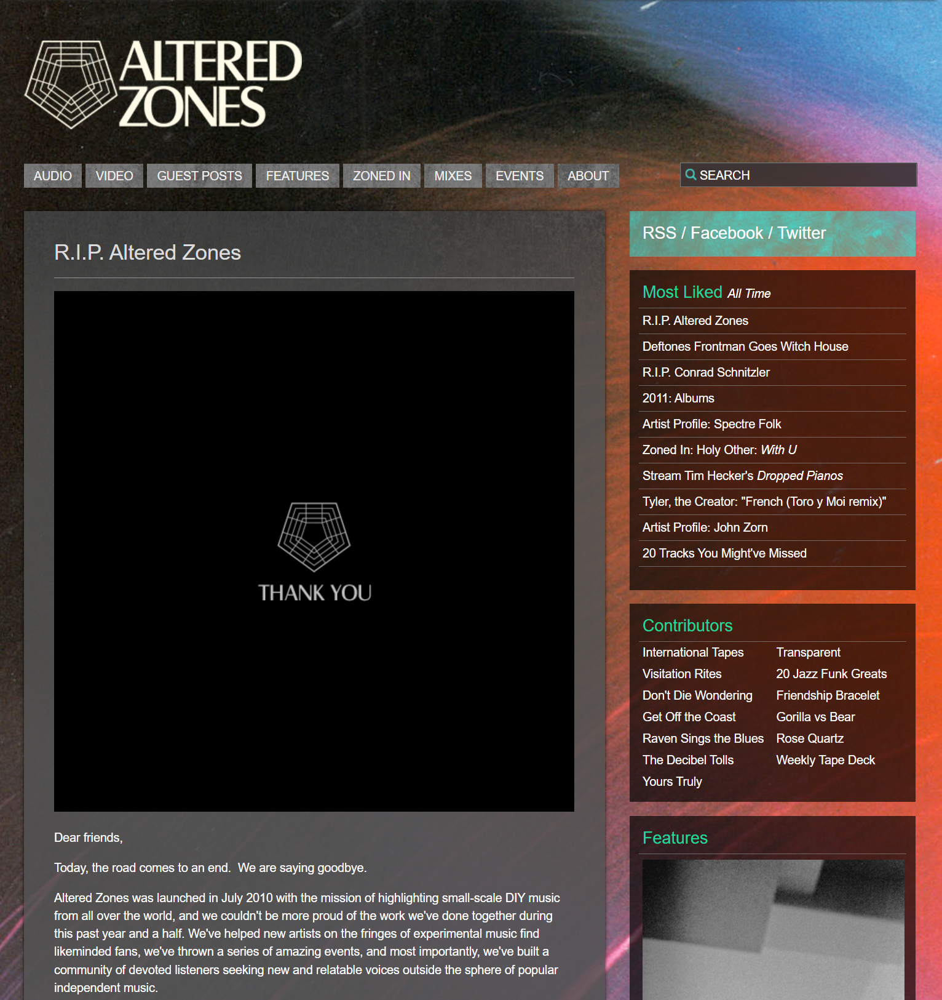

これらのブログは、単なる紹介にとどまらなかった。書き手の何人かは、やがて自分でレーベルやイベント、ZINEを始めていく。

Pitchfork が2010年7月に立ち上げた共同ブログ [Altered Zones](https://web.archive.org/web/20100721234255/http://www.alteredzones.com/) は、[Gorilla vs. Bear](https://web.archive.org/web/20091231010835/http://gorillavsbear.blogspot.com/)、[20 Jazz Funk Greats](https://web.archive.org/web/20081217014931/http://www.20jazzfunkgreats.co.uk/wordpress/) など14のサイトを束ねたものだった。その終了は、この動きを象徴している。[Billboardによれば](https://web.archive.org/web/20240129002126/https://www.billboard.com/music/music-news/altered-zones-diyindie-blog-collective-shutters-after-16-months-1159091/)、わずか16か月で閉鎖する[2011年12月の声明](https://web.archive.org/web/20111202222827/http://alteredzones.com/posts/2173/rip-altered-zones/)では、Altered Zones の寄稿者たちがブログを離れてレーベルを立ち上げ、会場を運営し、ZINE を作り、自分の音楽を作るようになったと記した。

初期の mp3 ブログは著作権上のグレーゾーンに置かれていた。音楽用の P2P 共有サービス [Napster](https://en.wikipedia.org/wiki/Napster) をめぐる訴訟が続いた1990年代末からの流れで、楽曲ファイルを公開するブログは停止通告書（cease-and-desist レター）や DMCA テイクダウン通知を受けることがあった。

しかし2000年代後半にかけて、レーベルは mp3 ブログをプロモーションの経路として認識しはじめる。

アーティストを大手メディアより先に取り上げるブログが、次のリリースへの関心を作るという構図が見えてきたからだ。Said the Gramophone の書き手は2009年に、「アルバムを丸ごと zip ファイルで上げでもしない限り、レーベルがブログを止めようとすることはもうない。レーベルとは仲間だ」と[語っている](https://www.npr.org/2009/12/25/121861409/2004-the-year-of-the-music-blog)。違法な配布の温床というより、音楽を選び、文脈を与え、次の流通へ橋渡しする層として、mp3 ブログは働くようになっていた。

ただし、プラットフォーム側のリスクは消えなかった。2010年2月、Google が Blogger 上の[多数の音楽ブログを DMCA 申請に基づいて一斉削除](https://www.theguardian.com/music/2010/feb/11/google-deletes-music-blogs)した。これに対して Twitter では [#Musicblogocide2k10](https://x.com/search?q=%23musicblogocide2k10) というタグが作られ、この削除への抗議が行われた。レーベルとの直接の敵対が和らいでも、ホスティングサービスへの DMCA 申請ひとつでブログごと消えるという脆弱性は残った。GeoCities と同じく、場を提供するプラットフォームの判断に、コンテンツはいつも依存していた。

## MySpace——カスタマイズされる自己と音楽

mp3ブログが音源の流通を担っていたのと並行して、別のプラットフォームは音楽シーンの土壌を形成していた。

2003年8月1日、Tom Anderson、Chris DeWolfe、Jon Hart が eUniverse の内部プロジェクトとして立ち上げた **MySpace** は、[グローバルな規模に到達した最初のソーシャルメディア（SNS）](https://en.wikipedia.org/wiki/Myspace)だ。

MySpace の初期の急成長を生んだのは、既存 SNS から追放されたバンドのアカウントがそこに移住したからだったとされる。初期に知られていたソーシャルメディアの Friendster がバンドアカウントをプロフィール規約違反として削除しはじめると、インディーバンドが MySpace に移住したのだ。MySpace の創設者たちがLA の音楽シーンに関わっていたこともあり、[ミュージシャンが最初から多くいたプラットフォームとなった](https://computer.howstuffworks.com/internet/social-networking/networks/myspace.htm)。

MySpace が他の SNS と決定的に異なったのは、プロフィールの HTML と CSS を全面的に書き換えられたことだった。自動再生のプロフィールソングを設定し、背景や文字色を変え、「Top 8」でフレンドリストの上位8人を選んで並べる。

[Codecademyの記事](https://www.codecademy.com/resources/blog/myspace-and-the-coding-legacy) によれば、数千万人にとってアンカータグやスタイルシートを触った最初の経験が MySpace のプロフィール編集だったという。GeoCities の「ヴァナキュラーウェブ」が、今度は MySpace のカスタマイズされたプロフィールという形で再現されていた。

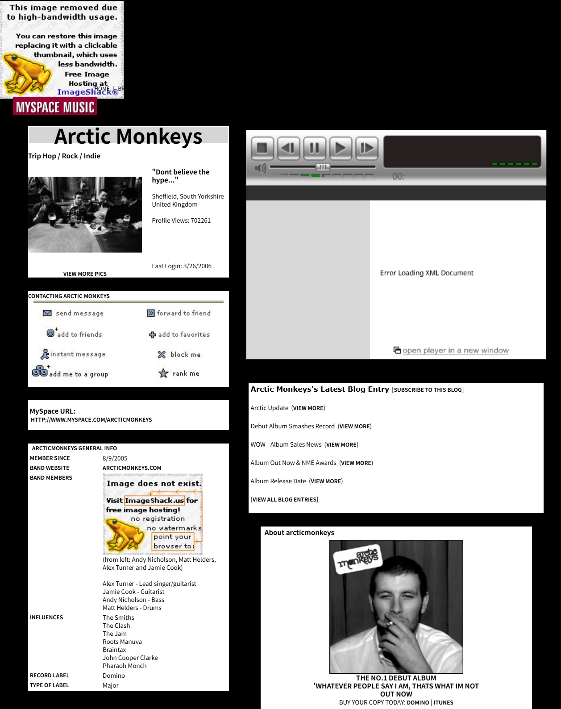

音楽の発見という点でも、MySpace は独特の役割を果たした。[Arctic Monkeys](https://web.archive.org/web/20060405174309/http://www.myspace.com/arcticmonkeys) は商業リリース以前にファンがMySpaceにアップロードしたデモで大きなフォロワーを獲得し、2006年1月の[デビューアルバム](https://en.wikipedia.org/wiki/Whatever_People_Say_I_Am,_That%27s_What_I%27m_Not)はUK史上最速で売れたデビューアルバムになった（[Internet-history.info](https://www.internet-history.info/blog/2026-03-16-myspace-birth-of-social-media/)）。

Lily Allen はレーベルのサポートが得られないまま自分でデモを MySpace に公開し、そこで注目を集めたという（[The National](https://www.thenationalnews.com/weekend/2023/08/18/myspace-anniversary-music/)）。Adele は友人が Lily Allen のトップフレンドに掲載されていたことで注目を集めたといい、さらにはキャリアのすべては MySpace に登録してくれた（別の）友人のおかげであると振り返っている（[E! News インタビュー](https://www.afterglowatx.com/blog/2021/3/22/the-death-of-an-era-the-lost-music-history-of-myspace)）。

MySpace で「発掘」されたポップスターをまとめた [The National の記事](https://www.thenationalnews.com/weekend/2023/08/18/myspace-anniversary-music/)では、Arctic Monkeys などのほかに、Calvin Harris や Avicii なども挙げられている。

MySpace は2005年に News Corp が5億8000万ドルで買収し、2006年にはGoogleを抜いて米国で最も訪問されたウェブサイトになった。しかし2008年に Facebook に追い抜かれ、2011年には Justin Timberlake らのグループに3500万ドルで売却される。そして2019年、サーバー移行の不手際によって12年分、約5300万曲・1400万アーティスト分の音源が失われた。

GeoCities の消滅が個人ページを、MySpace の事故が音楽のアーカイブを、それぞれ一度に消した。Cory Doctorow は[Boing Boing](https://boingboing.net/2019/03/17/facebook-is-next.html)で「プラットフォームにデータのアーカイブを委ねてはいけない」と警告し、Internet Archive を勧めている。

## Tumblrというアーキテクチャ

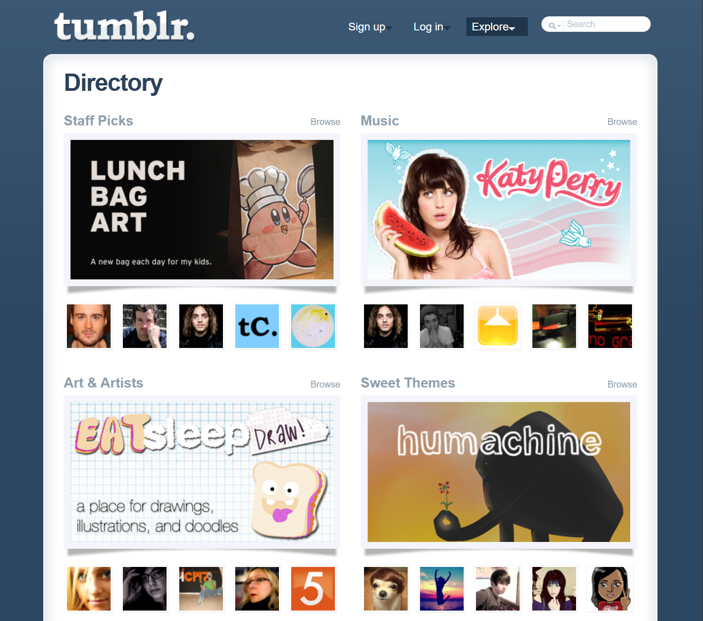

David Karpは2006年、自身のウェブコンサルタント会社「Davidville」を経営しながら、tumblelog（短形式ブログ）への関心を持っていたという。短い投稿を連ねるスタイルのブログを作りやすくするサービスが欲しかったが、既存の大手プラットフォームは対応しなかった。約1年待っても誰も作らなかったため、自分で作ることにした。

Craigslist で募集に応えた Marco Arment を第一エンジニアとして迎え、2週間の集中開発を経て、2007年2月19日に Tumblr は正式公開された。公開から2週間以内に75000ユーザーを獲得したという。

David Karp は既存のブログプラットフォームを「形式が固定されすぎている」と感じながら、一方で MySpace のカスタマイズを肯定的に見ていた。[SXSW での発言](https://www.smartbrief.com/original/sxsw-Tumblr-founder-david-karp-encouraging-creativity)によれば、MySpace の多くは確かに雑然としていたが、少なくともユーザーが時間をかけて個性を表現しようとしていた。

Facebook はソーシャルメディアにおける「醜さ」を終わらせた。ただしそれは、ユーザーが好みに合わせてカスタマイズする自由を取り除くことで実現された。David Karp は TechCrunch のインタビューで「[Facebook で自分のアイデンティティを誇りに思う人はだれもいない](https://techcrunch.com/2011/02/21/founder-stories-why-david-karp-started-Tumblr-blogs-dont-work-for-most-people/)」と語っている。Tumblr は、MySpace の持っていた個性表現の場を、別の形で引き継ごうとしていたのだ。

### リブログ：転載と帰属の連鎖

他のユーザーの投稿を自分のブログに転載する機能が、2007年3月には実装されていた。転載された投稿には、元の投稿者とリブログのチェーンが保持された。誰がどこを経由して投稿が広まったかが、投稿の下部に記録されていく。

Twitter の「リツイート」（2009年）や Facebook のモバイルサイト・アプリへの「シェア」（2012年）に先行するこの機能は、ニューヨークのアートテクノロジーセンター Eyebeam で開発された「ReBlog」ツール（2004年）からインスピレーションを得た設計だった。Eyebeam の ReBlog には Jonah Peretti（後の BuzzFeed 創業者）が関わっており、「reblog」という語と概念の起源はここに遡るという。

### タグ：受け手が意味を付与する仕組み

2007年11月の機能追加で、投稿にタグを付けられるようになった。さらに重要なのは、リブログの際に受け手が独自のタグを付与できたことだ。発信者が命名・投稿し、受容者がタグで意味を付与するループが技術的に内蔵されていた。

### テーマシステムとフォトセット：ムードボードの器

最初から搭載されていたテーマシステムは、ブログの HTML / CSS を直接編集できる機能で、ユーザーは自分のブログを完全にカスタマイズし、特定の「雰囲気」を演出するテーマブログを作ることができた。あるテーマで統一されたブログは、音楽や画像の集積がひとつの世界観を帯びていくムードボードとして機能した。

2009年6〜7月に追加されたフォトセット機能（複数の写真をグリッドレイアウトで一投稿にまとめる）が、「画像による世界観の構築」を決定的に容易にした。この設計の集積により、Tumblr は雰囲気をタグ化する場所になった。

---

## フォークソノミーという論理

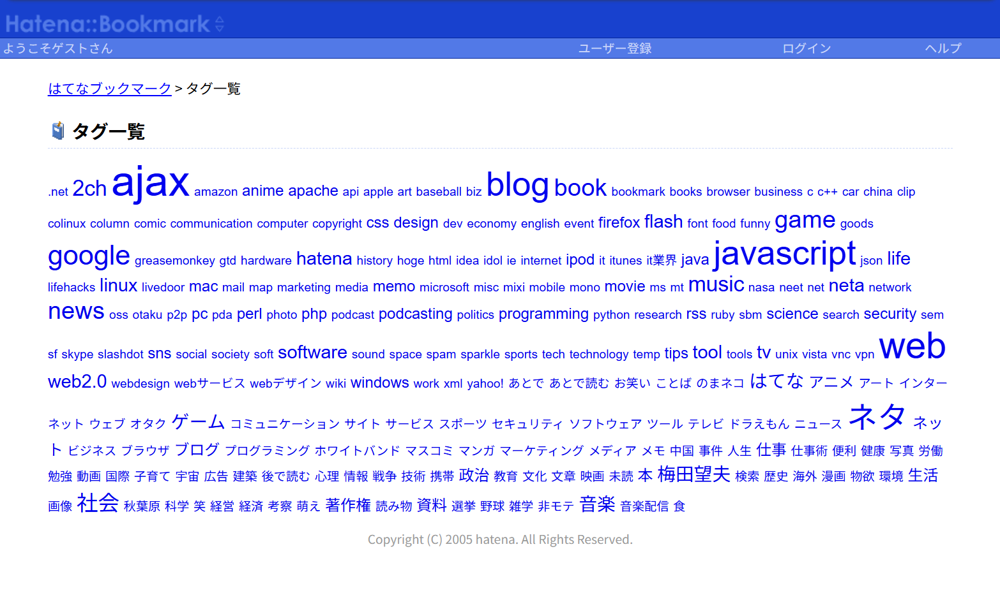
<!-- https://web.archive.org/web/20050924122504/http://b.hatena.ne.jp/t -->

Tumblr のタグは辞書とは異なる仕組みを持つ。辞書には定義がある。専門家が意味を決め、印刷し、権威として流通させる。しかし Tumblr のタグは誰でも自由に付けられる。「#dark academia」というタグが最初に何を意味していたか、誰が最初に付けたかは問題ではない。無数のユーザーがそのタグを使い続けることで、タグの意味が事後的に確定されていく。

これを情報科学では「[フォークソノミー](https://ja.wikipedia.org/wiki/%E3%83%95%E3%82%A9%E3%83%BC%E3%82%AF%E3%82%BD%E3%83%8E%E3%83%9F%E3%83%BC)（folksonomy）」と呼ぶ。*folk*（民衆）と*taxonomy*（分類学）を合わせた造語だ。中央集権的な分類体系とは異なり、フォークソノミーにおいてはタグの意味が使用の集積によって決まる。ここには重要な特性がある。間違いが多数派になった瞬間に「正しさ」になるということだ。

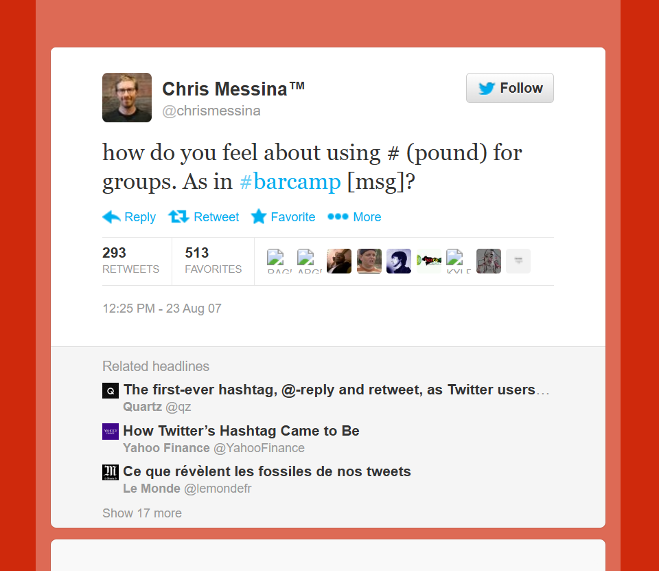

このロジックはハッシュタグの誕生にも見ることができる。2007年8月23日、Chris Messina がウェブサービス「Twitter」に向けて、「`#`記号を使ってグループを作ることができないか」（`#barcamp [msg]?`）と[ツイートした](https://web.archive.org/web/20131109001441/https://twitter.com/chrismessina/status/223115412)。

背景にはセマンティックウェブ運動に関わる[barcamp](https://ja.wikipedia.org/wiki/BarCamp)コミュニティや、HTML に機械可読な意味を付与するボトムアップな[Microformats運動](https://ja.wikipedia.org/wiki/%E3%83%9E%E3%82%A4%E3%82%AF%E3%83%AD%E3%83%95%E3%82%A9%E3%83%BC%E3%83%9E%E3%83%83%E3%83%88)の発想があった。Chris Messina は Twitter の共同創設者である Biz Stone に直接提案したが、「ニッチすぎる」と[却下された](https://www.cnbc.com/2020/01/09/how-chris-messina-got-twitter-to-use-the-hashtag.html)。

2007年10月、[カリフォルニア州サンディエゴの大規模山火事](https://en.wikipedia.org/wiki/October_2007_California_wildfires)で、Chris Messina が Flickr タグ `sandiegofire` の使用を呼びかけ、ハッシュタグが娯楽を超えた[初めての実用的な集合知ツールとして機能](https://www.sjpiatek.com/research/sandiegofire-the-first-successful-hashtag/)した。その後、コミュニティはハッシュ記号を用いる `#tag` 記法を使い続け、2009年に Twitter がクリッカブルリンクとして公式採用する。

コミュニティの自然発生的な慣習が先にあり、仕様がそれを後から追認した。「使用の集積が意味を確定する」というフォークソノミーの論理は、ハッシュタグそのものの誕生過程にも刻まれている。

Tumblr ではこのフォークソノミーが、画像と音楽と文章を横断して機能した。誰かが「#vaporwave」とタグを付け、別の誰かが同じタグで別の画像をリブログし、また別の誰かがその画像を見て新しい音楽をアップロードして同じタグを付ける。

2007年後半、スペイン・バスクの Gorka Julio が [Microformats Wiki](http://microformats.org/wiki/microblogging-nanoformats) に **Nanoformats** 草案を投稿し、Twitter 上の `@username` や `#tag` といった自然発生的慣習を体系化した。2008年には[hashtags.org](http://hashtags.org/) の実績が後押しし、`tag:` 記法は廃止され `#tag`（ハッシュタグ）への統一が承認された。 `#` 記法にも、コミュニティ慣習が仕様草案を後から追認する構造があった。

命名者が何を意図したかは関係なく、タグのもとにコンテンツが集積し、そのコンテンツの集積がタグの意味を確定していった。

---

## ポストインターネットアートという土壌

Tumblrが美学ミームの温床になる前に、その土壌を豊かにしていた動きがあった。それがポストインターネットアートだ。

### 語の起源と流通経路

語の起源は複層的だ。2004年ごろ、オンラインのアートフォーラム「[Rhizome](https://rhizome.org/)」で Valery Crancher らが使っていた "post net.art" という概念が原型とされる。オンラインのネットアートだけでなく、オフラインのネットアートも含めようとした試みだった。

それが2008年に Marisa Olson によって「インターネット以後の芸術」の意味で改めて使われ、バズワードとして広がった。この「ポストインターネットアート」という語はやがて拡大解釈され、Tumblrに投稿される特定の画像群や、ネットで活動する音楽家たちも包含するようになった。

2009〜2011年の Tumblr には、おおまかに二つの流れが並走していた。少数だが濃いポストインターネット系の実践と、数としてはるかに多い写真・GIF・ムードボード系の流通だ。

### 二つの流れ：ネットアートと soft grunge

#### ポストインターネットアートと tumblr
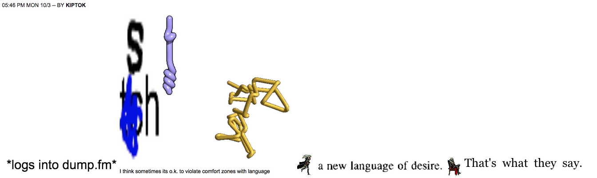
<!-- Joe Milutisによる hyperallergic.com の記事 https://hyperallergic.com/in-memory-of-dump-fm-an-endlessly-collaborative-image-poem/から画像引用。元はkiptokによるコラージュをlarsdkがスクリーンショットした画像。 -->

はじめの流れのハブとなったのが [dump.fm](https://hyperallergic.com/in-memory-of-dump-fm-an-endlessly-collaborative-image-poem/)（2010年〜、Ryder Ripps・Tim Baker・Scott Ostler）と [The Jogging](https://thejogging.tumblr.com/)（2009年〜、Brad Troemel ら）だった。

dump.fm は[リアルタイムの画像チャット](https://rhizome.org/editorial/2010/mar/05/introducing-dumpfm/)で GIF を改変・合成する「talk with images」の場であり、両者は[ポストインターネットの批評が指す中心的プラットフォーム](https://hyperallergic.com/in-memory-of-dump-fm-an-endlessly-collaborative-image-poem/)として並んで言及された。

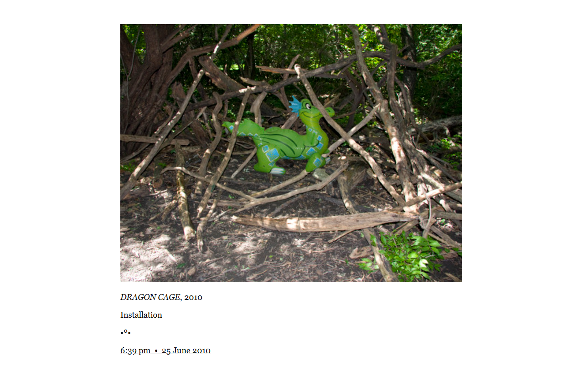
<!-- https://web.archive.org/web/20100828144213/http://thejogging.tumblr.com/#:~:text=25%C2%A0June%C2%A02010-,DRAGON%20CAGE,-%2C%202010 -->

The Jogging は自己紹介に "an original content blog that displays immaterial works of art and writing（非物質的な芸術作品や文章を展示するオリジナルコンテンツのブログ）" と掲げ、投稿のすべてに「タイトル・年・種別（Sculpture / Performance / Installation / Image）」というギャラリーのキャプション形式を付していた（[2010年当時のアーカイブ](https://web.archive.org/web/20100828144213/http://thejogging.tumblr.com/)）。The Jogging の形式は、[ネットから拾った画像や Photoshop で加工した素材を「無形の作品」として額装して並べる](https://rhizome.org/editorial/2010/may/5/immaterial-incoherence/)ものだった。

Ryder Ripps は Internet Archaeology のあと dump.fm や The Jogging にも関わっている。GeoCities 閉鎖（2009）への応答から、Tumblr 上のポストインターネットアート実践のハブまで、同一人物でつながる例だ。

The Jogging の実践は、Tumblr のアーキテクチャとも意識的に絡み合っていた。

2010年6月、The Jogging は「Positive Feedback」と名付けた実験を開始した。直近の投稿が35ノート（いいね＋リブログ）に達したとき、次の新作が公開されるという仕組みで、閲覧者の拡散行動が制作の公開タイミングを直接決めた。Tumblr のノート経済を流通の外側に置くのではなく、制作リズムそのものに組み込んだ試みだった。Brad Troemel はこの問題をのちに論文「[Athletic Aesthetics](https://thenewinquiry.com/athletic-aesthetics/)」でも理論化し、リブログの速度と頻度に最適化される制作態度を分析している。

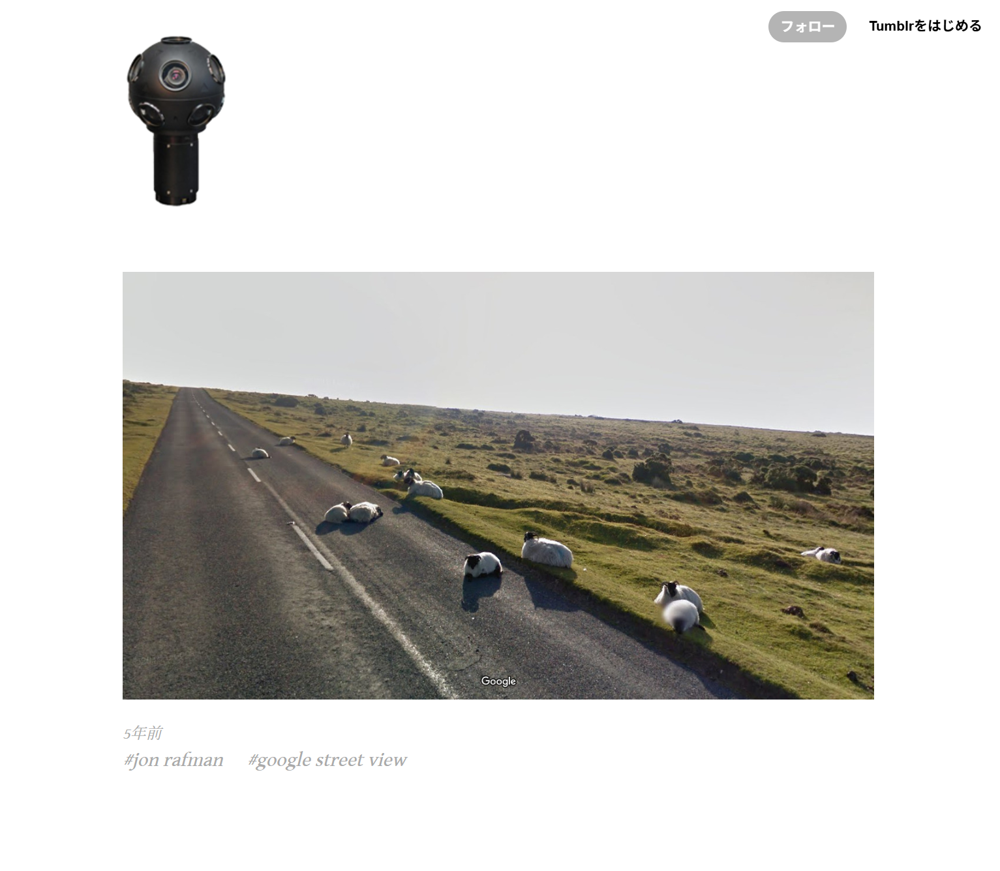
<!-- https://9-eyes.com/post/633157629442719744/jon-rafman-sheep -->

同じ時期、ポストインターネット系の Tumblr では別の種類の画像実践も並走していた。

Jon Rafman の「[9 Eyes](https://anthology.rhizome.org/9-eyes)」（2008年〜）は、Google ストリートビューのスクリーンショットを Tumblr 上で再文脈化するプロジェクトで、偶発的な記録画像を「見出す」行為そのものを前景化した。

ニューヨークで2010年に創設された DIS Magazine も[公式サイト](https://dismagazine.com/)を主軸に、Tumblr を[イメージ流通のサテライト](https://dismagazine-blog.tumblr.com/)として並走させながらポストインターネットアートの場で活動し、やがてアーティスト紹介のハブとなっていった。DIS Magazine による dump.fm とのコラボレーション「[DIS/dump](https://dismagazine.com/discussion/6770/dis-dump-fm/)」も、両者の画像感覚を示している。

#### soft grunge と tumblr

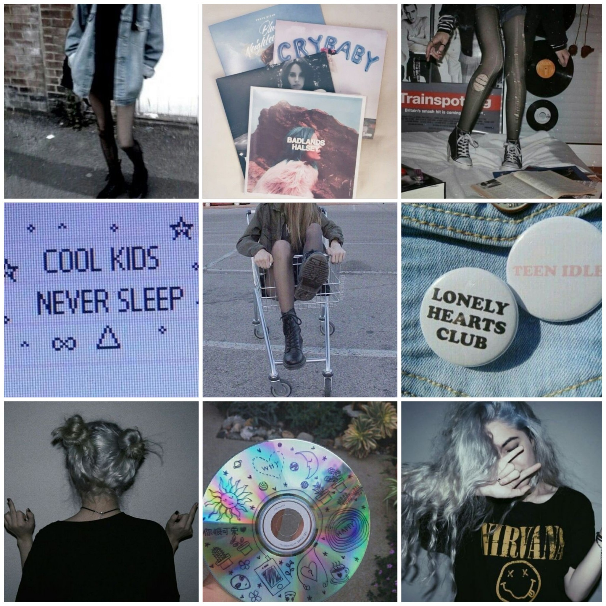
<!-- https://www.tumblr.com/theprettieststarxx/753281637372035072/%F0%9D%9A%83%F0%9D%9A%8A%F0%9D%9A%94%F0%9D%9A%8E-%F0%9D%9A%96%F0%9D%9A%8E-%F0%9D%9A%8B%F0%9D%9A%8A%F0%9D%9A%8C%F0%9D%9A%94-%F0%9D%9A%9D%F0%9D%9A%98-2014 -->

ふたつめの流れは、グレインのあるモノクロ写真、タイプライター風の引用文、パステルカラーのムードボード、映画スチルから作る gif などで、ユーザー数ではこちらの方がはるかに多かった。MySpace の [emo](https://ja.wikipedia.org/wiki/%E3%82%A8%E3%83%A2) や [scene](https://en.wikipedia.org/wiki/Scene_(subculture)) カルチャーが 2009〜2010年に Tumblr へ移り、 soft grunge とくくられるイメージやファッションが広がった。

英語版 Wikipedia によれば、soft grunge のファッションは、もともと [indie sleaze](https://en.wikipedia.org/wiki/Indie_sleaze) と呼ばれることになるトレンドから派生し、Tumblr 上でより暗い要素と混ざりあって生まれた。indie sleaze は2000年代後半のニューヨークやロンドンのシーンを後年になって遡及的に名づけたもので、その名が広まるのは2021年以降のことだ。ある個人ブログは、こうしたトレンドの Tumblr ブログ全体が[「なりたい自分の姿」を映す装置として機能した](https://web.archive.org/web/20220313035133/https://therollercodester.com/bloghome/v-aesthetic-an-ode-to-tumblr-the-good-and-the-bad)、と書いている。

写真キュレーションブログや、2010年当時の Tumblr の gif サイズ上限（1MB）のなかで工夫された gif アニメのループ文化も、この薄く広い流通を支えた（[Transformative Works and Cultures](https://journal.transformativeworks.org/index.php/twc/article/view/1153/1687)）。「soft grunge」という言葉自体は[2012年末から2013年初頭にかけて知られる](https://trends.google.co.jp/explore?q=soft%20grunge&date=all&geo=Worldwide)ようになった。

2014年2月、英語版 Wikipedia に 「Soft grunge」 が立項されている。Tumblr 発のファッションとして記され、[初期](https://en.wikipedia.org/w/index.php?title=Soft_grunge&oldid=596847422)には soft grunge を起点に [pastel grunge](https://aesthetics.fandom.com/wiki/Pastel_Grunge) 、 [pastel goth](https://aesthetics.fandom.com/wiki/Pastel_Goth) 、 seapunk といったバリエーションが派生したと言及されていた。「90年代のグランジカルチャー」を現代に取り入れたものであり、90年代の geocities から切り取ったような低品質のビットマップ画像を使うことがみられる、と lo-fi 感覚と連続したセンスを感じさせる記述もあった。

「aesthetic」とは書かれていないものの、Tumblr から生まれた「音楽ジャンルであり、ファッショントレンドであり、デザインスタイル」と、今日の aesthetic 的説明に近い整理がなされている。美学ミームの土壌は、こうしたイメージの流通や流行からも形成された。

#### 二つの流れの対比

この二つの流れは、名前や出どころとの距離という点でも対照的だった。ひとつめの流れの周辺、つまりネット上での活動を重視する作り手の一部は、ハンドルや別名義を活用してネット上のペルソナとして現れた。ふたつめの流れでは、画像のほうが作者の名から離れてリブログや転載されていった。どちらも、のちの章でくりかえし出会う特徴の出発点になっている。

### Megazord

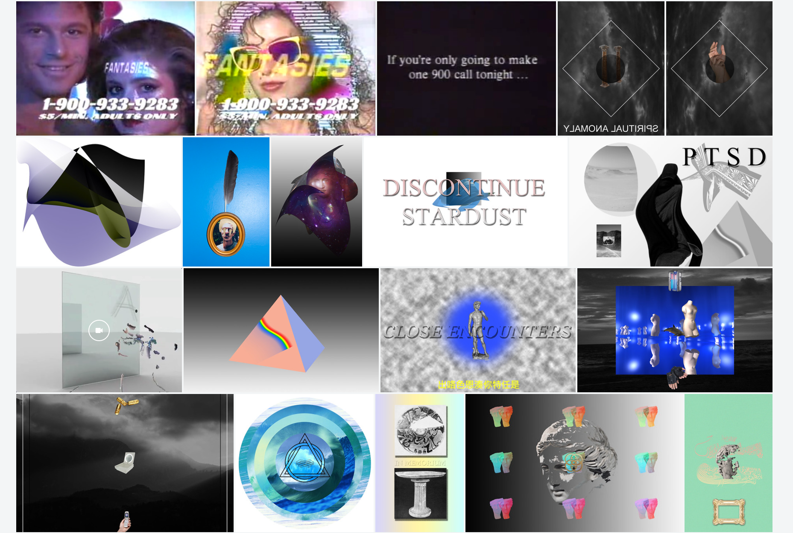
<!-- https://www.flickr.com/photos/megazord/with/4304715667 -->

Megazord は主に Tumblr で活動したデジタルアーティストで、dump.fm や The Jogging とは別系統のアーティストだ。Megazord（Christian Oldham）の作風は、低解像度や 16bit 的な質感のコンピュータ支援画像と、ダークでサイバーディストピア的な雰囲気、アイロニカルなテキストや引用が同居するデジタルコラージュとして語られる（[Rhizome Artbase](https://artbase.rhizome.org/wiki/Q2638)）。

古典彫刻の石膏像、広告スチル、インターネットから拾った画像を切り貼りし、2009年ごろから [Tumblr](https://web.archive.org/web/20110511233305/http://megazord.tumblr.com/) と Flickr に大量に投稿し、リブログされるたびに参照元として拡散していった。『Post Internet Survival Guide 2010』（[Katja Novitskova](https://www.katjanovi.net/publication/post-internet-survival-guide-2010)）や、2011年1月のベルリン Future Gallery 展示にも選出されている。

Oneohtrix Point Never のミュージックビデオを制作し、Daniel Lopatin と Joel Ford のユニット Games のアートワークも手がけた。proto-vaporwave と呼ばれることになる音楽と Tumblr の視覚文化は、Megazord という人物のもとで交差している。

Megazord の出自自体はどちらかといえばふたつめの流れ、つまり気ままに画像を投稿することにある。Tumblr での影響力が大きくなるにつれひとつめの流れとも関わるようになったという点で、Tumblr の画像文化を象徴するデジタルアーティストということもできる。

### 日本語圏での受容

2012年9月に日本で出版された書籍『[Designing Tumblr](https://bnn.co.jp/products/9784861008306)』（BNN、古屋蔵人・高岡謙太郎 編）は、Jon Rafman や Ryder Ripps といったポストインターネットアート系のアーティストの Tumblr ブログも日本の読者に紹介している。ポストインターネットアートと Tumblr の視覚文化が不可分に結びついていたこと、そしてその動向が日本語圏に輸入されていたことを記録している。

2012年の『Designing Tumblr』に続いて、日本語圏では雑誌の特集を通じてもポストインターネットの動向が紹介されていった。2014年8月に発売されたグラフィックデザイン誌『[アイデア](http://www.idea-mag.com/idea_magazine/366/)』No.366（9月号）は、特集「ポスト・インターネット時代のヴィジュアル・コミュニケーション」を組んだ。企画・監修は、前年に『Designing Tumblr』を編んだ高岡謙太郎と、のちに『新蒸気波要点ガイド』の年表・辞典を書くばるぼらだ。国内の Pixiv やニコニコ動画ではなく、英語圏を中心とするプラットフォーム群の上で育った世界的な潮流に焦点をあてている。

同号にはネットアーティスト pootee へのインタビュー「networking and inter-viewing with pootee」（聞き手：アイデア編集部と高岡謙太郎、紙上では takaoka 名義）も収められており、当時の日本語圏での受容や、英語圏と並行して動いていたシーンを示している。

翌2015年6月号の『[美術手帖](https://bijutsutecho.com/backnumber/749)』も「ポスト・インターネット」を特集した。いずれも日本語圏独自の系譜を一本に束ねるものではない。

---

## RBMA『H∆SHTAG$』

2010年代初頭、インターネット上の音楽ではマイクロジャンルが次々と生まれていた。そうした乱立と、命名をめぐる当事者の距離感を、2013年に映像として記録したシリーズがある。

2013年1月から3月にかけて、Red Bull Music Academy（RBMA）はミニドキュメンタリーシリーズ [H∆SHTAG$](https://daily.redbullmusicacademy.com/2013/03/hashtags-video-series/) を配信した。全6回にわたるシリーズで、各話は「Don't Call It #…」という形式のタイトルとなっている。インターネット上の音楽現象を特集しており、各エピソードでは「#AltRnB」や「#PostDubstep」などのハッシュタグを取り上げる。構成は、マイクロジャンルにかかわるアーティストやジャーナリストのインタビューを中心としたものだ。

タイトルにハッシュタグ形式のジャンル名を使っている点からも、マイクロジャンルとハッシュタグの結びつきがうかがえる。「Don't Call It #…」という形式は、当事者のラベルへの距離感を反映したものでもある。本編でも、アーティストはジャンル名への違和感をたびたび表明している。

H∆SHTAG$ では、シリーズ全体を通じて Tumblr の名が繰り返し出てくる。マイクロジャンルの多くは、ここまで見てきたリブログとタグの仕組みの上で生まれ広まっていた。第5話 [Don't Call It #Tumblrwave](https://daily.redbullmusicacademy.com/2013/03/hashtags-tumblrwave/) では seapunk 当事者などが登場する。Tumblr の「[音楽エバンジェリスト](https://musicconsultant.com/tools-for-musicians/tumblr-marketing/)」である Nate Auerbach もこのエピソードに出演し、リブログを "you're taking samples of pop culture and creating new culture（ポップカルチャーのサンプリングから新しい文化をつくる行為）" と説明する。さらに、ビジュアル面でも同様のことが起きている、と付け加えている。これはリブログやムードボードの説明とも重なる。

2013年3月に公開された第6話「Don't Call It #BlogPop」では、Charli XCX が Tumblr について語っている。収録時、Tumblr アカウント「[In Real Life London](https://web.archive.org/web/20121127163407/http://inreallifelondon.com/)」がデザインしたレギンスを着用しており、このアカウントを紹介している。In Real Life London を運営する Cornelia Van Rijswijk は、witch house や seapunk の Tumblr コミュニティで先に知られるようになった人物で、[そのオンラインでの人気を服という商品に変換していった](https://www.dazeddigital.com/fashion/article/16056/1/the-new-diy)という。

Charli XCX は、この出自を意識したものかは定かでないが、In Real Life London のレギンスをネット上の画像や美意識を服という形に落とし込んだものだと説明する。さらに、こうした発想を自身のアイデンティティへ重ね、オンラインでの活動を恥じないアーティスト全般へも話を広げている。レギンスは、エピソード全体のテーマを象徴する具体例として使われた。そして、それは tumblr コミュニティのマイクロジャンルに関する実践によって生まれたものでもあった。

[英語版 Wikipedia の「Soft grunge」](https://en.wikipedia.org/wiki/Soft_grunge) によれば2014年の初版から Charli XCX は soft grunge と結び付けられ、2023年からスタイルへ影響を与えたとも書かれている。第6話に soft grunge という語は出てこない。しかし soft grunge もまた、ラベルのひとつとして、この時期のマイクロジャンルの乱立と地続きにある。美学ミームが育つ土壌には、こうしたラベルの蓄積も含まれていた。

## James Bridleの「新しい美学」

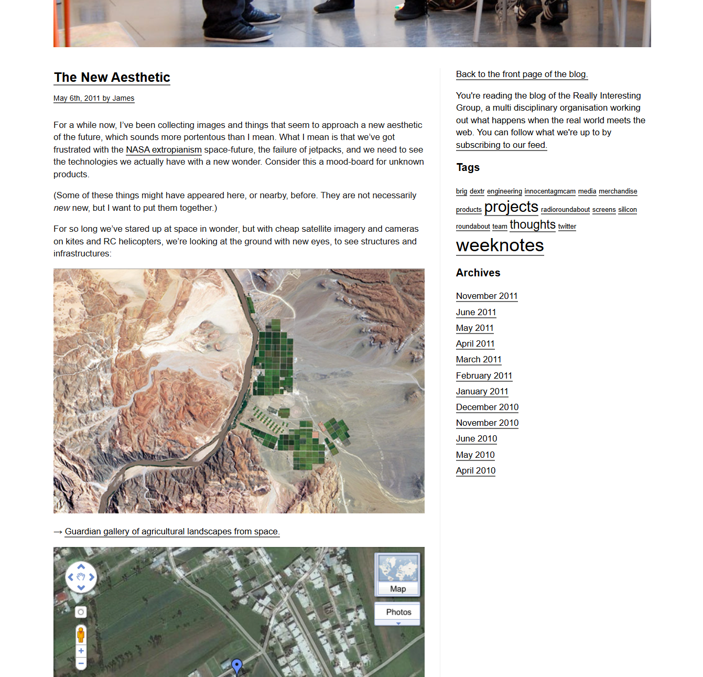
<!-- https://web.archive.org/web/20111114184842/http://www.riglondon.com/blog/2011/05/06/the-new-aesthetic/ -->

2011年5月6日、ロンドンのデザイナー James Bridle は自身のブログに[一本の記事](https://web.archive.org/web/20111114184842/http://www.riglondon.com/blog/2011/05/06/the-new-aesthetic/)を投稿した。タイトルは「The New Aesthetic」。同日、[同名の Tumblr ブログ](https://new-aesthetic.Tumblr.com/)も開設した。

記事の内容は一種のムードボードだった。衛星写真の粗いピクセル、コンピュータが生成した軍用ドローンの迷彩パターン、Instagram の写真フィルター効果、顔認識技術が失敗したときに生じるノイズ。これらを並べながら、James Bridle はコンピュータの「見え方」が人間の視覚文化に滲み出している現象を観察した。

これは美学ミームではない。しかしいくつかの点で後の美学ミームと連続している。Tumblr ブログとして出発していること、「aesthetic」という語を固有のタームとして使っていること、ムードボードという形式を採用していること。[2012年3月の SXSW でのパネル](https://web.archive.org/web/20120123041124/http://schedule.sxsw.com/2012/events/event_IAP11102)、同年4月2日のの [Bruce Sterling による WIRED への論考](https://web.archive.org/web/20140411042352/http://www.wired.com/2012/04/an-essay-on-the-new-aesthetic/)がこれを広めた。こうして「New Aesthetic」はひとつの運動の名前として定着した。

Bruce Sterling によれば、New Aesthetic は "an eruption of the digital into the physical.（デジタルが物理世界に噴出すること）" を主題にしているという。ポストインターネットアートはインターネットが一般化したあとの社会での芸術実践に焦点を当てる。この意味で New Aesthetic は、Tumblrブログ上で展開されたポストインターネットアートの取り組みの一つと見ることができる。

New Aesthetic は、のちに語る vaporwave や seapunk といったマイクロジャンルの初期の批評でもたびたび触れられる。インターネット美学の「Aesthetic」という言葉がここからきたわけではない。ただし、これらの共通点に加え、批評メディアを通じて拡散したという点も、美学ミームの成立における「伏線」としての役割を見ることができる。

---

## Reblorg：Tumblr公式のキュレーション

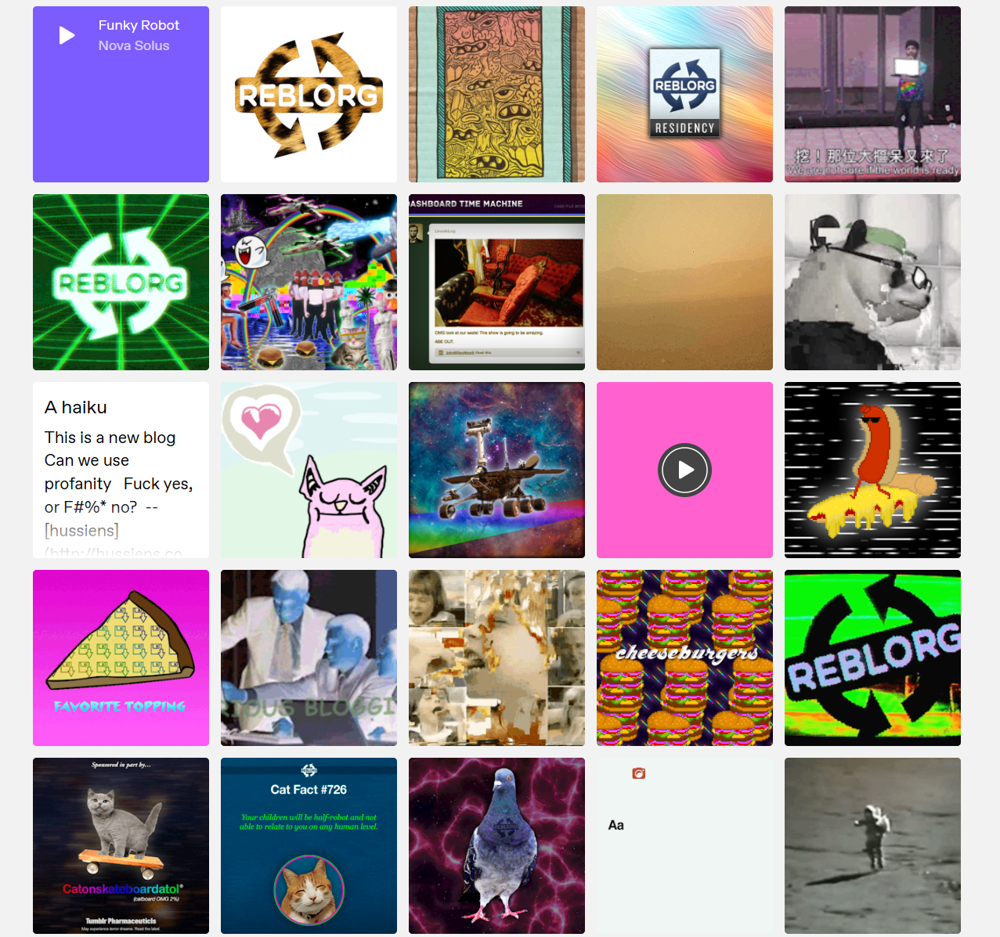
<!-- https://reblorg.tumblr.com/archive -->

2008年以降、Tumblrの画像文化はユーザーのブログとリブログの連鎖のなかで育っていた。前節のポストインターネットアートや New Aesthetic は、そうした土壌のなかで批評家やアーティストが各自観察したものだ。

しかし、あの時期の Tumblr にどんな画像が流れていたかを、プラットフォーム自身が公式に選び直し、名前を付けて広めた事例もある。それが Tumblr Editorial 部門が運営する公式キュレーションブログ [Reblorg](https://reblorg.Tumblr.com/) だ。個々のユーザーブログとは別に、運営が「これが Tumblr 上のオリジナル Web art だ」と判断した投稿だけを再掲する窓口だった。

Reblorg は長文インタビュー中心の [Storyboard](http://storyboard.Tumblr.com/) とは別系統の公式プロジェクトとして、[2012年8月7日に立ち上げられた](https://www.theverge.com/2012/8/7/3225479/Tumblr-reblorg-curated-content)。ユーザーが自作した投稿を複数の経路から集め、スタッフが選んで Reblorg 本体に載せた。募集条件は「自分で作ったこと」「新しいこと」の二点だけだった。

キュレーターは Tumblr 公開直後に参加した [Christopher "topherchris" Price](https://staff.Tumblr.com/post/99749628/topherchris) で、のち Editorial Director となった。[公式告知](https://staff.Tumblr.com/post/28908702107/from-the-department-of-editorial-makers-of)では、動画やアニメーションから俳句まで、ジャンルを問わず "all welcome" とされていた。

Reblorg に載ったのは、Tumblr 全体の断面ではない。立ち上げ直後、 [The Verge が紹介](https://www.theverge.com/2012/8/7/3225479/Tumblr-reblorg-curated-content)したのは、[ピザの上をサーフするサングラス付きホットドッグの GIF](https://reblorg.Tumblr.com/post/28865062154/lulinternet)、[頭からタコスを撃ち出すハトの映像](https://reblorg.Tumblr.com/post/28864335027/topher)といった、意図的に不条理なミーム的ループアニメだった。Tumblrが冗談めかして「[The only website on the Internet](https://www.makeuseof.com/tag/reblorg-original-creative-Tumblr-content-reblog-promote/)」と呼ぶ通り、理解不能さを味わいとして楽しむ文脈に近い。当時のレビューは、多くの作品が strange and bizarre だと述べている。

アーカイブ（[reblorg.Tumblr.com/archive](https://reblorg.Tumblr.com/archive)）を眺めると、グリッチ、ビットマップ風のイラスト、スクリーンセーバー的グラフィック、短いアニメーション GIF といった「Web art」的な画像を見ることもできる。

一方、Tumblr で共有される画像の多数派だった soft grunge 的なヴァナキュラー写真や、ブログのカスタマイズとキュレーションそのものがコンテンツでもあったムードボード型ブログの雰囲気は、ここでは見ることができない。

キュレーターの Price は Reblorg を通じて、こうした作品群を「インターネット・アート（Internet art）」と呼んでいた。[Fast Company の取材](https://www.fastcompany.com/3000358/reblorg-Tumblr-embraces-its-apocalypse-gif-and-bespectacled-panda-penchant)では、その理由を、技術とインターネットがなければ存在し得なかったからだと説明している。

これは James Bridle の New Aesthetic が観察した「コンピュータの見え方の滲み出し」と問題意識が近いともいえる。前節のポストインターネット系の濃い実践と、GIF・グリッチ中心の軽い投稿群とを、Tumblr 公式がひとつの「Web art」として掬い上げようとした試みでもある。

ただしこれは限界もはっきりしている。Reblorg は2008〜2011年に Tumblr で静かに蓄積されていた感触のすべてを記録したわけではない。公式キュレーションが対象にしたのは、Tumblr 上でよりはっきり「アート」として見えるニッチな部分に限られていた。

それでも、プラットフォーム自身が、この時期の Tumblr 画像語彙の一端を「Web art」として名指し、拡散の回路に乗せたことは事実だ。2012年11月、BuzzFeed が Rihanna の SNL 出演をめぐる記事を書いた。そこで Fluxblog 運営者の Matthew Perpetua は、読者がそのビジュアルに見覚えがあるはずだと述べ、Reblorg の存在を引き合いに出した。

Tumblr 上で活動するポストインターネットアーティストたちと、James Bridle の「The New Aesthetic」と、Reblorg が示した公式キュレーションの輪郭、そして DIS Magazine 。やがて生まれることになる美学の群れは同じ土壌から育っていた。

---

ここまで見てきた前史と事例を、アーキテクチャとして一度整理する。

## アーキテクチャが開いた可能性の空間

### タグ化、流通、参与

Tumblr がなければ美学ミームは生まれなかったのか。おそらくそうではないだろう。同じ頃、Pinterest は2010年に公開され、画像のコレクション文化を拡大した。Instagram は2010年に登場し、フィルターをかけた写真を世界に発信する場になった。これらのプラットフォームも同時に美学ミームの発展に重要な役割を果たしている。

しかし Tumblr は、美学ミームが最初に育った土壌として、リブログ・タグ・フォトセット・テーマカスタマイズが一体として機能した点で際立っていた。いずれか単独ではなく、その組み合わせが「雰囲気をタグ化する」「ある感じを一語で指し示す」実践を可能にした。

こうして付けられたタグの多くは、当時は aesthetic という語とは結びついていなかった。見た目とムードでくくるラベルのクラスタの一部が、のち aesthetic と呼ばれて数えられるようになる。そして aesthetic という枠組みが成立すると、そこに当てはまるものを探し、その枠組みの中で aesthetic を作る動きが生まれる。つまり、この土壌のうえで aesthetic としての個別ラベルの生成が加速する。

美学の発見は、タグページを毎回能動的に検索し続けることだけでは成り立たなかった。フォローしたブログの投稿やリブログがダッシュボードに流れ、そこから別のブログへたどり着く。「ブログ→リブログ→ブログ」という連鎖が、美学を知る主要な回路だった。

フォロー網に基づく[類似ブログの推薦](https://help.Tumblr.com/knowledge-base/how-Tumblr-recommends-content/)や、フォロー中タグの人気投稿がダッシュボードに混ざる機能もあった。いずれも、すでにつながったソーシャルグラフのなかをコンテンツが伝播する構造だった。最初の一歩、つまりあるブログをフォローする、あるタグを追う、というステップを踏んだあとは、半受動的にクラスタの縁へ近づいていく感覚もあった。

美学コミュニティへの参加にも段階があった。流れてきた画像をなんとなく「いいな」とリブログするだけの行為も、同じソーシャルグラフのなかにあった。

一方、美学カルチャーに本格的に足を踏み入れるには、もう一段のハードルがあった。ブログ全体をその美学に合わせてカスタマイズし、テーマとしてリブログを重ね、タグで意味を付与していく。クラスタの一員として可視化されるには、この程度の能動性と時間を要した。

この構造が、ゆっくりと有機的に育つ美学の形成を可能にした。命名者が誰か分からないまま、複数のユーザーが少しずつ積み重ねることで美学と呼ばれるラベルが形成されていく。

### 土壌の位置づけと二つの流れ

ポストインターネット節で対比した二つの流れ、つまり少数の濃い実践と、数としてはるかに多い soft grunge 的な実践は、いずれも同じタグとリブログの仕組みの上で行われていた。ここまで見てきたのは、その仕組みそのもの、つまり見た目やムードをタグでくくり、似た画像を集積していくラベル生成の加速だった。Tumblr 的なフォークソノミーは、「aesthetic」という語が枠として厚くなる以前から、またその用法が変わったあとも、ラベルを付けて流通させる環境として続いていく。

プラットフォームのアーキテクチャは文化を決定しない。しかし可能性の空間を開く。Tumblr が開いた空間の中で、美学の形成につながる活動がうまれた。

# 第2章　シーンと土壌

## その頃のインターネットの雰囲気

佐藤秀彦編『[新蒸気波要点ガイド](https://diskunion.net/dubooks/ct/detail/DUBK237)』（DU BOOKS、2019）には、proto-vaporwave の作り手である骨架的（Skeleton／骷）のインタビューが収められている。骨架的はそこで、2010年にサンプリングと chopped and screwed の技法で音楽を作ろうとした理由を問われ、「**単純にその頃のインターネットにそういう雰囲気があった**」と答えている。骨架的は、Daniel Lopatin や James Ferraro と並んで proto-vaporwave の作り手に数えられる一人で、2010年前後から活動している。

**その頃のインターネットの雰囲気**とは、具体的に何を指すのか。

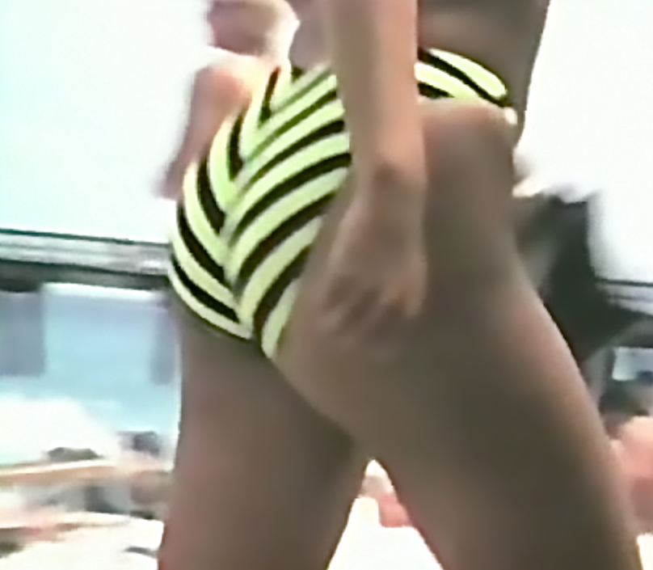

骨架的はこのインタビューで、2010年11月2日にリリースした『[Holograms](https://virtualarchives.bandcamp.com/album/holograms)』（[アーカイブ](https://web.archive.org/web/20121101025047/http://soundcpu.bandcamp.com/album/holograms)）を、当時「**ポスト・チルウェイブ、エクスペリメンタル、あるいはスロウ・ジャムだと思って発表した**」と振り返る。雰囲気が先にあって、名前が後からつく。vaporwave という語は後付けで広がった。制作時点では、作り手は別のラベルで音を流通させていた。

本章に続く各節では、この雰囲気が具体的にどんなシーンだったのか、つまり音楽と映像と物理メディアがどう結びつき、どんなレーベルとプラットフォームの上で動いていたかを見ていく。Salem、Oneohtrix Point Never、Gatekeeper、20jazzfunkgreats、Hippos in Tanks。これらはシーンのごく一部にすぎないが、命名以前の土壌を示す象徴的な名前だ。

## マイクロジャンルの見取り図——2009〜2011年

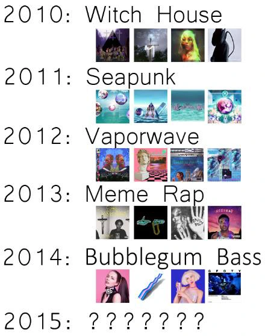
<!-- https://4chanarchives.com/board/mu/thread/53888656?utm_medium=organic&utm_source=yasmartcamera -->

2009年から2011年にかけてネット発の音楽サブジャンルが次々と名指しされた。本章と第3章で繰り返し登場する **chillwave**、**hypnagogic pop**、**witch house**、**seapunk**、**vaporwave** を、ここで先に示しておく。

[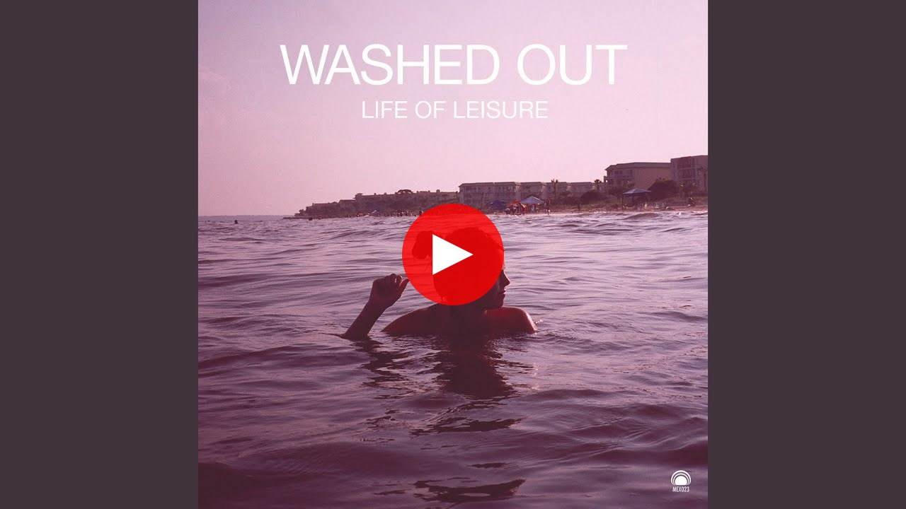](https://www.youtube.com/watch?v=3Pt0V6K7WpM)

**chillwave** は2009年7月27日、音楽ブログ Hipster Runoff の Carles が Washed Out らを紹介する記事の末尾で、半ば冗談めいた候補のなかから「chill wave」という語を浮かべたことから始まる。

ゆるやかなシンセ、夏のポップ、幼少期の記憶を思わせる lo-fi な質感が特徴で、郷愁をポップさや VHS 的な記憶と結び付けた。

[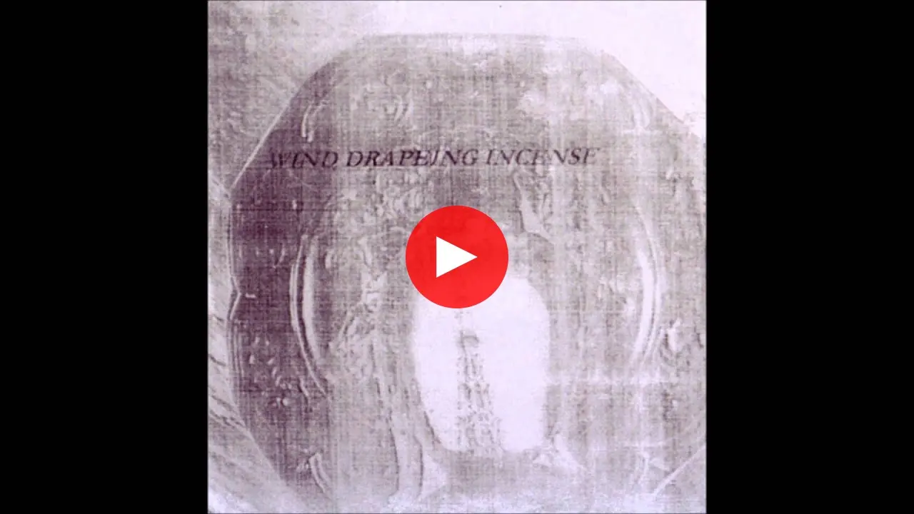](https://www.youtube.com/watch?v=en7-xZni79g)

**hypnagogic pop** は、2009年8月に *The Wire* の David Keenan が、chillwave とほぼ同じ音楽群に立てた別の名前だ。1980年代の幼少期の記憶を素材にしたホームレコーディング音楽を括る批評語で、chillwave としばしば同義に使われた。

Ghost Box Records や The Caretaker が代表するイギリスの憑在論的郷愁が批評言語として流通し、Keenan の命名はその文脈に接続する。

[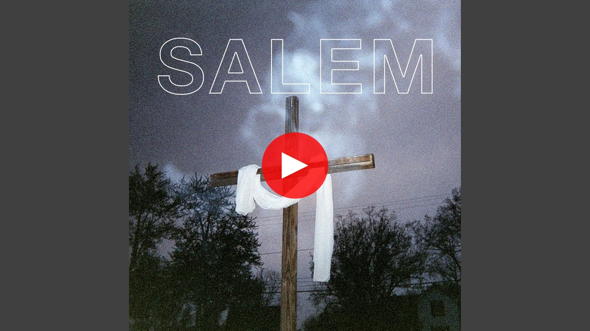](https://www.youtube.com/watch?v=sGSRAeaS73s)

**witch house** は、chillwave / hypnagogic pop とは対照的に、そのより暗いルートとして2000年代後半から形作られた。chopped and screwed 的な遅さ、ゴス / ホラー的ビジュアル、Unicode 記号を用いたアーティスト名などが特徴だ。2009年12月、Pictureplane による Pitchfork 寄稿で "witch house" という語がはじめてメディアに現れた。

音楽と映像とコミュニティがセットでムーブメントを支え、小規模レーベルとフォーラムがその歴史の正典を固定化する。

[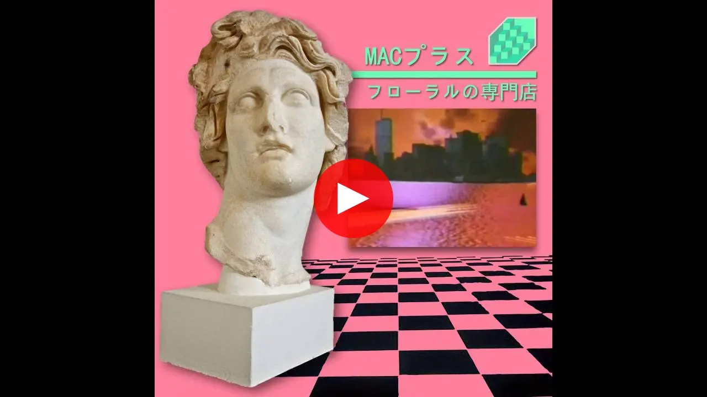](https://www.youtube.com/watch?v=bAgmGZ9iQ2Y)

**vaporwave** の音と映像の実体は、2010年頃から Daniel Lopatin（Chuck Person）、James Ferraro、骨架的、internet club、Ramona Andra Xavier らの作品として積み重なっていた。そこへ2011年後半に "vaporwave" という語が名づけられた。名づけ以前の作品は、のちに "proto-vaporwave" と呼ばれるようになる。

エレベーターミュージック系の muzak や消費文化の音をサンプリングすること、chopped and screwed 的な減速や音質劣化、80年代へのノスタルジアを特徴とする。

[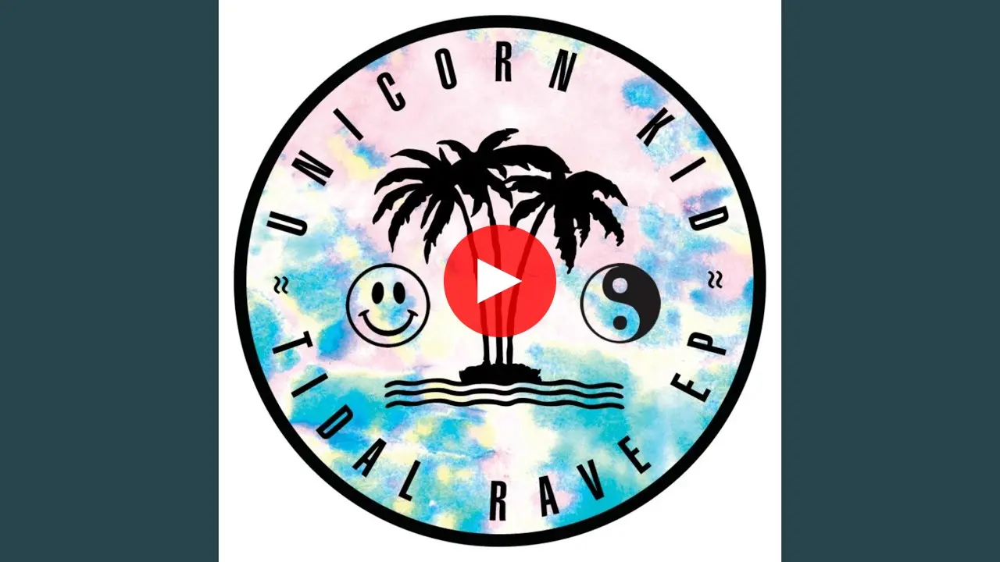](https://www.youtube.com/watch?v=sjFiQctbmhw)

**seapunk** は2011年6月1日、Lil Internet のツイートから生まれた。夢の断片として書かれた発端のツイートは "#seapunk" というハッシュタグとなり、ジョークとして広まった。

その後、音楽やビジュアルが後付けされ、ひとつのムーブメントとなっていく。90年代のレイヴカルチャーを参照しながら、その名の通り海洋的イメージをまとい、インターネット上で急速に拡散した。

これら五つのうち、少なくとも proto-vaporwave の担い手たちは、同じエクスペリメンタル・アンダーグラウンドの周辺で交差していた。Daniel Lopatin や James Ferraro は2000年代のノイズ・実験音楽の現場から出発し、mp3 ブログや MySpace、Bandcamp、そして物理媒体を扱う小規模レーベルを通じて音と映像を流通させた。

## ノイズシーンからの離脱——OPNとFerraro

エクスペリメンタルシーンの別の場所で、古いメディアの質感を素材にする実験を重ねていた作り手がいた。Daniel Lopatin（Oneohtrix Point Never）と James Ferraro だ。二人に共通するのは、「過去のメディアを引き摺る」操作だった。

OPN は2009年6月1日、レーベル Root Strata からオーディオ＝ビジュアル作品『Memory Vague』を DVD-R でリリースした。YouTubeからダウンロードした80年代のCMや宣伝映像などを、Windows Movie Maker で編集した映像が全編に使われている。2009年7月19〜20日、OPNはYouTubeチャンネル[sunset corp.](https://www.youtube.com/@sunsetcorp)に、『Memory Vague』から抜粋した「[angel](https://www.youtube.com/watch?v=dN0czUMRMU8)」「Nobody Here」「Computer Vision」「Demerol」をアップロードした。

古いコマーシャルや1980年代のビデオ素材を重ね合わせたこれらの映像は、後に「**最初のvaporwave作品**」として語られるようになる。しかし発表された当時「vaporwave」という言葉は存在せず、それは単なる実験的な映像作品に過ぎなかった。

2010年8月8日、OPN が Chuck Person 名義でアルバム『Chuck Person's Eccojams Vol.1』をリリースする。1980年代のポップスを極端にスローダウンしてループさせ、カセットテープが伸びたような質感を与えたこの作品は、『Memory Vague』と並ぶ vaporwave の先駆的作品となった。

Daniel Lopatin は2000年代初頭にボストンの実験音楽シーンに入り、[Carlos Giffoni の **No Fun** などノイズ・シーンで活動していた](https://www.novembermag.com/content/oneohtrix-point-never/)。だが2006年頃には「[ノイズに飽きてきた](https://www.villagevoice.com/brooklyns-noise-scene-catches-up-to-oneohtrix-point-never/)」感覚から参照先を広げ、[Klaus Schulze やライブラリ音楽、ニューエイジ](https://www.factmag.com/2010/06/28/fact-mix-162-oneohtrix-point-never/)を経て、ヨーロッパのグリッチを擁する **Editions Mego** へ接近し、同レーベルからアルバム『[Returnal](https://www.discogs.com/ja/master/250864-Oneohtrix-Point-Never-Returnal)』（2010）をリリースする。

James Ferraro は2003年頃、サンディエゴで Spencer Clark とユニット **The Skaters** を組んだ。出発点は、[ウスペンスキー](https://ja.wikipedia.org/wiki/%E3%83%94%E3%83%A7%E3%83%BC%E3%83%88%E3%83%AB%E3%83%BB%E3%82%A6%E3%82%B9%E3%83%9A%E3%83%B3%E3%82%B9%E3%82%AD%E3%83%BC)や Jon Hassell といった、[ノイズよりも儀式的な音楽への関心](https://www.progarchives.com/artist.asp?id=12834)だったという。自主レーベル **[New Age Tapes](https://www.discogs.com/ja/label/117246-New-Age-Tapes)** では[別名義](https://www.discogs.com/ja/artist/810577-Lamborghini-Crystal)も使い、古い boombox や使い古したカセットによる濁った lo-fi の質感を持った作品を発表していた。

やがて James Ferraro が素材に選ぶのは、テレビのジングルや着信音、ATM の操作音といった、日常にあふれて意識されない消費文化の音になる。その移行は Daniel Lopatin と並行したものだった。

2011年10月25日には、James Ferraro が Hippos In Tanks から『Far Side Virtual』をリリースする。着信音や MIDI、スムージーバーやオフィスを思わせる音で埋め尽くされたこの鮮明で hi-fi なアルバムは、Eccojams の伸びたカセットのような lo-fi とは逆の方向を向いていた。ともに proto-vaporwave の代表作として並べられることになる二作だが、その方向は質感の点で対照的だった。

## witch houseの音響的前史——Salem・chopped and screwed・ビジュアルと記号

### 暗いルートと internet aesthetics のひな型

chillwave や hypnagogic pop がノスタルジアをサマーポップや幼少期の記憶へと軽く転写したのに対し、**[witch house](https://en.wikipedia.org/wiki/Witch_house)** は先に触れた「より暗いルート」にあたるマイクロジャンルで、2000年代後半から2010年代初頭にかけてアメリカを中心に形作られた。ブログ・MySpace・Bandcamp・Tumblr・低価格 DAW の上で、音楽とビジュアルがセットで流通した。seapunk のようにハッシュタグを通じて拡散したわけではないが、こうしたあり方は、名前・映像・音源・コミュニティが一体となる、のちの aesthetics のひな型のひとつである。

### 音響・ビジュアル・記号

音楽的な土壌は、ヒューストン発祥の chopped and screwed（DJ Screw）にあった。テンポを落とし、声とビートを引き裂くこの技法は、witch house だけでなく vaporwave・cloud rap も共通の技術的祖先として言及する。2006年頃、ミシガン州 Traverse City で結成された **Salem**（S4LEM）が、その遅いビート、トラップ的なハイハット、shoegaze 的な壁音、ダークなシンセをひとつにまとめ、witch house の音響的なプロトタイプになった。

ビジュアルと象徴は別のルートで育った。

表象の多くは**ゴスカルチャー**に由来する。ゴシックやインダストリアル、ホラー映画、VHS の劣化、コラージュといったオカルト的ローファイが、音とセットで流通した。現代的なゴシックカルチャーはポストパンクとインダストリアルを通過して形成された。Ghost Box Records や David Keenan が扱う COIL 系の英国オカルトアンダーグラウンドとも、劣化メディアとコラージュという操作では並行する。直接の系譜ではないが、同じ「古いメディアを暗く引きずる」感覚は、地理を越えて同期している。

1980年代の **Thee Temple ov Psychick Youth（TOPY）** と **Psychic TV** は、ケイオス・マジックと郵便ネットワークでオカルト実践と音楽を結びつけた先行例として、witch house の美学と通信戦術と比較されることがある（[Siepmann 2018](https://www.tandfonline.com/doi/abs/10.1080/01411896.2018.1413870)）。

witch house バンドである **Modern Witch** の一人、**Mario Zoots** は2008年3月からブログで自作のコラージュ画像を投稿し始める。のちに Zoots 自身が語るように、その画像やデザインは witch house aesthetic を象徴するものとして語られるようになる。

Mario Zoots のコラージュ画像は、2008年9月の[CD-R付きZINE「Sonic Bonk」](https://web.archive.org/web/20200125172914/http://mariozoots.blogspot.com/2008/09/new-zine-sonic-bonk-modern-witch-issue.html)と一体で流通した。Cosmotropia de Xam が主宰するオーディオビジュアルプロジェクト **Mater Suspiria Vision** の映像寄りの作品とともに、Mario Zoots のコラージュ画像は witch house の音楽と切り離せない顔になった。

批評上、witch house は「drag」、「screwgaze」、「haunted house」などとも呼ばれた。重いリバーブ、加工されたボーカル、レイヤーされたベースが骨格だ。アーティスト名や曲名にキリル文字、三角（△）、十字（✝）などの Unicode を多用する慣行は、検索を難しくしつつ視覚的記号として機能した。検索避けそのものが witch house だけの発明ではないが、記号を美学の一部として使う実践は、のちのネット音楽マイクロジャンルに直接引き継がれる。

記号は見た目を作るだけでなく、発見の回路も左右した。キリル文字や △・✝ を含む名前は、当時の検索エンジンではうまく引っかからない。そのアーティストにたどり着くには、ブログのリンクや Tumblr のリブログ、フォーラムの書き込みといった、すでにシーンの内側にいる誰かの手引きが必要だった。読みにくい名前は、作り手を個人から切り離されたペルソナへと変えると同時に、内と外を隔てる敷居としても働いた。

### 画像文化、批評地図、並行する視覚

<!-- https://www.flickr.com/photos/mariozoots/with/4058133285 -->

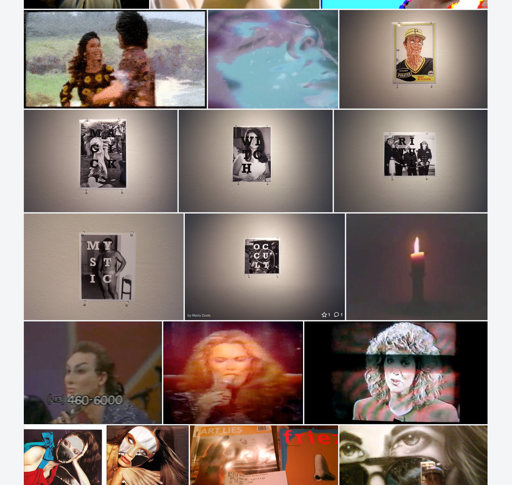
<!-- https://www.flickr.com/photos/mariozoots/with/4124149549 -->

**Mario Zoots** は [Monica Uszerowicz との対談](http://mariozoots.blogspot.com/)で、2009年に NetArt への関心を深め、物理作品を止めてオンライン限定で流通させたいと語り、「非物質性」に執着したと振り返っている。Google 画像検索で拾った写真からコラージュを作り、印刷用の大判と Tumblr 流通用の小サイズを意図的に分ける実践も行ったという。

2011年2月の [modernwitchmusic.com](https://web.archive.org/web/20110202091815/http://modernwitchmusic.com/) にはメディチ家のヴィーナスを加工した画像が載っており、西洋美術史画像のデジタル再利用という vaporwave 的な感覚と同期した表現が確認できる。

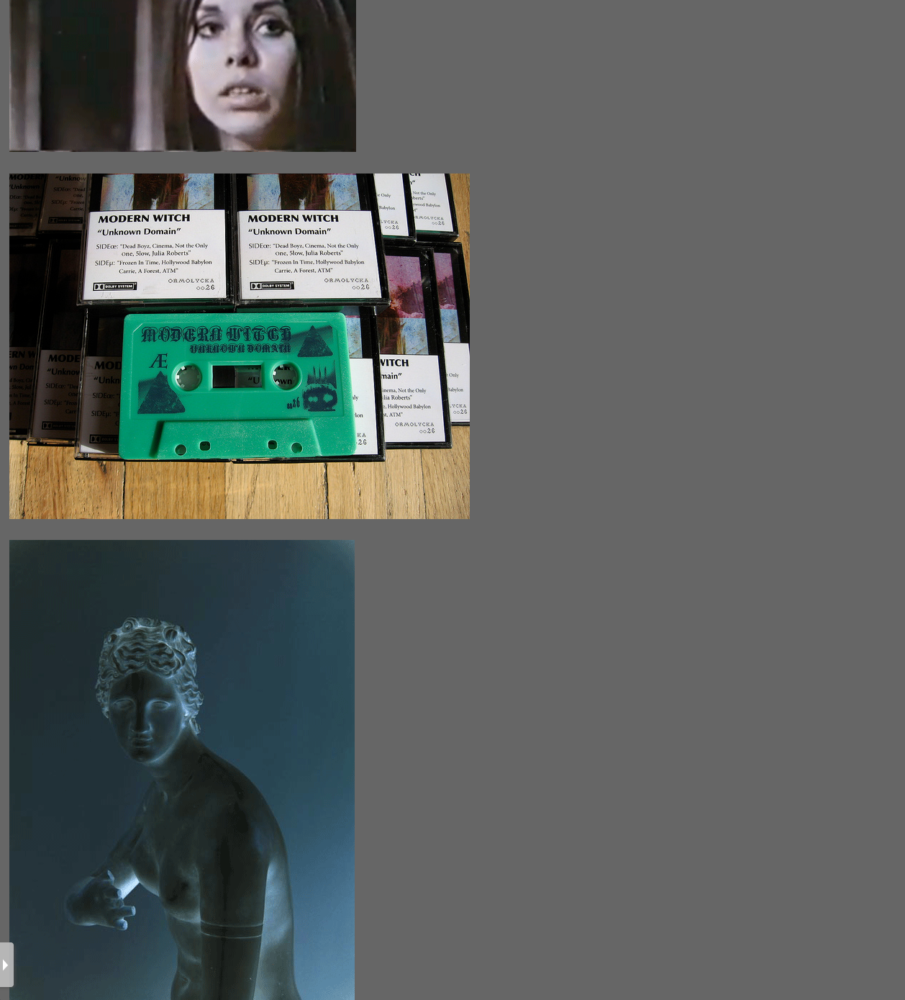
<!-- https://web.archive.org/web/20110202091815/http://modernwitchmusic.com/ -->

**Megazord**（Christian Oldham）の出自は witch house とも ポストインターネットアートとも別のところにある。2014年1月10日に刊行された [MASSAGE 9: INTERNET CULTURE](https://themassage.jp/archives/1)（MASSAGE編集部・庄野祐輔・高岡謙太郎 編）のインタビューでは、高校生のうちに Photoshop の練習としてデジタルコラージュを始めたと語られている。そうした実践がしだいに Tumblr の画像文化に多大な影響を与えたことで、先述のネットアート人脈との交流も生まれた。

Mario Zoots のコラージュや Megazord の Tumblr 投稿は画像文化に影響を与えたが、両者が同じものに直接影響を受けたわけでも、直接交流があったわけでもない。初期のものを見れば別々の出自だということがわかるが、2010年以降は同じインターネット上の視覚的ムーブメントのなかで制作しているようにみえる。両者は2009から2010年頃に近い視覚的センスを別ルートから育てた並行例であり、次第にシーンが形成されるなかで近い「作風」となっていったのかもしれない。

古典・美術史画像のデジタル加工、劣化メディア、コピーの連鎖というモチーフや技法は、witch house だけでなく、のちの vaporwave や seapunk が共有する土壌でもあった。

seapunk は witch house シーン出身アーティストが音楽の制作に多数かかわっている。憑在論的郷愁とは別の地理と感性のなかで hip-hop 技法とホラー／オカルト感覚を結びつけた witch house の要素は、vaporwave ではサンプルのスローダウン、デジタル劣化、Unicode 記号など文字による演出として継承されている。もちろん seapunk や vaporwave と witch house は相互に影響しあっており、単線的な影響関係があるわけではない。だが、時系列をみればそれらより先にその「美学」が形作られた witch house の要素が、その後のマイクロジャンルに流れていると言える。

## ダークな音のmp3ブログ——20jfg

mp3 ブログは音源を配り、書き手が選んだ音楽に言葉を添えて紹介する場だった。扱われる音楽の幅はブログごとに異なり、インディー・ポップからより難解な電子音楽まで、書き手の好奇心次第だった。そのなかで、ダークな手ざわりの音を専門に扱ったのが、イギリスのブライトンを拠点とする **20jazzfunkgreats**（20jfg、[myspace link](https://web.archive.org/web/20090803094355/http://www.myspace.com/20jazzfunkgreats)）だった。[Stereogum は2019年](https://stereogum.com/2089949/witch-house-salem-king-night-turns-10/columns/sounding-board)、20jazzfunkgreats について、新旧を問わずダークで難解な電子音楽を扱い、同時代のブログにありがちなトレンド追いに陥らない好奇心を保っていたと振り返っている。

2008年1月には、まだ無名だった Salem を[擬古文めいた文体を用いながら紹介](https://web.archive.org/web/20110910023629/http://www.20jazzfunkgreats.co.uk/wordpress/2008/01/remote-unfriended-melancholy-slow/)している。その音楽を『[フロム・ヘル](https://ja.wikipedia.org/wiki/%E3%83%95%E3%83%AD%E3%83%A0%E3%83%BB%E3%83%98%E3%83%AB)』に登場する[ホークスモアの教会](https://en.wikipedia.org/wiki/St_Luke_Old_Street)建築になぞらえる一節は、のちに witch house 批評が共有することになるダークな手ざわりを、早くも先取りしていた。

### タイトルと中身のずれ——Throbbing Gristleから20jfgへ

1979年12月にリリースされた **Throbbing Gristle** の3作目 *[20 Jazz Funk Greats](https://en.wikipedia.org/wiki/20_Jazz_Funk_Greats)* は、「ジャズファンクの名曲20選」と題されながら、その実シンセポップ、エキゾチカ、ディスコを横断するインダストリアルの実験音楽だった。タイトルとジャケットが中身とまったく食い違うこのアルバムは、意図的なジョークとして設計されている。Pitchfork は後年これを[史上最高のインダストリアル作品に挙げた](https://pitchfork.com/features/lists-and-guides/the-33-best-industrial-albums-of-all-time/)。

mp3ブログ **20jazzfunkgreats**（20jfg）の名前は、このアルバムから取られている。Throbbing Gristle は自主レーベル **Industrial Records** で、セルフリリースやカセットと郵便による配布を実践した。このやり方は、中心メンバーの[ジェネシス・P・オリッジ](https://ja.wikipedia.org/wiki/%E3%82%B8%E3%82%A7%E3%83%8D%E3%82%B7%E3%82%B9%E3%83%BBP%E3%83%BB%E3%82%AA%E3%83%AA%E3%83%83%E3%82%B8)がのちに立ち上げる **Psychic TV** や **TOPY** へと引き継がれた。ジェネシス・P・オリッジ自身も、witch house を初めて名指した Pictureplane の2009年ベスト記事に、コラージュ画集『30 Years Of Being Cut Up』の著者として名を連ねている。

## ブログからレーベルへ——Tri Angle

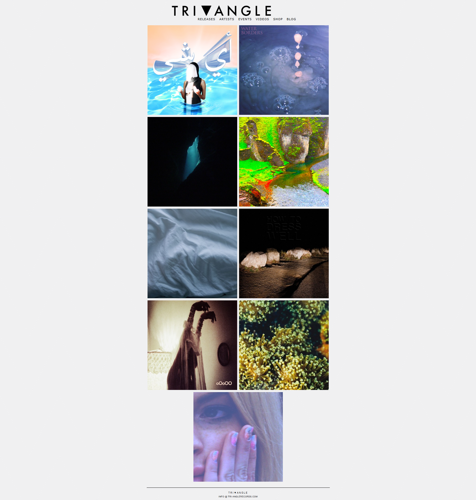
<!-- https://web.archive.org/web/20110808090342/http://tri-anglerecords.com/ -->
<!-- 『Let Me Shine For You』のほか、 Balam Acab や oOoOO 、 How To Dress Well、 Clams Casin 、 Ayshay（Fatima Al Qadiri） などの象徴的なリリースが並ぶ。 -->

こうしたブログから、レーベルへ移っていく書き手も現れた。**20jazzfunkgreats** のライター Robin Carolan は、[2010年4月に **Tri Angle Records** を設立](https://www.residentadvisor.net/features/1743)する。ブログで見つけたアーティストを自分の手で盤として送り出すほうが面白い、という動機だったと振り返っている。Tri Angle Records は次第に witch house シーンを代表するレーベルの一つと目されるようになる。第1章で見た、ブログがレーベルや会場へ転換していく動きの一例でもある。

2010年7月21日、Tri Angle はレーベル初の音源としてコンピレーションミックステープ『[Let Me Shine For You](https://dismagazine.com/disco/compilations/6173/tri-angle-records-presents-let-me-shine-for-you/)』をリリースする。リンジー・ローハンのポップソングに触発された6曲入りのコンピレーションであり、Laurel Halo や oOoOO、Oneohtrix Point Never らが参加している。このリリースは DIS Magazine とコラボレーションしており、同誌から告知されているほか、同誌の SoundCloud アカウントからミックステープがアップロードされていた。

Tri Angle は witch house シーンを担うレーベルの一つだった。しかし、それと同時に、witch house の枠に収まらない実験的なエレクトロニックミュージックもリリースしていた。また、レーベル初の音源で DIS Magazine とコラボレーションを行っているとおり、ポストインターネットアートのシーンとも接続していた。

## MySpaceのネットワーク——20jfgとの交差

2010年に Robin Carolan が Tri Angle Records を設立するより前から、作り手同士の交友は MySpace 上ですでに形成されていた。Daniel Lopatin（Oneohtrix Point Never）と Gatekeeper、そしてのちに Tumblr の視覚文化へ影響を与える Megazord らは、命名以前のシーンを、このネットワークのなかで共有していた。

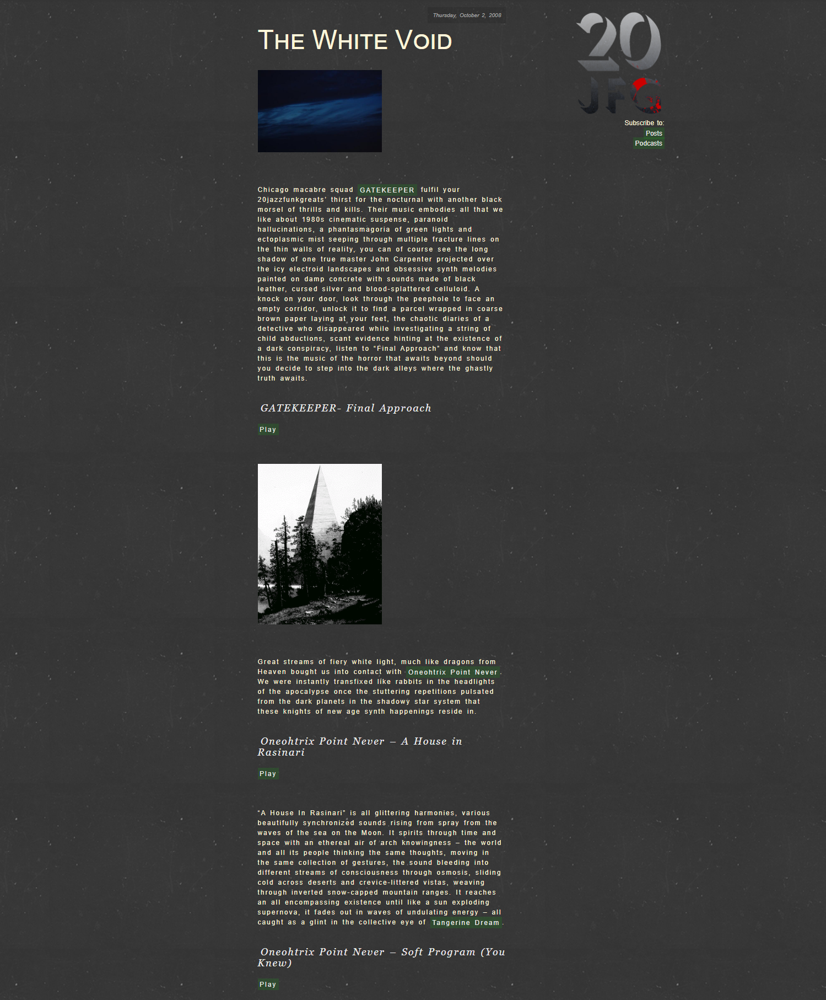
<!-- https://web.archive.org/web/20101213051243/http://www.20jazzfunkgreats.co.uk/wordpress/2008/10/02/the-white-void/ -->

2008年10月2日、mp3 ブログ 20jazzfunkgreats は「[THE WHITE VOID](https://web.archive.org/web/20101213051243/http://www.20jazzfunkgreats.co.uk/wordpress/2008/10/02/the-white-void/#)」で Gatekeeper の楽曲「Final Approach」と、OPN の楽曲「A House in Rasinari」「Soft Program (You Knew)」を同列に紹介した。これらの楽曲はその後採録されることもメディアに取り上げられることも[ほぼ](https://x.com/Sterrenplaten/status/363011683876225026)なかった。

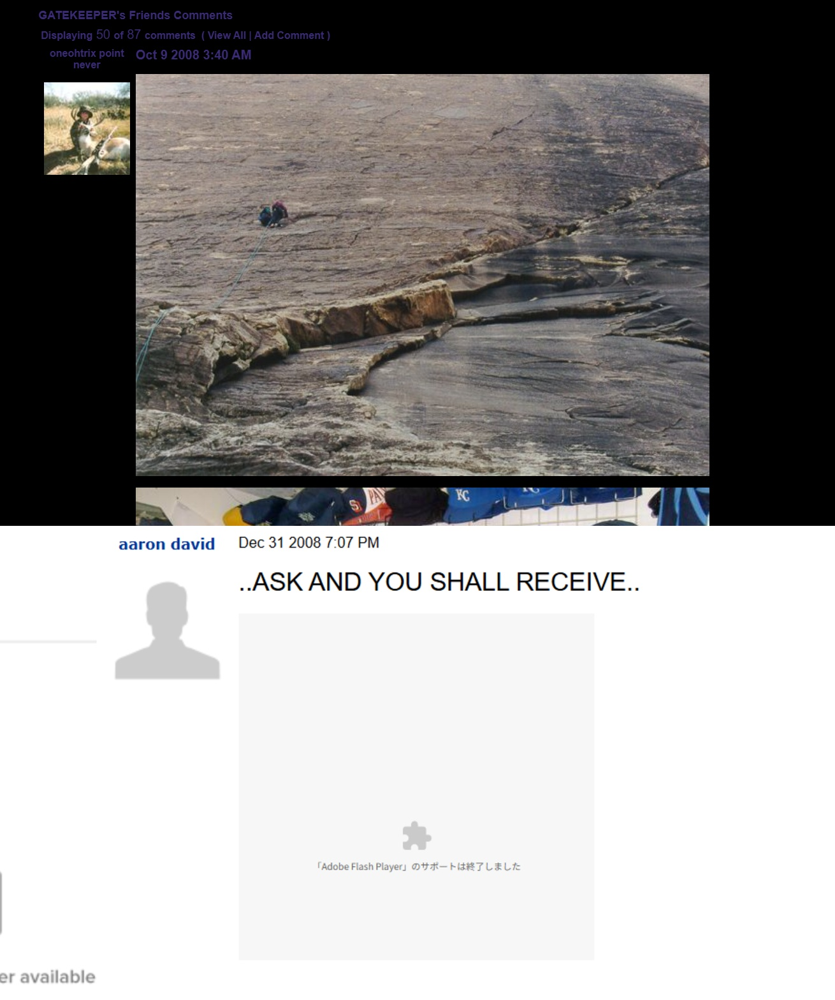
 <!-- gatekeeperへOPNは2008年10月9日 https://web.archive.org/web/20090212235209/http://profile.myspace.com/index.cfm?fuseaction=user.viewProfile&friendID=182269894 OPNへADRは2008年12月31日にフレンドコメントを送っている。これら以外にも複数送りあっている様子が確認できる。 -->

2008年10月の GATEKEEPER の[MySpaceアーカイブ](https://web.archive.org/web/20081011020249/http://www.myspace.com/iiigatekeeperiii)では、フレンドコメント欄で oneohtrix point never がランダムな画像や YouTube リンクを投稿している。動画のほとんどは現在では削除されているが、[Dyvaのイタロディスコの楽曲「On Fire」にあわせてランダムなgifアニメーションが再生される動画](https://www.youtube.com/watch?v=dYaSYCRmSAo)は確認できた。

同時期の[OPN側のMySpace](https://web.archive.org/web/20090212235209/http://profile.myspace.com/index.cfm?fuseaction=user.viewProfile&friendID=182269894)にも、Gatekeeperの一人である Aaron David Ross (ADR) が [aaron david](https://web.archive.org/web/20080216163920/http://profile.myspace.com/index.cfm?fuseaction=user.viewprofile&friendid=591594) 名義で YouTube 動画を複数送っている。それぞれのフレンドコメント欄に並んでいるのは、ホラー映画スチル、Photobucket 画像、VHS 風の映画のスクリーンショット、3DCG の gif アニメーション画像だ。MySpace 上の画像共有文化の一端がここで確認できる。

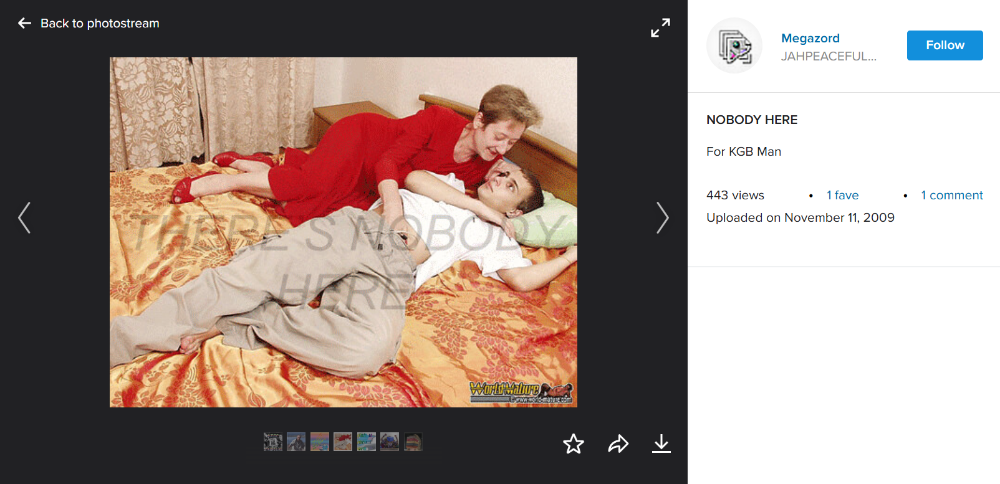

GATEKEEPERやOPN周辺のネットワークにはMegazordもいた。2009年11月11日、Megazord は説明欄に「For KGB Man」と書かれた[作品「NOBODY HERE」を Flickr に投稿](https://www.flickr.com/photos/megazord/4094220247)している。KGB Man は Daniel Lopatin の別名義であり、さらに作品名は[sunset corp. の動画「Nobody Here」](https://www.youtube.com/watch?v=-RFunvF0mDw)と呼応する。

Megazord と OPN の関わりはその後も続く。Megazord は2010年5月22日と24日、OPN の楽曲「[Ouroboros](https://vimeo.com/11940873)」と「[‡PREYOUANDI∆](https://vimeo.com/12008850)」の MV を制作・公開した。

Daniel Lopatin と Joel Ford のユニット Games は、EP『[Everything Is Working](https://www.flickr.com/photos/megazord/4754753441/)』と『[That We Can Play](https://www.flickr.com/photos/megazord/4973898569/)』を発表している。これらのアートワークも Megazord が制作している。

Megazord の Flickr 投稿には、古典彫刻や美術史画像をデジタル加工したものもあるが、それだけではない。Games EP のアートワークは、Megazord が手がけたもののなかでも、こうした彫刻系コラージュとは別の方向を取っている。

先に触れたように、Mario Zoots のデジタルコラージュも出自は異なる。両者に共通して見えるのは、VHS 的アーティファクトの載ったスクリーンショットのような画像、すなわち lo-fi 映像への態度とアプローチであり、この手ざわり自体は同時代に広く並んでいた。ただし、その具体的な特徴は作家ごとに別だ。seapunk や vaporwave の視覚の原型に近いのは Megazord のほうであり、Mario Zoots の作品は今日の目から見れば、そこまで近いとは言いにくい。

2009年9月には GATEKEEPER が Megazord の [MySpace ページ](https://web.archive.org/web/20091013065233/http://www.myspace.com/megazordlovesyou)にもフレンドコメントを残している。OPN の MySpace への Aaron David Ross のコメントと合わせると、GATEKEEPER がこの時期の MySpace ネットワークのハブのひとつになっていた様子がうかがえる。

## GATEKEEPER『Giza』——音と映像の一体流通

シカゴを拠点とした Aaron David Ross (ADR) と Matthew Arkell のユニット GATEKEEPER は[2010年初頭に Salem とギグを行っている](https://web.archive.org/web/20100107035835/https://www.nytimes.com/2010/01/07/arts/music/07salem.html)。また、2010年4月には witch house を特集した[オンラインマガジン notodo.com の記事](https://web.archive.org/web/20160408155157/http://www.notodo.com/musica/indie/1507_witch_house_ora_pro_nobis.html)でも言及されるなど、witch house シーンと近い場所で活動していた。

2010年12月に GATEKEEPER が Merok Records からリリースしたセカンド EP『[Giza](https://en.wikipedia.org/wiki/Giza_(EP))』は、ホラー映画やSF映画のサウンドトラックに影響を受け、また80年代のダークなダンスミュージックの要素を取り入れたものだった。音楽は、映画『ターミネーター』やゲーム『Diablo II』などダークかつキッチュな音楽を（YouTubeでダウンロードして）サンプリングしている。

6曲入りのこの EP は、全曲で映像ユニット Thunder Horse Video が MV を制作した。MV には[映画『Blade』](https://vimeo.com/16545253)や[アニメ映画『妖獣都市』、OVA『魔界都市<新宿>』](https://www.youtube.com/watch?v=YWGCtj0q7EU)をサンプリングしたものも含まれる。注目すべきは公開の仕方と質感だ。

最初、[2010年10月12日に1曲目『Chains』が公開](https://web.archive.org/web/20131027062545/http://www.xlr8r.com/news/2010/10/watch-gatekeepers-chains-video-t)された。これには90年代を想起させる 3DCG が用いられている。もうひとつの[オリジナルMV『Mirage』](https://vimeo.com/17322472)でも[lenox-lenox](https://web.archive.org/web/20101221101138/http://www.lenox-lenox.us/)による[3DCGが使用](https://rhizome.org/editorial/2010/dec/14/videos-from-gatekeepers-giza-by-thunder-horse-vide/)された。最初のMV発表の約2か月後、2010年12月6日から10日にかけて、mp3 ブログ 20jazzfunkgreats 上で[残りのMVが公開](https://web.archive.org/web/20101211090456/http://www.20jazzfunkgreats.co.uk/wordpress/cats/gatekeeper)された。

2011年1月の [Pitchfork『Giza』EPレビュー](https://pitchfork.com/reviews/albums/14980-giza-ep/)では、witch house クルーの「デジタルの曇り」とは対照的な、明瞭な「80年代シンセの再構成」として紹介されている。「vaporwave」という語は使われない。同レビューは [Philip Sherburne のブログ](http://phs.abstractdynamics.org/2010/11/witch_house_dj_screw_and_the_n.html)を引用し、**mid-80s の apocalyptic aesthetics** に根ざす暗い電子音楽の広がりを、過去の十年を **aesthetics** と名指す批評文脈として描いている。

『Giza』の MV は mp3 ブログ 20jazzfunkgreats 上で無料公開されたが、全曲映像は Hippos In Tanks の VHS『[GIZA: the HDvhs Experience](https://web.archive.org/web/20110312203749/http://hipposintanks.bigcartel.com/product/giza-the-hdvhs-experience)』（2010年12月13日、[Discogs](https://www.discogs.com/ja/release/2699011-Gatekeeper-Giza-The-HDvhs-Experience)）として物理メディアでもリリースされた。20jfg が紹介、Merok Records が音源、HIT が映像を分担しつつ、一本の作品を流通させた。

## レーベルネットワーク——HIT、OESB

HIT のほか、**Olde English Spelling Bee**（OESB）も、2010年前後にはネット発の音楽と映像を物理盤や VHS として流通させる小規模レーベルの一つだった。

2010年にロサンゼルスで設立された HIT は、共同創業者 Barron Machat と Travis Woolsey が KXLU の深夜ラジオ番組から出発して立ち上げたレーベルだ。2010年6月に [Von Haze の EP](https://web.archive.org/web/20111129093657/http://hipposintanks.bigcartel.com/product/von-haze-von-haze-e-p-ltd-12-pre-order) を最初のリリースとした。

[Barron Machat は音楽業界に影響力のある家系](https://www.thefader.com/2015/04/17/how-hippos-in-tanks-ushered-avant-garde-music-into-the-21st-century)であり、そうした背景が Sony RED との配給契約を可能にしたという。これにより HIT は、実験音楽の盤が大規模小売にも乗るという、[当時のインディーとしては異例の流通網を獲得](https://www.rollingstone.com/music/music-news/remembering-barron-machat-the-label-boss-who-took-pop-in-wild-new-directions-34276/)した。

[The Fader（2015）](https://www.thefader.com/2015/04/17/how-hippos-in-tanks-ushered-avant-garde-music-into-the-21st-century) は、HIT を Tri Angle や OESB と並べ、いずれも pop・クラブ・実験音楽の境界があいまいな領域を横断するレーベルだったと述べている。HIT の Travis Woolsey も、設立時に Tri Angle や OESB といった小規模レーベルへの「敬意と意識」が[創業の動機のひとつだったと振り返っている](https://imposemagazine.com/features/hippos-in-tanks-label-profile)。

OESB のファウンダー Todd Ledford は、OPN の楽曲「[Time Decanted](https://vimeo.com/7616034)」（*Russian Mind*、2009年、No Fun Productions）の MV を手がけている。OPN 作品が OESB からリリースされているわけではないが、レーベルの枠を越えて Todd Ledford と Daniel Lopatin が協働していた一例だ。

2010年8月16日には、OPN こと Daniel Lopatin と Joel Ford のユニット Games のデビューEP『[Everything Is Working](https://web.archive.org/web/20110616053950/http://hipposintanks.bigcartel.com/product/games-everything-is-working-ltd-7-pre-order)』が Hippos In Tanks からリリースされている。2010年11月2日（Giza VHS の約1か月前）には、GATEKEEPER のリミックスを含む Games のセカンドEP『[That We Can Play](https://web.archive.org/web/20101113014010/http://hipposintanks.bigcartel.com/product/games-that-we-can-play-12-vinyl)』がリリースされている。

Games は2010年当時はこの名義で活動するが、のちに Ford & Lopatin へ改名する。収録曲「Strawberry Skies」には Laurel Halo がボーカルで参加している。先行曲「Shadows in Bloom」は Gorilla vs. Bear と Pitchfork の Altered Zones で2010年9月29日に同日プレミアされた。

**Ford & Lopatin** は改名後、デビューアルバム *Channel Pressure*（2011年6月7日、Software / Mexican Summer）を発表した。収録曲「[World of Regret](https://vimeo.com/24113258)」の MV は、GATEKEEPER の *Giza* 全曲 MV を手がけた **Thunder Horse Video** が監督し（[Dazed クレジット](https://www.dazeddigital.com/music/article/10453/1/ford-lopatin-world-of-regret-video-premiere)）、CGI・アニメーションを **Tabor Robak** が担当した。

James Ferraro が2011年10月25日にリリースした『[Far Side Virtual](https://web.archive.org/web/20111212030035/http://hipposintanks.bigcartel.com/product/james-ferraro-far-side-virtual-ltd-12-pre-order)』も Hippos In Tanks から出されている。2011年には Fact Magazine が[HIT を年間ベストレーベル](https://www.factmag.com/2011/11/22/10-best-labels-of-2011/3/)に選んでいる。そこからリリースしていた Laurel Halo や James Ferraro らの作品は、音楽批評の場で注目を集めるようになった。

同じ2011年7月、James Ferraro・Daniel Lopatin・Laurel Halo の3人は **RVNG Intl.** のシリーズ企画 *[FRKWYS Vol. 7](https://www.discogs.com/ja/master/353721-Borden-Ferraro-Godin-Halo-Lopatin-FRKWYS-7-)* でスタジオに集まっている。

「世代をまたいだ協働（intergenerational collaboration）」を掲げる RVNG のこのシリーズは、1970年代のシンセ・ミニマリスト David Borden（Mother Mallard's Portable Masterpiece Co.）と2010年代のネット音楽世代が同席する場として機能した。

## ペルソナとHD視覚——Gatekeeper と Tabor Robak

Gatekeeper は作り手自身をペルソナの背後に退かせる方向を選んでいた。視覚面でも、再生環境の選び方や協働者との関わり方を通じて、その方針が表れていく。

GATEKEEPER の ADR は後年、[The Creative Independent のインタビュー](https://thecreativeindependent.com/people/musician-aaron-david-ross-on-misusing-the-tools-youre-given/)（2026年3月）で初期の姿勢を振り返っている。「音楽を作るのに使っていた技法を、あえてぼかしていた。個人としての自分たちから離れたナラティブを作り、演じられるキャラクターやペルソナを立てるほうが、ずっと面白かったから」。

再生環境を選ぶ不透明な VHS、技法の非開示、読みにくいアーティスト名。それぞれは別の文脈から来ているが、「個人としての作り手から切り離されたペルソナ」というひとつの方向を向いていた。

GATEKEEPER の視覚面には、のちにポートランド出身のネットアーティスト **Tabor Robak** が関わるようになる。[Dazed の記事](https://www.dazeddigital.com/music/article/14170/1/gatekeeper-enter-the-void)によれば、GATEKEEPER の二人と Tabor Robak は MySpace 上で出会い、数年間「JPEG画像などをやり取りしあっていた」という。

GATEKEEPER が2010年の大晦日にポートランドでライブを行った際、Tabor Robak は初めて彼らと顔を合わせた。

2011年、Tabor Robak は、第1章で触れた Jon Rafman と共作 *[BrandNewPaintJob.exe](https://web.archive.org/web/20110521043603/http://eexxttrraa.com/bnpj.html)*（BNPJ.exe）を発表する。元になったのは Jon Rafman のプロジェクト「[Brand New Paint Job](https://brandnewpaintjob.com/)」で、Google 3D Warehouse から拾った素人向け3Dモデルに近代絵画の名作をテクスチャとして貼り付ける作品群だった。BNPJ.exe はその延長として、名作のテクスチャで包まれた仮想空間を歩いて回れるゲーム的な環境にしたものだ。

GATEKEEPER が2012年にリリースするファーストアルバム『Exo』で、Tabor Robak は本格的にこの作品と関わることになる。『Exo』は、『Giza』が VHS のアーティファクトを利用した方向とは逆の質感を取り入れ、BNPJ.exe のゲーム要素をさらに拡張したアルバムとなった。

## Post T.V.——lo-fi映像というシーン

### ローマ国際映画祭の「Post T.V.」

Megazord の Tumblr コラージュ、OPN『Memory Vague』そして Pictureplane「[Goth Star](https://www.youtube.com/watch?v=NuxE7TjYuo4)」のアナログノイズ。VHS やネット上の古い映像を素材にした lo-fi な映像は、個々の作家の散発的な試みにとどまらず、2010年前後にはひとつのまとまった動きとして批評の俎上に乗りはじめていた。それを制度の側から可視化したのが、2010年11月4日、ローマ国際映画祭（Festival Internazionale del Film di Roma）の「L'Altro Cinema | Extra」部門で上映された60分のプログラム **「[Post T.V. - Lo-Fi For The Eyes](https://lofifortheeyes.blogspot.com/)」**である。ネット発の lo-fi 映像が、[主要な国際映画祭の公式カタログ](https://www.romacinemafest.it/wp-content/uploads/2016/09/Catalogue-Rome-Film-Fest-2010-eng.pdf)に一つの作家群として記載された。

このプログラムをキュレーションしたのは、ローマの現代アート誌 **[NERO Magazine](https://www.neroeditions.com/)** の Lorenzo Gigotti と Valerio Mattioli であった。**[AAVV](https://vimeo.com/aavv)**（Valerio Mattioli と Egisto Sopor が2010年に設立した DVD-r／VHS の映像レーベル）が企画に協力している。批評の言葉と DIY の物質的な実践、アートワールドとアンダーグラウンド音楽とが、同じ人物たちのなかで重なっていた。

### プログラムノートが書いていること

[公式プログラムノート](https://lofifortheeyes.blogspot.com/)は、この一連の動きを単発の流行ではなく「ひとつの本物のシーン（una vera e propria scena）」と呼んでいる。書き手は Lorenzo Gigotti と Valerio Mattioli だが、いま読み返すと、のち aesthetic として語られることになる感覚の多くが、2010年の時点ですでに言葉にされていて興味深い。

プログラムノートが挙げるのは、おおよそ次の点だ。まず、ネット上の画像の粗さ、つぶれたピクセルや不意のグリッチを、直すべき失敗ではなく作品の手ざわりとしてそのまま使うこと。次に、ウェブを発表と共有の場として使い、そのことが作品に「コミュニティ的」な性格を与えること。さらに、ウェブを過去と現在の素材がいくらでも引き出せる「巨大なアーカイブ」として扱うこと。そして、80年代・90年代を、個人の思い出というより「みなが共有している記憶」として、考古学と夢とのはざまのまなざしで掘り起こすこと。プログラムノートはこれを、引用を冷たく並べるポストモダンのパスティーシュとは異なると書いている。

プログラムノートはまた、こうした映像が見る側のジャンルの枠をわざと崩すとも指摘する。ビデオアートに見えるものが実は奇妙な音楽の MV であり、古い観光案内に見えるものが実は偽物の幻覚的な CM である、というように。媒体の劣化を欠点ではなく質感として見せる態度は、前節の VHS やカセットと地続きであり、それがネット上の画像にまで及んでいた。

### 集まった顔ぶれ

参加した16組には、本章ですでに登場した人物が多く含まれる。プログラムノートに添えられた紹介文は、彼らが2010年の時点でどう見られていたかを伝えている。参加したアーティストを列挙する。

- Cadeo
- Cosmotropia de Xam
- Kevin DiTrapano
- James Ferraro
- Forcefield
- Todd Ledford
- Daniel Lopatin
- Michele Manfellotto
- Megazord
- Paper Rad
- Daniel Swan
- Sunset Television
- Takeshi Murata
- TV Carnage
- Luke Wyatt
- Alivia Zivich

**James Ferraro** は「アメリカの最新世代のアンダーグラウンドで、もっとも愛され、議論され、物議をかもす人物」と紹介されている。Spencer Clark との The Skaters を経て無数の別名義で活動し、「ひとつの運動に名前を与えるほど影響力のある型」に行き着いた、と書かれている。David Keenan が hypnagogic pop と名づけた現象は「主に彼に由来する」とされ、James Ferraro 自身は自分を「virtual atmospherist（仮想の雰囲気職人）」と呼ぶ。

**Daniel Lopatin** は「時代遅れな技術への偏愛、古いアナログ表現の流用、そして『ノスタルジア』への考察を融合させた、新しい感性の代表格」と紹介される。Oneohtrix Point Never としての音楽に加えて映像作家としての面が強調される。2009年の DVD『Memory Vague』は「アンダーグラウンドの新世代のアーティストに計り知れない影響を与え、いまでは何十人もの追随者を生む流れを実質的に始めた」と評価されている。本章でここまで追ってきた二人が、ローマの上映ではこのように位置づけられていた。

そのほか、2000年代初頭のアメリカで lo-fi の形式的な価値を再発見した先行者として **[Forcefield](https://en.wikipedia.org/wiki/Forcefield_(art_collective))** と **[Paper Rad](https://en.wikipedia.org/wiki/Paper_Rad)** が、そして datamoshing の先駆者の一人として **[Takeshi Murata](https://en.wikipedia.org/wiki/Takeshi_Murata)** が名を連ねた。

プログラムノートは **Todd Ledford** の OESB を、リリースごとにアウトサイダーの映像作家による MV を添える慣行を通じて「ひとつの言語をコード化した」レーベルだと評している。つまりこれは、OESB を lo-fi 映像シーンの代表的なレーベルと位置づける評価だと読めるだろう。実際、[OESB 自身もこの上映を「OESB が国際映画祭に乗り込む」と告知し](https://oesbee.blogspot.com/2010/11/post-tv-lo-fi-for-eyes-today-at-rome.html)、所属の映像作家たちが大きく名を連ねていた。さきにみた OPN「[Time Decanted](https://vimeo.com/7616034)」の MV を Todd Ledford が監督したことも、その慣行の一例だったのだ。Cosmotropia de Xam（witch houseシーンで活動するアーティスト）、Megazord（Tumblrの画像文化に影響を与えた作家）の名前も見逃せない。ここではレーベルや会場ごとに別々に語られがちな名前が、「lo-fi映像」という一点でキュレートされていた。

### Daniel Swan と『Lux Laze』

イギリスの **Daniel Swan** が2010年に発表した短編映画『[Lux Laze](https://u-t-t-e-r.bandcamp.com/album/lux-laze)』は、時間旅行や古い建築への空想を全編 VHS で撮った作品で、サウンドトラックを **Jack Latham** が手がけた。リリースの形態そのものがこの時期らしく、VHS・コミック・DVD-R をまとめたセットとして自主リリースされ、サウンドトラックは50本限定のカセットで同時に出された。映像も音も、あえて古いメディアの手ざわりに乗せて配られている。

この Jack Latham は、まもなく **Jam City** の名義で Night Slugs から『Classical Curves』（2012年）を出し、いわゆる deconstructed club を切り開く。Daniel Swan 自身も、のちに lo-fi の粗さから離れて高精細な映像へ進み、PC Music 周辺の仕事に関わるようになる。lo-fi の質感から出発した人物が数年後にはむしろ HD 的な方向へ向かう、その転回の起点がここにある。

### lo-fi映像という共通の質感

Post T.V.の企画に協力した映像レーベル AAVV から作品をリリースしたのは、[Harappian Night Recordings](https://www.youtube.com/watch?v=zpsE04hzEZk)、[CADEO](https://www.youtube.com/watch?v=rdC_yWNMHXA)、Cosmotropia de Xam、Luke Wyattの4組だった。AAVV の初期4作は、いずれも音楽と映像を同一の作者が一体で手がけた作品だ。そう明記されているわけではないが、このレーベル名はオーディオビジュアル（AV）を指す意図を帯びていると思われる。

Cosmotropia de XamとLuke Wyattは「Post T.V.」にも参加している。

Cosmotropia de Xamは、Mario Zootsの作品と同じく witch house の視覚表現のひな型を作ったアーティストだ。witch house 系レーベル Phantasma Disques を設立するとともに、音楽と映像プロジェクト／コレクティブである Mater Suspiria Vision を主宰しており、こうした活動をもって witch house の初期のシーンを支えるアーティストと評される。Cosmotropia de Xam が AAVV からリリースしたDVD-r作品「VISUAL ECSTASY」はネット上ではどういう作品か確認することはできないが、PWIN ▲▲ TEAKS名義の[初期作品](https://www.youtube.com/watch?v=8s_jSAdlMXc)（2010年1月27日アップロード）を見れば、lo-fi 映像の質感を利用していることがよくわかる。

Luke Wyatt は音楽名義 Torn Hawk としても活動する映像作家だ。Video Mulch という手法を開発したことで知られる。これは、VCR を意図的に物理破損させてデジタル取り込み時のエラーを利用する手法と、デジタル編集での加工を行ったうえでアナログダビングをし、さらにデジタルで取り込むループを行う手法を指す。いずれも lo-fi 質感やアーティファクトを作品内に取り込むことを狙ったものだ。AAVVからリリースした「[SAD STONEWASH - A Video Mulch](https://www.youtube.com/watch?v=F4B8pyqHUdk)」はタイトルの通りこの手法を活用したものだ。

Luke Wyatt の活動は、友人たちと組んだグループ [TeamFILO](http://teamfilo.org/allaboutfilo.html) にさかのぼれる。TeamFILOは2006年からDIYで[ドラマ風作品](https://www.youtube.com/playlist?list=PLA3AA1203F480C167)を作成しており、ここでも lo-fi 的な映像の質感を取り入れている（一部は[DVDで販売](https://www.normanrecords.com/records/160593-luke-wyatt-aka-torn-hawk-blowback-season-one-episode-12)されている）。こうしたDIYドラマには、友人たちのグダグダした演技そのものを映像として記録する内輪の意図に加え、素人の手で（演技・脚本・映像編集・音楽なども含めて）作ること自体の DIY性と、そこに宿るある種の稚拙さそのものを作品にするというコンセプトがあった。Luke Wyattはこの作品が持つこうした性質を、[youtubeの再生リスト](https://www.youtube.com/playlist?list=PLA3AA1203F480C167)の説明で"garbage beauty（ゴミのような美しさ）"と呼んでいる。

プログラムの企画にかかわっている映像レーベル AAVV は上映企画や流通だけでなく、他のアーティストの MV 制作も手がけている。chillwave / synthwave 系として語られることの多い **[Com Truise](https://vimeo.com/12730648)**、Hippos In Tanks から『Casual Diamond』『[Forever](https://www.discogs.com/release/3119638-Sleep-Over-Forever)』（ともに2011年）を出した **[Sleep ∞ Over](https://vimeo.com/15265801)**、**Stellar OM Source** の MV などがその例である。一方、Megazord は OESB からリリースされた Stellar OM Source「Island Best」の[MVを制作](https://www.youtube.com/watch?v=r7zCz7r9Gyo)しており、同一シーンのなかで別の経路から映像が接続されていた。

いずれも音楽と映像を同一作者が一体で手がけた AAVV の4作は、音と映像を Daniel Lopatin が制作した OPN の『Memory Vague』と同型の作品群だ。こうした映像作品を見てみれば、これらが非常に proto-vaporwave 的な質感を持っていることに気づく。一方、"proto-vaporwave"と後世くくられたり、vaporwave と関連して語られることはほとんどない。Cosmotropia de Xam は witch house シーンで活動しているため、この枠に入らないことも理解できる。一方で Luke Wyatt の作品がそこに入らない理由は見当たらない。ここには、vaporwave やほかのサブジャンルの成立をめぐる、言説の経路依存性とその恣意性が垣間見える。『Chuck Person's Eccojams Vol.1』がリリースされた当時 "vaporwave" という言葉はなかった。なにが vaporwave かを決めるのは、この語を使用しつづけることで形作られる言葉の意味なのだ。

witch house のビジュアル（Cosmotropia de Xam）から chillwave 系（Com Truise、Sleep ∞ Over）まで、ジャンル名はまちまちでも、lo-fi 映像という共通の質感のもとで同じネットワークに接続していた。Megazord のコラージュや Pictureplane の MV は、孤立した作家の趣味ではなく、こうした同時代的な「lo-fi映像のシーン」のただ中にあった。GATEKEEPER もこのネットワークと地続きだが、ノスタルジックな素材を扱いながら映像はむしろ HD 的な鮮明さへ向かっていた点で、やや異なる方向を指していた。

## アーキテクチャ：シーンを支えた条件

### プラットフォームと物理メディアへの回帰

このシーンは、デジタルのプラットフォームだけでできていたわけではない。配信が当たり前になった時期に、作り手はあえて物理メディアへ戻った。OPN の『Memory Vague』は DVD-R で、Beer on the Rug は Type II カセットで、Gatekeeper の『Giza』は Hippos In Tanks の VHS『GIZA: the HDvhs Experience』で出された。これは単なる懐古ではない。mp3 なら一瞬で無限にコピーできるのに対し、数百本しか作られない VHS やカセットは手に入りにくく、その入手しにくさ自体が価値になった。さらに、VHS のノイズやテープのヒスといった媒体そのものの質感は、消すべき欠点ではなく作品の質感として、そのまま聴かせ・見せるものになった。きれいに複製できるデジタルのただ中で、あえて劣化する、数の限られるメディアが選ばれたのだ。

そこで配られたのは「音楽」でも「ミュージックビデオ」でもなく、音と映像が切り離せないひとつの作品だった。『Memory Vague』も『Giza』も、映像とセットで初めて成立する。流通の仕方も同様だ。『Giza』の MV は mp3ブログ 20jazzfunkgreats で無料公開されたが、それは新譜の宣伝であると同時に、それ自体が作品の本体でもあった。ブログに載った瞬間に、同じ映像が広告にも作品にもなる。宣伝と作品、無料公開と正式リリースのあいだに、作り手はあえて線を引かなかった。

### lo-fi と HD——同じ問いへの二つの答え

質感の選びかたも一様ではなかった。一方には、ノイズシーンの粗さや、vaporwave・chillwave・hypnagogic pop が好んだ劣化したノスタルジアがある。古い VHS や擦り切れたテープを思わせる「lo-fi」だ。もう一方には、Gatekeeper らが掲げた、CG とハイファイをどこまでも磨き上げる「HD」がある。一見すると正反対だが、どちらもデジタルと消費文化に覆われた世界にどう向き合うかという、同じ問いへの別々の答えだった。そしてどちらも、鮮明さや解像度の高さがそのまま画像の価値になっていく時代への応答でもあった。

Hito Steyerl は『In Defense of the Poor Image』で、ネット上の画像は解像度で格付けされ、高画質なものほど上位に置かれると論じる。lo-fi はその世界をわざと古びさせて受け止め、その格付けからすすんで降りる。HD は逆に鮮明さを限界まで突き詰め、磨き上げた画質をかえって非人間的でよそよそしいものに変えていく。ノイズシーンから出発した OPN や James Ferraro が、やがてライブラリ音楽や CM・着信音といった消費文化の音そのものを素材に選んだことも、同じ問いの延長にあった。

### 匿名性の美学

プラットフォームと物理メディアに加えて、この時代にはもうひとつ、作り手のあり方そのものに関わる特徴があった。自分の名前や顔を後ろに引っ込め、ペルソナや別名義の背後から作品を出すやり方だ。本稿ではこれを「匿名性の美学」と呼びたい。名前を中身からずらすこと自体は前史で見た Throbbing Gristle にもあったし、正体を伏せた匿名ユニット Drexciya のような先行例も電子音楽には古くからあった。

だがインターネットの上では、それは桁違いの自由と速さを得る。先に見た witch house は、アーティスト名にキリル文字や △・✝ を混ぜ、名前そのものを検索しにくい記号に変えた。vaporwave の Ramona Andra Xavier は Laserdisc Visions、Macintosh Plus、PrismCorp Virtual Enterprises と名義を増やし、ひとりの作り手が架空のいくつもの存在として現れた。OPN の Chuck Person や KGB Man、James Ferraro が自主レーベル New Age Tapes で用いていた Lamborghini Crystal やその他無数の別名義も同じだ。新しい Bandcamp ページひとつが、そのまま新しいアーティストになりえた。

これらは、素顔を隠すための仮面というより、インターネットという場所に固有の存在の仕方だった。ステージに立つ身体ではなく、プロフィール、アバター、検索語、フォロー網のなかの一点として、作り手はネットの上に現れる。名義は隠れ蓑であると同時に、ネットの上でしか成り立たない人格でもあった。PC Music が QT を架空のエナジードリンクの広告塔に仕立て、所属アーティストを誇張された架空のアイドルとして送り出したのも、その延長にある。美術の言葉を借りれば、特定の場所のために作られ、その場所でしか成立しない作品をサイトスペシフィックと呼ぶ。この時代の音楽と映像は、インターネットをその「場所」として作られ、作り手自身もインターネット固有の存在になった。顔と本名を持つ個人がネットを宣伝に使うのではなく、ネットの上で生まれた人格が作品を差し出す。この反転は、のちの hyperpop が突き詰める架空のポップスターにも、本名を伏せたまま運営される無数の美学アカウントにも引き継がれていく。

プラットフォームのエコシステム、物理メディアへの回帰、宣伝と作品の融解、そして作り手がペルソナの背後へ退くこと。いずれもこの時代に固有の形をとった。プラットフォームが変われば、美学の生まれ方も、作り手のあり方も変わる。

# 第3章　命名の時代

## vaporwaveという名前の登場

前章で見たシーンの上で、やがて名前が生まれた。Salem・Oneohtrix Point Never・Gatekeeperらが動いていたエクスペリメンタルシーン、20jazzfunkgreatsやHippos in Tanksが担ったレーベルネットワーク、Tumblrの視覚文化。これらが重なる場所で、2011年前後から音楽に固有の名前がつき始める。

2011年7月1日、Ramona Andra Xavierが[Laserdisc Visions名義](https://www.discogs.com/ja/artist/2395810-Laserdisc-Visions)でアルバム『[New Dreams Ltd.](https://vektroid.bandcamp.com/album/new-dreams-ltd)』をリリースした。[Chicago ReaderのLeor Galilの記事](https://chicagoreader.com/music/vaporwave-and-the-observer-effect/)はこの日を「vaporwaveの実質的な誕生日」として挙げ、他のプロデューサーたちがこのスタイルに倣い始めたきっかけになったと記録している。

この『New Dreams Ltd.』を送り出したのは、2011年3月にカンザスで始まった小さなレーベル **[Beer on the Rug](https://www.discogs.com/ja/label/242586-Beer-On-The-Rug)** だった。Bandcamp を拠点に、Laserdisc Visions や [PrismCorp Virtual Enterprises](https://www.discogs.com/ja/artist/3262137-PrismCorp-Virtual-Enterprises) といった Ramona Andra Xavier の別名義作品を次々と発表し、Type II のカセットにこだわったテープでもリリースしていた。ここでは Bandcamp とカセットという小規模な流通経路の上に、のちに vaporwave と呼ばれる音楽が集まりはじめていた。

ネット上で確認できる最初の「vaporwave」という語の使用記録は、2011年10月13日の音楽ブログ [Weed Temple](https://weedtemple.blogspot.com/2011/10/review-girlhood-surfs-pure-hearts-holy.html) にある。[Girlhood](https://holypagerecords.bandcamp.com/album/surfs-pure-hearts)のレビュー記事の中で、著者はこう書いた。「Vaporwareから連想して、私はこのカテゴリの作品を『vaporwave』と分類する傾向がある」。[Leor Galilの記事](https://chicagoreader.com/music/vaporwave-and-the-observer-effect/)によれば、2011年晩秋、テキサスのプロデューサーRobin Burnett（Internet Club名義）が、このスタイルに「vaporwave」という語を確信を持って付与したという。どちらが命名したのかは定かでないが、少なくとも「vaporwave」という言葉は2011年後半に生まれたといえるだろう。

2011年12月、同じ Beer on the Rug から、Macintosh Plus 名義のアルバム『[Floral Shoppe](https://en.wikipedia.org/wiki/Floral_Shoppe)』がリリースされた。[Wikipedia](https://en.wikipedia.org/wiki/Floral_Shoppe) は、当時まだ形をとりつつあったこのスタイルの代表例として、同レーベルの作品群とともにこのアルバムを挙げている。このアルバムがジャンルを象徴する作品として広く知られるようになるのは、もう少し先のことだ。

ジャンル名と *aesthetic* が結びついた複合語は、vaporwave という語の定着以前から存在していた。2009年の **witch house aesthetic** や、2011年に [Cluster Mag](https://web.archive.org/web/20150909201415/http://theclustermag.com/2011/12/the-abyss-seapunk-splishsplash-oceangang/) が seapunk を music・aesthetic・fashion・meme の混合として整理した例がそれにあたる。

[捨て垢（sute_aca）の記事](https://note.com/sute_aca/n/n7b9fe27ae4b2)では、vaporwaveという語が定着する以前に、匿名のプロデューサーたちが作品のフィーリングを表すために `#treblefunk` や `#vaporboogie` といった架空のジャンル名をハッシュタグとして付けていたことを紹介している。これらは言語化しがたい雰囲気に対してラベルを貼り、感覚を共有しようとする実践だった。のちの美学ミームに通じる「ムードのタグ化」は、この黎明期にすでに芽生えていた。

---

## 名前は冗談から生まれる——chillwave・hypnagogic pop

### chillwaveとhypnagogic pop

2009年7月27日、Hipster Runoffという皮肉の効いた音楽ブログに、[Carlesという匿名の人物が記事を投稿した](https://web.archive.org/web/20101024082135/http://www.hipsterrunoff.com/2009/07/washed-out-next-neon-indianmemory-cassette.html)。記事の中でCarlesは、Washed Out、Neon Indian、Memory Cassetteといったアーティストたちの音楽を紹介しながら、「このジャンルには名前がない気がする。『まじめ』に聞こえる名前が必要だ」と書いた。

記事のなかでCarlesは、no-fi、ShitWave、CumWave、GazeWave、ChillHouseなど30以上の候補を列挙し、末尾を「将来、これを『chill wave』と呼ぶかもしれない」と結んだ。これが、ネット上で確認できる最も古い chillwave に関する記述とされる。

この記事での chillwave は、複数の候補のなかからほぼ思いつきで立てられた語にすぎなかった。しかしコミュニティはこの「chill wave」というラベルを採用し、音楽・ビジュアル・ムードを集積させていく。他の候補（CumWaveもGazeWaveも）は充填されなかった。同じ土壌から生まれた語が、なぜこの語だけ生き残ったのか、明確な理由はない。ただコミュニティが選んだ。

#### hypnagogic pop と二重の命名

数週間後の2009年8月、Wire誌のジャーナリストDavid Keenanがほとんど同じムーブメントに、先に触れた hypnagogic pop という別の名前を立てた。chillwave と hypnagogic pop はしばしば同義に使われたが、異なる命名者がほぼ同じ音楽に独立して名前を付けたものだった。これもインターネット音楽ジャンルの命名に繰り返し現れる構造だ。

### 憑在論と郷愁の言語

両者を支える批評言語のひとつが **憑在論（hauntology）** だ。古い放送やライブラリ音楽が劣化したサンプルとして蘇る感覚、「実現されなかった未来」への郷愁を語る枠組みであり、**Mark Fisher** や Simon Reynolds が2000年代に音楽批評へ広めた。典型例はロンドンの **Ghost Box Records**（2004年〜）である。共同設立者の **Julian House** は1990年代から Broadcast や Primal Scream らのジャケットを手がけ、[Factory Records](https://en.wikipedia.org/wiki/Factory_Records) 系の[ポストパンク的な「音とパッケージの一体」](https://note.com/hirayamakun/n/n2abbc42d2ffd)をレーベル設計に据えた。hypnagogic pop を命名した **David Keenan** は、COIL や Current 93 ら英国ポスト・インダストリアルの批評家でもある。先に触れた憑在論的な文脈との接続は、この経歴からも裏づけられる。hypnagogic pop と chillwave は憑在論の「過去が今に憑りつく」という見方を、アメリカのブログ圏でVHSや幼少期の記憶としてより軽くポップに取り込んだ。近年、日本語圏では[平山悠](https://atochietebura.com/)が憑在論の系譜を紹介しており、その代表例としてはZINE『[MUSIC + GHOST : FEECO Magazine extra issue](https://atochietebura.com/HD/h024.html)』がある。

同じ憑在論の回路には **The Caretaker**（Leyland Kirby）も代表例として挙げられる。**Mark Fisher** はウォーリック大学の CCRU（Cybernetic Culture Research Unit）で、当時カリスマ的な影響力を持っていた **Nick Land** のもとで論を学び、憑在論に加え、『資本主義リアリズム』（2009）のように資本主義の枯渇と想像力の喪失を問う批評を展開した。Nick Land はのちに加速主義や**暗黒啓蒙**へ向かった。Fisher が資本主義の行き詰まりを嘆いたのに対し、Land はそれを加速させる方向を選んだ。

この分岐は、のちの vaporwave の解釈にもつながる。vaporwave は Fisher 的な郷愁として語られる一方で、Adam Harper は Nick Land の加速主義と結びつけて紹介し、Charlie Jones は distroid を同じ文脈で論じた。ひとつの音楽が複数の思想的文脈で解釈される多義性は、こうした分岐から生まれている。2009年には、憑在論や加速主義とは別の文脈で、**witch house** もまた命名されていた。

## witch house——命名と充填

### Pitchfork、witch house aesthetic、充填

2009年12月11日、**Pictureplane**こと Travis Egedy は、[Pitchfork の「Guest List: Best of 2009」](https://pitchfork.com/features/guest-lists/7740-guest-list-best-of-2009/)に寄稿した。寄稿のなかで Pictureplane は、自身と友人の SHAMS（Brooklyn の Jonathan Coward）がこのムーブメントに「**witch house**」（「black house」「occult house」とも）と名づけ、広めたと書いている。事実上「witch house」という言葉がメディアに現れるのはこれが初めてだ。Pictureplane は続けて "Mark our words, 2010 will be straight up witchy" と煽るように書いている。

この記事では **witch house aesthetic** という語も使われ、その例として Modern Witch の「[In Your Eyes](https://youtu.be/liynYBqqy3k)」、SHAMS の「[Pillow Talk](https://shams.bandcamp.com/track/pillow-talk)」、「[Goth Star](https://youtu.be/NWaOHIlUf8Q)」のミュージックビデオが挙げられている。Pitchfork 本文には曲や映像への直リンクはない。In Your Eyes と Pillow Talk は当時 MySpace 流通のトラックで、のちにコンピやレーベルで流通されるまで、公式なリリースはされていなかった。[「Goth Star」の MV](https://www.youtube.com/watch?v=NuxE7TjYuo4) だけは Sterling Crispin 監督で2009年9月に公開されていた。「Goth Star」MV はアナログ映像特有のノイズが効果的に用いられており、これが witch house aesthetic の手がかりになった。

この記事は「witch house」のメディアでの初出でありながら、そこでは witch house はまるですでに確立されたジャンルのように語られていた。のち Pictureplane 自身も[半分冗談として造語した](https://web.archive.org/web/20130404033135/http://www.boulderweekly.com/article-4113-which-house-for-witch-house.html)と振り返っているが、ここには内輪の実践をあえてジャンル名で立ち上げる半ばジョーク的なアイロニーがあった。

ちなみに、Pictureplane が指した2009年時点の例とは別物かもしれないが、Modern Witch の Mario Zoots が2011年10月18日に投稿した In Your Eyes の [YouTube 映像](https://www.youtube.com/watch?v=tzef2WLD5po) は確認できる。古いコンピュータに関する記録映像と[1980年代後半の3DCG短編映像](https://www.youtube.com/watch?v=9VdHrA8SKSg)を組み合わせたファウンド・フッテージによるコラージュ映像だ。vaporwave と[同相の映像感覚](https://www.youtube.com/watch?v=_4gl-FX2RvI)が現れている。

付言すれば、Pictureplane の2009年ベストのうちの一つに、ジェネシス・P・オリッジのコラージュ画集「30 Years Of Being Cut Up」が挙げられていること、「Denver Bands/People」のなかにModern Witch のZINE「Sonic Bonk」の名前を入れていること、Rusko によるKaty Perry "I Kissed a Girl"のダブステップミックスを入れていることも注目できる。

「witch house」という言葉が初めてメディアに登場してから4日後の12月15日、Better Than Sex ブログは Pitchfork への反応としてコンピ **[WITCH HΔVS](https://betterthansexmusic.blogspot.com/2009/12/black-celebration.html?zx=769ed76df1e9594b)** をリリースした。Salem、Modern Witch、Tearist、Zola Jesus ら40曲の「ghost music」で、Pictureplane の言葉が想定したものと一致しない曲も多いものの、「同じ spirit」として witch house に同調したものだった。トラックリストには Modern Witch の「In Your Eyes」が入る。こうした**命名のあとについてくるタグ付けとコンピ**が、2010年の雰囲気をつくった。

Last.fm では2010年1月28日に **KingTreehouse**（のち **GucciGoth**／**BlackBlackGold**こと Daniel Dodecahedron）が **Salem**、**oOoOO**、**White Ring**、**GR†LLGR†LL**、`///▲▲▲`*、**Ritualz**、**Tearist**、**Zola Jesus** らに[「Witch house」タグを付けはじめ](https://www.last.fm/user/KingTreehouse/tags/witch+house)、2010年3月18日には juancarlitos（Ritualz）が [Last.fm で WITCH HOUSE グループを立ち上げた](https://web.archive.org/web/20100405075051/http://www.last.fm/group/WITCH+HOUSE)。

音源の固定化を担ったのは小規模レーベルだった。ヒューストンの **Disaro**（Robert Disaro）、ロンドンの **Tri Angle Records**（Robin Carolan）、**Phantasma Disques**（Mater Suspiria Vision 関連）が中心的だった。2010年5月、zin（Alan Karlik）が [witch-house.com](http://www.witch-house.com/) のサイトとフォーラムを開設し、議論とリリース告知の拠点になった。同年12月30日の [Boulder Weekly 記事](https://web.archive.org/web/20130404033135/http://www.boulderweekly.com/article-4113-which-house-for-witch-house.html)で Pictureplane は、当初の意図はダンスミュージックを cult のように語る「magical house」に近いものだったと説明し、半年ほどで「遅いゴス・ローファイ」へ意味がすり替えられたとも振り返っている。ジョークとしての命名、批評上の先取り、コミュニティによる充填と固定化は、同じ年のなかで重なった。

### Rhinoceropolis と横断するネットワーク

デンバーの DIY 会場 **Rhinoceropolis** は、この固定化と並行してシーンの交差点になった。Pictureplane こと Travis Egedy は会場に居住しブッキングにも関わり、**Modern Witch** の初ライブもここで開かれた（2008年9月12日）。Pitchfork 寄稿は Modern Witch を aesthetic の例に挙げており、造語者とビジュアル側の核がデンバーで重なっていたことがわかる。2010年4月2日、Travis Egedy は Rhinoceropolis で **Washed Out** のデンバー初公演を手配した（Pictureplane、Small Black と共演）。前節の chillwave 代表曲 [「Feel It All Around」](https://en.wikipedia.org/wiki/Feel_It_All_Around)（2009年7月）の作者 Ernest Greene を、witch house 命名の直後に同じ会場へ招き入れたことは、ジャンル名の違いの下でシーンが交差していたことを示す。

Internet Archiveで[2010年4月頃の Modern Witch の MySpace](https://web.archive.org/web/20100404150959/http://www.myspace.com/dickcavettsmodernwitch) を確認してみると、Top Friends に **PICTUREPLANE**、**oOoOO**、**GATEKEEPER**、**Mater Suspiria Vision**、**Disaro**、**Keenan**（hypnagogic pop命名者）が並んでいることがわかる。この Top Friend 欄は、Modern Witch が witch house 単一のジャンルではなく、幅広いネット音楽と画像の文化のなかで活動していたことを示している。コメント欄には Photobucket 画像や GIFアニメ画像、Vimeo リンクが並んでいる。これは MySpace 上の画像共有文化の痕跡を残すものだ。こうした MySpace 上の共有文化は、Tumblr のリブログ文化に引き継がれていく。

### コミュニティの正史

witch house コミュニティのなかで描かれた歴史観を代表するものに、2020年1月22日にフォーラム上で公開された [witch-house.com のタイムライン](https://witch-house.com/thetimeline/)がある。どのように witch house が生まれ、どう発展したかを、当事者自身が年表として記述した資料である（[フォーラム告知](https://witch-house.com/forum/viewtopic.php?t=7137)）。サブレディット [r/witchhouse](https://www.reddit.com/r/witchhouse/) の投稿 [「Witch House Music History」](https://www.reddit.com/r/witchhouse/comments/1pe4re5/witch_house_music_history/)も独自のシーン史をまとめており、こちらも参照先として詳しい。

インターネット発の音楽ジャンルが、次々と命名されていった。そのどれもが、真剣さとジョークの境界線が曖昧な場所に立っていた。

---

## seapunk

seapunkについては、当事者であるLil InternetとLil Government自身が対立の経緯まで含めて年表を残しており、他のジャンルに比べて一次資料が際立って厚い。以下ではその厚みに沿って、やや詳しくたどる。

### 2011年6月1日のツイート

2011年6月1日、ブルックリンのDJ Julian Foxworth（ネット上では「Lil Internet」という名で知られていた）が、[Twitterに夢で見た光景を投稿した](https://twitter.com/LILINTERNET/status/75846788397006848)。

> "SEAPUNK LEATHER JACKET WITH BARNACLES WHERE THE STUDS USED TO BE"

全て大文字で書かれたこのツイートは、夢の記憶の断片だった。バルナクル（フジツボ）がスタッズの代わりに生えたレザージャケット。Lil Internet はそこから何かを命名しようとしていたわけではなかった。それでも「seapunk」という語は独り歩きした。

友人の Lil Government はこのツイートを受けて #seapunk とハッシュタグ化し、そこからこの言葉が [Twitter と Tumblr に広まった](https://knowyourmeme.com/memes/cultures/seapunk)。ツイートには言葉と視覚的なビジョンが含まれていたが、音楽やビジュアルの定義は存在しなかった。それはコミュニティが後から充填した。

「命名してから充填する」パターンは、seapunk でも繰り返される。ただし発端は意図的な命名ではなく夢の記録だった。そのうえで充填をめぐる当事者は三つに分かれた。Lil Internet と Lil Government 側の Twitter ジョーク、Ultrademon と Zombelle 側の Coral Records による固定化、witch-house.com に残る隣接ジャンルからの反応。2011年夏から2012年にかけて、これらは別々の記録として並走する。

### Lil Internet と Lil Government の年表

発端は Lil Internet 側の言葉遊びだった。Lil Internet や Lil Government、Teams らにとって、seapunk はファッションや Twitter 上のジョークの延長にすぎなかった。

この時期の経過を最もくわしく残しているのは、Lil Internet と Lil Government 自身による年表だ。2012年3月、[VICE](https://www.vice.com/en/article/r795xr/seapunk-washes-up)（[現在アクセスできるページは画像が残っていないため、画像を閲覧できるWayback Machine のアーカイブを参照](https://web.archive.org/web/20201112024823/https://www.vice.com/en/article/r795xr/seapunk-washes-up)）はふたりのメールに基づく「Seapunk Washes Up: The Untold Story Behind the Microniche」を編集せず全文掲載した（"As documented by @LILGOVERNMENT and @LILINTERNET"）。

発端の Lil Internet と Lil Government は、Coral Records を立ち上げた Ultrademon、Zombelle と次第に決裂していく。この年表はその対立を前提に書かれている。

#### 2011年6月〜夏：ハッシュタグと内輪の盛り上がり

2011年6月1日、Lil Internet が夢で見た光景をTwitterに投稿した。その後すぐにLil Government が#seapunkというハッシュタグを付けた。

2011年夏、内輪のTwitter関係者の間で #seapunk の冗談がシェアされ、cyberpunk 的な要素が混じっていく。Ultrademon（Albert Redwine）は秘密の Facebook グループを開き、当初は内輪のコミュニティの一人として活動していた。

2011年7月29日、Ultrademon の Facebook グループから、彼とZombelleによってレーベル「 [Coral Records Internazionale](https://twitter.com/coralrecords/status/96734195145113600) 」のツイッターアカウントが開設される。開設は7月末だが、音源のリリースはすぐには行われなかった。

9月に入ると、ロンドンの SuperSuper! Magazine が [seapunk を紙面で最初に特集](https://web.archive.org/web/20111010162542/http://www.thesupersuper.com/featured/seapunk/)した（Vol 2 #001）。SuperSuper! Magazine はwitch house や seapunk などのインターネット上のサブカルチャーをさかんに紹介しており、こうしたムーブメントのハブとして機能した。

#### 2011年秋：論争とムーブメント化

2011年9月11日には、Coral Records Internazionaleからコンピレーションアルバム『#Seapunk Volume 1』がリリースされる。このコンピレーションアルバムは Coral Records が初めてリリースした音源であり、これが話題となったことで seapunk が徐々に音源化され、音楽ムーブメントとして認知されていくようになった。

9〜10月、facebookの秘密グループ内で交わされていたアイデアやイメージのやり取りは「何が seapunk で何が違うのか」をめぐる論争に発展していった。Ultrademonはグループの初期メンバーの協力を得てseapunk 専用の電子音楽レーベルを立ち上げようとしたが、そうした流れに対してLil Internet と Lil Government は「我々 対 彼ら」の空気が立つのを警戒した。seapunkの初期の支持者だったLe1fやTeamsも、seapunkが「クラブ」のようなものへと変質した瞬間に距離を置いた。

UltrademonとZombelleはpunk用語を流用してseapunkの拡大をすすめる一方、seapunkがどうやってはじまったのかへの言及は目立たなくなっていったという。年表が引用する Teams の言葉は象徴的だ。"I stopped relating to seapunk when I realized it had surpassed a fun TWITTER joke/fashion style and turned into a club,（楽しいTwitterジョーク/ファッションスタイルを超えてクラブになったことに気づいたとき、seapunkへの関心を失った）"。

2011年10月、Coral Records はブルックリンで **College Music Journal Festival** に合わせた最初の Seapunk ショーケースを開き、Lil Internet ほか複数の DJ・パフォーマーが出演した（[VICE](https://www.vice.com/en/article/r795xr/seapunk-washes-up)（[Wayback](https://web.archive.org/web/20201112024823/https://www.vice.com/en/article/r795xr/seapunk-washes-up)））。オンラインのミームが、秋にはライブまで行われるようになった。2011年11月から2012年初頭には seapunk 名義のパーティが各地で開かれ、Coral Records は限定版CD-Rとmp3をリリースし始めることで seapunk のビジネス化を進めていった。同レーベルはこうした限定版の無料配布リンクへDMCAを出すほどになっていたという。

2011年12月には DIS Magazine が「[What is seapunk?](https://web.archive.org/web/20201028232914/http://dismagazine.com/blog/26777/wtf-is-seapunk/)」とイメージだけ共有したブログ記事で問いかけ、seapunkの世間の関心を高めた。この頃になると Soulja Boy や Azealia Banks 、Venus X 、Franki Chan 、Kreayshawn などが Twitter で #seapunk とツイートするほど認知度は高まっていた。

#### 2012年3月：メディア化と命名権争い

2012年3月には、『New York Times』の Ben Detrick が seapunk について取材し、[「Seapunk, a Web Joke With Music, Has Its Moment」](https://web.archive.org/web/20120303234129/http://www.nytimes.com/2012/03/04/fashion/Seapunk-a-Web-Joke-With-Music-Has-Its-Moment.html)（2012年3月2日掲載・3月4日紙面見出し「Little Mermaid Goes Punk」）を公開する。年表では、RedwineがLil Internetの連絡先を持っていないとDetrickに伝え、「（Lil Internet）はseapunkとは何も関係ない」と発言したと記している。Detrickは自ら取材を通じてLil Internet にたどり着いたことで、seapunkの発端に関する記述を記事に組み込んだ。年表の「Present」節では、Zombelle と Redwine が「真の」創始者として知られたがっているとする一方で、第二の波にジャンルとレーベルを任せ、より包括的な用語として「#waverave」を勧めた。

年表を見ると分かる通り、seapunkの発端に関わり「ジョーク」に忠実によりオープンなものを志向する Lil Internet と Lil Government と、ムーブメントとして seapunk の拡大を目指す Ultrademon と Zombelle との間の対立がそのまま全面に展開されている。誰が語・歴史・レーベルを所有するかという問題が焦点になっていた。

[Artforum](https://www.artforum.com/columns/lil-internet-214584/) に寄稿した Lil Internet について、誌は "he unwittingly birthed #seapunk in his sleep（「彼は寝ている間に、知らず知らずのうちに #seapunk を生み出した」）" と書いている。意図のない睡眠中の産物、というトーンは、のちのジャンルとして固定しようとする動きへの抵抗を匂わせている。

### レーベルと正史

#### 正史の競合：Coral Records の設立

witch house シーン出身の Zombelle（Shan Beaste）と Ultrademon は、#seapunk という内輪の盛り上がりを音楽とレーベルで固定しようとした。発端となったツイートから1ヶ月以内に Ultrademon は Facebook でコミュニティを立ち上げ、[2011年7月末](https://twitter.com/coralrecords/status/96734195145113600)には Zombelle とともに Coral Records Internazionale を設立している。

2012年12月11日の Interview MagazineによるUltrademonとZombelleのインタビュー記事『[Zombelle and Ultrademon, Seapunks Next Door](https://www.interviewmagazine.com/culture/zombelle-ultrademon-seapunk) 』では、Zombelle を seapunk の生みの親と紹介している。Zombelle 自身はインタビューのなかで、自らをキュレーターと称した。2011年末の[Fokkawolfeブログ](https://fokkawolfe.blogspot.com/2011/12/2012-hype-list.html)は Zombelle が "#seapunk" という「ジャンル」を発明したと書いている。同ブログはそれを "less of a musical genre and more of a lifestyle, visual, conceptual genre（「音楽ジャンルというより、ライフスタイルやビジュアル、コンセプトのジャンルに近い」）" とも位置づけている。

#### RBMA H∆SHTAG$ での seapunk

2013年3月、第1章で触れた [H∆SHTAG$](https://daily.redbullmusicacademy.com/2013/03/hashtags-tumblrwave/) の第5話 [Don't Call It #Tumblrwave](https://daily.redbullmusicacademy.com/2013/03/hashtags-tumblrwave/) では、Tumblrwave なるラベルをタイトルにつけている。

しかし、このエピソードでは実際のところ「Tumblrwave」というジャンルは取り上げられていない。中心となっているのは seapunk だ。この名前と実際に特集されたジャンルとの相違について、番組内で明確な理由は語られていない。

当初タイトルは、この回だけ「Don't Call It A #Wave」と冠詞つきの形式で発表されていた。「seapunk」は知名度的にはタイトルにあってもおかしくない。このラベルが用いられていないのは、これまで書いてきたような対立の経緯が現れているからかもしれない。あるいは、seapunk を含む Tumblr 発のアーティスト全体を括ろうとした包括的なネーミングだったかもしれない。

H∆SHTAG$ 第5話の冒頭では、Zombelle が画面に映し出された『New York Times』記事を "the worst article" と評価する。さらに一部を読み上げ、"That's pretty funny" と付け加えた。

同じ回で Zombelle は "We're not a web joke. We're 90s kids. Like, we have real-life reference to a certain period in time（私たちはウェブジョークじゃない。90年代の子どもだ。つまり、特定の時代について実生活に基づいた参考例を持っている）" と語った。Ultrademon は seapunk について "I really don't think it is a music genre. I figured it was always more of, like, an ideology（正直、音楽ジャンルとは思えない。むしろずっと、思想のようなものだと考えていた）" と述べている。こうした Coral Records 側の発言は、 Lil Internet 側の認識や New York Times 記事の "Seapunk, a Web Joke With Music" に対する反論として読める。

#### 『Tropicult』：最初の音源と witch house との交差

最初の seapunk 専門レーベルは [Coral Records Internazionale](https://coralrecords.bandcamp.com/) だったが、seapunk として最初にリリースされた音楽作品は、このレーベルからリリースされたものではなかった。

2011年7月26日、Zombelle と Myrrh Ka Ba の5曲 EP『[Tropicult](https://web.archive.org/web/20110831135005/https://tundradub.bandcamp.com/album/tropicult)』が、サンフランシスコの witch house 系レーベル Tundra Dubs から無料ダウンロードで公開された。Zombelle は witch house シーン出身であり、かつ7月26日というタイミングは Coral Records Internazionale 設立の直前でもあった。Tundra Dubs のカタログ番号は、通常「TND000」というような形式だが、『[Tropicult](https://web.archive.org/web/20110831135005/https://tundradub.bandcamp.com/album/tropicult)』は「TNDSEAPUNK666」という「SEAPUNK」を含んだ番号でリリースされている。これは、レーベル側が seapunk という語を意図的に刻んだ痕跡のひとつだろう。

witch house フォーラムである witch-house.com では、このリリースを witch house として扱っている。6月1日のツイートから約2ヶ月で、名称だけだったseapunkに最初の音源が結びついた。そしてそれは、witch houseシーンのなかで行われたものだった。

[witch-house.com フォーラム](https://witch-house.com/forum/viewtopic.php?p=4191#p4191) では、参加者が『Tropicult』を [witch house（w/h）の文脈で聴き](https://witch-house.com/forum/viewtopic.php?p=4329#p4329)、[物理盤を求める声](https://witch-house.com/forum/viewtopic.php?p=4668#p4668)が上がっていることも確認できる。スロバキアのTumblrブログ [Apesago](https://apesago-blog.Tumblr.com/post/8819709603/zombelle-myrrh-ka-ba-tropicult-2011-tundra)の2011年8月12日の投稿は、ふたりを「第2世代の witch house プロデューサー」として紹介し、「WH サウンドから離れ、今話題になっているSEAPUNKの領域に踏み込んだ」と書いている。また、「witch house の枠を越えただけでなく、その美学（estetikou）においても」興味深い、と書いている。

#### 『#Seapunk Volume 1』とビジュアルの固定

前述の通り、9月11日に Coral Records Internazionale から発表された『#Seapunk Volume 1』（[Discogs](https://www.discogs.com/label/369506-Coral-Records-Internazionale)）は、アルバム名にハッシュタグ形式を採用しており、Twitter 発のラベルを音楽作品に刻もうとする試みと捉えられる。一方それと同時に、#seapunk という言葉を入れた、シンプルである種説明的でもあるアルバムのネーミングは、seapunk をジャンルとして固定しようとする意思を感じさせる。この『#Seapunk Volume 1』は seapunk の音楽的側面とビジュアル的側面を説明する、代表的なアルバムとして認知されることになる。Aesthetics Wiki[「seapunk」記事](https://aesthetics.fandom.com/wiki/Seapunk)のHistoryセクションでは、このアルバムをseapunkの音楽作品として最初に挙げている。

seapunkのビジュアルは、1990年代デジタル文化の残骸をノスタルジアとアイロニーで再組立てしたものだった。CGIのイルカ、ターコイズとシアンのカラーパレット、初期3Dのピラミッドやヤシの木、水没した彫像。こうしたビジュアルの成立において、Coral Records Internazionale のデザイナー Kevin Heckart が中心的な役割を担った。2011年12月5日の [Cluster Mag](https://web.archive.org/web/20150909201415/http://theclustermag.com/2011/12/the-abyss-seapunk-splishsplash-oceangang/) は Coral Records作品に "Artwork by Kevin Heckart for Coral Records" とクレジットを付けている。また、2012年3月7日の [Elektro Daily インタビュー](https://elektrodaily.com/elektro-exclusive-what-is-seapunk-an-interview-with-the-creators/) でZombelleは Heckart をレーベルのビジュアルで最も知られるアーティストであり中核メンバーでもあると紹介している。同記事でUltrademonはseapunkを"meta-texture"と端的に説明している。

### witch-house.com フォーラムとseapunkの受容

2011年、witch house のフォーラム [witch-house.com](http://www.witch-house.com/) では #seapunk をどう受け取ったか。2011年秋の[#seapunkスレッド](http://www.witch-house.com/forum/viewtopic.php?t=922)では、「[it's not punk, though. what gives?](https://witch-house.com/forum/viewtopic.php?p=5925#p5925)」、「[How is this any different than chill wave?](https://witch-house.com/forum/viewtopic.php?p=5929#p5929)」といった懐疑の声が並んだ。多くは音楽ジャンルとしての妥当性に疑問を呈する声だったが、それでもTropicultなどのリリースはseapunkの入門作としてスレッド上で紹介されており、懐疑と受容が同居していた。

### 三つの流れ

以上を踏まえれば、seapunk の初期は一本の物語に収まらない。Lil Internet 側の「意図のないジョーク」、Zombelle／Ultrademon 側の「レーベルと正史づくり」、witch house 側の「隣接ジャンルからの距離と関心」。おおよそ2011年夏から秋にかけて三つが並走した。『Tropicult』のリリースは第二と第三の流れが交差した地点でもある。

Lil InternetとLil Governmentの年表をみれば、確かにUltrademonとZombelleがseapunkを簒奪しているように見える。実際に言葉を生み出したのはLil Internetだし、それをハッシュタグにしてミーム化への一歩を踏み出させたのは Lil Government だ。しかし、UltrademonとZombelleが音楽レーベルを通じて、音楽とヴィジュアルの分かりやすいパッケージとしてseapunkを広げたのも事実だろう。その結果、ムーブメントとしてseapunkは広く知れ渡ることとなった。ムーブメント総体を生み出したのは誰なのか。それは少なくともLil InternetとLil Governmentではない。さらにいえば、seapunkの音楽的な起源は、witch houseシーンを媒介として形作られたものだ。

## SuperSuper! Magazineという記録媒体

seapunk は音楽・ファッション・ビジュアル・ミームをまたぐ、もともと領域横断的なものでもあった。こうした現象を紙とウェブで積極的に紹介した媒体が、ロンドン発の **SuperSuper! Magazine**（ウェブ版 [thesupersuper.com](https://web.archive.org/web/2012*/http://www.thesupersuper.com/)）だった。この雑誌は、Steve Slocombe によって2006年頃に、 nu rave を扱う [UK 系インディペンデント誌](https://www.facebook.com/SuperSuperMagazine)として創刊された。SuperSuper! Magazineは誌面や表紙のデザインが実験的で「奇抜」であることが注目されており、2007年には Creative Review 編集長の Patrick Burgoyne が SuperSuper! と、ドイツのデザイン誌 032c を並べ、均質化した誌面デザインへの反動として「[The New Ugly](https://www.creativereview.co.uk/the-new-ugly/)」というラベルを用いて論じている。2010年代前半には「次の音楽」を連続で追う雑誌へ転じており、そこではインターネット発祥の音楽・映像・ファッションを横断的に特集し、当時のネットカルチャーを読者へ接続するハブとして働くようになった。ネット上に誌面の情報はほとんど残っていないが、[表紙や告知のコピー](https://web.archive.org/web/20120119224840/http://www.supersuper.bigcartel.com/)だけでも、当時の視覚文化の雰囲気を確認できる。

### witch house シーンの紹介

[witch-house.com のタイムライン](https://witch-house.com/thetimeline/) にも SuperSuper! は頻繁に登場する。2009年の Salem 特集、2010年6月の "The Rise Of Generation Cult"（10ページの特集、Salem、oOoOO、White Ring、Mater Suspiria Vision 等が掲載）、2011年4月頃の Vol.1 #24 による [Tri Angle Records](https://charlottemcmanus.wordpress.com/2012/03/09/music-tri-angle-records-supersuper-vol-1-24/) や [Butterclock](https://charlottemcmanus.wordpress.com/2012/03/09/music-butterclock-interview-supersuper-vol-1-24/) の特集など、witch house シーンとレーベル経済の接点も紙面に反映されていた。

### Vol 1 #22 と Vol 2 #001：seapunk 特集

インターネット美学の形成期を把握するうえで重要なのが、2010年9月頃に発売され、「Real Beyond」というインターネット・アーティスト特集が組まれた Vol.1 #22 だ。Megazord が [Flickr に掲載した誌面写真](https://www.flickr.com/photos/megazord/5095163987/in/photostream/) では、NIKE7UP（witch houseシーンで活動したアーティスト）、MEGAZORD、LIL B、ONEOHTRIX、DIS MAGAZINE などのアーティストやコレクティブが紹介された様子が確認できる。2010年時点ですでに「インターネット・アーティスト」という編集単位が存在していたことも注目に値する。witch house、cloud rap、vaporwave の各系譜が分化・深化する以前に、「インターネット・アーティスト」という括りで物理書籍が取り上げていたのだ。

seapunkの発端となった2011年6月1日のツイートから約3か月後、2011年9月の [Vol 2 #001](https://charlottemcmanus.wordpress.com/2011/09/08/supersuper-vol-2-001-is-here/) が [seapunk を紙面で特集](https://web.archive.org/web/20111010162542/http://www.thesupersuper.com/featured/seapunk/)した。SuperSuper! Magazineに寄稿していたライターの Charlotte McManus が[自身のブログに記事を多数転載](https://charlottemcmanus.wordpress.com/2012/02/20/culture-seapunk-supersuper-vol-2-001/)しており、ここからある程度雑誌の雰囲気が推測できる。記事は seapunk を witch house / chillwave の「次」として位置付けており、書き出しは次のようになっている。"Over witch house/chillwave/lo-fi/other? Fed up with trying to wear black in new and interesting ways? Then it's high tide for a new style direction, and this season's must-have look is ALL ABOUT THE SEA!!!"。

Lil Internet、Lil Government、Ultrademon、Zombelle、Teams らが中核として名を連ねる。当事者争いが表面化する以前の様子を伝えるものだ。同号には Thunder Horse Video（gatekeeper『Giza』MV制作） や Bubblebyte.org（インターネット特化のオンラインギャラリー）のインタビューもあり、音楽・映像・ネットアートが同一誌面に括られていた。Coral Records の『#Seapunk Volume 1』（2011年9月11日）や CMJ ショーケース（10月）と同じ時期に、紙面もまたミームを「ムーブメント」として読める形に整えた。

### Vol 2 #002〜#004：横断特集と slimepunk

**Vol 2** は2011年9月から2012年3月にかけて4号が発行された。2011年11月の **#002** では Nightcore や [K-Pop](https://charlottemcmanus.wordpress.com/2012/03/11/culturemusic-%ea%b0%80%ec%9a%94-k-pop-%ea%b0%80%ec%9a%94-supersuper-vol-2-002/) を [Diamond Black Hearted Boy](https://charlottemcmanus.wordpress.com/2012/03/14/music-diamond-black-hearted-boy-interview-supersuper-vol-2-002/) や [Zombelle](https://charlottemcmanus.wordpress.com/2012/03/14/music-zombelle-interview-supersuper-vol-2-002/) 、[Ayshay（Fatima Al Qadiriによるプロジェクト）](https://charlottemcmanus.wordpress.com/2012/02/16/music-ayshay-interview-supersuper-vol-2-002/)といった witch house ・エクスペリメンタル周辺のアーティストと同号で扱った（[フォーラム告知](https://witch-house.com/forum/viewtopic.php?f=15&t=8357)）。12月19日発売の **#003** では [CRIM3S](https://charlottemcmanus.wordpress.com/2012/02/16/music-crim3s-supersuper-vol-2-003/)、Elite Gymnastics、Physical Therapy、Venus X らを特集した。CRIM3S の記事の地の文では "aesthetic" という語がすでに使われている（"Crim3s has a really strong visual and aural aesthetic (distortion, lo-fi, cult imagery etc)."）。インターネット発祥の音楽現象を、ジャンルの境界を越えて同列に並べる編集姿勢が、Vol 2 全体を貫いていた。

2012年3月の **Vol 2 #004** では [slimepunk を特集](https://charlottemcmanus.wordpress.com/2012/03/15/cultureartmusic-slimepunk-supersuper-vol-2-004/)している。"There's a new Internet meme on the horizon. It's thick. It's green. It OOZES. It's… slimepunk! Starting off as a trolling game on Facebook and shaped by 'likes', #slimepunk is set to take 2k12 – and your Tumblr page – by storm…"。slimepunkは、seapunkから派生した aesthetic のひとつであり、[Aesthetics Wikiの「Slimepunk」記事](https://aesthetics.fandom.com/wiki/Slimepunk)もそのように整理している。この語は、のち2024年に Zombelle（Shan Beaste）が自分が命名したと [Silent Generation ep22](https://www.iheart.com/podcast/1323-silent-generation-130572482/episode/ep-22-seapunk-2-w-zombelle-172547976/)で振り返っている。

記事では、seapunk が「Twitter のジョーク」から始まったのに対し、slimepunk は「Facebook のトローリングゲーム」から形づくられたと対比する。"While #seapunk gave us turquoise hair, idyllic ocean scenes and an almost disturbing love of dolphins last year, slimepunk is all about getting greener, grimier and naaastier – think noxious colours, polluted sounds and, above all, LETHAL DOSES OF SLIME."。タグには Chino Amobi（Diamond Black Hearted Boy）、Le1f、Teams らが並ぶ。SuperSuper! Magazineがslimepunkを特集した2012年3月と同時期に、先述の『New York Times』の seapunk 取材記事「[Little Mermaid Goes Punk](https://web.archive.org/web/20120303234129/http://www.nytimes.com/2012/03/04/fashion/Seapunk-a-Web-Joke-With-Music-Has-Its-Moment.html)」でも、実はslimepunkは紹介されていた。記事の最後の部分で、Chino Amobi（Diamond Black Hearted Boy）はすでに seapunk から slimepunk へ移ったと語り、それを「これは2012年の有毒廃棄物（toxic waste of 2012）だ」と評している。

### Dux Content と編集の総括

2011年11月、SuperSuper! Magazineのウェブ版に、 **Dux Content**（A. G. Cook と Danny L Harle の初期ユニット）の[インタビューとミックス](https://web.archive.org/web/20111106092958/http://www.thesupersuper.com/featured/dux-content-mix-and-interview/)が載せられた。

nu rave から witch house、seapunk、slimepunk まで、SuperSuper! は「次の音楽」を積極的に取り上げた。音楽だけでなく、ビジュアルアートやファッションも同一誌面に並べ、ジャンルの境界を越えた文化全体を記録していた。視覚・ファッション・メディア・音楽を横断して当時のネットカルチャーを束ねる編集姿勢は、 *aesthetic* という括り方の先駆けでもあった。

---

## seapunkの死と遺産

### seapunkの「死」

#### Rihanna SNL と BuzzFeed 論争

2012年11月、seapunkは主流に触れた。2012年11月10日、Rihanna は Saturday Night Live（シーズン38第7話）で「Diamonds」を披露した。浮かぶピラミッド、クロームの波、グリーンスクリーンを使った1990年代PC的CGIは、seapunkのTumblrやclosed groupで流通していたビジュアルに近く、クレジットなしで使われた（[Interview Magazine](https://www.interviewmagazine.com/culture/zombelle-ultrademon-seapunk)）。Interviewは、Tumblrや非公開のFacebookグループの深淵から「釣り上げ（fished）」られたseapunkが、流用されて磨かれ、大衆消費に回されたと書く。各地では seapunk 関係者が嘆き悲鳴を上げたという。Zombelleは「声が出なかった（I had no words）」と回想している。

Rihannaに加え、Azealia Banksもseapunk的ビジュアルを用いた。[BuzzFeed](https://www.buzzfeed.com/perpetua/web-artists-are-furious-at-rihanna-and-azealia-ban)（2012年11月12日）は、激怒の論点のひとつとしてAzealia Banksの「Atlantis」のMVをRihannaのSNL演出と並べて扱っている。このBuzzFeedの、Matthew Perpetuaの[激怒記事](https://www.buzzfeed.com/perpetua/web-artists-are-furious-at-rihanna-and-azealia-ban) と[擁護記事](https://www.buzzfeed.com/perpetua/why-rihanna-going-seapunk-is-totally-okay)が、批判と正当化を同時に流通させた。Matthew Perpetua は mp3 ブログ草分けの Fluxblog の運営者だ。

#### 激怒記事：Jerome LOL と seapunk 以前のビジュアル

激怒記事（[BuzzFeed](https://www.buzzfeed.com/perpetua/web-artists-are-furious-at-rihanna-and-azealia-ban)、2012年11月12日）は、Rihanna のビジュアルが Los Angeles のビデオアーティスト Jerome LOL の2010年作品に酷似している点を前面に出した。Jerome LOL 本人は関与しておらず、2012年11月11日のツイートで "Rihanna I See you" と書いている。記事はまた、Tumblr が2012年8月に立ち上げた web art キュレーション Reblorg を引き合いに出し、seapunk 的ビジュアルの認知がアンダーグラウンドな投稿だけでなくプラットフォーム公式のキュレーションにも組み込まれていた時期だったことを示す。

激怒記事の末尾近くで、Perpetua はこうしたビジュアルが seapunk 以前から別の場所にも顔を出していたことに触れている。ひとつは Tim Heidecker と Eric Wareheim のコメディ番組 *[Tim and Eric Awesome Show Great Job!](https://en.wikipedia.org/wiki/Tim_and_Eric_Awesome_Show,_Great_Job!)*（Adult Swim、2007〜2010年）だ。地方のパブリックアクセスTVや低予算のローカルCM、企業の研修ビデオをパロディの下敷きにし、VHS でわざと画質を劣化させた粗いグラフィック、けばけばしい色、グリッチを多用する番組で、80年代ケーブルテレビ的なキッチュをコメディに持ち込んでいた。レトロなメディアの残骸をアイロニーごと再利用する感覚は、のちの vaporwave とも通じるものがある。

もうひとつは M.I.A. で、2010年のシングル「[XXXO](https://en.wikipedia.org/wiki/XXXO)」のMV（M.I.A. 自身が監督）が挙げられている。アルバムのアートワーク用に作った web グラフィックを動かしたもので、Blingee 風のキラキラした花柄、GIF アニメ、「click here to download」のスクロール文字、最後の「Thank you for adding me」という MySpace 的な決め台詞など、当時のネットの視覚言語を全面に押し出した映像だった。とりわけ目を引くのは、彼女の名前を縁取る金色のアラビア風カリグラフィや、アラビア語圏のフォーラム・ブログ・出会い系サイトで流通していた GIF やアニメーションを思わせる装飾だ。英語圏の主流インターネットの美学を借りるというより、もっと雑多でグローバルな、いわば各地のヴァナキュラーなインターネットの光景を引き寄せているような感触がある。記事の中ではいずれも短く言及しているのみだが、初期 CGI やデジタルキッチュが seapunk だけのものではなかったこと、そしてそのなかには英語圏の外に視線を向けたものもあったことがここからわかる。

#### 擁護記事と vaporwave の接続

同年11月17日のBuzzFeedの[擁護記事](https://www.buzzfeed.com/perpetua/why-rihanna-going-seapunk-is-totally-okay)は、激怒記事の翌週に掲載された。記事はseapunkとTumblr上のウェブアートをJames Bridleが提唱した美術運動であるThe New Aestheticと結びつけつつ、主流のアーティストがアンダーグラウンドな要素を取り込む先例（デヴィッド・ボウイとクラウス・ノミのSNL、マドンナやマルコム・マクラーレンによる vogue 文化の取り込み、ソニック・ユースと美術作家など）を引き合いに出した。激怒は理解できるが、seapunk自身も初期インターネットの安っぽいグラフィックを流用し、現代のウェブのバイラル性を肯定してきた、という矛盾も論じる。さらに、著名アーティストの活動が無名のアーティストに注目をもたらすこともあると述べた。サンプリングや流用のうえにヒップホップや DJ 文化が築かれ、さらにその上にインターネット文化があるがゆえに、こうした手法はインターネット文化に深く根付いているとも論じている。

注目すべきは、seapunkアーティストやウェブアーティストたちがいずれは「自分たちの美学（their aesthetic）」が主流に取り込まれるだろうと予感していた、と書いていることだ。Rihannaのスタイルの流用ほど早く実現するとは予測していなかっただろうが、Tumblr上のアートムーブメントに関わるのであれば視覚的ミームが急速に、しばしば出典が明記されずに拡散するかはわかるだろう、と皮肉に述べている。

記事末尾ではvaporwaveを、「seapunkと関連したmicro-movement」、seapunk的スタイルの「よりテーマ的に一貫した親戚（more thematically coherent cousin）」と位置づけて紹介している。Perpetuaは音楽サイト [DMY](https://dmy.co/)（当時 Dummy Magazine）に掲載されたAdam Harperの論考（2012年7月12日、「[Vaporwave and the Pop-Art of the Virtual Plaza](https://dmy.co/news/adam-harper-vaporwave)」）を引き、vaporwaveのアーティストたちが「ハイデフ資本主義のアイコンを自分たちの目的のために起用する（co-opting the icons of hi-def capitalism for their own ends）」と書いた、と要約する。こうしたvaporwaveのテーマや手法を取り入れれば主流の企業文化への批判に転じることができる。Rihannaのスタイルの流用は、seapunkアーティストたちにこうした可能性を開かせる機会になった、と勧めてこの記事を締めている。同年夏に批評側でvaporwaveが言語化され、同年秋のseapunk論争のなかでふたつが「親戚」として接続された。

メディアが11月に seapunk と vaporwave を「親戚」として結びつけたのに対し、音楽コミュニティ側の位置づけは別回路ですでに行われていた。[Reddit の r/vaporwave](https://www.reddit.com/r/vaporwave/) は2012年7月7日に作成され、[2012年7月12日](https://web.archive.org/web/20120712022959/reddit.com/r/vaporwave) 時点のサブレディット概要欄では、vaporwave を「chillwave のサブジャンル」、その上位に idm、electronic と書く入れ子の系譜として自己記述している（"a subgenre (vaporwave) of a subgenre (chillwave) of a subgenre (idm) of a genre (electronic music)"）。seapunk が Rihanna SNL をめぐる論争の中心になる4か月ほど前から、音楽性に関してはすでにこう位置づけられていたことになる。同じ年に、二つの異なる系譜の描き方が並んでいたわけだ。

#### 離脱と遺産

Rihanna の Saturday Night Live に seapunkコミュニティは激怒し、これを文化的流用として批判した。このできごとは seapunk を「世界に知らしめた」が、それと同時に創設者や seapunk にかかわる多くの人々がシーンから離脱するきっかけとなった。今から見れば seapunk は短命に終わったムーブメントかもしれない。こうしたできごとの約8か月前、2012年3月に掲載されていた [『New York Times』](https://web.archive.org/web/20120303234129/http://www.nytimes.com/2012/03/04/fashion/Seapunk-a-Web-Joke-With-Music-Has-Its-Moment.html) の記事や SuperSuper! Vol 2 #004 では、seapunkの「次」のジャンルとして slimepunk が取り上げられていた。結局のところ、slimepunk は seapunk ほどのムーブメントになることはなく、それどころか話題にさえならなかった。

seapunk の遺産とは、むしろこの急激なムーブメント化と失速によるところがあるのかもしれない。2000年代後半から2010年代前半にかけて生まれたインターネット発の音楽サブジャンルの中で、最も早くメインストリームに取り上げられたのが seapunk だった。seapunk はジョークから始まったというとらえどころのなさを持ちながら、それが局所的ミームだけで終わるにとどまらず音楽や視覚要素、あるいは思想なども巻き込みながら拡散していった。そして、それはメインストリームに触れ、触れたがゆえにはじけ飛んだ。seapunk のような「あり方」が知られるようになったこと、そしてそれがすでになくなったこと。これは seapunk 的な「あり方」が後に開かれるきっかけとなった。seapunk は礎として、そして slimepunk はそうした未来のさきがけとして評価できるのかもしれない。[Google Trends](https://trends.google.com/trends/explore?geo=&date=2004-01-01%202026-06-30&q=seapunk,vaporwave,tumblr%20aesthetic&hl=en-US)（Worldwide・月次、2026年6月取得。以下、Google Trends 参照は同条件。数値は同一クエリ内の相対指数〔最大値＝100〕で、クエリの組み合わせごとにスケールは異なる。検索行動の代理指標として用い、起源や因果を示すものではない）でも、seapunk の検索関心の頂点は2012年11月に限られ、Rihanna SNL との同月の尖りは、息の長いミームではなく短いスパイク型だったことと整合する。

### seapunk と vaporwave

#### トーンの差と aesthetic の継承

コミュニティの離散によって、seapunkは「死んだ」とされた。しかし実態は、コアコミュニティの解体、あるいは「衰退と変容」と呼ぶ方が近いかもしれない。BuzzFeed「擁護記事」のような批評では seapunk と vaporwave の関連性に注目していた。seapunkは単に「死んだ」だけでなく、その遺産は vaporwave に引き継がれている。

もちろん、視覚的・音楽的遺産がそのまま引き継がれたわけではない。1990年代デジタル文化への参照、CGI美学、彫像モチーフは連続しているが、感情的なトーンは対照的だ。seapunkがターコイズの楽観性とレイヴ的なユートピア観を持っていたのに対し、vaporwaveは孤独と疎外と、資本主義の残骸への奇妙なノスタルジアを持っている。個別の要素の連続性を超えて、ビジュアルと音楽、さらにライフスタイルや思想をひとつの「美学」として名指す感覚こそが、vaporwaveに引き継がれているといえる。

#### Blank Banshee 0 と分類の交差

2011年12月9日、Macintosh Plus（Ramona Andra Xavier）のアルバム『Floral Shoppe』がリリースされた。vaporwaveはこの時期、すこしずつ音楽の「ジャンル」として認知され始めていた。

『Floral Shoppe』リリースの約9ヶ月後の2012年9月1日、カナダ人アーティスト Blank Banshee（Patrick Driscoll）はデビューアルバム『Blank Banshee 0』を Bandcamp で無料公開した。このアルバムは、vaporwave のサブジャンルである vaportrap の先鞭をつけた作品とみられているが、「孤独と疎外と、資本主義の残骸への奇妙なノスタルジア」、あるいはlo-fiさ、メディアの劣化という、vaporwave と通常結び付けられる要素はあまり見られない。どちらかといえば seapunk にちかい要素を持っている。

実はこのアルバムが vaporwave とされたのは、Blank Banshee 自身による自作へのタグ付けがきっかけだった。 [Melisma Magazine のインタビュー](https://www.melismagazine.com/interviews/fptd2i8q7duf42lctckdzz0trf7mlu)で、Blank Banshee は自分の音楽が vaporwave と「同系統だが少し違う」と感じ、念のため（"just in case"）Bandcamp のタグに vaporwave を付けたと述べている。「Mine was kind of different, but it felt like it was in the same vein, so I tagged it vaporwave on Bandcamp just in case, and the rest is history.」既存カテゴリの境界上にあると認識しながら留保つきでラベルを貼る行為。ラベルの充填を促すのはリスナーだけでなく、制作者自身の場合もある。

このアルバムの位置づけは、実はそこまではっきりとしたものではない。[Rate Your Music](https://rateyourmusic.com/release/album/blank-banshee/blank-banshee-0/) では Genres に Vaportrap、Wonky、Post-Dubstep、Movements に Seapunk が付き、Descriptors には sampling、atmospheric、futuristic、aquatic、internet などが並ぶ。

『[MASSAGE 9: INTERNET CULTURE](https://themassage.jp/archives/1)』の誌面「SEAPUNK DISC REVIEW」（選曲・文：swap tv、Faeru 汰ム）では、『Blank Banshee 0』が seapunk として紹介されている。制作者が vaporwave と留保つきで結びつけたアルバムが、日本語圏のキュレーションでは seapunk のディスクレビューに収められた。ちなみに、同ページでは Yung Lean の「[Hurt](https://www.youtube.com/watch?v=stgrSjynPKs)」（2013年6月18日公開のMV）も seapunk として扱われている。

[Wikipedia の『Blank Banshee 0』](https://en.wikipedia.org/wiki/Blank_Banshee_0) 項目は [2016年12月12日の初版](https://en.wikipedia.org/w/index.php?title=Blank_Banshee_0&oldid=754479127) からすでに vaporwave アーティストのデビュー作であり、ジャンルの先駆的作品（"pioneering album in the Vaporwave genre"）だと記され、vaporwave アルバムとして立項されていた。編集履歴を辿ると、途中で seapunk との関連が本文に加わることはあっても、vaporwave と認定する骨格は継続している。現行版ではジャンル欄が Vaporwave／vaportrap／electronic とされ、批評欄では「vaportrap」の制作スタイルが2010年代の vaporwave 普及とジャンルの方向転換に寄与したと述べられる。

2014年の MASSAGE 9 が seapunk 枠に収めていた同じアルバムが、英語版wikipedia では2016年から vaporwave 正史の一部と位置づけられ、Rate Your Musicのデータベース上では seapunk 系ムーブメントとも重ねて記録されている。こうした痕跡は seapunk と vaporwave に相互交流があったことを端的に示すものだ。また、今日vaporwaveの音楽性が多様であり、「とらえどころがない」と形容されているのは、こうした作品がvaporwaveと関連付けられ、その一部と見られているからだろう。

## 2012年7月12〜13日、DMY Magazine

### Adam Harper 記事と 2012年の位置づけ

2012年7月12日、音楽批評誌DUMMY MAGAZINE（現在は「DMY Magazine」）に[Adam Harperの記事](https://dmy.co/news/adam-harper-vaporwave)が掲載された。タイトルは「Vaporwave and the pop-art of the virtual plaza」。

Harper は vaporwave を、ハイデフ資本主義のアイコンを起用するアングラな音楽として紹介し、アイロニーか真意かは別として"something of a soundtrack to Land's visions（Landのビジョンのなんらかのサウンドトラック）"と形容した。Adam Harperの記事がvaporwaveとNick Landを結び、翌日の[Charlie Jonesによるdistroid記事](https://dmy.co/features/distroid-gatekeeper-fatima-al-qadiri-adam-harper)が同一の「加速主義」文脈でdistroidを論じた。2012年7月のDUMMYの二本の記事が、このムーブメントの批評の起点となった。ただし同年11月のBuzzFeed擁護記事がAdam Harperを引用する際には、加速主義やNick Landの角度は脱落し、「ハイデフ資本主義のアイコンを起用する」という別の要約に置き換えられた。いずれにせよ、この記事はvaporwaveの世界的な認知のきっかけとなった。

ここで seapunk と vaporwave のムーブメント化と拡散を振り返る。seapunk は2011年6月のツイートに始まり、2011年夏には音楽的実体をもち、そこから2012年を通じてムーブメントを形成した。vaporwave も2011年末から2012年にかけて音楽とビジュアルの輪郭を固めていった。こうした流れのなか2012年7月、DUMMY MAGAZINEのAdam Harperの記事でvaporwaveが取り上げられ、注目を集める。

その4か月後の2012年11月にはRihannaがSNLパフォーマンスを行い、seapunkの意匠を（クレジットなく）利用したことでseapunkコミュニティから反発を受けた。このできごとはseapunkとTumblrの画像文化そのものが注目を集めるきっかけとなった。また、ひとまずは2011年夏からつづくseapunkムーブメントの流れに楔を打ったのが2012年11月だったといえる。このころはvaporwaveと比べてseapunkのほうが名前が知られていた。[Google Trends](https://trends.google.com/trends/explore?geo=&date=2009-01-01%202026-07-01&q=vaporwave,seapunk&hl=en-US)（同条件）でも、2012年11月は seapunk の検索関心が尖る月であり、vaporwave の検索上の頂点（2017年1月）より五年以上早い。

それまでも aesthetic という語は批評の語彙として広く用いられていた。witch house や seapunk をめぐる批評でも、この語は繰り返し現れている。2012年夏から2015年末までの間に、徐々に「aesthetic」という語が特にvaporwaveと結びつけられていくことになる。

さて、Adam Harperの記事は「seapunkの死と遺産」節で触れたとおり、Rihanna SNLパフォーマンスの[BuzzFeedの擁護記事](https://www.buzzfeed.com/perpetua/why-rihanna-going-seapunk-is-totally-okay)（2012年11月17日）が、vaporwaveを「親戚」として位置づけつつ、主流批判への転用可能性を示す際にも引き合いに出したものだ。2012年夏にAdam Harperの記事が vaporwave の批評性（消費文化・資本主義批判）を言語化すると、vaporwave はこうした論点とセットでコミュニティ内外に拡散していく。

Adam Harperの加速主義的な読みに対するコミュニティの応答は、すぐには可視化されなかった。のちの報道ではしばしばvaporwaveを「資本主義批判」の試みとして紹介したが、シーン内部ではその読み方が誠実かどうかをめぐる応答も続いた。[Andrew WhelanとRaphaël Nowak](https://doi.org/10.1515/culture-2018-0041)は、こうした解釈の固定化とそれへの応答を「genre work」として後年分析した。

### Charlie Jones 記事と distroid へ

翌2012年7月13日、同じDUMMY MAGAZINEに前日のAdam Harperの記事の続編として、Charlie Jonesの記事が掲載された。全2回シリーズの後編として、vaporwaveと同じ運動の「ダークサイド」に焦点を当てたものだ。取り上げられたのはBODYGUARD（James Ferraro）、Fatima Al Qadiri、Gatekeeperの3組で、ハイファイへのフェティッシュ、マッチョで非人間的な響き、声を意味内容のない音響オブジェクトへと還元することを特徴として論じていた。

この二本の記事が並んで掲載されたことは、2012年という時点の意味を示している。seapunkが前年の発端のツイートから音楽とビジュアルを充填し、Rihanna SNLをめぐる論争で主流に触れた年。vaporwaveがコミュニティで自己記述を始め、批評が言語化した年。そしてその二つの方向性が、批評の言葉で初めて並んで示された年でもあった。

Adam HarperのvaporwaveとCharlie Jonesのdistroidという二本の記事は、同じシーンに並走していた二つの方向性を批評的に可視化した。一方は減速・劣化・ノスタルジア、もう一方は加速・高精細・人工性。この対比は当時から明確だったわけではなく、同じ作り手が両方をまたいでいることもあった。

## アーキテクチャ：命名とプラットフォーム

命名はひとつのプラットフォームの上だけで起きたわけではない。複数のプラットフォームが異なる役割を担い、連鎖して機能した。

Twitterは命名の場だった。SMS由来の140文字という制約と、モバイル端末からの投稿しやすさが、Lil Internetの夢の断片をその場でハッシュタグへと変えた。短く、手軽で、すぐに拾われる。seapunkがジョークとして生まれ、ミームとして広まった速さは、このプラットフォームの手軽さと切り離せない。

Bandcampは充填の場だった。Coral RecordsがSeapunk Volume 1をリリースしたように、命名されたラベルに音楽が素早く結びついた。一方、Beer on the Rugのように、命名以前から音楽的実体を積み上げていたレーベルもBandcampを拠点にしていた。vaporwaveという名前が広まったとき、そこには名前を待っていた音楽がすでにあった。物理的な流通を必要とせず、リリースから数時間で世界中に届くBandcampの無料配布モデルが、どちらの動きも可能にした。

Tumblrはビジュアルの集積と増幅の場だった。タグとリブログが発見の回路になり、seapunkのターコイズのイルカやvaporwaveのヘリオス像がリブログを重ねながら広まった。フォークソノミーの論理が、命名されたラベルのもとにビジュアルを引き寄せた。

専用フォーラムやMySpaceは、命名以前から機能していた別の層だ。witch-house.comのフォーラムは、witch houseシーンに固有の密なコミュニティの場として、タグやリブログとは異なる回路で議論とリリース告知を担った。vaporwaveやseapunkにはこうした専用フォーラムはなく、RedditのサブレディットやTumblrのタグがその代わりを果たした。MySpaceはこの時代には影が薄くなりつつあったが、アーティスト間のネットワークの地図として、命名以前のシーンを下支えしていた。

美学ミームはひとつのプラットフォームに閉じなかった。それはプラットフォームのエコシステム全体の産物だった。

# 第4章　lo-fiとHD

## 本章の視点：遡及的確定としてのlo-fi/HD区分

第2章で見たシーンのなかに、すでにこの二つの方向性の萌芽があった。Daniel LopatinとJames Ferraroは同じエクスペリメンタルシーンにいながら、対照的な質感の作品を作っていた。第3章の命名の時代を経て、その方向性が批評的に可視化されたのが2012年7月のDUMMY MAGAZINEの二本の記事だった。Adam Harperがvaporwaveを、そしてCharlie Jonesがdistroidをそれぞれ言語化することで、同じシーンの二つの傾向が並んで見えるようになった。本章はその区分を遡及的に整理し、それぞれの展開を追う。

2009年から2010年代前半にかけてのエクスペリメンタル音楽シーンには、二つの傾向が並走していた。ひとつは劣化・遅さ・ノスタルジアの方向、もうひとつは高精細・加速・人工性の方向だ。本章ではこれをlo-fiとHDと呼ぶ。

ただし、この区分は当時から明確に意識されていたわけではない。lo-fiとHDという対比を持ち込んでいるのは、後から振り返る本稿自身だ。Frutiger Aeroに「Frutiger Aero」という名前を与えたのがEvan Collinsのグループだったように、当時誰もそう呼んでいなかったものに後から分析的な区分を与える操作、つまり遡及的確定は、歴史記述において普遍的に起きる。本章のlo-fi/HD区分も同型の操作だ。

当時の実践者たちは、lo-fiかHDかを選んでいたわけではない。同じシーンのなかで、ときには同じ作り手のなかで、両方の傾向が実験的に試みられていた。James Ferraroは、1980年代のポップをカセットが伸びたような質感でスローダウンした『Chuck Person's Eccojams Vol.1』の作り手と同じシーンにいながら、着信音とMIDIをどこまでも鮮明なhi-fiに仕上げた『Far Side Virtual』を出した。同一人物が両方をまたいでいる。

この区分が後から意味を持つのは、二つの傾向がそれぞれ異なる名前と展開を持つことになるからだ。lo-fi側はvaporwaveとして語られ、HD側はdistroid・PC Musicを経てhyperpopへ向かう。そしてPC Music周辺の視覚的要素は、のちにEvan CollinsらがNeo-Y2Kと呼ぶようになる。

## proto-vaporwaveの音——EccojamsとFar Side Virtual

OPN が2009年6月1日にリリースしたオーディオ＝ビジュアル作品が、レーベルRoot Strataからの『Memory Vague』だった。YouTubeからダウンロードした映像をWindows Movie Makerで編集したものが全編に使われている。もちろん、当時「vaporwave」という言葉は存在しなかった。

2009年7月19〜20日、OPNはYouTubeチャンネル[sunset corp.](https://www.youtube.com/@sunsetcorp)に、『Memory Vague』から抜粋した「[angel](https://www.youtube.com/watch?v=dN0czUMRMU8)」「Nobody Here」「Computer Vision」「Demerol」をアップロードした。古いコマーシャルや1980年代のビデオ素材を重ね合わせたこれらの映像は、後に「**最初のvaporwave作品**」として語られるようになる。アップロード時点では、それは単なる実験的な映像作品に過ぎなかった。

2010年8月8日、OPNがChuck Person名義でアルバム『Chuck Person's Eccojams Vol.1』をリリースする。1980年代のポップスを極端にスローダウンしてループさせ、カセットテープが伸びたような質感を与えた作品であり、『Memory Vague』と並ぶvaporwaveの先駆的作品となった。

翌2011年10月25日には、James Ferraro が Hippos In Tanks から『Far Side Virtual』をリリースする。着信音や MIDI、スムージーバーやオフィスを思わせる音で埋め尽くされたこの鮮明で hi-fi なアルバムは、Eccojams の伸びたカセットのような lo-fi とは逆の方向を向いていた。ともに proto-vaporwave の代表作として並べられることになる二作だが、その方向は対照的だった。

## Hito Steyerl「貧しいイメージの擁護」

第2章で見た2010年の Post T.V. プログラムが Lo-fi 映像の作品群を 「ひとつのシーン」と呼んだ動きの少し前、映像作家でライターの Hito Steyerl は、低解像度の画像が出回ることをめぐる論考「[In Defense of the Poor Image](https://www.e-flux.com/journal/10/61362/in-defense-of-the-poor-image/)」（2009年、*e-flux journal* #10）を発表していた。Hito Steyerl は **poor image（貧しいイメージ）** を、コピーされ、アップロードされ、圧縮しなおされ、共有されるたびに劣化していく「動きのなかの複製」と呼ぶ。原文が "an AVI or a JPEG" と並べるように、これは動画にかぎらず JPEG のような静止画も含む。Tumblr でリブログされて回っていく画像も、その意味では貧しいイメージの一種といえる。画質は悪く、解像度も低い。だが Hito Steyerl は、その粗さこそが、遅い回線や掲示板、ファイル共有を通って画像が渡り歩いてきた道のりを、そのまま映している、と書く。

Post T.V. のプログラムノートが言っていた「粗いピクセルや不意のグリッチを、失敗ではなく手ざわりとして使う態度」を、Hito Steyerl は美術批評の言葉で先に整理していた。Hito Steyerl にとって貧しいイメージの値打ちは、映画館やアーカイブにしまわれた一点ものとしての価値ではなく、速く広く出回ることそのもののほうにある。原本がひとつあって尊ばれるのではなく、何度も貼りなおされ、リミックスされ、ファイル名さえわざと崩されながら生き延びる画像のほうが、いまの公共的な見られ方を作っている。ファイル名をわざと崩すのは、出どころや権利をわざと見えなくする行為でもある。使い回されることで意味が定まっていくこの見方は、タグやリブログの積み重ねが意味を作るフォークソノミーの論理とも響き合うかもしれない。

GATEKEEPER や distroid、Tabor Robak といった作り手は、これとは逆に、HD の鮮明さをどこまでも磨き上げる方を選ぶ。貧しいイメージを擁護する批評の言葉と、高精細へ向かう実践。この一見正反対のふたつをどう並べて読むかは、本章の終わりであらためて取り上げる。

---

### VVORK と「無言のキュレーション」

dump.fm や The Jogging と同じ時期に、ポストインターネットアートのもうひとつの画像実践として VVORK というブログがあった。

VVORK は、ウィーンとベルリンを拠点に Oliver Laric・Aleksandra Domanovic・Christoph Priglinger・Georg Schnitzer の4人が2006年から2012年まで運営するブログだった。このブログは、ギャラリーのキャプションのように、さまざまなアートの作品の画像にタイトル・制作年・作家名だけを添えて毎日投稿していた。批評も解説も付かず、並んだ作品の良し悪しや、画像どうしにどんな関係があるかは、すべて見る側に委ねられていた（[West Den Haag](https://www.westdenhaag.nl/exhibitions/07_10_vvork/media)）。VVORK 展を開催したオランダの West Den Haag の解説は、こうした手法を、画像を説明なしに大量に並べた美術史家 Aby Warburg の「図像アトラス (Bilderatlas)」プロジェクト『[Mnemosyne Atlas](https://warburg.library.cornell.edu/about/)』（1924〜29年）になぞらえている。DIS Magazine がファッション誌の体裁を借りたとすれば、VVORK が借りたのは美術館やギャラリーの展示形式だった。[SFMOMA の Open Space によれば](https://openspace.sfmoma.org/2009/10/vvork/)ピーク時には1日2万を超える閲覧があったという。

VVORK の拠点はヨーロッパだが、ニューヨークのポストインターネットアート圏と地続きだった。2010年に VVORK がキュレーションした展覧会「[MULTIPLEX](https://www.peertospace.eu/#/multiplex/)」の出品者には、のちにトレンド予測集団 K-HOLE に加わる Dena Yago や、Are.na というコレクション・プラットフォームを立ち上げる Charles Broskoski・Damon Zucconi が[出品している](https://monoskop.org/Post-internet_art)。The Jogging も、投稿ごとにタイトル・年・種別（Sculpture / Performance / Image）というギャラリー形式のキャプションを付けており、VVORK との形式的な類似は大きい。一方、The Jogging が日常の素材や拾った画像に「作品」のラベルを貼ることで「何でも作品になる」という問いを立てたとすれば、VVORK は実在する作品を並べ、コメントをいっさい付けないことで、「これらはどう関係するのか」という問いを見る側へ丸ごと委ねたものだった。リアルタイムに画像を加工しあうRyder Rippsらによる dump.fm を加えた三者は、同じ時期に、それぞれ異なる角度でインターネット上の画像実践を形作っていたといえるだろう。2012年に更新を止めたいまは、[Rhizome のアーカイブ](https://webarchives.rhizome.org/vvork/20141006184357/http://www.vvork.com/)で閲覧することができる。

こうした画像が見る側にどう届いていたかを、日本の受け手が書き残している。デザイナーの Nukeme は、DIS の日本初の展覧会に寄せた美術手帖の[レポート](https://bijutsutecho.com/magazine/news/report/21127)（2019年12月）で、意図も出どころも読み解けず初見ではゴミのようにしか見えない画像を、Tumblr をはじめた頃に友人たちとの間で「ゴミ画像」と呼んでいた、と書いている。「ゴミ画像」を見る体験は「混乱を楽しむ」感覚に近いと書き、DIS Magazine を初めて見つけたとき「ゴミ画像の佇まいを強烈に洗練させている人たちがいる」と思ったという。同じ記事で、バッグブランド TOSHIKI のデザイナー八木沢俊樹は、Instagram や Tumblr が広まる前に「ただひたすら作品をアップしていくサイト」の代表として VVORK を挙げ、こうした動向の中から DIS Magazine が現れたことを「インターネットに魂が宿った瞬間だと感じた」と振り返っている。

Nukeme が「ゴミ画像」と呼んだ感覚、つまり意図も出どころも読めない画像が与える「混乱を楽しむ」感覚は、この節で並べてきた実践が共有していたものだ。dump.fm のリアルタイム加工、The Jogging の「作品ラベル」付きコラージュ、VVORK のコメントなしの画像の列、DIS Magazine の洗練されたページ、あるいは Jon Rafman の「[9 Eyes](https://anthology.rhizome.org/9-eyes)」が拾うストリートビューの偶発的スクリーンショットも挙げられる。いずれも、文脈から切り離された貧しいイメージを次々と提示するという点で地続きだった。Nukeme が「ゴミ画像の佇まいを強烈に洗練させている」と DIS Magazine を評したとき、その洗練とは混乱を消すことではなかった。意図が読めない、誠実なのか風刺なのかわからないこと、そうした不透明さを精度ごと引き上げたものが DIS Magazine だった。

こうした「集めて並べる」実践をインフラとして設計したのが Are.na だった。VVORK の MULTIPLEX 展に出品していた Charles Broskoski と Damon Zucconi が2011年に立ち上げた Are.na は、画像やリンクやテキストをコメントなしにチャンネルへ集積できるコレクション・プラットフォームとして展開した。ブログという形式で実践されていた「無言のキュレーション」は、こうして専用のプラットフォームへと定着していった。

---

## distroid——充填されなかった名前

### Charlie Jones 記事と distroid の定義

[Charlie JonesのDUMMY記事](https://dmy.co/features/distroid-gatekeeper-fatima-al-qadiri-adam-harper)（2012年7月13日）は、前日のHarperのvaporwave記事の続編として、同じ土壌から生まれた別の方向性を論じた。distroidという語は「disturbing（不穏）」「dystopian（ディストピア的）」「android（アンドロイド的）」「steroid（ステロイド的）」の組み合わせとされる。だが記事は、その第一義的な連想先をDIS Magazineにある、と明言している。vaporwaveと並ぶ「潜在的アクセラレーショニスト的スタンスの第二の主要分岐」として位置付けられた。

取り上げられたアーティストはBODYGUARD（James Ferraro）、Fatima Al Qadiri、Gatekeeperの3組だ。記事が挙げるサウンドの特徴は、ハイファイへのフェティッシュ、マッチョで非人間的な響き、スチールパンやガムランなど金属打楽器への親和性、声を意味内容のない音響オブジェクトへと還元すること、などである。Arca、Jam City、Nguzunguzu、E+Eといった周辺のアーティストにも言及しながら、記事はdistroidを厳密なジャンルではなく「特定のテーマへの角度のスパイダー図（a spider diagram of angles on a particular theme）」と断った。

### DIS Magazine と #HDBOYZ

Charlie Jonesの記事はDIS Magazineを、distroidの美学のもとで活動するアーティストネットワークにとっての「おそらく中心的な結節点」と名指し、「風刺的なアート / ファッションサイト」と性格づけた。DISが掲載する多数のミックスとその周辺イメージがdistroidの美学を体現している、とも書かれている。DIS Magazineは「誠実さと風刺のあいだの境界線を意図的にぼかす」プラットフォームとして機能していた。本気なのか皮肉なのかを判断しにくくすること自体が編集的戦略だった、と解説した。

この文化圏の曖昧さを象徴する存在として、記事は #HDBOYZ を対比的に論じている。[DIS Magazineの特集](https://dismagazine.com/dystopia/22132/hdboyz-the-boyz-defined/)によれば、メンバーはAlex（Maxwell Velocity / Cop Magnet）、Colin Self、Aaron David Ross（ADR）、Tabor Robak、Ryder Rippsの5人。「世界初のハイデフィニション・ボーイバンド」を自称し、2011年8月にRyan TrecartinのMoMA PS1個展クロージング（DIS Magazine共同主催）でライブを行った。Gatekeeperのアルバム『Exo』（2012年7月17日、Hippos in Tanksからリリース）は「暗くdistroid的（grimly distroid）」、#HDBOYZは「皮肉的アクセラレーショニスト（sarcastically accelerationist）」と形容されている。記事は、GatekeeperのメンバーAaron David Ross（ADR）が #HDBOYZ にも参加していると指摘する。そのうえで両者は、「技術的表象の極端化と、それに反比例するリアリティの喪失への、スリルを伴った不安」を共有している、とも述べている。記事末尾のミックスには「HDBOYZ: 'UNZIP [SCREWED]'」が、BODYGUARD・Fatima Al Qadiri・Gatekeeperらと並んで収録された。本気なのかジョークなのか、その問いを立てること自体が、この文脈ではずれている。

### Gatekeeper『Exo』と HDIY

GATEKEEPERのアルバム『Exo』は、Charlie JonesのDUMMY記事でも紹介されている。その視覚を一手に担ったのが、ネットアーティストで #HDBOYZの一員でもある Tabor Robak だった。ポートランド在住時に MySpace を通じて GATEKEEPER と知り合い、2012年にはニューヨークで Ryder Ripps とスタジオを共有する。Jon Rafman との共作 BNPJ.exe をはじめ、ポストインターネットアートと実験音楽の両方に足をかけてきた人物である。

『Exo』は GATEKEEPER によるアルバムであると同時に、Tabor Robak が手掛けた[没入型ゲーム環境](https://web.archive.org/web/20130420112307/http://e-x-o.com/screenshots.html)でもあった。GATEKEEPER による音楽は、そのサウンドトラックとして機能した。さらに、Tabor Robak が作成した[ダウンロード可能なフォント](https://pitchfork.com/news/47007-gatekeeper-share-new-track-tour-dates-downloadable-font-for-decoding-secret-messages/)でもあった。このフォントをダウンロードすることでアルバムアートワークに仕込まれた秘密のメッセージが読めるという仕掛けが施されていた。

Dazedの記事では、これは21世紀の「音楽リリース」とは何かを問い直す試みとして紹介されている。プロモーションによる「宣伝と作品の融解」は #HDBOYZ とも通じるものだ。『Exo』の音楽は、超高精細な商用サウンドデザインで知られる Hollywood Sound Libraries を漁って作られた。こうした試みは James Ferraro の着信音・MIDI 志向と同じく、消費文化の音そのものを素材とすることに通じている。

Tabor Robak と GATEKEEPER が『Exo』で掲げた方向を、[彼らは **HDIY**（HD + DIY）](https://www.dazeddigital.com/music/article/14170/1/gatekeeper-enter-the-void)と呼んだ。プロではない素材を短時間で組み上げ、それでもプロが作ったように見せ、聞かせる態度を指す造語だ。Tabor Robak は HD の部分を品質とディテールへのこだわりだと述べ、同時に、当時あふれていた lo-fi への意識的な応答でもあったと語っている。『Exo』はサウンドトラックであり、Unity で作った一人称の探索型ゲーム環境であり、ダウンロードできるフォントでもあった。音楽・映像・ゲームの境を意図的に溶かし、音源には超高精細な商用ライブラリを流用して、日常を覆っていく HD のありふれ方そのものを作品の側から引き受けた。『Exo』のサウンドについて、DUMMY記事では『Giza』と対比して語っている。『Giza』は「レトロな80年代インダストリアルディスコ」だとすれば、『Exo』は「サウンドを現代にアップデート」し、「暴力的な近未来FPSゲームのBGM」を彷彿とさせる、と。"It has as much ultramodern HD terror as you’ll find in the most palacial cinemas（「最も豪華な映画館で見られる超現代的なHDの恐怖が詰まった作品」）"という言葉はこの作品を端的に表現している。

さきに触れた Hito Steyerl の「貧しいイメージ」が、劣化と遅さ、流通のなかに価値を見いだしたとすれば、「HDIY」はその裏返しになっている。鮮明さと作り込みを引き受け、「プロに見えること」自体をアマチュアの手元へ引き寄せる。Giza の映像を GATEKEEPER 本人たちと作った Thunder Horse Video と違い、『Exo』では Tabor Robak が映像の設計をほぼ一任された。この鮮明さへ向かう方向性は、Tabor Robak が ADR や Ryder Ripps らと組む DIS Magazine の #HDBOYZ と連続したものだった。

### 命名の失敗と James Ferraro

distroidは、DMYという発信力のある批評誌から命名された。DIS Magazineという強力なハブがあり、James Ferraro、Fatima Al Qadiri、Gatekeeperらの実作家ネットワークも存在していた。それにもかかわらず、コミュニティによる自発的なタグ付けや充填は起きなかった。外部からの概念的な提案だけでは、美学ミームは成立しない事例でもある。Charlie Jonesの記事が最初から「ジャンルではない」と留保したこと、対象のアーティストがすでにDIS Magazineという文脈を持っていたことも、固有名詞として定着しにくかった一因と考えられる。コミュニティがラベルを充填するためには、名前が「これは何か」という問いへの答えとして機能する必要があるのかもしれない。

James Ferraro は、この系譜の結節点でもある。BODYGUARD 名義で distroid の代表格として論じられているのと同時に、『Far Side Virtual』の作者でもある。

さきに見たとおり、『Far Side Virtual』と Chuck Person 名義の『Eccojams』は、ともに proto-vaporwave の代表作として並べられながらも、方向は対照的だった。『Eccojams』はカセットが伸びたような lo-fi の質感を前面に出し、『Far Side Virtual』は着信音や MIDI、スムージーバーといった消費文化の音を、どこまでも鮮明な hi-fi に仕上げた。James Ferraro は着想のきっかけとして、ウェストハリウッドの [Earth Bar](https://www.google.com/search?sca_esv=ec2bff8bd1e2ef21&sxsrf=ANbL-n7t5N1Ua2KJ-I-zEAkUasPiLZ0niA:1781620400917&q=Earthbar&ludocid=5615362107268296873&lsig=AB86z5XxBGK-HUdtvRha0xPO2D_3&sa=X&ved=2ahUKEwi_3PuY_YuVAxUis1YBHU8GEuAQoAJ6BAgtEBo&biw=756&bih=1197&dpr=1.65) で [V-SMOOTHIE](https://mx.vitalhealthglobal.com/products/v-smoothie?variant=51934951866671) を飲んでいたときの[体験を挙げている](https://thequietus.com/interviews/james-ferraro-far-side-virtual-interview/)。冷たい空調、鳴り響くデジタル着信音、スムージーのブレンダー、ラップトップ。「その空間が、まるでオンラインのようだった（the space felt so online）」。lo-fi で過去を引き摺るのでも、テクノロジーへの不安を直接表明するのでもなく、消費文化の質感をそのまま極限まで磨き上げた作品だった。『Eccojams』は lo-fi 側に、『Far Side Virtual』は HD 側に置けるだろう。

Ferraro が BODYGUARD 名義で distroid として論じられ、かつ vaporwave の先駆でもあったことは、Adam Harper と Charlie Jones の二本の記事が描いたふたつの方向性を、同一人物が内側からまたいでいたことを示している。

### 継承と conceptronica

distroidという名前は定着しなかった。しかし音楽的な方向性は死ななかった。DIS Magazine周辺で活動したアーティスト群の音楽は、後にdeconstructed club（昨今日本語圏では「デコクラ」と略される）などというラベルで呼ばれるようになった。ラベルの失敗と音楽的方向性の継続は、別の問題だ。「皮肉的アクセラレーショニスト」である #HDBOYZ のコンセプチュアルなアートプロジェクト、あるいはGatekeeper『Exo』の「商業的な美学」をサンプリングする「HDIY」、そして両者に共通する「技術的表象の極端化と、それに反比例するリアリティの喪失への、スリルを伴った不安」。さらにアートプロジェクトであることと商業プロジェクトであることのあいだの境界線を意図的にぼかすこと。こうした要素はDIS Magazineのネットワークのなかで引き継がれていくことになる。

distroid と同型の未充填命名は、2010年代後半にも繰り返されている。2019年10月10日、Simon Reynolds が Pitchfork に [The Rise of Conceptronica](https://pitchfork.com/features/article/2010s-rise-of-conceptronica-electronic-music/) を公開し、Arca、Holly Herndon、Chino Amobi らのコンセプト志向の電子音楽を conceptronica と括ろうとした。しかし結局、一般化はしなかった。Simon Reynolds は冒頭で "Conceptronica isn't a genre as such, but more like a mode of artistic operation" と留保している。これは Charlie Jones が distroid を「a spider diagram of angles on a particular theme」と断じたのと同じ構造だ。命名者が「ジャンルではない」と最初から言うと、コミュニティが充填するための問いへの答えとして機能しにくいのかもしれない。James Ferraro は distroid 記事から7年後の conceptronica 記事にも登場しており、同じ音楽的方向性に対して命名だけが繰り返されている。distroid と conceptronica は、ラベルの充填が起きなかった例として並べられる。

---

## PC Musicという継承

### Gamsonite と DIS Magazine

DIS Magazineのネットワークには、A. G. Cookもいた。2012〜2013年、A. G. CookはGamsoniteというTumblrブログを運営していた。このブログがネットレーベル「PC Music」の前身となっている。A. G. Cook、GFOTY、Danny L Harleが参加していたこの実験プロジェクトは、後にPC Musicという音楽レーベルとして結実する。

PC MusicはA. G. CookがDIS MagazineにMixをリリースし（「Personal Computer Music」2013年10月2日）、DISown Radioとコラボ（2014年3月26日）するなど、DIS Magazineのネットワークと深く接続していた。「ポップのフォーマットを器として使いながら本気か冗談かをぼかす」という身振りは、DIS Magazineの編集的戦略と連続していた。

PC Musicの直接の前身はGamsoniteだ。だが、PC Musicへつながる人脈のネットワークの構築は2011年頃に形成されていた。SuperSuper! Magazineがそこにかかわっている。

### SuperSuper! と人脈の形成

2011年11月、SuperSuper! Magazineのウェブ版に、**Dux Content**（A. G. Cook と Danny L Harle の初期ユニット）の[インタビュー](https://web.archive.org/web/20111106092958/http://www.thesupersuper.com/featured/dux-content-mix-and-interview/)と[ミックス](https://soundcloud.com/duxcontent/super-super-dux-mix)が載せられた。取材はPolly Salmonによるものだった。この Polly Salmon は、のちにGFOTYという名義で活動するようになり、GFOTYとしてGamsoniteとPC Musicに参加することになる。また、PC Musicに参加する[Hannah Diamond はSuperSuper! Magazineのインターンとして GFOTY と知り合い](https://www.loudandquiet.com/short/losing-my-edge-we-asked-hannah-diamond-what-her-favourite-song-is-really/)、そこからGFOTYを経由してA. G. Cook と Danny L Harleと知り合ったという。SuperSuper! MagazineのDux Contentのインタビューは「Roy」による投稿だ。だがこれは、Dux Contentのふたりが2010年4月から運営していたブログ「[Novatel Allegro](https://novatelallegro.blogspot.com/)」でのA. G. Cookの名義だった（Danny L Harleは「Mike Phillips」名義と思われる）。インタビュー内の「Business Boys」という初期曲についてのくだりが、それをほのめかしている。

SuperSuper! Magazineは、2010〜2012年にwitch houseやseapunkシーンを紹介し、2010年9月頃にはMEGAZORDやOPN、DIS Magazineらをインターネット・アーティストのくくりで紹介していた。その編集部のネットワークは、PC Music に結実する人脈の一端を形成した。

### PC Music の設立と SOPHIE

2013年6月、A. G. Cook はロンドンでネットレーベル「PC Music」を立ち上げ、SoundCloud 上でリリースを始めた（[Dazed 回顧](https://www.dazeddigital.com/music/article/47273/1/pc-music-a-g-cook-history-end-of-decade-2010s-retrospective)）。中心には Hannah Diamond、Danny L Harle、EASYFUN（のち Finn Keane）など、ゴールドスミス大学で一緒にいた友人が並んだ。物理盤を出さず SoundCloud 主体でハイペースに曲をリリースしつづけるこの運用について、Dazed はのちに、"[like a SAW-style hit factory](https://www.dazeddigital.com/music/article/47273/1/pc-music-a-g-cook-history-end-of-decade-2010s-retrospective#:~:text=like%20a%20SAW%2Dstyle%20hit%20factory%2C)（まるでSAWシリーズのようなヒット製造工場）" と書いている。

同時期、スコットランド出身のプロデューサー SOPHIE（Sophie Xeon）は、グラスゴーの Huntleys & Palmers からデビューし、2013年6月17日に Numbers からシングル「[Bipp](https://en.wikipedia.org/wiki/Bipp)」を出していた。A. G. Cook は2012年夏に SOPHIE の SoundCloud 上の「BIPP (DEMO)」を発見し、2012年10月13日に初対面したという（[Glasse Factory](https://glassefactory.com/sophie-the-godmother-of-hyperpop/)）。「Bipp」は、ピッチを上げたボーカルと弾むベース、実験的シンセを融合させたサウンドで、PC Music 周辺の「加速・過剰・人工甘味料」的な方向の音の具体例になった。SOPHIE は PC Music の正式メンバーではなかったが、草創期からレーベルのエコシステムと隣接していた。

### QT と Charli XCX

2014年8月26日、SOPHIE と A. G. Cook、パフォーマンス・アーティスト Hayden Dunham によるコラボ名義 **QT** のシングル「[Hey QT](https://en.wikipedia.org/wiki/Hey_QT)」が XL Recordings からリリースされた。曲は架空のエナジードリンク **DrinkQT** の広告キャンペーンという設定で流通した。アートプロジェクトとポップシーンと広告の境界を意図的にあいまいにしたのだ。前段で触れた DIS Magazine が「本気か冗談かをぼかす」編集戦略を持っていたのと同型に、QTやPC Musicでリリースされるアーティストは、メインストリームで流通する企業ポップの音とビジュアルを過剰に誇張したような、架空のアイドルのように仕立て上げられていた。

2015年、すでにメジャーで活動していた Charli XCX が PC Music を聴き、SOPHIE に自分から連絡した（[Stereogum](https://stereogum.com/2490424/vroom-vroom-turns-10/reviews/the-anniversary)）。同年10月20日、SOPHIE がプロデュースする Charli XCX のシングル「Vroom Vroom」が Beats 1 で初公開された（EP 版は翌2016年2月）。

### vaporwave との対置

vaporwaveが**減速・劣化・ノスタルジア**の方向へ進んだのに対し、PC Music周辺が向かった方向は逆だった。**加速・過剰・人工性の極限**。デジタルの質感をどこまでも高め、ポップを過剰に加速し、人工甘味料が喉の奥に残るような音楽。#HDBOYZ や gatekeeper『exo』から引き継いだこの方向性は、2019年に Spotify のプレイリスト名を通じてジャンル名化したことで「hyperpop」という名前を得る。

同じポストインターネット的感性から出発した二つの分岐として、vaporwaveとPC Music / hyperpopは対置できる。2012年の夏、連続する二本の記事がその二つの方向性を並んで記録したのは象徴的だった。

しかし、この対置は固定的なものではなかった。

### コラム：Daniel Lopatin と A. G. Cook

PC Music と vaporwave を対比した一方、本章前半で proto-vaporwave の作り手として追ってきた Daniel Lopatin（Oneohtrix Point Never）と PC Music を創設した A. G. Cook は、じつは音源を通じて繰り返し交差していた。ここではその交差の軌跡を詳しく記述しているが、本筋とはすこし逸れているため読み飛ばしてもらっても構わない。

#### Jpeople Magazine と DJ Warlord（2013）

確認できる最古の接点は、2013年10月28日に公開された [Jpeople Magazine x DJ Warlord](https://rateyourmusic.com/release/djmix/dj-warlord/jpeople-magazine-x-dj-warlord/) である。**DJ Warlord** は A. G. Cook の別名義で、ミックス内に Oneohtrix Point Never「[Zebra (Warlord Edit)](https://rateyourmusic.com/song/oneohtrix-point-never/zebra-warlord-edit/)」が収められている。原曲は同年の *R Plus Seven* 収録曲の [Zebra](https://youtu.be/M1QAM9rq1PA) だった。

#### 共作とリミックス（2014–2016）

2014年12月18日、Daniel Lopatin と A. G. Cook の共作「[Bubs](https://soundcloud.com/oneohtrix-point-never/a-g-cook-x-opn-bubs)」が SoundCloud 上で公開された。[Pitchfork](https://pitchfork.com/news/57890-oneohtrix-point-never-shares-new-tracks-rush-and-bubs-collaboration-with-pc-musics-ag-cook/)によれば、Daniel Lopatin はこれを "holiday special.（休日の特別曲）" と呼んでいる。

2016年12月、A. G. Cook のサイトに Daniel Lopatin との名義で **「THE 500 BEST TRACKS OF 2016」**（*A YEAR END LIST BY OPN & AG*）が公開された（[Wayback（2016-12-19）](https://web.archive.org/web/20161219210450/http://agcook.com/5OO0pn/)）。架空のアーティスト名を並べたジョーク年表だが、**#228** に Oneohtrix Point Never（「Danny L Lopatin」名義）「Sticky Drama (A. G. Cook Remix)」、**#336** に Guys Next Door「Behind The Wall」が載っていた（現行 [agcook.com/5OO0pn/](https://agcook.com/5OO0pn/) では #336 は別曲に差し替えられている）。Danny L Lopatin の表記はPC Musicに所属していた Danny L Harle を意識したものだろう。

2016年12月16日、A. G. Cook による Oneohtrix Point Never『Garden of Delete』（2015年11月13日）収録曲「[Sticky Drama](https://oneohtrixpointnever.bandcamp.com/track/sticky-drama-a-g-cook-remix)」のリミックスが[配信された](https://www.thefader.com/2016/12/18/ag-cook-oneohtrix-point-never-sticky-drama)。『Garden of Delete』は、Daniel Lopatin がポップ・レコードとして企画した作品でもある。ポップのフォーマットを器として借り、架空バンド [Kaoss Edge](https://www.kaossedgeofficial.com/) や加工ボーカルで本気と冗談をあいまいにする身振りは、#HDBOYZ や PC Music と並行する。だが、音像は攻撃的なノイズ側にあった。

#### Guys Next Door（2017）

2017年5月6日、PC Music の「Month of Mayhem」第6弾として Guys Next Door「[Behind The Wall](https://soundcloud.com/pcmus/guys-next-door-behind-the-wall)」が[公開された](https://www.tinymixtapes.com/chocolate-grinder/listen-guys-next-door-behind-wall)。

上記の500曲リスト **#336** に同曲が載っていたことから、Daniel Lopatin と A. G. Cook の共同名義ではないかという噂がコミュニティ内で広がった（[Reddit r/pcmusic](https://www.reddit.com/r/pcmusic/comments/69lvdr/guys_next_door_behind_the_wall/?tl=ja) 等）。[Tiny Mix Tapes](https://www.tinymixtapes.com/chocolate-grinder/listen-guys-next-door-behind-wall) もその可能性に言及しているが、正確なところは不明だ。PC Music による公式声明は見当たらない。

#### 7G と Apple（2020）

2020年8月12日、A. G. Cook の7枚組のデビューアルバム『[7G](https://agcook.bandcamp.com/album/7g-2)』Disc 2 収録の「[Lil Song](https://agcook.bandcamp.com/track/lil-song)」は、Daniel Lopatin と A. G. Cook の[共同作曲](https://agcook.bandcamp.com/album/7g-2)である。Oneohtrix Point Never『Age Of』（2018年6月1日）収録曲「Still Stuff That Doesn't Happen」の**デモ断片**をサンプリングした、とコミュニティで特定されている（Daniel Lopatin の Instagram [@eccopn](https://www.instagram.com/eccopn/) 投稿断片。[YouTube](https://www.youtube.com/watch?v=6pSszYFL-48)に転載されている）。

2020年9月18日、続くA. G. Cook のセカンドアルバム『[Apple](https://music.apple.com/us/album/apple/1527199950)』収録の「Animals」は、Oneohtrix Point Never[『Garden of Delete』収録曲のカバー](https://en.wikipedia.org/wiki/Apple_(A._G._Cook_album))である。Apple Music のライナーノートでは、Daniel Lopatin のスタジオで録音した経緯に言及されている。

#### 2021–2022年

2021年12月3日、Oneohtrix Point Never『Magic Oneohtrix Point Never』Blu-ray 版のボーナストラックとして「[Lost But Never Alone (A. G. Cook Remix)](https://oneohtrixpointnever.bandcamp.com/album/magic-oneohtrix-point-never-blu-ray-edition)」が追加された。

2022年3月14日、Charli XCX のシングル「Every Rule」が公開された（アルバム *Crash* リリースは3月18日）。プロデューサーに A. G. Cook、Daniel Lopatin（Oneohtrix Point Never）、Matt Cohn がクレジットされている。Charli XCX は2015年から PC Music 周辺と協働している。Daniel Lopatin と A. G. Cook の交差は、hyperpop 側の制作にも及んでいる。

## deconstructed clubという並走

ここまで見てきた、ハイファイで高精細な質感を磨き上げる方向の流れは、GATEKEEPER の『Exo』や distroid のまわりから始まる。その結節点だった DIS Magazine のネットワークから PC Music が現れ、やがて hyperpop へ続いていく。だがこの系譜の傍らには、本稿がここまで用いてきた「命名」や lo-fi / 高精細という切り口ではうまく拾えなかった、もうひとつの重要な動向がある。deconstructed club だ。

### Night Slugs と Fade To Mind

Charlie Jones は Jam City や Nguzunguzu、Fatima Al Qadiri らを distroid の周辺に並べていた。彼らの音楽はその後、deconstructed club（前述のとおり日本語圏では「デコクラ」とも略される）と呼ばれるシーンを形づくる。中心にあったのは、ロンドンのレーベル [Night Slugs](https://en.wikipedia.org/wiki/Night_Slugs)（Bok Bok と L-Vis 1990 が2010年に設立）と、その姉妹レーベルでロサンゼルスの Fade To Mind（Kingdom 主宰）である。Jack Latham こと Jam City が Night Slugs から出したアルバム『[Classical Curves](https://nightslugs.net/releases/nslp002-jam-city-classical-curves/)』（2012年）は、クラブ音楽の定型をいったん分解し、磨き上げられたハイファイの表面に組み直した作品として、このシーンの起点に挙げられる。GATEKEEPER が掲げた鮮明で人工的な方向が、ノイズや vaporwave とは別の場所、ダンスミュージックの側で受け継がれていた。

### Future Brown と DIS 圏内の交差

このシーンも DIS Magazine の圏内と地続きだった。distroid の代表格でもあった Fatima Al Qadiri は、Fade To Mind の Nguzunguzu（Asma Maroof と Daniel Pineda）らと **[Future Brown](https://www.discogs.com/ja/artist/3483918-Future-Brown)** を組む。彼らが Pérez Art Museum Miami の委嘱で作った「[Vernáculo](https://www.thefader.com/2014/12/17/watch-future-browns-dewy-vernaculo-video) ft. Maluca」の MV は、架空の美容ブランド広告という体裁をとり、カバーアートも DIS Magazine が手がけた。本気とも皮肉ともつかない広告の語法をそのまま作品にするコンセプトは、PC Music が架空のエナジードリンク DrinkQT で QT を売り出したのと同型である。

### Daniel Swan——deconstructed club から PC Music へ

PC Music と deconstructed club は、Daniel Swan を介してつながってもいる。Post T.V. に lo-fi 映像作家として登場した Daniel Swan は、Jam City の『Classical Curves』収録曲「[The Courts](https://nightslugs.net/2012/02/15/video-jam-city-the-courts/)」の MV を手がけた。2012年には [DIS Magazine にも取り上げられている](https://dismagazine.com/blog/29818/im-in-love-his-name-daniel-swan/)。その後は初期 PC Music の映像制作に関わり、Dux Content「[Lifestyle](https://vimeo.com/80669303)」や Life Sim「[IDL](https://www.thefader.com/2015/09/10/life-sim-idl-pc-music)」（Life Sim は A. G. Cook の名義）の MV を監督している。lo-fi の Post T.V. から deconstructed club、そして PC Music へと、Daniel Swan の仕事は移っていった。

### コラム：IDL のモチーフ

余談だが、この Life Sim「IDL」のアルペジオは、PC Music のなかで繰り返し立ち返られるモチーフになった。未発表の「Lightning」を[経て](https://agcook.com/n1a/)「[Lightning Lipgloss Life](https://www.youtube.com/watch?v=uMOOTCkB9Bw)」（2017年）へと引き継がれ、Charli XCX のミックステープ『Number 1 Angel』の「[Lipgloss feat. CupcakKe](https://www.youtube.com/watch?v=U3wSBK6xiXs&list=OLAK5uy_n3OiUcksIDVjSAJ_qoiyW9ZhvaKvQRweo&index=10)」にもつながる。同じ年の『Pop 2』の「[Track 10](https://www.youtube.com/watch?v=Rj6dwEBmBJA&list=OLAK5uy_nkh3tYPGN8_J8Y59szYq4eS8K0JQhzQWc&index=10)」は、その後半で IDL のモチーフを組み直している。2020年の A. G. Cook のアルバム『7G』では「[Idyll](https://www.youtube.com/watch?v=hTuH6WDPk4Y)」として、アルペジオの進行を残したままシンセを Caroline Polachek のボーカルチョップに差し替える形で作り直された。そして2021年に公開された[「Idyll」の MV](https://www.youtube.com/watch?v=LuvEgPW8Ujw) を監督したのは、ふたたび Daniel Swan だった。この系譜は、PC Music のファンコミュニティでもたびたび話題にされる（[r/pcmusic の議論](https://www.reddit.com/r/pcmusic/comments/mry1f8/idl_by_life_sim/)、[系譜図](https://www.reddit.com/r/pcmusic/comments/1bur425/full_idl_sample_chain_breakdown_i_made/)など）。実験的なネットレーベルだった PC Music がメインストリームへ近づいていくなかで、初期に使われたモチーフが手を替え品を替え使われる。IDL のモチーフは、PC Music の変遷と一貫性の象徴でもある。

hyperpop は PC Music から直接生まれた一方で、こうした deconstructed club の質感からも影響を受けている。deconstructed club は独自のシーンを形成し、のちのクラブとポップの双方に影響を与えていく。そしてそれはハイファイで高精細な方向のもうひとつの結節点でもあった。

---

## hyperpopの浮上

デジタルの質感を加速・過剰化する方向は、2019年に Spotify のプレイリスト名を通じてジャンル名化したことで「hyperpop」という名前を得た。

A. G. Cookが設立したPC Musicについては、さきに見たとおりだ。SOPHIEはPC Musicからリリースしたわけではないが、このシーンと並走して流れを決定づけた最重要人物だった。電子音楽のあらゆる人工性を限界まで高め、ポップのフォーマットを器として使いながら、ジェンダーとアイデンティティと音楽の境界を問い直した。Laura LesとDylan Bradyによるデュオ100 gecsは、複数のジャンルを溶かし込んだカオスな音楽で、2019年のアルバム「1000 gecs」がシーンを決定づけた。

2019年8月、SpotifyのエディターであるLizzy Szaboが "Hyperpop" プレイリストを現在の形に[立ち上げた](https://www.billboard.com/music/pop/hyperpop-history-mainstream-crossover-9595799/)。きっかけは 100 gecs のバイラルな急成長への反応だった。ただしこのプレイリストは新規作成ではなく、2017年頃から存在していた「Neon Party」（プレイリストID: `37i9dQZF1DX7HOk71GPfSw`）の改名・刷新にあたる。改名前は Charli XCX をカバーアートに起用し、PC Music勢を中心にGIRLI、Namasenda、Hi Life、Henrik the Artist、Wave Racerらを収録していた。2019年7月時点ではまだ「Neon Party」という名称でLittle Mixの「Wasabi」がリード曲だったが、同年8月に Lizzy Szabo はコンセプトとセレクションを刷新して「hyperpop」に改名する。プレイリストの説明文には ["Hyperpop is a simulation" とあった](https://www.dazeddigital.com/music/article/55293/1/the-rise-and-fall-of-hyperpop-the-internets-most-confusing-music-genre)。[FAR OUT Magazine によれば](https://faroutmagazine.co.uk/did-spotify-invent-hyperpop/)名称は新しく命名されたものではなく、Spotifyのデータアナリスト Glenn McDonald が2014年頃からPC Music系リリースのメタデータに付けていた "hyperpop" を、2018年頃にマイクロジャンルとして整理したものが土台になっているという。音楽配信プラットフォームがプレイリスト化して提示することで、このシーンはさらにメインストリームの視界に入った。

vaporwaveが辿った方向とは対照的に、hyperpop は加速・過剰・人工性の極限の方向へ進んだ。同じポストインターネット的感性から出発した二つの分岐が、10年越しに並列して主流に浮上した。

## アーキテクチャ：lo-fiとHD

### 二つの質感と同じ問い

lo-fiとHDという二つの質感は、どちらもデジタルと消費文化に覆われた世界にどう向き合うかという同じ問いへの別々の答えだった。

lo-fiはその世界をわざと古びさせて受け止め、高画質な画像がより「美しいものである」という格付けからすすんで降りる。HDは逆に鮮明さを限界まで突き詰め、磨き上げた画質をかえって非人間的でよそよそしいものに変えていく。Hito Steyerlが「貧しいイメージ」を擁護する批評文を書いたこととGATEKEEPERとTabor Robakが「HDIY」を掲げたことは、どちらも鮮明さや解像度の高さがそのまま画像の価値になっていく時代への応答だった。

### 遡及的確定として

lo-fi/HDという区分は後から与えられたものだ。当時の実践者たちはその区分を意識して作品を作っていたわけではなく、同じシーンのなかで両方の傾向が混在していた。この区分は後の展開を念頭に置いて用いている。

# 第5章　「aesthetic」という語——包含関係の逆転

## 本章が追う「逆転」とは何か

「aesthetic」は古くからある、ありふれた言葉だ。「美的な」「美意識」「見た目の趣味」を指す。それが2010年代のインターネットで、ある雰囲気や様式そのものを名指す言葉になり、やがて vaporwave や cottagecore を束ねる「インターネット美学」という分類の名前になった。

「インターネット美学」が指す見た目や雰囲気そのものがどこから来たかは、Tumblr の画像文化や seapunk・vaporwave の視覚表現としてすでに追ってきた。本章で見るのは、それを呼ぶ「言葉」のほうだ。なかでも、インターネットで生まれた音楽の「サブジャンル」をめぐる批評やコミュニティでの使い方に注目する。

「インターネット美学」という分類は、ここから生まれた。ただし、その土壌は音楽だけのものではない。それは音楽でありながら、視覚や雰囲気、プロモーションの仕方までを一緒に動かすシーンだった。そして「internet aesthetic」という言葉自体も、のちに音楽の話を離れ、ネット上で広く使われる言葉になっていく。

本章で追うのは、ひとつの逆転だ。「aesthetic」は、はじめ、そうした音楽が持つ見た目や雰囲気を指すのに使われていた。あるものに備わった一つの側面を指す言葉だ。それがやがて、vaporwave のような個々の音楽を内に含む、上位カテゴリ（属）の名前になっていく。ただし、一度できれいに入れ替わったわけではない。ある場所では vaporwave の下に置かれ、別の場所では他の様式と横に並べられる。そうした使い方が、しばらく同居していた。

この移り変わりは、ひとつのものを測る「ものさし」が分かれるところから始まる。ひとつは音楽のものさしで、ジャンルやサウンド、系譜で捉える。もうひとつは見た目と気分や雰囲気のものさしで、これが「aesthetic」の担うものだ。やがて見た目と気分や雰囲気のものさしは、音楽のものさしと並ぶひとつであることをやめ、音楽も見た目も、その内に束ねる上位の枠になっていく。

---

## 音楽ジャンルに添えられた「aesthetic」

vaporwave という名前が広まるより前から、「aesthetic」はネット発の音楽の批評に顔を出していた。といっても、まだ何かを束ねるカテゴリの名前ではない。ある音楽が持つ見た目や雰囲気を指す、ふつうの言い方としての aesthetic だ。Pictureplane が2009年12月に Pitchfork の「Guest List: Best of 2009」で witch house を名指したときにも、*witch house aesthetic* という語が使われ、Modern Witch「In Your Eyes」や「Goth Star」の映像がその例に挙げられていた。ジャンル名に aesthetic が添えられる使い方は、この頃からあった。

2011年10月6日、Luna Vega はブログ記事[「Seapunk: The New Web and the Evolution of the Visual Music Genre」](https://web.archive.org/web/20141127014033/http://www.lunavega.net/2011/10/seapunk-the-new-web-and-the-evolution-of-the-visual-music-genre/)で、witch house と seapunk を対比した。witch house は「サウンドそのものが非常に特徴的」で、それに寄り添う「決定的なビジュアル美学（visual aesthetic）」を持つ。これに対して seapunk では "the visual element is more concrete then the sound itself（視覚的要素のほうがサウンドより具体的だ）" と書き、seapunk を「インターネットのために、インターネットによって生み出された最初の音楽のサブジャンルのように思える」とまで言う。ここで Luna Vega は *musical aesthetic* と *visual aesthetic* を分け、商品を買う前にパッケージやロゴのビジュアルが先に目に入る、という比喩で、マイクロジャンルを「見た目が先に立つ流通の単位」として説明している。

この Luna Vega の記事は、同じ年の12月5日に Alexis Stephens が [Cluster Mag](https://web.archive.org/web/20150909201415/http://theclustermag.com/2011/12/the-abyss-seapunk-splishsplash-oceangang/) に書いた記事「The Abyss: #seapunk #splishsplash #oceangang」のなかで、"seapunk visual aesthetic" の外部解説としてリンクされている。その Cluster Mag の記事で、Alexis Stephens は seapunk を "Part music, part aesthetic, part fashion, part meme（一部は音楽、一部は美学、一部はファッション、一部はミーム）" と整理した。ここでの aesthetic は、のちのインターネット美学のような上位カテゴリではなく、視覚様式やライフスタイルを指す一般的な語彙だ。記事の冒頭には、ウォーリック大学 CCRU 出身の批評家 Kodwo Eshun が1998年に *The Wire* で匿名ユニット Drexciya を論じた文章からの引用が置かれている。本文では、seapunk の発端について Lil Internet 自身の言葉を引く。"the dream became a meme and the meme became a scene, but aside from having the dream and coining the term I had little to do with it's evolution into an actual real-life subculture.（夢がミームになり、ミームがシーンになった。だが夢を見たことと用語を作ったこと以外、それが現実のサブカルチャーへ育っていく過程に、私はほとんど関わっていない。）" 夢、ミーム、シーン、現実のサブカルチャーという段階は、名づけた当人が中身づくりには関わっていないことも表している。

そして Alexis Stephens は、seapunk を友人に説明するなら、というくだりで "it is more of an aesthetic than a genre（ジャンルというより、ひとつの aesthetic に近い）" と書く。ジャンル名で音を固定するのではなく、視覚・プラットフォーム・ライフスタイルのまとまりとして捉える、という言い方だ。ここでは aesthetic がジャンルと同列に並べられ、しかもジャンルより実態に近いとされている。これは「vaporwave」という名前が広まるより前の話だ。aesthetic を、ジャンルと並ぶ、数えられるひとつの単位として使う芽は、この時点ですでにあった。

---

## 批評の語彙になる「aesthetic」

2012年になると、ネット発の音楽を論じる批評のなかで、aesthetic はよく使われる語になっていく。ただし、まだ何かを束ねる名前というより、その音楽が「持っている」質を指す書き方だ。

2012年7月の DUMMY Magazine の連載がその例だ。 Adam Harper の vaporwave 記事は、「hypnagogic pop」と「vaporwave」の音楽的な差に注目して比較したあと、ジャンル名そのものを取り上げてその音楽性を比較したことを "particular ways of looking at musical activity（音楽活動を見る特定の見方）"、"one angle on its aesthetics（その美学に対する切り口のひとつ）" と相対化する注釈を置く。ジャンルと aesthetic を対立させるのではなく、分類の語そのものを「見方のひとつ」に引き下げる書き方だ。ここで使われているのは *its aesthetics* と、所有を表す its がつき、しかも複数形になった形だ。これは「その音楽が持つ、いくつもの美的な面」という意味になる。aesthetic は何かの名前ではなく、対象に備わった質を指す言葉として使われていた。

Charlie Jones の distroid 記事は、distroid という語を説明したすぐあとで、DIS Magazine を "the network of artists working in this aesthetic（この美学のなかで活動するアーティストたちのネットワーク）" の結節点と呼ぶ。掲載される MIX やイメージが "embody or resonate with the distroid aesthetic（distroid 美学を体現し、あるいはそれと共鳴する）" と書く。*the distroid aesthetic* は、場とネットワークに結びついた様式を指す。「あれ（distroid）の aesthetic」という、所有つきの言い方だ。aesthetic はここでも、ある対象に備わったまとまりとして扱われている。

同じ年の11月、seapunk がメインストリームに触れたとき、批評文脈で aesthetic が最も密度高く流通した週のひとつになった。

モデルでウェブアート関係者の Bebe Zeva は、2012年11月11日夜の連続ツイートで、aesthetic という言葉を何度も用いた。"an aesthetic movement"、"an Aesthetic"、"the Aesthetic" と、大文字で、ひとつの固有の概念のように書く。同じ日には "vaporwave / seapunk are 100% aesthetic" とも書いた（[2012-11-12](https://x.com/BebeZeva/status/267822935543279616)）。"the Aesthetic served as an exclusive binder for URL counterculture（その Aesthetic は、URL のカウンターカルチャーを囲い込む排他的な結束材として働いた）" と述べ、aesthetic を仲間の内と外を分ける目印として語る。主流のアーティスト（Rihanna）が同じビジュアルを身につけた瞬間については、"the Aesthetic suggests allegiance to her as an artist/icon, NOT membership to implied counterculture（その Aesthetic は、暗に示されたカウンターカルチャーへの所属ではなく、アーティスト／アイコンとしての彼女への忠誠を示す）" と書いている。

2012年11月12日、Matthew Perpetua は [BuzzFeed の記事](https://www.buzzfeed.com/perpetua/web-artists-are-furious-at-rihanna-and-azealia-ban)（Rihanna の SNL 出演をめぐってウェブアートの作り手たちが怒っている、という報道）で、その視覚的なまとまりを繰り返し aesthetic と呼んだ。記事の中で、前日の Bebe Zeva の連続ツイートの一部を本文に引用している。地の文では "their visual aesthetic"、"their aesthetic"、"an intentionally hideous visual aesthetic"、"this aesthetic" と、小文字で、指し示すように使う。外から眺めて、seapunk 的なビジュアルを「彼らの aesthetic」として記述する書き方だ。

同じ週の論争のなかに、二通りの書き方が並んで読まれた。外から記述するジャーナリストは aesthetic を小文字で、指し示す語として使う。内側の当事者は the Aesthetic を大文字で、それ自体ひとつのものとして使う。どちらかが正しいというより、書き手の立場によってこの傾きが出やすかった、という程度の差だ。ただ、Bebe Zeva の書き方では、aesthetic はもう「あの音楽が持つ質」ではなく、所属を測る、それ自体ひとつのまとまりに近づいている。

なお、当時どの語といちばん多く結びつけて語られていたかは、検索でおおまかに見当がつく。2026年6月時点で、X で `"seapunk" AND "aesthetic"`、`"vaporwave" AND "aesthetic"`、`"witch house" AND "aesthetic"` をそれぞれ2012年末までの期間で検索し、数を比べた。すると、seapunk を含む投稿がいちばん多く、しかもその大半がこの11月に集まっていた。aesthetic という語をめぐって人目を集めていたのは、この時点ではまず seapunk の側だった、と見ることができる。のちに知名度の中心が vaporwave へ移っていくこととは、別の話だ。

---

## ミームになる「aesthetic」

### YouTube と「リサフランク420」

批評や論争のなかで aesthetic が使われていたのと並行して、もうひとつの回路があった。YouTube のコメント欄だ。ここでは aesthetic は、定義や論争とは関係なく、ある種のミームとして貼られていく。

その中心に置かれて語られるのが、Macintosh Plus のアルバム『Floral Shoppe』（2011年12月9日）に収録された「[リサフランク420 / 現代のコンピュー](https://www.youtube.com/watch?v=tl7mW0dzAdk)」だ。Diana Ross が1984年に出した「It's Your Move」を、大きくスローダウンさせてチョップし、ループさせた7分あまりの曲だ。引き伸ばされ、とろけるような感覚を持つ。2012年2月14日、この曲を再生する YouTube 動画がアップロードされた（この動画は2018年に権利者によって削除された）。再生数を Internet Archive でたどると、[2013年6月で約7万回](https://web.archive.org/web/20130607225546/https://www.youtube.com/watch?v=cU8HrO7XuiE)、[2015年12月で約255万回](https://web.archive.org/web/20151211074557/https://www.youtube.com/watch?v=cU8HrO7XuiE)、[2016年12月で約1,700万回](https://web.archive.org/web/20161209031219/https://www.youtube.com/watch?v=cU8HrO7XuiE)だった。vaporwave を象徴するこの動画が本格的に広がるのはおおむね2016年以降だった。

のちの言説によれば、この動画と aesthetic という語が結びつけられ、コメント欄に「aesthetic」とだけ書き込まれた、という。ただし、その結びつきがいつ始まったのかは、はっきりしない。語そのものは、動画が大きく伸びる前から話題になっていた。それでも、ネット文化のなかで aesthetic という語が『Floral Shoppe』のジャケットや、この動画と強く結びついていた時期があったことは確かだ。2015年11月の [r/OutOfTheLoop](https://www.reddit.com/r/OutOfTheLoop/comments/3snn9u/what_is_up_with_a_e_s_t_h_e_t_i_c/) には、「a e s t h e t i c とは何なのか」と問うスレッドが立ち、そのなかでこの動画が取り上げられている。のちのメディアの整理、とくに [Know Your Meme の2015年1月に立ち上げられた「aesthetic」記事](https://knowyourmeme.com/memes/aesthetic)も、この楽曲とこの動画を aesthetic という語に結びつけている。哲学的な問いとしてではなく、音楽と映像が持つ固有の雰囲気や視覚的な特徴、世界観を一語で指す使い方としてだ。 r/VaporwaveAesthetics の作成が2014年10月27日であり、この文脈で aesthetic という言葉がミーム化したのは2014年末頃かもしれない。

### コメント欄のミーム

では、なぜこの動画と aesthetic という言葉が結びつき、ミーム化したのか。動画は、ピンクの抽象空間に浮かぶヘリオス像、日本語の文字、ヴィンテージ CM の切り貼り、伸びきった Diana Ross の声など、説明のつかない要素の寄せ集めでできている。感覚では受け取れるが、筋道は通らない。

こうした映像のコメント欄に、人は「aesthetic」とだけ書いたとされる。哲学や美学を思わせる、少し気取った響きの語を、意味のはっきりしないムードのシールのように貼る。真面目に「美しい」と讃えるのではなく、その不条理さ自体を面白がるナンセンスでアイロニカルな感覚がそこにはある。この感覚は、2012年ごろ Tumblr で流行した [2deep4u](https://knowyourmeme.com/memes/2deep4u) とも地続きだ。"too deep for you（君には深すぎる）" の略で、気取った抽象画像や、それを気取って評価する人（いわゆる「ヒップスター」、意訳すれば「（美）意識高い系」）を揶揄するミームだった。中心にあるのは、言い表せないものに、わざと大げさな名前を貼ることのおかしさだ。ギリシャ語に由来し、18世紀以降は美学という学問の名でもあった「aesthetic」という重い語と、筋の通らない映像とのあいだのずれ。そのずれが、この語をラベルとして広めたのかもしれない。のちに YouTuber の FrankJavCee が aesthetic を「『美しい』の気取った言い方」と言い換えたのも、同じ感覚を指している。コメント欄でこの使い方がいつ始まったかを示す記録はほとんど残っていない。[2013年6月時点の保存](https://web.archive.org/web/20130607225546/https://www.youtube.com/watch?v=cU8HrO7XuiE)では総コメント232件が確認できるが、そのうち閲覧できた12件ほどに aesthetic は見当たらなかった。

### 過剰な細分化と命名の政治

第1章で触れた [H∆SHTAG$](https://daily.redbullmusicacademy.com/2013/03/hashtags-tumblrwave/) 第5話において、Daniel Dodecahedron（BlackBlackGold／GucciGoth）は、90年代に憧れるような憧憬やノスタルジアの感覚について、「that has just led to this pooling of different aspects of the aesthetics（それが、その美学のさまざまな側面が一つに溜まっていく結果につながった）」と述べる。ここでも *aspects of the aesthetics* と、定冠詞のついた複数形で、ひとまとめになった文化的パッケージの「いくつもの側面」を指している。aesthetic はまだ、何かが持つ質の側にある。続けて彼は、「hyper-segmentation is a creation more of the people who are writing about it, like music journalists（過剰な細分化は、それについて書く人々、たとえば音楽ジャーナリストが作り出したものだ）」と述べ、"I think that the people actively involved with it don't really care that much.（実際に関わっている人たちは、そんなに気にしていないと思う）" と付け加える。外から名づけるジャーナリストと、当事者の感覚とのあいだのずれについて語ったものだ。この Daniel Dodecahedron は、2010年1月28日に Last.fm で [witch house タグを付けはじめた](https://witch-house.com/forum/viewtopic.php?t=8558) KingTreehouse（のちの GucciGoth）と同一人物だった。witch house というラベルを特定の音楽に最初期に付けた当の実践者が、のちに細分化への批判を語る。この逆説は、名づけることの政治、つまり誰が分類を所有するのかという問いにかかわるものだろう。

### 作品名と FrankJavCee

語がひとつの「もの」として立ち上がる動きは、作品名のなかにも見える。2013年11月24日、Savvy J は YouTube に「♋AESTHETIC♋」と題した動画を投稿した（現在は[再投稿版](https://www.youtube.com/@steingar7820)で確認できる）。ファイナルファンタジーのゲーム内映像、旧 Windows のスクリーンセーバー、ガンダムの 3DCG を組み合わせ、フレームの周囲には回転する 3D オブジェクトの GIF（Windows ロゴ、地球儀アイコン、PlayStation のロゴなど）が配置されていた。aesthetic 的な映像そのものだ。注目したいのは、「aesthetic」という語が、ここでは作品のタイトルそのものになっていることだ。何かに添える形容詞から、ひとつの名前へと移っている。佐藤秀彦編『[新蒸気波要点ガイド](https://diskunion.net/dubooks/ct/detail/DUBK237)』所収のばるぼら「Vaporwave年表」は、この動画について項目を立て、「以降、Vaporwaveのビジュアル面に関してAestheticという言葉をもちいることが多くなる」と記す。Know Your Meme の「aesthetic」記事も、語の広がりを示す例として、この動画を最初に挙げている。

なお、タイトルに含まれる ♋ という記号と元アカウントの停止のため、この動画は長く検索しづらいロストメディアの状態に置かれた。これは witch house 由来の検索避けと同じ効果を、意図せず生んでいたともいえる。

同じ『新蒸気波要点ガイド』所収のばるぼら「蒸気波大辞典」は、aesthetic の語義をこう整理する。aesthetic はもともと「美的な」「美しい」を意味するが、vaporwave の世界では1980〜90年代のコンピュータ、ビデオゲーム、日本語の文字などを使ったノスタルジックな雰囲気のアート（およびその美学）を指す。ビデオゲームのロゴ、ギリシャ彫刻、3D エフェクト、翻訳された日本語などの組み合わせだ。音楽そのものよりも、主にビジュアルの側面を指す語として定着した、という点が要点だ。

2014年7月21日、YouTuber の FrankJavCee は「[How to make Vaporwave](https://www.youtube.com/watch?v=uU4gd4VRCHg)」という皮肉まじりの How to 動画を投稿した。aesthetic を vaporwave にとって「非常に重要で不可欠な言葉」であり、かつ「『美しい』の気取った言い方」だと紹介する。その中身を「ディストピア的な未来のゴミ捨て場で大量の VHS を見つけ、世界でただ一人、すべてが孤独であるような感覚」だが「手元には大量の weed があって、常にハイで、日本にいて、空にいる」と説明する。要するに「基本的には80年代のようなもの」とまとめる。動画の最後では、vaporwave を売り込むには「他の多くの浅薄な aesthetics と同じように、音楽ではなく見た目がすべて」であり、「Windows 98 のコンピュータに乳白色の大理石を Photoshop で合成」して vapor art を作る、と解説した。Know Your Meme の記事は、さきほどの Savvy J の動画に続けて、この FrankJavCee の動画も aesthetic の広がりを示す例として挙げている。

ここで FrankJavCee は "other shallow aesthetics（他の多くの浅薄な aesthetics）" と、複数形で言っている。aesthetic は、横に並ぶ、数えられるもののひとつとして口語で扱われている。実際、彼は同じ時期に「[HOW to make SEAPUNK](https://www.youtube.com/watch?v=LZeW2qC54rQ)」（2014年9月10日）、「[HOW TO MAKE WITCH HOUSE](https://www.youtube.com/watch?v=As5c-P4N84Y)」（2014年10月16日）、「[How to make CHILLWAVE](https://www.youtube.com/watch?v=91jVZAfIgu4)」（2014年11月4日）と、ほかのマイクロジャンルの How to 動画も投稿していた。aesthetic は vaporwave に限らず横断する風刺の語彙になっていた。「HOW TO MAKE WITCH HOUSE」では witch house の "visual aesthetics" に触れ、オカルトのコラージュや、アーティスト名・曲名に Unicode の記号を使うことが重要だと述べている。さらに [2015年7月16日](https://www.youtube.com/watch?v=qHCrR3g0Zwg)と[7月19日](https://www.youtube.com/watch?v=KXdNwjNab3c)には「HOW TO VISUAL AESTHETIC」を2本立てで投稿し、Google 画像検索で拾った画像をコラージュして「Personal Aesthetic」を作る様子まで見せた。全角の `Ａ Ｅ Ｓ Ｔ Ｈ Ｅ Ｔ Ｉ Ｃ` や `a e s t h e t i c` という表記が定着したのも、この時期とされる。

2014年ごろまでの多くの場面では、aesthetic はまだ形容詞的・述語的な一語として働いていた。だが、Savvy J は作品名に掲げ、FrankJavCee は「他の浅薄な aesthetics」と数えた。YouTube の vaporwave 動画、とくに「リサフランク420 / 現代のコンピュー」のコメント欄でも、同じようにミームとして貼られた。こうした流れのなかで、aesthetic はしだいに、何かに添える語から、それ自体ひとつの数えられるものへと近づいていく。

---

## 音と見た目が分かれる

### vaporwaveサブレディットの分離

2014年の終わりごろ、コミュニティが自分たちで、音楽と見た目を別々の場所に分けはじめる。音楽のサブレディット [r/vaporwave](https://www.reddit.com/r/vaporwave/) は2012年7月7日に作られていた。その後、2014年10月27日に [r/VaporwaveArt](https://www.reddit.com/r/VaporwaveArt/) が、12月30日に [r/VaporwaveAesthetics](https://www.reddit.com/r/Vaporwaveaesthetics/) が作られる。r/VaporwaveAesthetics の初期の概要（[Wayback 2015年1月6日](https://web.archive.org/web/20150106122252/reddit.com/r/vaporwaveaesthetics)）は、音楽は r/vaporwave へ、こちらは Vaporwave の aesthetic の画像と素材だけ、とはっきり書いている。同じ vaporwave を、音で集める場と、見た目で集める場に分ける。音楽ジャンルとビジュアルの分離が、コミュニティ自身の自己記述として現れた。r/VaporwaveArt の[初期の投稿](https://www.reddit.com/r/VaporwaveArt/comments/2mlwej/the_banality_of_the_new_aesthetic/)には、第1章で見た James Bridle の New Aesthetic を論じた [Furtherfield の記事](https://web.archive.org/web/20120420225824/http://furtherfield.org/features/reviews/banality-new-aesthetic)（2012年4月15日）へのリンクもあり、vaporwave の画像文化が批評上の New Aesthetic 論とつながれていた。

### Know Your Meme の「aesthetic」項目

ほぼ同じ時期、Know Your Meme に「aesthetic」の項目ができる。[2015年1月19日に登録された](https://web.archive.org/web/20150122051039/http://knowyourmeme.com/memes/aesthetic)この項目の About 節は、aesthetic を視覚的なまとまりとして説明していた。

> Aesthetic refers to a series of abstract images, photos and art that are known for feeling oddly perfect, either by having a running theme, following certain patterns or having color palettes that blend well with each other, it is normally described by outsiders as 2deep4u due to the abstract natures of it.（Aesthetic とは、一貫したテーマや特定のパターン、あるいは互いによく調和した配色によって、不思議なほど完璧な印象を与える、一連の抽象的な画像・写真・アートを指す。その抽象的な性質から、外部の人からはしばしば 2deep4u と評される。）

続く一文は、その典型的な見た目を並べたうえで、重要なことわりを置く。

> Aesthetic images tend to have a nostalgic underwater pattern, often including objects from the past (specifically he 80´s, 90´s) like videogame consoles, windows 98´s icons and desktop, as well as busts and columns with japanese letters and 80´s filters, however this is only one form of aesthethic (as well as the most common one) popularized by the music movement Vaporwave（Aesthetic な画像は、ノスタルジックな水中のような雰囲気を持ち、ビデオゲーム機や Windows 98 のアイコン・デスクトップ、日本語の文字を添えた胸像や柱、80年代風のフィルターなど、過去〔とくに80年代・90年代〕のものをよく含む。ただしこれは aesthetic の一つの形にすぎず〔そして最も一般的な形でもあり〕、音楽ムーブメントの vaporwave によって広まったものだ。）

About 節の途中には『Floral Shoppe』のジャケットが引用されている。引用文に出てくる 2deep4u は気取った抽象画像をめぐるミームだ。Tumblr の画像文化と、vaporwave のアルバムアートが、ここではっきり結びつけられている。

この項目の分類欄は、しばらく揺れている。2015年1月19日に登録された2日後の[最終更新1月21日版](https://web.archive.org/web/20150414171725/https://knowyourmeme.com/memes/aesthetic)（2015年4月14日に保存）には要約欄がない。[最終更新6月23日版](https://web.archive.org/web/20150923215127/http://knowyourmeme.com/memes/aesthetic)（2015年9月23日に保存）では、要約が「Part of a series on Album Cover Parodies」になっている。トップ画像が『Floral Shoppe』のジャケットなので、一時的にアルバムカバー・パロディの系列に分類されたと読むことができる。そして[最終更新10月7日版](https://web.archive.org/web/20151008181506/https://knowyourmeme.com/memes/aesthetic)（2015年10月8日に保存）から、要約は「Part of a series on Vaporwave」に変わる。About 節の中身は立項から10月8日まで変わっておらず、この要約はそれ以降2026年まで変わっていない。

### 音楽ジャンルと aesthetic の配置関係

Know Your Meme の分類のうえで、aesthetic が vaporwave の系列の下位項目になったのは、この2015年秋以降だ。ここで注意したいことがある。2015年秋の KYM が aesthetic を vaporwave の下位に置いたとき、vaporwave はすでに単純な音楽ジャンルではなくなっていた。音楽と見た目とムードを一体として動かすシーンとして、ジャンルより広い位置を占めていた。だからこそ、aesthetic を下の項目として従える位置に置けた。しかも About 節は同時に、その vaporwave 由来の見た目を "this is only one form of aesthetic" と書いている。aesthetic にはいくつもの形があり、vaporwave のものはそのうち最も一般的な一つ、という見方がここにすでに顔を出している。

2020年代に入ると、Consumer Aesthetics Research Institute（CARI）や Aesthetics Wiki が整えた分類のなかで、向きが反対になる。そこでは vaporwave は「aesthetic（美学）のひとつ」として、aesthetic の内側に置かれる。Know Your Meme は2015年の位置づけを保ったままなので、二つの向きが別々の場所に並んで残っている。これ自体が、概念の移り変わりを化石のように保存している。同じ2015年の後半には、先に見た FrankJavCee の「HOW TO VISUAL AESTHETIC」のように、aesthetic が vaporwave から切り離されて単独で流通する動きも並行していた。つまり2015年の時点では、Know Your Meme は aesthetic を vaporwave の下に置き、FrankJavCee はほかの様式と横に並べていた。逆転現象はこのとき、まだ途中の段階だった。

---

## 逆転の中身

### 二つのものさし

同じ vaporwave という対象は、二通りのやり方で見られ、集められていた。一方は音楽のものさしだ。Pitchfork や DUMMY Magazine、Discogs のような場では、ジャンル、系譜、元ネタ、サウンドの特徴で vaporwave を測り、整理する。もう一方は、見た目と気分のものさしで vaporwave という対象を測った。Tumblr のタグ、YouTube のコメント欄、サブレディットでは、aesthetic、vibe、lifestyle、ideology といった語で、同じものを束ねる。どちらが正しいというのではなく、ひとつの対象に二つの見方が重なっていた。そして後者の見方は、誰かが先に定義を決めたものではない。フォークソノミーと同様、使われ方が積み重なって、あとから意味の形ができていった。

### 三つの段階

この二つのものさしは、はじめから対等に並んでいたわけではない。aesthetic という語の使われ方を順にたどると、三つの段階が見えてくる。

はじめは、音楽が主で、見た目はその一属性だった。これらはあくまで音楽ジャンルであり、aesthetic はそれが「持つ」見た目を指す。Adam Harper の *its aesthetics*、Charlie Jones の *the distroid aesthetic*、Matthew Perpetua の *their aesthetic* は、どれも所有のついた言い方だった。「あれ（その音楽）の aesthetic」であって、aesthetic は対象の内側に従属している。文法でいえば、ある対象が持ついくつもの質、いわば質の複数として現れている。この段階では、aesthetic は vaporwave の中にある。

次の段階で、aesthetic が音楽と対比して立ち上がる。Alexis Stephens の "more of an aesthetic than a genre" は、ジャンルと aesthetic を同列に並べ、しかも後者のほうが実態に近いとした。Bebe Zeva の *the Aesthetic* は、大文字で書かれ、所属を測る、それ自体ひとつのものになっている。Savvy J が作品名に掲げた「♋AESTHETIC♋」や、全角の `Ａ Ｅ Ｓ Ｔ Ｈ Ｅ Ｔ Ｉ Ｃ` という表記も、語を音から剥がして、ひとつのものとして立ち上がらせる動きだ。ここで「二つのものさし」が並んで走りはじめる。ただしこれは通過点であって、終点ではない。

その次の段階では、aesthetic は、音楽と並ぶ「もうひとつのものさし」であることをやめる。雰囲気そのもの、つまり文字どおりの「美学」を本質とみなし、音楽も、見た目も、デザインも、その下の側面として束ねる、上位の枠になる。FrankJavCee の "other shallow aesthetics（他の浅薄な aesthetics）" のように、aesthetic は横に並ぶ、数えられる種のひとつとして扱われ、やがてその種を集める上位の枠の名前にもなっていく。文法でいえば、ある対象が持つ質の複数（*its aesthetics*）から、並び立つ種の複数（*other aesthetics*）へと、複数形の意味そのものが移り変わっている。

こうして、包含の向きが入れ替わる。vaporwave は「見た目も持つ音楽ジャンル」から、「音楽も持つ、ひとつの aesthetic」へと読み替えられる。aesthetic は、対象に備わった一つの属性から、対象を束ねる上位の枠（属、上位概念）になる。

ただし、これは見た目が音楽に勝った、という話ではない。音楽はそぎ落とされず、上位の枠の内側に、ひとつの側面として再び収まる。「vaporwave aesthetic」と言っても、それを音楽の側から見たり説明したりすることはできる。一面的に見ていたものを、雰囲気もひっくるめて aesthetic として見られるようになった、というだけだ。のちにグラフィックデザインの文脈で vaporwave が「数あるデザインスタイルのひとつ」として語られるとき、そこでは音楽や雰囲気ではなく、単なる見た目の側面が取り上げられている。vaporwave を aesthetic のひとつとしてみることができるように、デザインスタイルの側から vaporwave をみることもできる。その場合、後者の側では音楽的側面が捨象されている。しかし、前者の側では見た目や雰囲気のラベルである aesthetic のひとつとして、音楽的側面も含んだ vaporwave を見ている。

ここまで、逆転を二つの面から見てきたことになる。ひとつは文法の面だ。複数形の意味が、質の複数から種の複数へ移り、所有の言い方（あれの aesthetic）から、それ自体ひとつのもの（the Aesthetic）を経て、並ぶもののひとつ（an aesthetic）へと動いた。もうひとつは意味の面だ。aesthetic が、対象の属性から独立して、対象を束ねる上位の枠になった。この二つは別々の話ではない。ひとつの移り変わりを、語の形から見るか、意味から見るかの違いだ。

### プラットフォームと速度のずれ

なぜ、aesthetic の見方がここまで育ったのか。筆者の推測も含んだ仮説だが、手がかりは第1章で見たプラットフォームのつくりにある。Tumblr や Pinterest のような場では、画像は、リブログ、タグ、ボードという単位で、複数枚を同時に扱える。画像は、添付され、タグを付けられ、別のボードに集められて、速く流通していく。これに対して、サウンドの系譜や音楽的な特徴は、画像ほど簡単にはタグをつけられず、流通するのも遅い。しかも音楽は、SNS の上ではそれ単体で流通することがほとんどなく、たいてい動画として、つまり画像やビジュアルとセットで流通する。いまの音楽配信サービスでも、たいていはアートワークと一緒に配信されている。見た目のほうが扱いやすく、速く動く。この速さのちがいのために、群衆による分類は、見た目と気分の軸に沿って重ねられていきやすい。だから aesthetic という上位の枠も、その軸の上に形づくられていったのだと見ることができる。ただし「見た目が音楽に勝った」ということではない。音楽はそぎ落とされたのではなく、枠の内に一つの側面として収まり直した。速さの非対称が生んだのは、見た目の優勢ではなく、見た目と気分の軸を基準に対象を束ね直す再編成だった。使われ方の積み重ねが意味をつくるフォークソノミーの構造が、ここでも働いている。

---

## 逆転が固まるまで

### 「internet aesthetic」という複合語

ここまで、aesthetic という一語を追ってきた。だが、この語が個々の様式を束ねる上位カテゴリとして目録や百科に書きつけられる段階になると、ありふれた一語のままでは指すものが定まらない。aesthetic は日常語でもあり、18世紀以来の美学という学問の名でもある。ネット発の様式群という特定の種を名指すには、限定の語が要る。そこで現れるのが「internet aesthetic」という複合語だ。

複合語は、制度化、つまりカタログ化や立項が要請した語彙だといえるだろう。本稿でいう制度化とは、散在していたラベルや雰囲気が、固定名・固定枠として通じはじめる段階を指す。専用 Wiki の項目や百科事典の立項などの仕組みはいずれも、ばらばらに流通していたものを後から束ね、参照できる形にする。

本章が追ってきた、個々の様式を束ねる上位カテゴリとしての用法では、internet という限定語がつくことで、この複合語は「数えられる種」として働く。an internet aesthetic は、an internet meme と同じ形だ。ただし、同じ綴りがつねにこの意味になるわけではない。「internet aesthetic」は、インターネットそのものがもつ美的な質、いわば「ネットらしい手ざわり」を指す質的な使い方もできる。2013年8月の [Harvard Business Review](https://x.com/HarvardBiz/status/365460092126113792) は、風変わりなスタートアップの社名ブームを「internet aesthetic」と呼んでいるが、これは個々の様式を束ねる種ではなく、ある時代のネットの質感を指す比喩だった。逆転のあらわれとして読めるのは、前者、つまり数えられる種としての用法のほうだ。

### メディアへの出現

今日の意味での internet aesthetic、すなわち個々の様式を束ねるカテゴリとしての使い方は、2019〜2020年ごろにメディアで見えはじめる。2019年12月の [AIGA Eye on Design](https://x.com/AIGAeyeondesign/status/1202981083786219520) は vaporwave を "half-satirical, half-earnest internet aesthetic（半ば皮肉、半ば本気のinternet aesthetic）" と呼んだ。2020年9月の [Washington Post](https://web.archive.org/web/20200911061944/https://www.washingtonpost.com/lifestyle/travel/how-the-cottagecore-internet-aesthetic-dovetails-with-pandemic-travel/2020/09/10/3ae54032-ed39-11ea-99a1-71343d03bc29_story.html) は #cottagecore を "nostalgic, romantic Internet aesthetic" と紹介した。ここでは、音楽ジャンルを出自に持たない cottagecore が、ひとつの internet aesthetic として数えられている。複合語が、個々の様式を束ねる上位カテゴリの名前として、一般の読者に届きはじめた初期の例だ。

### Wikipedia による制度化

やがてこの語は、百科事典の項目になる。英語版 Wikipedia では、2022年8月5日、Spiderwinebottle という編集者が[ユーザーページに草稿](https://en.wikipedia.org/w/index.php?title=User:Photos_of_Japan/Internet_aesthetic&oldid=1102551949)を起こした。要約には「Draft; To be continued」とある。草稿はまもなく本記事の空間へ移され、2022年9月30日には新規記事として[本文空間に登録が確認](https://en.wikipedia.org/wiki/Special:Redirect/logid/137226761)された。タイトルは単数形の「Internet aesthetic」だった。2023年10月11日には、この記事を翻訳するかたちで、日本語版 Wikipedia に[「インターネット・エスセティック」](https://ja.wikipedia.org/wiki/%E3%82%A4%E3%83%B3%E3%82%BF%E3%83%BC%E3%83%8D%E3%83%83%E3%83%88%E3%83%BB%E3%82%A8%E3%82%B9%E3%82%BB%E3%83%86%E3%82%A3%E3%83%83%E3%82%AF)も作成された。英語版はその後も拡張され、2024年の後半には dark academia、McBling、Frutiger Aero、Y2K Aesthetic といった節が[足されていく](https://en.wikipedia.org/w/index.php?title=Internet_aesthetic&action=history)。

だが2024年12月10日、ZimZalaBim という編集者から[削除提案（AfD）](https://en.wikipedia.org/wiki/Wikipedia:Articles_for_deletion/Internet_aesthetic)が出される。議論のポイントは「internet aesthetic」という上位概念の項目タイトルであることの妥当性と、この上位概念が出典で裏付けられるかどうかだった。dark academia や cottagecore などの個別の aesthetic の実在性はここでは前提として共有されており、「internet aesthetic」という概念が、そうした個別の aesthetic を束ねる内包として妥当かどうかが問題とされた。存続派は個々の美学の実在性を示す根拠として Aesthetics Wiki を引いた。また、ソース（[First Monday](https://www.researchgate.net/publication/369252566_The_aesthetics_of_the_self_The_meaning-making_of_Internet_aesthetics)、[The Atlantic](https://www.theatlantic.com/technology/archive/2021/02/aesthetics-wiki-cottagecore-Tumblr-tiktok/617923/)、[Vogue](https://www.vogue.com/article/do-i-have-an-aesthetic)、[Prospect](https://www.prospectmagazine.co.uk/culture/63526/all-style-no-substance-the-aesthetics-wiki) 等）では online aesthetic や digital aesthetic、micro aesthetic と揺れた表記が多いことに注目し、項目名を「Aesthetic (internet)」へ改名することを提案した。

特筆性や出典の質をめぐる議論の末、2025年1月1日、記事は本記事の空間から[削除された](https://en.wikipedia.org/wiki/Special:Redirect/logid/166837320)（[当時の履歴は351版](https://en.wikipedia.org/wiki/Special:Redirect/logid/166850404)）。ただし完全に消えたわけではなく、同じ日のうちに、内容は「User:Photos of Japan/Internet aesthetic」というユーザーページへ差し戻された。口語から生まれた合成語が、百科の項目として通用するかどうかは、まだ定まっていなかったということだ。ちなみに、英語版が落ちたあとも、さきの日本語版は独立して残っている。

記事は、その後べつのかたちで戻ってくる。2025年7月6日、Aradicus という編集者が、今度は複数形の「Internet aesthetics」として[記事を立て直した](https://en.wikipedia.org/w/index.php?title=Internet_aesthetic&oldid=1299024742)。冒頭は「Internet aesthetics refers to visual styles, subcultures, and thematic trends that originated or proliferated primarily through the internet（インターネット美学とは、インターネットを通じて生まれ、あるいは広まった視覚様式・サブカルチャー・主題的な潮流を指す）」と始まり、図書館向けのリファレンス [EBSCO Research Starters](https://www.ebsco.com/research-starters/social-sciences-and-humanities/internet-aesthetic)（2025年）などを典拠に引いている。なぜ複数形にしたのかを記した説明は残っていない。冒頭が複数の様式・潮流を指す書き出しであることからすると、ひとつの潮流の名として上位概念の内包の定義を戦略的に避ける意味で、複数形を選んだのかもしれない。8月19日には、単数形の「Internet aesthetic」が、この複数形の記事への[リダイレクトとして作られた](https://en.wikipedia.org/w/index.php?title=Special:Log&logid=171960912)。そして2025年11月16日、記事は記事名を原則として単数にするという慣行（[WP:PLURAL](https://en.wikipedia.org/wiki/Wikipedia:Naming_conventions_(plurals))）にもとづいて、ふたたび単数形「[Internet aesthetic](https://en.wikipedia.org/wiki/Internet_aesthetic)」へ[移される](https://en.wikipedia.org/wiki/Special:Redirect/logid/174223221)。項目名はそこから変わらず、2026年6月現在もこのタイトルで読むことができる。

この単数と複数の揺れは、ただの表記の問題ではない。単数の「Internet aesthetic」は、定義できるひとつの概念、いわばその中身（内包）を指す。複数の「Internet aesthetics」は、個々の美学が集まった集合、いわばその外延を指す。ただしこれは、aesthetic を vaporwave の下に置くか、それを束ねる側に置くか、という問いとはちがう。そうした問いは、さきに見た KYM の分類のように、もっと早い段階のものだった。ここで起きているのは、語の逆転が固まったあとの、種の内側で、定義（内包）と集合（外延）をどう書き分けるかの調整だ。

### CARI と Aesthetics Wiki

こうした制度化の中心にあるのが、Consumer Aesthetics Research Institute（CARI）と [Aesthetics Wiki](https://aesthetics.fandom.com/wiki/Category:Internet_Aesthetics?action=history) だった。Aesthetics Wiki は2022年6月に「Category:Internet Aesthetics」という上位カテゴリを作り、すでに数多くあった個々の美学の記事を、その下に束ねた。ここでは vaporwave も、cottagecore も、Frutiger Aero も、aesthetic のひとつとして並ぶ。「aesthetic」は、ここで、個々の様式を目録のように束ねる上位カテゴリの名前として落ち着く。

### 振り返り

ここまでの道筋をまとめておく。aesthetic という語が見た目とムードのラベルとして使われるようになったのは、vaporwave や seapunk のように、音楽ジャンルに出自を持つシーンの土壌のなかでだった。いっぽうで、視覚と雰囲気のまとまりをタグでくくること自体は、それより前からありえた。第1章で見たように、Tumblr のリブログとタグは、フォークソノミーの仕組みでこうしたラベルづけを加速させる。そうして並べられたまとまりの一部が、aesthetic と呼ばれていく。

この移り変わりは、語の形にも痕跡を残す。はじめ aesthetic の複数形は、「あるものがもつ複数の美的性質」を指していた。Adam Harper が vaporwave について "its aesthetics" と書くときの複数形が、これにあたる（質の複数）。次に、所有者を外し、大文字や記号、全角でつづることで、この語は誰かに属する性質から切り離され、それ自体ひとつの「もの」になる。さきに見た the Aesthetic や ♋AESTHETIC♋、Ａ Ｅ Ｓ Ｔ Ｈ Ｅ Ｔ Ｉ Ｃ がそれだ。この物象化が、質から種への蝶つがいになる。所有された性質から切り離されてはじめて、aesthetic は他と並べて数えられる。やがて複数形は、「並び立つ様式のひとつ、そしてその集まり」を指すようになる。FrankJavCee が "other shallow aesthetics" と言うときの複数だ（種の複数）。質の複数から、物象化を経て、種の複数へ。優勢な使い方がこう移ることが、逆転の文法上にあらわれている。そして、この種の複数をつくる作業は、ひとつひとつのラベルを「ひとつの aesthetic」として数える作業でもある。並べられた種が集まったところに、それらを束ねる上位の概念としての aesthetic が立ち上がる。

枠としての aesthetic がここまで育ったことを、もっともはっきり示すのが、音楽ジャンルを出自に持たないものまでが「ひとつの aesthetic」と数えられるようになったことだ。cottagecore がその例にあたる。cottagecore は田園的な暮らしへの憧れを、視覚と雰囲気のまとまりとして束ねるラベルで、出発点になる音楽ジャンルを持たない（dark academia なども同じだ）。ここで vaporwave と cottagecore は対称ではない。vaporwave は音楽ジャンルとして生まれ、のちに aesthetic へ読み替えられた。これが本章でいう逆転そのものだ。いっぽう cottagecore には、そもそも従属させるべき音楽ジャンルがない。「cottagecore っぽい音楽」が作られることはあっても、それは cottagecore という美学の派生物であって、cottagecore という名の音楽ジャンルが先にあり、それが美学に読み替えられた、というわけではない。だから cottagecore は、vaporwave のような読み替え、つまり逆転の事例ではない。

他方、aesthetic という語が上位カテゴリとして一般化するより前から、見た目や雰囲気のラベルとして特定のタグが流通することはあった。この場合、aesthetic という上位の枠が整備されるにつれ、そうしたラベルが aesthetic と結びつき、そのように数えられることで internet aesthetic の内側に位置付けられることになった。vaporwave は、音楽ジャンルを出自に持ち、そのビジュアル的側面が注目されて aesthetic という言葉が独り立ちする場となった。vaporwave は読み替えという形で、cottagecore のような例は枠の自律という形で、別々の角度から、同じひとつのことを指している。

では、なぜ aesthetic の見方が、ここまで上位の枠に育ったのか。さきに見たように、鍵は見た目と音楽のあいだの速度のズレにある。画像や動画はリブログされ、タグづけされ、ボードに集められ、フォークソノミーが扱える単位として速く流通する。これに対して、音そのもの、その系譜や音色は、相対的にタグ化しにくく、しかも SNS では音単体ではなく、動画やアートワークとセットで流れる。そのぶん見た目のほうが扱いやすく、速く動く。だから群衆による分類は見た目と気分の軸に沿って走り、aesthetic という枠もその軸で形づくられていった。ありふれた一語が、ネット音楽圏の特定の使い方を通って、個々の様式を束ねる上位カテゴリの名前になる。そこでは aesthetic は何かに備わる質ではなくなり、それ自体で立つ一次的な単位になった。

---

# 第6章　名前があとから来る（2015〜2019年）

**時間軸：2015〜2019年（前史として2008〜2014年に触れる）**

aesthetic という語の転換は、主に vaporwave などの音楽ジャンルに関連する見た目やムードが aesthetic という概念に読み替えられ、出発した音楽ジャンルそのものが aesthetic の内側に位置付けられるという流れで起きた。 dark academia と cottagecore は、その読み替えとは異なる仕方で美学となった。つまり、音楽ジャンルを経由せずにすでに流通していた画像やタグの集積が、aesthetic という枠に直接結び付けられた。

## ラベルが増えるとき——サフィックスと匿名のキュレーション

フォークソノミーがタグという技術的な仕組みを通じてラベルを増やしたとすれば、2010年代の中盤には、言葉そのものの仕組みもラベルの増殖を支えていた。-core、-wave、-punk といったサフィックス（接尾辞）だ。chillwave（2009年）から vaporwave への流れは -wave の系列にあたり、cyberpunk から steampunk への広がりは -punk の系列にあたる。

この -wave は、のちにすでに名前を持っていたジャンルの呼び名まで塗り替えるほどの求心力を持つようになる。シンセポップ専門メディアの [Electrozombies の記事](https://electrozombies.com/magazine/article/what-is-synthwave/)と synthwave 専門ラジオ [Forever Synth の解説](https://www.foreversynth.com/subgenres)によれば、1980年代ノスタルジアの電子音楽は2007年ごろから Kavinsky らによって「outrun」と呼ばれていた。これが2014年ごろ、「synthwave」あるいは「retrowave」という呼び名へ置き換わっていったという。

なかでも -core は、この時期にもっとも生産的なサフィックスになっていく。

### サフィックスの生産性

「-core」は、もともとハードコア・パンク（1980年ごろ）の「ハードコア」に由来する。英語版 Wikipedia の [-core 記事](https://en.wikipedia.org/wiki/-core)によれば、これがスタイルを指す接尾辞として最初に使われたのは、メタルコアバンドの Eighteen Visions が2002年ごろに使った「fashioncore」だという。誰が言い出したかは諸説あるが、称賛として生まれた語ではなく、音楽そのものより髪の染め方を気にするようになったハードコアの若者への揶揄として使われた、という点ではおおむね一致しているようだ。第1章で触れた MySpace 期のemo・scene サブカルチャーの視覚的な基盤は、この fashioncore から育ったものだとされる。

侮蔑や冗談として生まれた名前があとから定着していくのは、chillwave（音楽ブログ Hipster Runoff の揶揄から広まった名）とも共通する。-core はその後、normcore（2013年）を経て、cottagecore の時代に爆発的に増殖する。なんの語にでも -core を付ければ新しい美学が立ち上がるかのように使われ、ついには増殖そのものを皮肉る corecore（2020年）まで現れることになる。のちに normcore を世に出すことになる K-HOLE の Emily Segal は[雑誌"Interview"が組んだ normcore の座談会](https://www.interviewmagazine.com/fashion/normcore-the-oral-history-no-one-asked-for)で、この増殖をふりかえって"Once 'norm' was attached to 'core,' anything was possible（"norm" が "core" にくっついた瞬間、何でもありになった）"と語っている。[英語版 Wikipedia の -core 記事](https://en.wikipedia.org/wiki/-core)は、この接尾辞を「*chic* の後継」と呼んでいる。辞書編纂者の Grant Barrett が [New York Times に語った](https://web.archive.org/web/20240807010228/https://www.nytimes.com/2023/11/05/insider/a-word-thats-true-to-its-core.html)とされる "‘Core’ just seems like a suffix that is going to last and last and last,（"core" は、これからもずっと使われる接尾辞のように思える）"という言葉も引いている。二音節を付けるだけで、ある態度やムードのまとまりに名前を与えられる。サフィックスは、参加者が新しいラベルを作るコストを下げる仕組みとして働いた。

### normcore——冗談から「態度」へ

このサフィックスの増殖のなかで、概念の来歴をたどりやすい語のひとつが normcore だ。この語の初出は、漫画家の Ryan Estrada が[2008年に描いた一本のギャグ漫画](http://web.archive.org/web/20080921063143/http://www.ryanestrada.com/2008/09/20/comics/guest-strips/templar-az/)だった。Ryan Estrada は Spike Trotman の webコミック *Templar, Arizona* に寄せたゲストストリップのなかで、街にあふれる架空の奇妙なサブカルチャーをいくつも並べ、そのオチに「normcore」を置いた。Tシャツとジーンズしか着ず、よそのサブカルチャーのスラングを流行から数年遅れて、しかもシットコムで使われたあとにようやく使う「サブカルチャー」、という冗談だった。翌2009年、この語は [Urban Dictionary に登録](https://web.archive.org/web/20131113213746/http://www.urbandictionary.com/define.php?term=normcore)される。Ryan Estrada 本人は、自分でも知らないうちに normcore を「発明」してしまった顛末を、[のちに Medium に書いている](https://medium.com/@ryanestrada/im-sorry-i-accidentally-invented-normcore-42e4f34732af)。それによれば、K-HOLE はこの語をどこかで耳にし、検索して Urban Dictionary 定義を見たうえで使ったという。

normcore はまた、-core というサフィックスのラベルが一般に広く知られた最初期の事例でもある。今日では [Aesthetics Wiki](https://aesthetics.fandom.com/wiki/Normcore) にも項目を持ち、現在の基準で言えば、これもまた一つのインターネット美学として数えられている。

この冗談の語を拾い、まったく別の意味を与えて世に広めたのが [K-HOLE](https://khole.net/) だった。K-HOLE は、ニューヨークを拠点に2010年前後から2016年まで活動したトレンド予測アーティスト・コレクティブだった。メンバーは Greg Fong、Sean Monahan、Chris Sherron、Emily Segal、Dena Yago の5人である。いずれもブラウン大学や RISD（ロードアイランド・スクール・オブ・デザイン）の出身である。グループ名はケタミン中毒時の乖離状態を指す「[K-hole](https://en.wikipedia.org/wiki/K-hole)」、つまり記号と意味が切り離されて再構成される解離状態の比喩からとられた。[Fast Company](https://www.fastcompany.com/3045744/thats-a-total-k-hole-thing-to-do) によれば、出発点は、メンバーの Chris Sherron が企業向けのトレンド予測レポートに出くわし、その奇妙な業界用語に惹かれて自分たちでも作ってみようとしたことだったという。

K-HOLE は2013年10月、4本目のレポート「[Youth Mode: A Report on Freedom](https://khole.net/issues/youth-mode/)」を制作した。これは、1989年生まれのイノベーターをマッピングするプロジェクト[89plus](https://www.89plus.com/)がロンドンの Serpentine Gallery で開催したイベント [89plus Marathon](https://www.serpentinegalleries.org/whats-on/89plus-marathon/)で発表するためのものだった。18〜24歳の若者を専門とするサンパウロ拠点のマーケットリサーチ会社 [Box 1824](https://box1824.com/) との共同制作で、この号で normcore に新しい意味が与えられた。K-HOLE の定義では、normcore はファッションのドレスコードではなく社会学的な態度を指す。人とは違う個性を競うのではなく、何も特別でないことのなかに自由を見いだし、帰属を求める構えのことだという。

### 「態度」から「ファッション」へ——名前は誰のものか

ところが、この概念を一気に広めたのは K-HOLE 自身ではなかった。[Aesthetic Wiki](https://aesthetics.fandom.com/wiki/Normcore)と[英語版Wikipedia](https://en.wikipedia.org/wiki/Normcore)によれば、2014年2月26日、ライターの Fiona Duncan がNew York Magazineのオンラインメディア The Cut に[記事](https://web.archive.org/web/20170714065312/https://www.thecut.com/2014/02/normcore-fashion-trend.html)を書いた。この記事は normcore を特定のビジュアルスタイルとして紹介し、K-HOLE が込めた社会学的な含意から離れたひとつのファッショントレンドとして世間に広めたという。先述の["Interview"座談会](https://www.interviewmagazine.com/fashion/normcore-the-oral-history-no-one-asked-for)によれば、 Fiona Duncan がこの語を知ったのは、The Jogging の運営者のひとりであるアーティストの Brad Troemel からだったという（The Cutの記事に名前のみ登場する）。2013年、 Brad Troemel が当時ポストインターネットアート界隈の男たちに広がっていたシリコンバレー風の装いを normcore と呼んだ、と Duncan はのちに回想している。

The Cut 記事は normcore の先行例として、Alice Goddard 編の雑誌 [Hot and Cool no.5](https://web.archive.org/web/20130616062053/http://hotandcool.biz/)（2013年春）も挙げている。この号には [Google ストリートビューのスクリーンショットだけで構成した特集](https://fifidunks.tumblr.com/post/74172528286/photographs-of-street-style-from-hot-cool)があり、街頭スナップをパロディしていた。第4章で見た Jon Rafman「9 Eyes」（2008年〜）と発想は近いが、直接的な影響関係は確認できていない。

第4章で見た distroid は、批評誌が命名し、ハブとなるプラットフォームも実作家のネットワークもあったにもかかわらず、コミュニティに充填されないまま消えた名前だった。一方、normcore は何度も意味を詰めかえられた名前だった。発端となった漫画家 Ryan Estrada の冗談では、流行遅れそのものを "normcore" という架空の流行として表現するユーモアだった。K-HOLE はこれを、態度の概念へ読みかえた。そして Fiona Duncan の記事は、服装のスタイルの話にすり替えて世間に広めた。ラベルの意味は、名づけられた瞬間に決まるのではなく、それを使う側の実践によって事後的に定まっていく。

### K-HOLE と DIS——形式を借りる批評

K-HOLE は、DIS Magazine と近い領域にいた。もともと K-HOLE の第3号を [DIS Magazine が取り上げている](https://dismagazine.com/blog/40703/k-hole-issue-3/)。そして、そもそも normcore が初めて発表された "89plus Marathon" イベントに、DIS Magazine は関わっている。

89plus は、1989年以降に生まれた「インターネットとともに育った最初の世代」をマッピングしようとする国際的なリサーチプロジェクトだった。Serpentine Gallery での Marathon の[参加者一覧](https://www.designboom.com/art/serpentine-galleries-present-89plus-marathon-10-18-2913/)には、Hito Steyerl （映像作家・ライター、"In Defense of the Poor Image"）や Ryan Trecartin（アーティスト、DIS Magazine共同主催のMoMA PS1個展クロージングで #HDBOYZ がライブを行った）、そして DIS Magazine 自身も名を連ねている。さらに DIS Magazine は、この 89plus の枠組みのなかで行われた[新興アーティスト向けグラント](https://fsrr.org/en/mostre-category/re-rebaudengo-serpentine-grants/)の一般投票枠の選考プラットフォーム「DIScrit 89plus」を共同運営してもいた。normcore がK-HOLEによってお披露目された場そのものに DIS Magazine がいたことになる。さらにその後も両者の交わりは続いた。2014年3月から4月にかけて Red Bull Studios NY で開かれた [Agatha Wara と DIS Magazine によるキュレーション](https://www.complex.com/style/a/cedar-pasori/disown-art-exhibition)の展覧会 "[DISown – Not For Everyone](https://web.archive.org/web/20140407021420/http://disown.dismagazine.com/)" に [K-HOLE は参加](https://www.frieze.com/article/moving-targets-de)している。また、K-HOLE メンバー Emily Segal の[エナジードリンクに関するレポート](https://dismagazine.com/discussion/59642/whats-the-energy-of-your-energy-drink/)が DIS Magazine のサイト上で掲載されている。

DIS は、批評の対象である商業的なビジュアル文化、つまりストックフォトやファッション誌の体裁そのものをまとうことでこれを批評した。外から否定するのではなく、その形式の内側に入り込み、形式が当然としている前提を露わにする。企業のトレンドレポートの形式を借りた K-HOLE も、同じ身振りをしていた。さらにいえば、VVORK について述べたのと同じ構えがここにもある。"Interview"座談会では、DIS が企業の美学を加速主義的に極端化し、意味を失わせた末の "fallout（残りかす）" として normcore があった、という見立てを Interview シニアエディターのTaylore Scarabelli が語っている。Charlie Jones の [distroid 記事](https://dmy.co/features/distroid-gatekeeper-fatima-al-qadiri-adam-harper)では、distroid を DIS Magazine に結びつけ、加速主義的なスタンスを読み取り論じていた。こうした distroid の加速主義的スタンスは、DIS Magazine を通じて normcore にも流れ込んでいたともいえる。

K-HOLE と The Cut 記事に連なるこの人脈は、ポストインターネットアートの人脈と重なっていた。ビジュアルの集積に名前がつき、その名前が独り歩きしていくという形式は、cottagecore や dark academia にもかたちを変えて引き継がれていく。

### Are.na——「集めて並べる」がインフラになる

K-HOLE をめぐる人脈は、もうひとつ別のプロジェクト "[Are.na](https://www.are.na/)" にもつながっている。第4章で名前だけ触れた Are.na は、[K-HOLE のメンバーだった Chris Sherron と Dena Yago が共同創設者として2011年に設立](https://www.denayago.com/work/are-na/)したプラットフォームだった。 "Are.na" の共同創設者に名を連ねた Charles Broskoski は、2010年の VVORK キュレーション展に Dena Yago とともに出品していた人物でもある。K-HOLE と Are.na は別々のプロジェクトだが、ニューヨークのポストインターネットアート圏という同じネットワークから同じ時期に生まれた双子のような関係にある。

Are.na を開発するきっかけの一つは、ソーシャルブックマークサービス [del.icio.us の終了だった](https://web.archive.org/web/20171121082103/https://thecreativeindependent.com/people/charles-broskoski-on-self-discovery-upon-revisiting-things-youve-accumulated-over-time/)とされる。Charles Broskoski は、収集したものを浅く共有するのではなく、深くつなげて考えるための道具として Are.na を構想した（"[Are.na is a tool for thinking](https://upstatement.com/blog/interview-with-charles-broskoski)"）。[「いいね」もアルゴリズムも広告も設計の段階から外されている](https://www.fastcompany.com/90157216/this-is-what-a-designer-led-social-networking-site-looks-like)。VVORK の「集めて並べる」実践が、ここでは専用のプラットフォームの設計思想になっている。Are.na はのちに、美学アーカイブの研究基盤として使われていく。

### 無言のキュレーションが Twitter に移るとき

VVORK の「無言のキュレーション」という形式は、ブログというプラットフォームを離れても引き継がれていた。Tumblr では2010年から2015年ごろにかけて、匿名のアカウントが画像だけをキャプションも出典もなくリブログするムードボード文化が広がり、Soft Grunge や Pale Grunge といったサブカルチャーがこの形式をとった。アーティスト名や出どころは消え、雰囲気だけが流通する。やがてこの形式は Twitter に移植される。

その代表が [Archillect](https://archillect.com/) だ。2014年末、トルコ系のデジタルアーティスト Murat Pak が作った画像キュレーションの botアカウントで、[名前は archive と intellect を組み合わせた造語だという](https://archillect.com/about)。Archillect は Tumblr や Flickr、500px といった画像中心のサイトをクロールし、リツイートやシェアの反応を次の投稿に反映させながら、[自律的に好みの美学を更新](https://www.vice.com/en/article/the-most-interesting-curator-on-tumblr-knows-exactly-what-you-want-to-see/)していくものだった。[VICE による Murat Pak のインタビュー](https://www.vice.com/en/article/the-most-interesting-curator-on-tumblr-knows-exactly-what-you-want-to-see/)によれば、当初設定されていた収集キーワードが「abstract（抽象）」から「sphere（球）」へと移り変わり、さらに「round（丸い）」から「asses（お尻）」へと勝手に連想していったため、手動でリセットしたこともあるという。出典を示さない投稿が批判されると、ソースを別途投稿する @Archilink というアカウントが用意された。仕組みそのものは公言されている。

また、こうした形式を引き継いだものに [@rare_jpg](https://x.com/rare_jpg) のような匿名アカウントがある。2015年に運用が始まり、運営者も来歴も明かされていない。「.jpg」をファイル名のようにアカウント名へ付ける命名はこの時期の画像キュレーション系アカウントに広く見られた慣習で、投稿者の人格を消し、コンテンツではなくファイルが流通しているかのように見せる演出だった。Archillect が仕組みを説明する bot だとすれば、rare.jpg は仕組みも作者も語らない人力のアカウントだ。どちらも著者性を消していくという点で、K-HOLE が normcore に込めた「個性を消すことで逆説的に立ち上がる存在感」と構造的に響き合う。ただし両者のあいだに直接の影響関係を示す資料はない。VVORK が始めた「集めて並べる」形式は、こうして bot、匿名アカウント、そして Are.na のようなプラットフォームへと分かれて受け継がれていった。

## vaporwave の政治的受容

vaporwave をめぐる批評的な語彙は、2016年以降、政治的な文脈と接続していく。そのとき論争の中心になった言葉じたいが、-wave というサフィックスの系列のうえにあった。chillwave と vaporwave が定着させ、synthwave や retrowave が既存のジャンルの呼び名まで塗り替えたこの接尾辞は、2016年には fashwave や trumpwave という政治的なラベルまで生み出す。

### fashwave 論争（2016–2017）

2016年11月の大統領選の前後、オルタナ右翼はトランプ陣営を強く支援していた。この時期、ネットの片隅では「fashwave」と呼ばれる音楽が育っていた。2016年12月13日に公開された[BuzzFeed News](https://www.buzzfeednews.com/article/reggieugwu/fashwave)の記事によれば、fashwave は fascist と synthwave の合成語で、2015年11月12日にプロデューサー CYBERN∆ZI が公開した楽曲「[Galactic Lebensraum](https://altcensored.com/watch?v=GAx3FnVAOWA)」を起点とするジャンルだという。synthwave が持つレトロフューチャーな質感（1980年代の SF 映画やアーケードゲームを思わせる、歌詞のないシンセサイザー主体の音）を借りながら、そこにネオナチのイメージや白人ナショナリズムの主題を重ねたジャンルが fashwave とされる。記事では fashwave の曲として CYBERN∆ZI 楽曲、「[Right Wing Death Squads](https://altcensored.com/watch?v=bNuYGxMV-xQ)」、「[~ ∆ R Y ∆ N 卐 F V T V R E ~](https://altcensored.com/watch?v=ehp9ahkoHlg)」、「[卐 CYBER KAMPF 卐](https://altcensored.com/watch?v=9pbkn_DuGd0)」を例に挙げた。

2016年8月、Daily Stormer を創設したネオナチの Andrew Anglin は、自身の投稿に「オルタナ右翼の公式サウンドトラック（The Official Soundtrack of the Alt-Right）」という見出しを掲げ、"The Whitest music ever: Synthwave.（史上最もホワイトな音楽：synthwave）"と呼んだという。Daily Stormer の元記事はサイトごと閉鎖されており確認できないが、先述の BuzzFeed News の記事や[SPLC](https://www.splcenter.org/resources/hatewatch/fashwave-electronic-music-alt-right-just-more-hateful-subterfuge/)、[DooBeeDooBeeDoo](https://doobeedoobeedoo.info/an-analysis-of-the-music-of-the-alt-right-know-your-enemy/)がそれぞれ同じ文言を引いている。Anglin が「オルタナ右翼の公式サウンドトラック」と呼んだのは fashwave ではなく、synthwave のほうだった。fashwave は synthwave から派生したオルタナ右翼的なジャンルだったが、そもそも synthwave 自体が、こうした視点でオルタナ右翼に聴かれていたことになる。

BuzzFeed News の記事「[How Electronic Music Made By Neo-Nazis Soundtracks The Alt-Right](https://www.buzzfeednews.com/article/reggieugwu/fashwave)」（BuzzFeed Japan の翻訳「[オルタナ右翼が愛する電子音楽とは](https://www.buzzfeed.com/jp/bfjapannews/fashwave-jp)」）自体は、副題に"'Fashwave,' the sound of young white nationalism.（白人至上主義者の電子音楽「ファッショ・ウェイブ（fashwave）」）"と掲げており、synthwave 自体を直接オルタナ右翼に結び付けているわけではない。記事では、fashwave の作り手がまだ数えるほどしかいないため、オルタナ右翼のファンは [Power Glove](https://en.wikipedia.org/wiki/Power_Glove_(band)) や [Perturbator](https://en.wikipedia.org/wiki/Perturbator) のような、白人ナショナリズムとは無関係な synthwave アーティストの曲もあわせて共有し、ミーム "Pepe the Frog（カエルのペペ）" や単語 "cuckold（寝取られ男）" と同じように、もともと無関係なものを自分たちのものへ読み替えていたと報じている。Daily Stormer の定例企画「Fashwave Fridays」は、実際の fashwave 曲とこうした synthwave の YouTube 動画を並べて紹介していたという。

BuzzFeed News が fashwave を取り上げた翌日の2016年12月14日、[The Guardian](https://www.theguardian.com/music/musicblog/2016/dec/14/fashwave-synth-music-co-opted-by-the-far-right) はこうした synthwave と fashwave の重なりをさらに掘り下げた。 fashwave 専業の作り手による曲は「稚拙で模倣的」であり、fashwave のプレイリストに乗る「もっとも出来のよい曲」は、fashwave に関わる意図をまったく持たない既存の synthwave アーティストの曲だという。記事によれば、fashwave が synthwave と共有する80年代 SF 風のグラフィック（Tron のような）に付け加えるのは、スワスティカやトランプ・ヒトラーの肖像、「壁を作れ、みんな追い出せ（Build a wall, deport 'em all）」といったスローガンだった。The Guardian は、こうして主流の音楽と見分けがつきにくい体裁を取れてしまうことこそが fashwave の危うさだとして、「世界から完全に孤立することを選んだ人びとによって、そして彼らのために作られたようには聞こえない、極右初のポップ音楽（the first pop music of the far right that doesn't sound like it was made by and for people who had chosen to completely alienate themselves from the world）」と結んでいる。ここまでの BuzzFeed News と The Guardian の記事が扱うのは synthwave と fashwave であり、「vaporwave」という語はどちらにも出てこない。

こうした報道から10か月ほどさかのぼる2016年2月9日、フェイクニュース系サイト [Rave News](https://www.ravenews.ca/en/read/2016/february/09/) が「Vaporwave Artists Mad That Their Music Is Popular With Fascists（vaporwaveアーティスト、自分たちの音楽がファシストに人気があることに激怒）」というタイトルの記事を公開した。これは、数十人の vaporwave アーティストがモントリオールで集会を開き、ジャンルに「忍び寄るファシズム（creeping fascism）」を論じた、という筋書きの記事だ。記事では vaporwave プロデューサーが登場し、ネオナチがプロパガンダに曲を使うならリリースを止めるかもしれない、という旨の発言を引用している。しかし、この記事はすべて、ネット上に漂う雰囲気を風刺するための創作だった。2016年12月時点の報道では fashwave とsynthwave が取り上げられ、 vaporwave とオルタナ右翼との結びつきは語られなかった。しかしこの Rave News の記事を見れば、すでにオルタナ右翼と vaporwave の結びつきを前提としていることがわかる。記事のなかでは架空の反人種差別活動家が "No one know's exactly why it's so popular with fascists, but if you go on youtube and search for their videos, odds are they'll have a vaporware soundtrack.（なぜファシストにこれほど人気があるのかは誰にも分からないが、彼らの YouTube 動画を検索すれば、たいてい vaporwave のサウンドトラックが使われている）" と発言している。

vaporwave がオルタナ右翼と結びついたものとして報道されるようになるのは、 BuzzFeed News や The Guardian の報道（2016年12月）のやや後だ。2017年1月、[Vice](https://www.vice.com/en/article/trumpwave-fashwave-far-right-appropriation-vaporwave-synthwave/) は、fashwave が synthwave と vaporwave に「swastika を押しつけて混ぜ合わせた（stamped synthwave and vaporwave with a swastika and swirled them together）」ものだと述べ、関連するマイクロジャンルとして trumpwave を挙げている。同記事は、実在しなかった Rave News の集会報道を紹介しつつ、その記事のコメント欄にネオナチが殺到し、vaporwave への関心を擁護する書き込みが相次いだことを伝えている。風刺として書かれたはずのフェイクニュースが、結果としてオルタナ右翼側の自己正当化の場になった。Vice の記事は trumpwave を論じるなかで、オルタナ右翼が vaporwave からアイロニーを剥がし、資本主義の称揚として読み替える「流用の論理」があったことを可視化している。Adam Harper が vaporwave に2012年に持ち込んだ加速主義的な読み方と、この騒動が直接つながるわけではない。だが、批評が先に敷いた「加速」「資本主義」という語彙は、のちの政治的な読み替えと交差する余地を残していた。

### コミュニティの応答

こうした論争に対してコミュニティの応答は二層に分かれた。ひとつは synthwave 側からの距離の表明だ。2016年12月の [The Guardian](https://www.theguardian.com/music/musicblog/2016/dec/14/fashwave-synth-music-co-opted-by-the-far-right) によれば、スウェーデンの synthwave 制作者 Robert Parker は、自分の曲が fashwave のプレイリストに組み込まれていたことに愕然とし、80年代のクリシェを使う以上は結びつけられる理由もあると認めつつ、"I do not use any language or imagery that can be connected with it（それと結びつけられる言葉も図像も一切使っていない）" と断言している。YouTube レーベル [NewRetroWave](https://newretrowave.com/) の創設者 Ten S. も、コメント欄の「fash」系の投稿を受けて "We do not approve of bigotry or hate（偏見や憎悪を容認しない）" と [BuzzFeed News](https://www.buzzfeednews.com/article/reggieugwu/fashwave) に述べている。

もうひとつは、vaporwave 側の内側からの問い直しである。[Andrew Whelan と Raphaël Nowak の分析](https://doi.org/10.1515/culture-2018-0041)によれば、vaporwave 側では政治的流用への声明というより、Adam Harper 以降に積み重なった「資本主義批判」という固定ラベルそのものを問い直す動きが、オンライン上の議論を通じて記録されているという。Andrew Whelan と Raphaël Nowak はこうしたジャンルの言説に関する問い直しを "genre work" として分析している。たとえば2017年11月27日、vaporwave / future funk レーベル [Business Casual](https://businesscasual.biz/) 主宰の [@ccchristtt](https://twitter.com/ccchristtt/status/934884934187212800)（John Zobele）は、「vaporwave に関連づけられている『資本主義文化への批判』という話が冗談に思えるのは、わたしだけだろうか」と投稿している。ムーブメント初期にジャーナリストがジャンルへ「深み」を与えるために貼った大雑把なラベルではないか、という問いかけだ。synthwave 側は外からの政治的な結びつけに距離を宣言し、vaporwave 側はコミュニティの内側から言説を推敲した。

### コラム：日本語圏での受容（2018–2019）

英語圏で2016〜17年に起きたこの流用とコミュニティの応答は、日本語圏ではしばらく直接的には紹介されなかった。ただし Adam Harper による vaporwave＝資本主義批判（および加速主義）という読み方そのものは、別経路で先に入っていた。翻訳家ショコラ（Chocolat Heartnight）のブログ「[cahier de chocolat](https://ameblo.jp/chocolat-et-framboise/)」は、2017年後半からたびたび vaporwave 関連の翻訳を載せていた。2018年10月12日には DUMMY Magazine の Adam Harper の記事の翻訳「[vaporwaveとヴァーチャルプラザのポップアート](https://ameblo.jp/chocolat-et-framboise/entry-12413541077.html)」を公開している。Nick Land も、思弁的実在論の紹介のなかで2010年代半ばから読まれていた（たとえば2015年1月、仲山ひふみ「[哲学のホラー――思弁的実在論とその周辺](https://sensualempire.hatenablog.com/entry/20150122/1421959481)」）。

これらがひとつの論点として束ねられるのは、2019年だ。1月に刊行された木澤佐登志『[ダークウェブ・アンダーグラウンド](https://www.amazon.co.jp/dp/4781617417)』第5章は、新反動主義と CCRU の流れのなかで Adam Harper の DUMMY 記事を引いて vaporwave に触れている。そのもとになったブログ「[Mal 
d'archive](https://toshinoukyouko.hatenablog.com/)」の2018年8月24日の記事「[オルタナ右翼の源流ニック・ランドと新反動主義](https://toshinoukyouko.hatenablog.com/entry/2018/08/24/230418)」は vaporwave には触れないものの、Oneohtrix Point Never を紹介していた。続く2月7日、木澤佐登志が[現代ビジネスに寄せた記事](https://gendai.media/articles/-/59738)は、当初「オルタナ右翼を魅了する奇妙な音楽『ヴェイパーウェイブ』とは何か」という見出しで[公開され](https://x.com/gendai_biz/status/1093253154211225603)、fashwave が vaporwave や synthwave の意匠を取り込んでいると指摘した。見出しが内容とずれているとの反応を受け、約10時間後に「ミレニアル世代を魅了する奇妙な音楽『ヴェイパーウェイブ』とは何か」へ[変更](https://x.com/euthanasia_02/status/1093409976033337344)されている。この記事には、fashwave / trumpwave を vaporwave から外れた一過性の亜種と見る[反応](https://x.com/PerfectNISEMONO/status/1093327242287955968)や、vaporwave に影響を受けたネットレーベル「[Local Visions](https://sites.google.com/view/local-visions/)」を設立した捨て垢（sute_aca）による「[オルタナ右翼みたいな人は一人もいない](https://x.com/sute_aca_/status/1093332999003721728)」という反応がなされている。いっぽうライターのさやわかは、vaporwave をノスタルジーだけでなくネット的なミーム文化として捉え直せば政治運動とも連結しうる、と[指摘](https://x.com/someru/status/1093373443309920256)している。その後、2019年2月10日の動物豆知識botがnote記事「[極右の世界のBGM/スキンズ、RAC、Fashwave の話](https://note.com/ykic/n/n6590a1678623)」で fashwave の流れを本格的に紹介し、同年の[現代思想 加速主義特集](https://www.seidosha.co.jp/book/index.php?id=3300)や、ショコラ訳の Adam Harper 記事を再掲した[ユリイカ vaporwave 特集](https://www.seidosha.co.jp/book/index.php?id=3364)でこうした側面に注目する vaporwave の言説が紙媒体で本格的に紹介された。日本語圏では英語圏で2012年から積み重なった批評の語彙と、2016年以降の政治的な流用の話が、2019年にほぼ同時に結びつけられて受け取られることになった。

---

この論争が起きた2016年は、[Google Trends](https://trends.google.com/trends/explore?geo=&date=2004-01-01%202026-06-30&q=seapunk,vaporwave,tumblr%20aesthetic&hl=en-US)（同条件）で見ると、vaporwave の検索関心が2016年2月ごろから上向き、翌2017年1月のピークへ向けて高まっていく途上の時期にあたる。言葉が広く知られていくこの時期に、vaporwave は政治的な意味づけの対象にもなった。こうした政治的な流用は vaporwave だけに起きた特別な出来事ではないが、2016年がオルタナ右翼の伸長とトランプ当選に重なったことで、インターネットの視覚的なミームが政治的な読み替えと無縁ではいられないことを示す、早い時期の事例になった。

vaporwave が最も広く知られたこの時期、Tumblr の奥では、まったく別の育ち方をするラベルが静かに積み上がっていた。

## 名付け親の分からない美学——dark academia と cottagecore

[seapunk](https://knowyourmeme.com/memes/cultures/seapunk) には、[2011年6月1日のツイート](https://twitter.com/LILINTERNET/status/75846788397006848)という単一の起源があった。特定の日付と人物が、そのまま起源として残る。しかし dark academia と cottagecore は事情が異なる。この二つは、コミュニティの実践のなかで少しずつ育ったために、最初の発端そのものが覆い隠されてしまっている。seapunk がおよそ1か月でレーベルを立ち上げ、メインストリームに触れて短命に終わったのとは対照的に、この二つは数年かけてゆっくりと育った。

### dark academia

2015年ごろから [Tumblr](https://www.tumblr.com/) に、石造りの建築、古い図書館、羽根ペン、キャンドル、ツイードのジャケットといった画像が増え始めた。誰が最初にこれを dark academia と呼んだのかは分からない。

このビジュアルの文学的な原型は、1992年の Donna Tartt の小説『[The Secret History](https://en.wikipedia.org/wiki/The_Secret_History)』にさかのぼるという。ニューイングランドの小さなカレッジで古典を学ぶ学生たちが殺人に巻き込まれるこの物語は、孤立した知的サークルと石造りのキャンパスという世界を描いていた。Lara López Millán が Scielo に発表した論文「[The Secret History: un fandom clave de la Dark Academia](http://www.scielo.org.pe/scielo.php?script=sci_arttext&pid=S1025-99452022000200101)」によれば、この小説は2000年代初頭、Yahoo! のクラブなど初期のファンコミュニティで読み継がれていた。Tumblr コミュニティの直接の前身ではないものの、感情的な素材として長く温められていたという。2015年ごろ、この小説とともに育った Harry Potter 世代が成人し、studyblr（勉強記録を投稿する Tumblr 文化）とともに、古書や石造りの建築の画像をリブログし始めた。この Tumblr 上での拡大については、同じく López Millán が IJCMR に発表した論文「[The Dark Academia aesthetic: nostalgia for the past in social networks](https://ijcmr.online/2/article/view/18/22)」が、Wayback Machine の記録から裏づけている。

[2017年1月14日](https://aesthetics.fandom.com/wiki/Dark_Academia)、Tumblr ユーザーの Ryan（[@holocene-days](https://www.tumblr.com/holocene-days)）が[こう書いた](https://holocene-days.tumblr.com/post/155874596482/the-holy-trinity-of-dark-academia-that-is-kill)。

> "the holy trinity of Dark Academia that is kill your darlings, dead poets society, and the secret history（dark academia の「聖なる三位一体」、すなわち『Kill Your Darlings』、『Dead Poets Society』、『The Secret History』）"

この投稿が `#dark academia` というタグの定着に寄与したことは分かっている。López Millán の IJCMR 論文も、2017年1月を `#dark academia` タグ付き投稿の最古の記録としている。だがこれは seapunk のような単一の起源投稿ではなく、複数のユーザーが数年かけて積み上げた蓄積の、ひとつの通過点にすぎない。

dark academia のビジュアルが白人・欧州中心的に偏っているというユーロセントリシズムへの批判もある。これは、エリート的な学術環境をロマン化しているという問題だ。

### cottagecore

cottagecore は、先に流通していたタグに名前が追いついた経緯を、より明確にたどれる。Tumblr の公式ブログ「[2020: The Year of Cottagecore](https://fandom.tumblr.com/post/636605468894232576/cottagecore)」によれば、`#cottage aesthetic` は2014年から Tumblr 上の一つの憧れであり続けており、かわいらしい小屋、湖の景色、生い茂る緑、秋の雰囲気を求める投稿がすでに存在していた。2016年ごろには `#cottage witch` というタグも現れ始めたという。こうしたタグのもとに写真とムードが先に集まり、2018年4月25日、Tumblr ユーザーの gardengnomeprince が cottagecore という語を用いたムードボード投稿を行った。[Know Your Meme](https://knowyourmeme.com/memes/cottagecore) によればこの投稿は2年間で800以上のノートを獲得したという。`cottagecore` というラベルは、`#cottage aesthetic` や `#cottage witch` に集まっていたものへ、あとから追いついた。ジャンル名ではなく見た目や雰囲気のまとまりに aesthetic を添える言い方がすでに広まっていた。`#cottage aesthetic` はその一例であり、ここでは `-core` という命名形式が、その集積に追いついたことになる。normcore から続くサフィックスの系列がここで顔を出す。

田園へのノスタルジアそのものには長い文学史があるが、cottagecore としての系譜は Tumblr の `#cottage aesthetic` から始まる。2010年代初頭の森ガール（Mori Kei）や、のちに英語圏へ広まった Hygge とは、画像群や感情的な土台を共有する部分もある。

cottagecore は逃避の美学として語られることが多い。Tumblr 期の担い手には LGBT+、なかでも WLW（women-loving-women）のユーザーが多く含まれていたという見方がある。[Ro White の Autostraddle の記事](https://www.autostraddle.com/what-is-cottagecore-and-why-do-young-queer-people-love-it/)は、のちに TikTok へ広がった段階の創作者について、その多くが若く、白人が多く、クィアであることを紹介している。記事のなかで、ウェールズの農村部に住む18歳の創作者 Hazel は、この美学を「現代生活のプレッシャーから離れた、完璧な幻想のライフスタイル」と語っている。伝統的なジェンダー役割への回帰を求める右派のムーブメント（tradwife 運動）とは対照的に、日常の営みを男女の二元性の外側に置いて描く、という解釈がここではなされている。

一方で、cottagecore が理想化する田園には、それが呼び起こす過去に先住民からの土地収奪のような人種的・階級的な暴力が伴っていたことへの無自覚性を問う批判もある。これは dark academia に向けられたユーロセントリシズム批判と、同じかたちの問いだ。

### Tumblrの内側で、まだ見えない

dark academia と cottagecore は、2018〜2019年の時点では、Tumblr の外部からほとんど見えなかった。Tumblr のアルゴリズムが弱い環境では、コミュニティが自分たちでタグを育てないかぎり、外からは可視化されない。誰かが外から「これは大きなムーブメントだ」と見つけるより前に、コミュニティが数年かけてタグを積み上げていた。Pinterest や Instagram にまたがって並行して育ったことも、命名者が特定できないという性格を強めた。

---

## Tumblr NSFW BAN

[2018年11月16日](https://techcrunch.com/2018/11/19/Tumblr-booted-from-app-store-due-to-child-porn/)、Apple がTumblrのiOSアプリをApp Storeから削除した。理由は最初に明かされなかったが、後に[報道](https://www.bbc.com/news/technology-46275138)で判明した（CNETが[児童性的虐待素材の流出を報じ](https://web.archive.org/web/20181120003121/https://download.cnet.com/news/the-reason-tumblr-vanished-from-the-app-store-child-pornography-that-slipped-through-the-filters/)、BBC等が引用した）。児童性的虐待素材がフィルターを通り抜けて投稿されていたのだ。

2018年12月3日、CEO Jeff D'Onofrioはスタッフブログに「[A better, more positive Tumblr](https://staff.Tumblr.com/post/180758987165/a-better-more-positive-Tumblr)」という声明を掲載した。そこでは、2018年12月17日をもって実写での性器描写・女性乳首・性行為描写（イラスト含む）を全面禁止すると発表した（[Know Your Meme「Tumblr Adult Content Ban」](https://knowyourmeme.com/memes/events/tumblr-adult-content-ban)もこの経緯を記録している）。

LGBTQアーティストや NSFW アーティストを中心に、コミュニティは強く反発した。Tumblrはこれらのコミュニティにとって、主流のSNSよりも安全な自己表現の場として機能していたからだ。

アルゴリズムによる自動フラグ付けは[12月17日](https://techcrunch.com/2018/12/17/this-post-may-contain-sensitive-media/)から実施されたが、誤検出が多発した。ヌードを含まない投稿まで「センシティブ」フラグが立った。こうした騒動から、[数ヶ月以内にサイトトラフィックは30%超減少した](https://mashable.com/article/tumblr-lost-a-third-of-its-users-after-porn-ban)と報じられた。

一部のクリエイターとコミュニティがTumblrを離れ、その多くは Twitter や Patreon、Instagram 等へ移行した。公開型のソーシャルメディアとは別に、サーバー型のチャットサービス [Discord](https://discord.com/) も移行先のひとつとして選ばれた。

Tumblr NSFW BAN は Tumblr の影響力が相対的に下がっていく時期の象徴的なできごとだった。[CNBC によれば](https://www.cnbc.com/2022/09/15/how-tumblr-went-from-1-billion-yahoo-payday-to-3-million-fire-sale.html)、2014年に日次投稿数が8,400万件ほどだった Tumblr は、2018年末には3,000万件にまで半減していたという。Tumblr の影響力が下がるにつれ、美学ミームのコミュニティも別の場所へ移動した。そして移動先のプラットフォームのアーキテクチャが、美学の生まれ方を変えることになる。

---

## 2020年へ

dark academia と cottagecore は vaporwave 型の読み替えを経由していない。aesthetic という枠が整い、そこにラベルが直接結び付けられた。

2018年12月の NSFW BAN によってクリエイターの一部は Tumblr の外へ流出したが、この時点では dark academia と cottagecore のどちらのラベルもメインストリームの目にはほとんど届いていなかった。

# 第7章　爆発（2020〜2021年）

**時間軸：2020〜2021年（前史として2008〜2019年、後日談として2022年以降に触れる）**

## liminal spaceの前史——「おかしい画像」の集積（2008〜2019年）

liminal spaceは、もともと建築・人類学の用語で、「ある目的地から次の目的地へのあいだ」にある通過用の空間を指す。ネットのミーム文化では用法が広がり、深夜の駐車場、人のいないモールの通路、空港の待合、学校の廊下といった空っぽの人工空間や、それを写した写真を指すようになった。さらに、そうした画像がもつ見覚えがあるのに特定できない奇妙な感覚を呼ぶものともされるようになった。主観的に現実と不調和な場所であれば「liminal」と呼ばれることもある。

ネットミームとしての liminal space の流通のしかたは、画像収集とラベル付けによる。ユーザーが拾った写真を Tumblr や Twitter で並べ、ときにチェーン投稿でリストを作り、 Reddit のサブレディットや YouTube のコンピレーション動画へ広まる。 [Know Your Meme](https://knowyourmeme.com/memes/cultures/liminal-spaces-images-with-elegiac-auras-dreamcore)によれば、liminal space は **images with elegiac auras（エレジアックなオーラを帯びた画像）**、**places that feel strangely familiar（奇妙なほど馴染みがある場所）**、**places you've been in your dreams（夢で見たことのある場所）** などの別名でも流通した。KYM は liminal space を cursed images の流れのなかのサブジャンルとして整理することもあるとしている。

英語版Wikipediaの[「Liminal space (aesthetic)」記事](https://en.wikipedia.org/wiki/Liminal_space_%28aesthetic%29) は、この美学を「2019年、 The Backrooms と呼ばれる liminal space を描いた 4chan の投稿がバイラルになったのち人気を得た」と記す。 The Backrooms によって広まったことは確かだが、 liminal space 的な画像感覚やラベルは The Backrooms 以前からネット文化の一部で育まれていた。これらは単一の起源があるわけではなく、いくつもの実践が並行して積み上がったものだ。いずれも、画像と感覚が先にあり、言葉があとから追いついている。

### ストリートビューの視線（2008年〜）

liminal space という語が Tumblr で広まるのは 2016 年ごろのことだ。その 8 年前の時点でカナダ人アーティスト Jon Rafman は、見た目や感覚の点で liminal space と重なる場所にすでに注目していた。のちの liminal space ミームがユーザーによる画像の拾い集めと拡散で育ったのに対し、Jon Rafman は Google ストリートビューの膨大なデータからスクリーンショットを選び、美術プロジェクトとして再文脈化した。

2008年、Jon Rafmanは[「9 Eyes」](https://anthology.rhizome.org/9-eyes)を始めた。タイトルはその9眼カメラに由来する。最初は [PDF](https://conifer.rhizome.org/despens/9-eyes/20090824071330/http://googlestreetviews.com:80/streetviews_rafman.pdf) として公開され、のちに Tumblrブログ（[9-eyes.com](http://9-eyes.com/)）として継続した。2009年の [ArtFCityの記事](https://web.archive.org/web/20130913210519/http://artfcity.com/2009/08/12/img-mgmt-the-nine-eyes-of-google-street-view/)が広く流通し、ポストインターネットアートの代表的実践として参照されるようになった。

Jon Rafmanが選んだ画像には、深夜の幹線道路、人のいない駐車場、霧の中の交差点、事故直後らしい光景が混じっていた。これらの場所の種類は、のちの2016年Tumblrチェーンがliminal spaceの典型例として挙げる場所と重なる。ストリートビューのカメラは目的地に向かっているのではなく、通過することそのものを目的としている。写真には「どこかへ行く途中の空間」ばかりが写る。

それ以上に重要なのは撮影者の不在だ。Jon Rafmanはキュレーターだが、シャッターを切ったのは自動化されたカメラだ。Jon Rafman自身はプロジェクトについてこう述べている。「Googleストリートビューは、無関心な存在の客観的な視線によって捉えられた世界を映し出している。そのカメラは歴史を目撃するものの、歴史に介入することはない。（["Google Street Views present a universe observed by the detached gaze of an indifferent Being. Its cameras witness but do not act in history."](https://web.archive.org/web/20130913210519/http://artfcity.com/2009/08/12/img-mgmt-the-nine-eyes-of-google-street-view/#:~:text=Google%20Street%20Views%20present%20a%20universe%20observed%20by%20the%20detached%20gaze%20of%20an%20indifferent%20Being.%20Its%20cameras%20witness%20but%20do%20not%20act%20in%20history.)）」。誰かが意図してこの構図を選んだわけではなく、車が通り過ぎた瞬間に偶然写り込んだものが、膨大なデータから拾い上げられた。「偶発的な記録と事後的な選別」という構造は、次節で取り上げる cursed images の作者が「Flickrのアーカイブから忘れられた写真を探す」と述べた収集の論理と重なる。

ポストインターネットアートの文脈にある Jon Rafman の「9 Eyes」から、のちの liminal space ミームへ直接つながる系譜は確認できない。しかし、来歴のたどれない画像が特有の質感を帯びるという感覚は、2008 年の時点ですでに美術の場で実践されていた。9 Eyes は Tumblr のテーマブログとしても運用されており、直接つながるわけではないものの、のちの liminal space ミームと共通した土壌のなかにあった。第2章・第4章でも Jon Rafman は Tabor Robak 経由で再登場する。

コラム：OPNとJon Rafmanの協働

Jon Rafman は2013年9月に OPN の「[Still Life (Betamale)](https://jonrafman.com/jon-rafman-betamale/)」映像を監督し、furries やニッチな性癖の NSFW イラスト、エロゲCG、匿名掲示板にアップされた無数の画像などを収集し組み合わせた映像を作成した。この内容は YouTube の ToS に違反して削除されている。

2015年11月、OPNのアルバム『Garden of Delete』収録曲「[Sticky Drama](https://www.youtube.com/watch?v=td-e4i2BL_Q)」の短編映像（プロローグと MV の二部構成）を Jon Rafman は Daniel Lopatin と[共同監督している](https://pitchfork.com/news/61952-oneohtrix-point-never-explores-the-world-of-larping-in-sticky-drama-short-film/)。

2016〜2019年の Jon Rafman の映像インスタレーション[『DREAM JOURNAL 2016–2019』](https://vimeo.com/349313505)では James Ferraro と OPN が音楽を担当している。2018年には Jon Rafman は OPN の次作『Age Of』収録曲「[Black Snow](https://www.youtube.com/watch?v=qMQJF-7Y2h0)」の MV （監督は Daniel Lopatin）に「デスクコンセプト」として参加していた。

Jon Rafman と OPN の協働は、ポストインターネットアートと proto-vaporwave が同じ場で交わっていた例のひとつだ。こうした関係は、時期を変えながら繰り返し現れている。

### cursed imagesとTumblrチェーン（2015〜2016年）

先に確立されたのは、「なんとなくおかしい画像」をラベル付きで収集する実践だった。

2015年10月28日に、アメリカ北西部の約15歳の写真・映像学生が「cursedimages」という[Tumblrブログ](https://web.archive.org/web/20160509084722/http://cursedimages.Tumblr.com/)を開設した。[最初の投稿](https://web.archive.org/web/20170220170155/http://cursedimages.Tumblr.com/post/132106855615/this-image-is-cursed)として知られるのは、老農夫と大量のトマト箱が写った写真だ。写真についての文脈の欠落や、写された状況の不可解さが醸す「呪われたような感覚」が、このジャンルの核になった。

Tumblrブログ「cursedimages」の作者は2019年12月、[PAPER Magazineのインタビュー](https://www.papermag.com/cursed-images-break-the-internet)に匿名を条件に応じている。それによれば、「Flickrのアーカイブを探索して過去の忘れられたフラッシュ写真を見る」のが趣味で、「暗く空っぽな部屋、マネキン、コスチューム」に関心を寄せていたという。

[2016年7月30日](https://twitter.com/cursedimages)（日本時間）、Tumblrブログ由来のTwitterアカウント@cursedimagesがはじめて投稿した。このアカウントは4ヶ月で10万フォロワーを獲得し、[New Yorker](https://web.archive.org/web/20170215002843/https://www.newyorker.com/culture/jia-tolentino/the-creepiest-pictures-on-the-internet)や[New York Magazine](https://nymag.com/intelligencer/2016/10/what-makes-a-cursed-image.html)などが取り上げた。2016年9月8日にはRedditの[/r/cursedimages](https://www.reddit.com/r/cursedimages/)が創設され、 cursed images というラベルと感覚は広まっていった。

[2016年7月15日](https://gwen-harkness.Tumblr.com/post/147442685035/places-where-reality-is-a-bit-altered)、Tumblrに "places where reality is a bit altered（現実がすこし変わっている場所）" というタイトルで始まるチェーン投稿が広まった。元の投稿者アカウント（pez-uzi-deactivated20160424）はのちに削除されたが、リレー形式のTumblrチェーンで、最終的に**120万以上のリアクション**を獲得している。このチェーンには、「現実が変容している場所」のリストが集められた。たとえばany Target store（郊外に多いアメリカの大手小売チェーン Target の店舗）、abandoned 7/11's（閉鎖されたセブンイレブン）、hospitals at midnight（深夜の病院）、empty parking lots（空の駐車場）、playgrounds at night（夜の遊び場）、unfamiliar McDonald's on long roadtrips（長距離移動の途中で立ち寄る見慣れないマクドナルド）、laundromats at midnight（深夜のコインランドリー）などだ。こうした例は、後にliminal spaceの典型として繰り返し参照される場所のカタログともいえる。

チェーンの途中で、ユーザー you-deserve-a-rhink が長いコメントを残している。冒頭では、先挙げたような場所を「liminal spaces」と呼び、前の空間と次の空間のあいだの通過路だと説明している。

> A lot of these places are called **liminal spaces** - which means they are throughways from one space to the next. (...) Reality feels altered here because we're not really supposed to be in them for a long time or think about them as their own entities（こうした場所の多くは liminal spaces と呼ばれています。これは、ある空間から別の空間へ移動する際の通り道にあたる場所を意味します。（中略）ここで現実感がどこか異なったように感じられるのは、こうした場所には本来長く留まったり、それらを独立した存在として意識することが想定されていないからです。）

続く段落では、別の種類の奇妙さについてこう説明している。人間の脳は、ものごとを特定の場所と時間の組み合わせに属させるよう慣れている（"our brains are hard-wired for context"）。学校が休みの間の校舎、誰もいない美術館、ほかの人が眠っている時間に起きている、といった「いつもの文脈」から外れると違和感を覚える（"Schools not in session, empty museums, being awake when other people are asleep"）。コメントの最後で you-deserve-a-rhink は、 liminal space に "very passionate（とても熱中）" して、 "fascinating stuff（魅力的なもの）" と書いている。後段の論点は場所について書かれているものの、直前に見た cursed images が扱う「文脈の欠落」や、Nukeme が「ゴミ画像」と呼んだ感覚とも、地続きで読むことができる。文脈から切り離されたものはただ不気味であるだけでなく、それ自体として質感を帯びる。そしてそれは、時に興味の対象になりさえする。

2016年7月の時点で、「liminal space」という語は一般Tumblrユーザーのあいだで、廊下や空港のように「通過用の」空間の感覚的定義としてすでに流通していた。語と感覚の骨格は、このチェーンの時点でほぼ揃っていた。

一方、「liminal space」という語それ自体は、以前から別の文脈でも流通していた。[2013年1月](https://web.archive.org/web/20150625004913/http://www.modernmythology.net/2013/01/the-liminal-state.html)と[2015年2月](https://web.archive.org/web/20150707003913/http://disinfo.com/2015/02/liminal-spaces-part-2-hidden-architecture/)、James Curcioは Modern Mythology や disinformation で論考を発表した。そこでliminal spaceを、覚醒と睡眠のあいだの意識状態、創作のための心的空間として論じている。この記事は Tumblr の隣接圏として読まれていた可能性はあるが、2016年チェーン以降の「通過用の物理空間」という用法とは内容的に断絶している。

### Twitter上の liminal space（2018〜2019年）

2016年のTumblrチェーンから数年後、Twitterで「liminal space」という語とそれに似た画像の結びつきが反復されはじめる。

[2018年5月21日](https://knowyourmeme.com/memes/cultures/liminal-spaces-images-with-elegiac-auras-dreamcore#:~:text=were%20made%20online.-,On%20May%2021st%2C%202018,-%2C%20Twitter%5B3)、ユーザー River Cafferata（@RiverCafferata）が返信ツイートで liminal spaces について説明した（原投稿はのちに削除され、現時点では閲覧できない）。「things come before and after them（前後に別のことが来るもの）」のための移行空間であり、そこに長くとどまることを想定していない、という趣旨だ。[Know Your Meme](https://knowyourmeme.com/memes/cultures/liminal-spaces-images-with-elegiac-auras-dreamcore)によれば、100回以上のリツイートと1400いいねを獲得したという。

[2019年3月15日](https://x.com/zerstoerer/status/1106521281908957189)、@zerstoererがロンドン・ヒースロー空港近くの Holiday Inn Express の内装写真を投稿した。「長いあいだ見たことのないほど悪夢的で抑圧的な建築」と書かれ、1年で1万2,000いいね、3,000リツイートに達した。この写真は単体の投稿として拡散し、のちの「Images with Elegiac Auras」アカウント開設の直接的な触媒になった。

[2019年4月19日](https://x.com/unwrappedlolly/status/1119104647392743427)、 @unwrappedlolly が liminal spaces について紹介するスレッドの投稿を行った。第1投稿は6,000回以上のリツイート、1万3,100いいねを記録した。

### The Backroomsと4chanスレッド（2019年）

ここで liminal space 的な質感に物語が加わった。

2019年5月12日、4chan /x/（パラノーマル板）に[スレッド](https://archive.4plebs.org/x/thread/22661164/)が立った。スレッドの趣旨は「disquieting images that feel 'off'（違和感のある、おかしいと感じる画像）」の収集だった。スレッドの最初に貼られた黄色い室内の画像は、もとは2018年4月22日に [cursed images の 4chan /x/ スレッドに貼られた](https://archive.4plebs.org/x/thread/20663805/#q20669208)ものだった。

翌5月13日、[このスレッドへのある返信](https://archive.4plebs.org/x/thread/22661164/#q22662718)が、この黄色い画像に物語的なフレームを与えた。黄色い室内の画像が貼られた最初の投稿への返信 "[what is that?](https://archive.4plebs.org/x/thread/22661164/#q22662579)（あれはなんだ？）" にさらに返信する形で、脅かすようなユーモアある投稿がなされた。

> If you're not careful and you noclip out of reality in the wrong areas, you'll end up in the Backrooms, where it's nothing but the stink of old moist carpet, the madness of mono-yellow, the endless background noise of fluorescent lights at maximum hum-buzz, and approximately six hundred million square miles of randomly segmented empty rooms to be trapped in （もしあなたが油断して良くない場所で現実から noclip してしまったら、The Backrooms に落ちることになる。そこにあるのは、古い湿ったカーペットの匂いと、一面イエローの狂気と、極度なハム音がうなる蛍光灯の果てないバックグラウンドノイズ、そして約6億平方マイルのランダムに区切られた空っぽな部屋だけだ）

> God save you if you hear something wandering around nearby, because it sure as hell has heard you （近くで何かがさまよう音が聞こえたなら、あなたに神の救いがあらんことを。それは間違いなくあなたの出す音に気づいているだろう）

[noclip](https://ja.wikipedia.org/wiki/Noclip%E3%83%A2%E3%83%BC%E3%83%89) はコンピュータゲームの用語で、壁や地形をすり抜ける挙動、すなわちいわゆるチートモードを指す。ここでは良くない場所で[壁抜け](https://dic.pixiv.net/a/%E5%A3%81%E6%8A%9C%E3%81%91)して現実の隙間から別次元へ落ちてしまう、という趣旨で使われている。

この投稿が、クリーピーパスタ The Backrooms の発端となり、[Wikipedia](https://en.wikipedia.org/wiki/The_Backrooms)や[KYM](https://knowyourmeme.com/memes/cultures/liminal-spaces-images-with-elegiac-auras-dreamcore)が起源として記すように、ここから爆発的な二次創作が始まった。このクリーピーパスタが生んだネット上の創作共同体は、のちに「レベル」と呼ばれる相互接続した層や、 The Backrooms に潜む「エンティティ」を設定として追加していった。[2022年](https://en.wikipedia.org/wiki/The_Backrooms)、 YouTuber の Kane Pixels（Kane Parsons）が The Backrooms をモチーフとした短編映像を公開し、このシリーズは大きな注目を集めることになった。映画制作会社**A24**はその後映画化を発表し、2026年5月に公開された。

[4chan](https://4chan.org/) はもともと日本の[ふたばちゃんねる](https://www.2chan.net/)の公開されていたソースを基に立てられた英語圏向けの匿名画像掲示板だった。英語圏にも Usenet や Something Awful といった掲示板文化はすでにあったが、4chan の登録不要・匿名投稿・画像付きスレッドという板の形式は日本の画像掲示板から取り入れたものだった。The Backrooms の広がり方、つまり匿名の一投稿を起点に不特定多数が要素や設定を継ぎ足して世界を厚くしていくさまは、謎が提示され参加者の考察が物語を強化していく代替現実ゲーム（ARG）の構造と重なる。同じ 4chan /x/ から育った [SCP財団](https://scp-wiki.wikidot.com/)も、作者不在の集合的創作だった。この「匿名の起点と集合的な考察」という構造は、のちにピザゲートから QAnon へ至る陰謀論の形成を論じる際にも、しばしば代替現実ゲームになぞらえて参照される。その政治的な展開を追うのは本書の射程を超えるが、来歴のわからない断片が集合的な考察を呼び込むという構造が、不気味な美学と地続きだったことは書きとめておきたい。

### r/LiminalSpaceとReddit（2019年）

[2019年8月14日](https://www.reddit.com/r/LiminalSpace/)、 Reddit ユーザーのCaLaHa717がサブレディット r/LiminalSpace を設立した。設立日に複数の写真が投稿され、この場所はのちに liminal space 画像の最大のハブになった。約2年後の2021年7月31日、より広義の r/liminalspaces が設立された。

cursed imagesは「おかしい画像」というラベル付きの収集を、2016年のチェーンと2018〜2019年のTwitterは「liminal space」という語と空間感覚を、The Backrooms以前から並行して積み重ねていた。それぞれの実践は、プラットフォームごとに違う呼び名を持ちながらも、同じ視覚文法（空っぽの人工空間、蛍光灯、見覚えがあるのに特定できない場所）をすでに広めていた。2019年5月の4chanスレッドとThe Backroomsは、この広がりにcreepypastaの物語を上乗せした一つの局面にすぎない。

第2章で見た匿名性の美学は、作り手の側のものだった。別名義やペルソナを能動的に立て、顔と本名を後ろに引っ込める。それは選び取られた戦略だった。liminal space や The Backrooms の匿名性は、それとは質が違う。最初に「places where reality is a bit altered」のチェーンを始めたアカウントは削除された。The Backrooms も、黄色い画像への問いかけにさらに匿名で返信が重なるなかで生まれており、作者と呼べる個人がそもそもいない。ここでの匿名は、ムーブメントを意図しなかったがゆえの結果であって、美学的な選択ではない。

それでも匿名性の美学は、かたちを変えて引き継がれている。引き継いだのは作り手ではなく、画像のほうだ。Tumblr の画像文化は、もともと出どころのわからない画像が巡ること自体を面白がる文化だった（その気取りを揶揄する 2deep4u のようなミームも、そこから出ている）。プラットフォームをまたいで転載が重なるうち、オリジナルが何だったのかは消える。cursed images や liminal space の不気味さは、その来歴のたどれなさに多くを負っていた。作り手が名前を中身からずらしたのと同じように、ここでは画像が出自から切り離され、その切断そのものが質感になった。匿名性の美学は人から画像へと場所を移したのだ。

---

## 世界がliminal化した

積み重なっていた実践が美学としてまとめ上げられる直前の2020年3月、現実の公共空間が大きく変わった。2020年3月11日、 WHO は COVID-19 の[パンデミック宣言](https://www.who.int/news-room/speeches/item/who-director-general-s-opening-remarks-at-the-media-briefing-on-covid-19---11-march-2020)を行い、2020年3月中旬にはアメリカや欧州の一部地域でロックダウンが開始されたのだ。

2020年3月24日に BBC は "[A quarter of the world's population is living under some form of lockdown.](https://www.bbc.com/news/live/world-52026908)（世界人口の 1/4 が何らかの形のロックダウン下で生活している）"と報じていた。 4月6日に [BBC](https://www.bbc.com/news/world-52103747) （[日本語記事](https://www.bbc.com/japanese/features-and-analysis-52217073)）は、世界の航空便が3月末の時点で前年と比較して63%ほど減ったと報じた。さらに都市間だけでなく各主要都市内の移動予定量や一日の平均渋滞量を比べ、都市の交通量も激減していることを示している。

これらの空間は、 Marc Augé が『Non-Places』（1992年、英訳1995年）でnon-place（非-場所）と呼んだものにあたる。 Marc Augé が挙げるのは空港、高速道路、スーパーマーケット、ホテルの部屋といった空間であり、こうした場所では関係もアイデンティティも固有の歴史も刻まれず、匿名の通過だけが想定されている。Aesthetics Wiki の [liminal space の項目](https://aesthetics.fandom.com/wiki/Liminal_Space)は、この概念を直接引いてこの美学を説明している。 2016年の Tumblr チェーンでの liminal space の説明や、ミームが量産してきた「どこかで見たことがあるが特定できない」空っぽの人工空間は、この定義とほぼ重なっている。

前節の終わりで、匿名性が人から画像へ移ったことを見た。ここで、 liminal space の匿名性が二つの水準で働いていることに気づく。まず、写っている場所が匿名的であることだ。空港もモールも深夜の廊下も、誰の記憶にも固有には属さない、通過のための空間だった。そして、そうした場所を写した画像そのものも匿名である。転載を重ねて撮影者と出どころを失い、匿名の閲覧者のあいだを通過していく。被写体の水準でも、画像の水準でも、liminal spaceは「非-場所」の性質を帯びていた。

ロックダウンは non-place から本来の目的である人の通過を剥ぎ取り、それまでネット上の liminal space として流通してきた人のいない空港やモールを現実にした。一瞬で通過するために設計された空間が通過者を失った。コロナ禍では、閉じた公共空間そのものが、そのミームが写し続けてきた風景と同型になったのだった。現実空間が liminal space に追いついた2020年春、ネット上で liminal space は一気に広まることになる。

---

## liminal spaceの爆発（2020年）

### 2020年4月の拡散

各国でロックダウンが始まった直後の2020年4月、複数の liminal space 画像コレクションが短い期間に複数プラットフォームで連鎖的に広まり、用語がより広く認知された。

[2020年4月1日](https://www.reddit.com/r/Weirdlyfamiliar/)にサブレディット r/Weirdlyfamiliar が創設された。[2020年4月9日](https://www.reddit.com/r/LimilalReality/)には r/LimilalReality が立ち上がった。Tumblrでは、4月3日ごろからユーザー [phoebelila が複数のコレクションを投稿](https://web.archive.org/web/20210628134518/https://phoebelila.Tumblr.com/post/614365820089417728)し、初投稿は1年で2万3,200リアクション以上を獲得した。4月13日の [rottingdaydreams のTumblrの投稿](https://www.Tumblr.com/rottingdaydreams/615327005263659008/how-does-this-make-you-feel)は2万1100リアクション以上を記録した。

YouTubeでも同年4月、liminal spaces 的な画像を集めたコンピレーション動画が立て続けに投稿された。タイトルはしばしば *strangely familiar*（どこか見覚えがある）系の英語フレーズで揃えられ、r/Weirdlyfamiliar と重なる。

確認できた中でもっとも早かったものは、2020年4月9日に [DavidCrypt](https://www.youtube.com/@DavidCrypt) が投稿した "[[Part 1] Pictures that feel strangely familiar but uncomfortable](https://www.youtube.com/watch?v=WMVeFaiQ_bo)" というタイトルのコンピレーション動画だ。動画の[概要欄](https://web.archive.org/web/20200618221721/https://www.youtube.com/watch?v=WMVeFaiQ_bo)では、ほとんどの画像は TikTok の投稿で見つけたもので、これらは liminal spaces と呼ばれているようだ、と書いている。 その6日後の2020年4月15日には、YouTuber の floatが "[Strangely Familiar Places with Unnerving Music](https://www.youtube.com/watch?v=VqZEfqoTA7M)" を投稿する。ゆめにっき、MOTHER2、DDLCのBGMを用いた画像集であり、この動画は約200万回再生された。その後 float は同型のコンピを連続で投稿し、4月30日には "[pictures that feel strangley familiar but uncomfortable with chill beats to study to](https://www.youtube.com/watch?v=TypPrGlTRIE)" を投稿している。4月30日には DavidCrypt がすべての画像を r/liminalspace から拾ってきたという [Part 2 も投稿](https://web.archive.org/web/20200611224633/https://www.youtube.com/watch?v=A9f9fxa2XKQ&gl=US&hl=en)している。こうした liminal space の拡散は、いずれもロックダウンが行われていた2020年4月に起きたものだ。

この後も同型の動画は投稿されつづけた。2020年5月2日には Epic による "[Strange Images that are Familiar](https://www.youtube.com/watch?v=qAOUdlqqZJU)"、5月9日には DavidCrypt の動画をオマージュした asolan の "[Strangely familiar places in Brazil](https://www.youtube.com/watch?v=YyOmWgLTSxE)" 、5月10日には Riyahluv "[Pictures that feel strangely familiar but uncomfortable [Part 2]](https://www.youtube.com/watch?v=c3pz4tzNDqo)" （Part 1 は確認できず）と "[unsettling images that feel strangely familiar to me](https://www.youtube.com/watch?v=eSSNBQlLn8I)" 、5月15日には float の "[strangely familiar places with unnerving music 2](https://www.youtube.com/watch?v=uXUYrUY9xD0)" 、5月16日には DavidCrypt の動画をオマージュした Igor Simbaña の "[Pictures that are uncomfortable - Anemoia](https://www.youtube.com/watch?v=tzNG29iNCvY)" などが続く。

これらの動画タイトルは "strangely familiar" や "unsettling" といったフレーズで揃えられている。注目すべきは、 "images" や "pictures" といった画像や写真を指すタイトルと、 "places" といった場所を指すタイトルが混在していることだ。集められた画像は両者とも似た質感であることから見て、このタイトルのずれに明確な意図があるとは言い難い。同一投稿者である [float の動画](https://www.youtube.com/@ffloat/videos)でも "places" が多いものの "images" や "pictures" をタイトルに含んだコンピレーション動画もあり、ニュアンスの違いはあれ明確な意図による使い分けは見て取ることができない。

この場所と画像の混同は、「cursed images」と「liminal space」の関係性に近い。画像や写真は場所や空間を写すものである以上、雰囲気や質感に注目する限り、動画のタイトルのうえでは両者の区別に意味はない。しかしこの二つのずれは、The Backrooms の拡散のなかで明確化することになる。

### Images with Elegiac Auras（2020年6月）

2020年6月6日、Twitterアカウント **Images with Elegiac Auras**（[@elegiac_images](https://twitter.com/elegiac_images)）が開設された。先に紹介した2019年3月15日の[@zerstoererの投稿](https://x.com/zerstoerer/status/1106521281908957189)に触発されたものだ。アカウントは liminal space 、 weirdcore 、 dreamcore に近い画像を「elegiac auras」という独自のラベルで横断的にキュレートし、2ヶ月で12万のフォロワーを獲得した。「elegiac auras」というラベルの由来は、先行するTwitterアカウント Toilets With Threatening Auras（[@scarytoilet](https://x.com/scarytoilet)）にある可能性がある。このアカウントは[2018年7月21日](https://x.com/scarytoilet/status/1020368448633933824)から投稿を開始し、cursed imagesとともに不気味な画像を楽しむ文化として[2019年2月にMashableに紹介](https://mashable.com/article/cursed-images-twitter-accounts-toilets-dark-stock-photos)されていた。

[Know Your Meme](https://knowyourmeme.com/memes/cultures/liminal-spaces-images-with-elegiac-auras-dreamcore)の記事は2020年8月17日に立てられた。当初のタイトルは「Images With Elegiac Auras / Liminal Spaces」だった。初版の About から liminal 的な画像を cursed images のサブジャンルとして整理しており、 The Backrooms の象徴的な黄色い室内写真が cursed images 系の 4chan /x/ スレに由来していることをこのミームの起源と定めて Year を「2018」としていた。時が下った2021年5月11日に改稿されると、記事のタイトルが「Liminal Spaces / Images With Elegiac Auras」と変わり、順番が入れ替わる。さらに2023年9月18日の編集で現行の記事タイトルである「Liminal Spaces / Images With Elegiac Auras / Dreamcore」へと変わった。

この記事の変遷を見れば、Twitterアカウント Images With Elegiac Auras や cursed images の当時の位置づけがうかがい知れる。この記事だけで確定的にいえることは少ないものの、記事が立てられた2020年8月時点から liminal spaces や Images With Elegiac Auras 、The Backrooms は cursed images ミームと連続したものだと把握されていた。さらにいえば、少なくとも2020年8月時点で KYM の記事タイトル上では、 liminal spaces は Images With Elegiac Auras の後ろに位置付けられていた。2021年5月11日の改稿では liminal spaces の建築用語の定義やサブレディット r/LiminalSpace が追記されており、ラベルの主語が liminal spaces 側に寄った内容になっている。 liminal spaces 的な感覚をどのような言葉でラベル付けするか、言葉の趨勢をここから見て取れる。そしてこの記事では、2020年8月から現在まで変わらず liminal spaces 的な感覚を cursed images のサブジャンルとして位置付けていた。

一時は KYM の記事名になるほどだった「Images With Elegiac Auras」だが、このラベルは定着することはなかった。2020年11月、どのような理由かは定かでないが @elegiac_images は凍結された。後継の [@elegiacimages](https://x.com/elegiacimages) が創設され7ヶ月で1万3,000人以上のフォロワーを獲得した一方、 @elegiacimages は2023年10月末以降は投稿が止まり長らく更新されなかった。このアカウントは2025年3月から再び動き始めるが、投稿内容は反トランプの政治的な主張を含むもともとの趣旨とは離れたものであり、3つの政治的な投稿を残して再び活動を停止した。

[2020年7月11日](https://www.youtube.com/watch?v=N63pQGhvK4M)、 YouTuber の Solar Sandsが解説動画「Liminal Spaces (Exploring an Altered Reality)」を投稿した。KYM の記事によれば、この動画は liminal space という概念および美学の拡散と理解に大きく寄与したという。

2020年8月1日、ボットアカウント [Liminal Spaces（@SpaceLiminalBot）](https://x.com/SpaceLiminalBot)が動き始めた。r/LiminalSpaceから画像を共有し人気を集めた。

---

2020年は、ロックダウンと重なって画像と用語の流通が一気に広がった年だった。これまで見てきたような流れは、liminal spaces 的な質感が拡散していく動きを表している。ここではこうした質感を「liminal spaces」というラベルで語っているが、ラベルが質感を束ねる代名詞のようになっていくことは質感が拡散していく動きとは別だ。それを象徴するのが「Images with Elegiac Auras」と、このラベルをタイトルに含んだ KYM の記事だ。作成された当初はラベルとして「liminal spaces」の前に置かれていた「Images with Elegiac Auras」だが、その位置づけが逆転するのは2021年5月のことだった。記事が作られた当初、このラベルの別名には「nostalgiacore」という -core サフィックスのラベルが挙げられていた。しかし位置づけが逆転した2021年5月の編集で、このラベルの名前は削除される。そして2023年9月には別の -core サフィックスのラベルである「dreamcore」がタイトルに入り込んだ。ラベルの趨勢はその内実の拡散と別の経緯を持つことが、この「liminal spaces」の使用の変遷に現れている。

## liminal space の制度化と The Backrooms との関係

この節では「liminal space」という名前が制度化する流れを The Backrooms を手がかりにまとめ、その名前が選ばれた理由を考察する。

### liminal space と The Backrooms の制度化のずれ

実は、英語版 Wikipedia も Know Your Meme の記事も、 The Backrooms の記事のほうが liminal space の記事よりも先に立てられている。

liminal space の制度化が最も早かったのは Aesthetics Wiki だった。「[liminal space](https://aesthetics.fandom.com/wiki/Liminal_Space)」項目ができたのは2019年8月24日のことだ。これは The Backrooms の発端となった 4chan の書き込みの約3か月後であり、 r/LiminalSpace 設立の約10日後のことだった。

Know Your Meme の「The Backrooms」記事が作られたのは2019年5月21日だった。初版では liminal spaces や cursed images への言及はなく、cursed images との関係が追記されるのは [2020年5月](https://knowyourmeme.com/memes/the-backrooms/edits/2483580)、 liminal space の追記にいたっては [2026年4月](https://knowyourmeme.com/memes/the-backrooms/edits/5823647)のことだ。

KYM の liminal space 記事の作成は2020年8月だった。これは「The Backrooms」記事が作られた約1年3か月後のことだ。前節で見たように、この記事のタイトルは「Images with Elegiac Auras」と「liminal space」を併記したものだった。

英語版 Wikipedia の「The Backrooms」記事は[2020年9月6日](https://en.wikipedia.org/w/index.php?title=The_Backrooms&oldid=977010890)に立てられていた。初版では liminal space に言及しつつ、ページ「[Liminality](https://en.wikipedia.org/wiki/Liminality#In_places)」にリンクを行っていた。記事「Liminal space」が作成されるのは、その2年4か月後の [2023年1月2日](https://en.wikipedia.org/w/index.php?title=Liminal_space&oldid=1131011250)のことだ。英語版 Wikipedia の記事では cursed images について言及は行われず、一方で初版から The Backrooms と結び付けられていた。

### The Backroomsの拡散の流れとメディアでの位置づけ

系譜を素直に観察すれば、 cursed images と The Backrooms を結び付けて論じることは自然なことのように思える。しかし、 The Backrooms や liminal space について取り上げる同時期のメディアを観察すると、 The Backrooms をクリーピーパスタと論じたり liminal space と関連するものとして書いている一方、cursed images や Images with Elegiac Auras と関連させて語るものは見つけられない。

2020年4月30日の [Bloody Disgusting](https://bloody-disgusting.com/editorials/3614536/play-shadows-backrooms-game-brings-modern-creepypasta-life/) は liminal space に言及せず The Backrooms をクリーピーパスタとして紹介し、同年11月の [Musée Magazine](https://museemagazine.com/features/2020/11/1/the-cult-following-of-liminal-space) は建築写真の文脈で liminal spaces は「backrooms」を含むとまとめている。2021年4月の [Dazed](https://www.dazeddigital.com/science-tech/article/52477/1/inside-the-uncanny-world-of-liminal-spaces-tiktok-reddit-nostalgia) の #liminalspaces の TikTok ブームを辿った記事は、 liminal space の系譜を2019年の The Backrooms に位置付ける。

これらの記事を見てみると、The Backrooms や liminal space それぞれ単体で取り上げたり両者の関連を書く一方、いずれも cursed images には言及していないことがわかる。

The Backrooms の拡散を象徴するのが、2022年1月6日に YouTube チャンネル Kane Pixels がアップロードした「[The Backrooms (Found Footage)](https://www.youtube.com/watch?v=H4dGpz6cnHo)」だ。過去に撮影された映像の体をとるモキュメンタリーホラーの短編映像作品であり、Kane Pixels はこの動画をシリーズ化させた。この動画シリーズは2023年2月時点で[1億回の再生回数を記録](https://www.polygon.com/23591121/backrooms-youtube-video-a24-movie-kane-parsons/)している。

Kane Pixels の動画以降も cursed images は取り上げられない。2022年7月の [PC Gamer](https://www.pcgamer.com/noclipping-is-no-joke-the-strange-world-of-the-backrooms-explained/) は r/LiminalSpace を手がかりに The Backrooms を紹介し、 Kane Pixels の動画シリーズにも言及する。この記事では The Backrooms を liminal space のサブジャンルと書いている。

### なぜ liminal space は The Backrooms と結びついたのか

The Backrooms がメディア上で論じられていくなかで、その背景となったネット文化は liminal spaces であるとしばしば説明された。こうした言説ではなぜ cursed images や Images with Elegiac Auras 、nostalgiacore 、Strangely Familiar Places ではなく liminal spaces が The Backrooms と結び付けて語られたのだろうか。

推測にはなるが、それは「liminal space」がどのような場所かを端的に説明できる批評的な言葉だったからなのではないだろうか。 liminal space はほかのどのラベルよりも The Backrooms の「空間性」を表現した語彙だった。

liminal space とほかのラベルや語彙を比較してみると違いがはっきりする。「cursed images」も「elegiac auras」も、空間の性質を表すものではなく、画像の性質やムードを名指すラベルだった。「nostalgiacore」や「dreamcore」といった -core サフィックスのラベルは、前章で見たように特定の「画像」や「空間」のラベリングに限定するものというより多様なメディアをムードや雰囲気でまとめ上げるメディア横断的なものだった。解釈に開かれていることは -core サフィックスの広まりを手助けしたが、 The Backrooms を語る批評的なワードとしてはとらえどころがなさ過ぎたのかもしれない。「Strangely Familiar Places」は場所を言い表す言葉であるものの、ラベルというより文章であり、説明のための語彙としては意味が限定的すぎる。一方で「liminal space」はどのような空間かをその名前自体が言い表すラベルであり、また批評的な深みも備えていた。

前節で見たように、2020年4月以降連続したコンピレーション動画のタイトルでは pictures や images と places という言葉は混在して使われていた。すくなくともこの時点で、動画のタイトルとしては場所か画像かの区別にそれほどの意味はなかった。

The Backrooms は、現実から「壁抜け」した先の無限に広がる出ることのできない空間としてその世界観を形作った。この世界観を説明するには、空間や場所を言い表す語彙が求められた。そしてその役割は、画像の性質やムードを名指す言葉では担えなかった。

The Backrooms という物語や世界観が拡散されて論じられていく中で、それをうまく説明できる言葉が選ばれていった。意識的にせよ無意識的にせよ、このプロセスを通じて語る語彙のうちで場所と画像の混在は徐々に分けられた。 liminal space というラベルの制度化は、こうした選択の延長線上にあるのかもしれない。

## dreamcore と weirdcore

liminal space 的な質感が広まっていくのと同じ時期、そうした感覚と重なりつつも別のニュアンスを持つ美学が分岐していた。

weirdcoreは1990年代後半から2000年代中頃のインターネット上で共有された画像の外見から影響を受けた美学だ。アマチュアな編集、低画質な写真、歪んだテキスト、文脈なしに配置された眼球や肢体など、いずれも違和感を増幅するために設計されたビジュアルが特徴になる。起源は不明確で、2017年ごろの画像が最古の例とされる。Underground Sound の [weirdcore 解説記事](https://undergroundsound.eu/culture/weirdcore-aesthetic-the-fascinating-world-of-the-oddly-familiar/)によれば、普及の触媒となったのは 前節で触れた [DavidCrypt（David Crypt）](https://youtube.com/@DavidCrypt) が投稿した weirdcore の解説動画だという。2026年現在 weirdcore を直接取り扱った[動画](https://youtube.com/watch?si=hRicCbohFBbN1FwK)は[確認することができない](https://web.archive.org/web/20240726233405/https://youtube.com/@DavidCrypt)。解説動画が美学を広めるのは、 Solar Sands が liminal space を解説動画で広めたのと同様のパターンだといえる。

Reddit の [r/weirdcore](https://www.reddit.com/r/weirdcore/) は2020年1月15日に作成されており、 liminal space が徐々に拡散していくのと同じ時期に広まっていったことが推測できる。 Tumblr 上の #weirdcore 投稿ページは[2020年1月時点のアーカイブ](https://web.archive.org/web/20200101125349/https://www.tumblr.com/tagged/weirdcore)が残っており、当初どのようなイメージが流通していたか確認できる。

Aesthetics Wiki の[「dreamcore」記事](https://aesthetics.fandom.com/wiki/Dreamcore)によれば、 dreamcore は weirdcoreから分岐したといわれている。より明るく夢の記憶に近いトーンで、CG的な夢の場面、パステルカラー、虹、雲などを組み合わせる。一方、 weirdcore コミュニティからは「dreamcoreはwatered-down（薄められた）バージョンだ」という批判も出たという。i-D magazine の[2021年6月の dreamcore に関する記事](https://i-d.co/article/dreamcore-tiktok-aesthetic/)では、TikTok の #dreamcore をつけられた動画は合計で4億回再生され、類似ハッシュタグの動画の再生回数も数百万回に上るという。

名前のない感情に造語をつけていくウェブプロジェクト『[The Dictionary of Obscure Sorrows](https://www.dictionaryofobscuresorrows.com/)』を主宰するJohn Koenigは、2012年に「自分が知ったことのない時代や場所へのノスタルジア」を「anemoia」と名付けた。 dreamcore や weirdcore 、liminal space のビジュアルはこの感情を作り出すために設計されていた。これらの美学は、経験したはずのない1990〜2000年代初期のデジタル文化の「記憶」を錯覚させる。

行ったことのない場所が懐かしいのは、その場所がどの記憶とも部分的に重なりながら、どの記憶の場所にも属さないからだ、ともいえる。「どこかで見たことがあるが特定できない」非-場所の匿名性は、 anemoia 的な懐かしさを生み出す条件のひとつなのかもしれない。

---

cursed images や liminal spaces が持つ文脈から切り離され匿名化した画像の質感や、weirdcore や dreamcore が素材にする低画質の写真やアマチュアな編集は、第4章で見た画像文化の系譜の続きでもある。 Hito Steyerl が擁護した poor image は、劣化しながら出回ることに価値を持つ画像を指し、 Nukeme のいうゴミ画像は、意図も出どころも読めない画像の混乱を楽しむ感覚を指していた。2010年代初頭にネットアートの批評と実作がそれぞれ扱っていたこの質感は、2020年には美学の素材としてとらえ直されている。

## cottagecoreの爆発

2020年春のロックダウンは、 liminal space や weirdcore / dreamcore など様々な美学コミュニティの盛り上がりを後押しした。第6章で見た cottagecore と dark academia は、この時期に[もっとも注目を集めた美学の二つ](https://fandom.tumblr.com/post/636605480338407424/2020-aesthetics)だった。

2020年3月以降、各都市でロックダウンが進んだ。2020年3月23日の Tumblr 公式の週間トピックまとめ「[Week in Review](https://fandom.tumblr.com/post/613396045973635072/time-for-a-tumblr-wide-broadcast-your-source-for)」では、 cottagecore は Harry Styles 、 Marvel 、 Taylor Swift より上位に浮上していた。 [The Washington Post](https://web.archive.org/web/20200911061944/https://www.washingtonpost.com/lifestyle/travel/how-the-cottagecore-internet-aesthetic-dovetails-with-pandemic-travel/2020/09/10/3ae54032-ed39-11ea-99a1-71343d03bc29_story.html) によれば、 Tumblr上の cottagecore 関連コンテンツは3月から4月にかけて153%増加し、「いいね！」の数は約550%増加したという。Tumblr上で数年かけて少しずつ育っていた美学が、パンデミックと重なって一気に広まったのだ。[Google Trends](https://trends.google.com/trends/explore?geo=&date=2009-01-01%202026-07-01&q=cottagecore,dark%20academia,liminal%20space,internet%20aesthetic&hl=en-US)（同条件）でも、cottagecore の検索関心は2020年11月に頂点に達する。 cottagecore は2019年4月ごろから現れ、2020年3月以降の上昇はロックダウンと重なっている。

ロックダウンで都市から動けなくなった人々にとって、 cottagecore が描く森の中の小屋や自給自足の生活、緑の野原といった世界は、[逃避先となった](https://fandom.tumblr.com/post/636605468894232576/cottagecore)。公共空間から切り離されたまま自宅のスクリーンの前にいた人々は、その画面の向こうに農村のユートピアを見たのだった。

2020年7月、Taylor Swiftがアルバム『Folklore』をリリースした。[Instagram の告知投稿](https://www.instagram.com/p/CC--BUtDjav/)の、手編みのカーディガンやチェック柄コートを着て霧がかった森に佇むビジュアルは [cottagecore の視覚要素と重なったもの](https://www.wmagazine.com/story/taylor-swift-cottagecore-folklore)として[受け止められた](https://www.refinery29.com/en-us/2020/07/9931460/taylor-swift-folklore-fashion-clothing-trend)。Taylor Swift は明確に cottagecore に言及しなかったが、このアルバムはメディア上で cottagecore とさかんに結び付けられた。リリース翌月には cottagecore の[Google検索数が400%も増えた](https://cottagecoreclothes.com/blogs/fashion/cottagecore-fashion#:~:text=for%20%22cottagecore%22%20spiked-,400%25,-in%20the%20month)という。 Taylor Swift の数百万人規模のファン層を通じて、 cottagecore のスタイルはメインストリームの視界に入った。

dark academia という美学も、コロナ禍のロックダウンで[盛り上がった](https://fandom.tumblr.com/post/636605480338407424/2020-aesthetics)。学校や大学が閉じられ学術へのアクセスが制限された時期に、学術的雰囲気への[ノスタルジア](https://ijcmr.online/2/article/view/18/22#:~:text=the%20nostalgic%20essence%20of%20Dark%20Academia)を体現する美学として、[逃避的に機能](https://ijcmr.online/2/article/view/18/22#:~:text=escape%20the%20present%20reality)した。

---

## TikTokというアーキテクチャの転換

2020年は COVID-19 の年であり、この時期に数々の美学が発展し流行した。この頃に流行した美学は Tumblr 上で育ったものが多かった。一方、コロナ禍を前後して流通するプラットフォームの重心は TikTok へと移っていた。

TikTok はモバイル端末向けの短尺動画プラットフォームだ。縦型のショート動画が全画面で自動再生され、スワイプするたびに次の投稿へ移る。起動時のデフォルト画面の For You（おすすめ）タブは、推薦アルゴリズムが表示する動画を選ぶ。この推薦アルゴリズムは視聴時間、最後まで視聴したかどうか、いいねなどの行動に基づく。2010年代前半には Vine や Musical.ly などの先行したショート動画サービスがあったが、いずれも表示する投稿はフォロー関係に基づいていた。TikTok がそれらと異なるのは、アルゴリズムによって投稿の発見が決定される点だ。

フォロワーが少ないアカウントでも投稿は推薦アルゴリズムによって For You タブに載り、そこから拡散しうる。Duet（2本の動画を並べて投稿する機能）や Stitch（元動画の一部を切り取って組み込む機能）、音源の再利用といった機能は模倣しやすくする仕組みであり、こうしたアーキテクチャは「ミーム」的な投稿の連鎖を広げる土壌になった。

### Tumblr の回路を読み返す

Tumblr にも「アルゴリズムがなかった」とは言えない。[How Tumblr Recommends Content](https://help.Tumblr.com/knowledge-base/how-Tumblr-recommends-content/) という公式のヘルプページが説明するフォロー網に基づく類似ブログ推薦や、フォロー中タグの人気投稿がダッシュボードに混ざる機能は 2010 年代後半にはすでに実装されていた。2017 年 10 月の[フォロー投稿の並べ替え](https://staff.Tumblr.com/post/166540346380/best-stuff-first)や 2021 年 11 月の[「For You」タブ](https://www.Tumblr.com/staff/668044535467851776/keepingtabson-your-dashboard)などさらに後から加わった機能もある。

こうした機能は TikTok のようにフォローグラフを横断するフィードをメインに据えるものではない。Tumblr のコミュニティの参加や発見の相対的な障壁の高さは、一方で美学の積み重ねを促進した。しかし2018年12月のTumblr の NSFW BAN以降、クリエイターの一部は Twitter や Patreon 等へ移った。公開型のソーシャルメディアとは別に、Discord も移行先のひとつとして選ばれた。美学がメインストリームへ広がったのは、2020年前後の TikTok への重心の移りとも重なった。

### 2014 Tumblr リバイバル

第1章で見た soft grunge も、TikTok 上で「[2014 Tumblr](https://aesthetics.fandom.com/wiki/2014_Tumblr)」というラベルのもと再び流行した。その名の通り、2010年代前半に Tumblr で流行した soft grunge ファッションやイメージが「2014 Tumblr」の名で aesthetic 化したものだ。[2020年5月に Vox は](https://web.archive.org/web/20200510193327/https://www.vox.com/the-goods/2020/5/7/21247938/Tumblr-aesthetic-2014-nostalgia-tiktok-indie-pop)、パンデミック下の若者がインディーポップと "early-2010s Tumblr aesthetic" へノスタルジアを向ける様子を "Stuck in 2020, pretending it’s 2014（2020年に囚われ、2014年のように振る舞う）" と書いた。 [Vogue（2022年1月）](https://www.vogue.com/article/2014-Tumblr-girl-aesthetic) も同じリバイバルを報じている。TikTok では #2014Tumblr や #Tumblraesthetic が[数千万ビュー規模に達し](https://mashable.com/article/tiktok-reviving-Tumblr-aesthetic)、サブカルチャーは Tumblrcore とまでラベル化されたという。

2021年10月に [Mashable](https://mashable.com/article/tiktok-reviving-Tumblr-aesthetic) は Aesthetics Wiki の「2014 Tumblr」項目を直接引用し、2014年頃の Tumblr を "cemented lifestyle category（確立されたライフスタイルカテゴリ）" として位置づけた。Aesthetics Wiki は soft grunge、indie sleaze、VSCO girl などをその下位様式として並べる。第1章でみたように、 soft grunge は Aesthetics Wiki より7年早く Wikipedia 個別項目にもなっていた。

この流れは、プラットフォームの継承の話とも重ねられていた。2021年2月に [Mashable](https://mashable.com/article/Tumblr-mistakes-tiktok-teen-creators) は、かつて Tumblr が担っていた「10代クリエイターの拠点」が今日では TikTok だと書いた。 cottagecore の爆発が「Tumblr 育ちの新しい aesthetic の一般化」だとすれば、2014 Tumblr の流行は「Tumblr自身の記憶の一般化」を示す。どちらも今日の aesthetic 流通の中心が Tumblr から TikTok へ移ったことを示している。

### -core サフィックスの標準化

第6章で見た -core サフィックスの増殖は、この時期に頂点を迎える。goblincore（泥や菌類、虫を愛でる美学）、nostalgiacore、darkcore、cottagecoreなど、誰の語にでも -core を付ければ美学が生まれるように命名が加速した。 dreamcore と weirdcore の名前もこの形式にならったものだ。fashioncore から normcore へと続いてきた名づけの形式はこの時期にスタンダード化した。

---

## hyperpopのその後

第4章では、2010年代の音をlo-fiとHDという二つの質感として整理した。その見立てを借りれば、ここまで見てきた liminal space や weirdcore は、劣化し出どころの情報を失った画像の質感、つまり lo-fi の側の系譜が大衆化したものだった。同じ2020年、加速・過剰・人工性というHDの側の系譜も hyperpop としてメインストリームに届いた。

第4章で見たとおり、 A. G. Cook の設立した PC Music 以降のシーンの中で hyperpop は生まれた。このシーンを Spotify がプレイリスト化して拡散したことで hyperpop というラベルが定着し、ムーブメント化したのだ。

2024年6月7日、Charli XCX の6枚目のアルバム *brat* がリリースされた。このアルバムの制作には A. G. Cook ら PC Music 周辺の制作陣が関わり、[英国チャート2位・米国3位に入った](https://www.newsweek.com/charli-xcx-brat-summer-music-aesthetic-phenomenon-explained-1982285)。 PC Music 周辺のサウンドが、Charli XCX を通じてポップ・チャートの上位に届いた。

*brat* のジャケットは、ほぼ無装飾のライムグリーン地に小文字で "brat" とだけ書かれたデザインだ。当初「安っぽい」と言われたがその単純さがかえって目立ち、夏のあいだに同じタイポグラフィと色を使用した派生作品がミーム的に広がった。 "brat green" を色名として使うこと、ユーザーが同型の画像を作れる公式ツール [Brat Generator](https://web.archive.org/web/20240606190005/https://www.bratgenerator.com/)、ブルックリン・グリーンポイントでアルバムカラーに塗り替え続けられた [brat wall](https://www.colossalmedia.com/case-studies/brat-wall-charli-xcx)などがプロモーションとして行われた。視覚的な美学やライフスタイルとして "brat" という言葉が夏に広まると、メディアはこの現象を brat summer と称した。

ジョー・バイデン大統領の再選出馬の撤回直後である2024年7月22日、Charli XCX は X に「[kamala IS brat](https://x.com/charli_xcx/status/1815182384066707861)」と投稿した。カマラ・ハリス陣営は SNS バナーを *brat* ジャケットに倣った[デザインに差し替え](https://archive.md/TGZaV)、選挙戦に利用した。brat summer は2024年の[アメリカ大統領選と結びついて報じられた](https://wired.jp/article/the-week-of-brat-summer-will-go-down-in-internet-history/)。2024年11月、Collins Dictionary は "brat" を「今年の言葉」に選んだ。

## Dismiss Yourself：Discordが音楽コミュニティになる

hyperpopがポップチャートの主流に届く一方で、同じ2020年のロックダウン下、より閉じたコミュニティを足場にする音楽シーンも育っていた。2017年9月に sticki は[YouTubeチャンネル「Dismiss Yourself」](https://www.youtube.com/dismissyourself)を始めた。レアでジャンルを超えた音源を私的にアーカイブすることが目的だったという。2020年のCOVID-19のロックダウン以降、この YouTube チャンネルの周りにはコミュニティが形成されるようになった。2020年4月には sticki が Discord サーバーを設立し、音源を共有し、話し合う場になった。

Discord のアーキテクチャは Tumblr と異なる。サーバー型でロールベース、半クローズドな構造を持つ。 Tumblr のパブリックなタグ文化にも、 TikTok のアルゴリズム配信にもない「意図的なコミュニティ」がここで形成された。

2020年4月にリリースされたコンピレーションアルバム [Surge Compilation Vol.1](https://dismissyourselfarchive.bandcamp.com/album/surge-compilation-vol-1) がたどった過程がそれを示している。Surge は hex とも呼ばれる音楽のマイクロジャンルだ。tomoe_✧theundy1ng がリリースしたリミックスアルバム "[Rare RCB hexD.mp3](https://youtu.be/0JstyqsNBDk)" がジャンルを形作った。このアルバムは Dismiss Yourself の YouTube チャンネルでアップロードされたことで拡散し、アルバムのカルト的な人気が Dismiss Yourself コミュニティの形成を促している。

Surge Compilation Vol.1 が生まれた経緯には[逸話](https://daily.bandcamp.com/label-profile/dismiss-yourself-label-profile)がある。sticki の Discord の友人が "Surge Compilation Vol.2" のジャケットを作った。 sticki はそのアルバムジャケットを見て自分ならさらにいいものが作れると思い、作り直した。しかし実は "Surge Compilation Vol.2" というアルバムやそのシリーズは存在せず、もともと遊びでジャケットを作っているだけだったのだ。 sticki が作った Vol.2 のジャケットを本人が気に入ったことでこのコンピレーションアルバムが企画され、Surge Compilation Vol.1 が生まれた。架空の Vol.2 のカバーアートが Vol.1 の充填を促すという逆転がここにはある。ビットクラッシュがかった粗いトラックとブルータルなビートを特徴とする surge および hex は、このDiscordコミュニティから生まれた。Dismiss Yourselfを主な発表の場とし、 Surge Compilation Vol.1 に参加してもいるアーティスト yabujin の音楽やアートスタイルは「[yabujincore](https://aesthetics.fandom.com/wiki/Yabujincore)」として美学ともなっている。

このコミュニティと活動は、外部メディアにも記録されている。2021年7月8日、 Kieran Press-Reynolds が Bandcamp Daily に[「How Dismiss Yourself Became a Hub for Internet Weirdness」](https://daily.bandcamp.com/label-profile/dismiss-yourself-label-profile)を掲載した。2022年4月20日には、松島広人（NordOst）が OTOTOY 連載[「深淵Web音楽の覗き方 第1回」](https://ototoy.jp/feature/2022041901)で Discord の「music」チャンネルでの音源共有からレーベル設立へという流れを、 Dismiss Yourself をその典型例として詳述している。Discord の内と外を分けるコミュニティは美学や音楽ジャンルを形作る土壌にもなった。

## アーキテクチャ：TikTokとDiscordという対照

TikTok と Discord は同じ時期に台頭したが、美学に対して逆向きの作用を持っていた。

TikTok の For You タブは、推薦アルゴリズムによって投稿を選び、フォロワーの少ないアカウントの動画もフィードに載せうる。美学は受動的な発見と消費の形で広く届く。普及は一気に進むが、コミュニティより消費者の増加が先に起きる。その結果、コアコミュニティは希釈されやすい。

Discord はサーバーへの入室が前提で、参加しなければ中身は見えない。Dismiss Yourself が示したように、音源の共有と議論からレーベルやジャンル名が生まれる。Tumblr の公開タグ文化にも、TikTok のアルゴリズム配信にもない、意図的なコミュニティがここにある。

2020年を中心に、この二つは同時に機能した。TikTok が美学を広く届け、Discord が美学を分類し、定義し、保存しようとする場を生んだ。

---

# 第8章　制度化：分類するという欲望

**時間軸：2013〜2026年（回顧的に構成）**

第5章末で見た「internet aesthetic」という複合語、メディアでの一般化、英語版 Wikipedia への立項と削除提案（AfD）は、aesthetic という語が制度の単位として通用するかをめぐる話だった。本章が追う制度化は別の層にある。CARI と Aesthetics Wiki 、そしてそれらが Frutiger Aero や cottagecore など個々の美学に名前を与え、目録に載せ、コミュニティで承認する営みに注目する。

## Frutiger Aeroという問い

2005年から2013年ごろ、テクノロジー企業の広告や製品のビジュアルに満ちていた「あの感じ」がある。光を帯びたWindowsのロゴ、泡立つ青空を背景にしたオフィスソフトのUI、緑の草原で白いシャツを着た人が走るCM映像、太陽光が液晶に反射するイメージなど、テクノロジーと自然が調和するという楽観を体現した、スキューモーフィズム（現実の物体を模倣したUIデザイン）全盛期の光沢感ある美学だ。2017年まで、この感覚を指す固有名はなかった。

2017年、のちに「Frutiger Aero」として定着する語が、言語学者の Sofi Lee（Xian）とグラフィックデザイナーの Froyo Tam のプライベート DM のなかで生まれた（命名の詳細は後述）。フォントデザイナー Adrian Frutiger の姓と、Windows Vista のデザイン言語「Aero」を組み合わせた造語だ。

「Aero」自体はMicrosoftのUIデザイン言語としてすでに名前を持っていたが、それはWindows Vistaという一製品の呼び名にすぎなかった。企業の広告やCM映像にまで広がる、この時代特有の視覚感覚全体を束ねるラベルは、まだなかった。ラベルがなければ、呼びようがない。Windows Vistaを使っていた人も「Vistaのあのデザイン」と言うだけだった。

「遡行的確定」と呼べるのが、この構造だ。現在の分類カテゴリを過去に投影することで、過去の出来事が「あの美学のひとつ」として認定される。OPNのsunsetcorpの動画が「最初のvaporwave」と呼ばれるのも同型で、アップロード時点ではvaporwaveという語は存在しなかったのに、後から「最初の」として位置づけられる。

本章冒頭で描いた「あの感じ」も、この構造の産物だ。2005年から2013年という区切りも、そこに含まれる要素も、Frutiger Aeroという名前が2017年に生まれたことで事後的に引かれた境界線にすぎない。別の名前が定着していれば、束ねられる年代も具体例も違っていただろう。

2024年1月3日、[@zunzetrider](https://x.com/zunzetrider/status/1742362908263076321) が2008年7月30日投稿の [phlyingphrogphilmz](https://www.youtube.com/@phlyingphrogphilmz) の動画「[Bars for You](https://www.youtube.com/watch?v=nhmRZOkVeRU)」を「最古のvaporwave作品」として再発見し、小さな話題になった。The Flamingos の曲をスクリューし深いリバーブをかけた音に、カラーバーをゆがませた映像を組み合わせた作品で、sunsetcorp の「Nobody Here」との雰囲気の連続性が見いだせる。しかし、むろん2008年にも2009年にも vaporwave という語はなかった。「最初の」という認定は、コミュニティの探索によって書き換えうる。

Frutiger Aeroは遡行的確定の最も明快な例のひとつだ。誰も知らなかった美学に名前が与えられ、定義され、それによって過去が整理される。

---

## CARIの起源：建築家の個人アーカイブ

### Evan Collins と Y2K Aesthetic Institute

Evan Collinsは建築家で、2013年9月30日にTumblrへ一本の投稿を行った。Dwell誌（2000年）の家具広告とBTの楽曲を組み合わせたその投稿が、"futuristic aesthetic around the turn of the millennium（ミレニアム前後の未来的美学）"への最初の着想だったという。2014年3月3日には同日3件の投稿をTumblrに行い、Y2K調査を本格化させた。

2014年8月、Evan Collins はある音楽ビデオに触発されてPhotoshopでコラージュを制作し、Y2Kスタイルを定義するイメージを集めた。2014年9月26日、これをr/Vaporwaveに投稿して反響を得た。

「もっと見たい」というコメントが集まり、Evan Collins は2014年10月頃に約900点の例を集めて[Imgurアルバム](https://imgur.com/OJKn2GR)にまとめた。2014年12月11日、CARIの前身となる[「Y2K Aesthetic Institute」というFacebookグループ](https://web.archive.org/web/20200618165810/https://www.facebook.com/groups/y2kaesthetic/)を設立した。2015年12月4日には[同名のTumblrも開設](https://y2kaestheticinstitute.Tumblr.com/)し、[最初の投稿](https://y2kaestheticinstitute.Tumblr.com/post/134531728509)を行った。

Evan Collins は個人としてこの活動を始めた。建築家として過去の視覚文化を研究する習慣が、インターネット美学の分類に向けられた。起点はr/Vaporwaveへの投稿であり、CARIの活動がvaporwaveコミュニティと美学ミームの分類活動をつなぐ連続性を示す。

### The Guardian と Neo-Y2K

2016年5月19日、The GuardianのLeigh Alexanderは、 Evan Collins と Y2K aesthetic Facebook グループを特集した記事「[The Y2K aesthetic: who knew the look of the year 2000 would endure?](https://www.theguardian.com/technology/2016/may/19/year-2000-y2k-millennium-design-aesthetic)」を公開した。記事は vaporwave ムーブメントを音楽とデジタルアートのムーブメントと紹介し、1990年代後半のデスクトップソフトウェアや初期のウェブの美学を、「それらを記憶しているかどうかも怪しい」世代の視点で考察するものとしている。Evan Collins は vaporwave の、特定の素材を用いて時代を呼び起こす手法に触発されたとしたうえで、「1990年代後半から2000年代初頭は、それ以前の時代ほど vaporwave シーンで深く掘り下げられたり、研究されてこなかったことに気づいた」という言葉を引用している。Y2K aesthetic Facebook グループはノスタルジーだけを目的にしているのではなく、「美学を通して、当時の価値観を議論し、定義づけることを目指している」と説明する。

記事の後半では「Y2K美学」が復活の途上にあるかもしれないと展望を紹介している。Y2K美学に影響を受け、意識して取り込んでいるものとして、Evan Collinsは「レーベルのPC Music、特にSOPHIE＆QT」やAcéphale Recordsが2014年にリリースしたDOSSのEP「[Doss EP](https://web.archive.org/web/20150120005056/http://acephale.bigcartel.com/product/ace029-doss-doss-ep)」の[プロモーションサイト](https://web.archive.org/web/20140606164455/https://dossworld.net/#)などを挙げている。加えて、こうしたY2K美学の特徴を推し進め、「より『本物』に感じられる」ようなものを「Neo-Y2K」という言葉を使って紹介する。そこで紹介されているのは、オンラインレーベルPriz TatsがリリースしたDV-iの作品[「Aurora Memoria」のトレーラー](https://www.youtube.com/watch?v=FV4RxtxVOEk)や、デジタルアーティストの[Maxime Dardenne](https://maximedardenne.com/)が提示するバーチャルペルソナ[Valeris Media](https://www.instagram.com/valerismedia)の[ポートフォリオ](https://vimeo.com/valerismedia)などだ。

### 系譜の重なり

ここで挙げられているNeo-Y2Kアーティストの系譜を見てみると、これまで見てきたような「インターネット美学」の系譜と重なっていることがわかる。[Priz Tats](https://web.archive.org/web/20131228052840/http://www.priztats.com/)は2013年12月に **PC Music** と共同企画 [Christmas 2.0](https://web.archive.org/web/20131224191308/http://christmas2.0forever.com/) を行った（クレジット表記「PC Music X Priz Tats」）。[DIS Magazine がそのコンピレーションアルバム](https://dismagazine.com/disco/56660/christmas-2-0/)を[公開](https://soundcloud.com/dismagazine/priz-tats-x-pc-music-christmas)している。このコンピレーションにはDV-i（Valerie Caputo）が楽曲「[Shenzhen Miracle](https://soundcloud.com/priz-tats/dv-i-shenzhen-mircale?in=leah-froyd/sets/cute)」で参加する。2015年9月、Priz Tatsからリリースされた **Aurora Memoria: Philosophical Data Session 2093** は、Valerie Caputo（DV-i）制作の[ビジュアルノベル](https://priztats.itch.io/aurora-memoria-2093)と[アルバム](https://soundcloud.com/priz-tats/sets/dv-i-aurora-memoria)のセットで、トレーラー映像では Evan Collins の収集した画像が借用されているという。

[Valeris Media](https://www.instagram.com/valerismedia)の[ポートフォリオ](https://vimeo.com/valerismedia)には、[2016年のshowreel](https://vimeo.com/156118316)が収められている。そこではADR (Aaron David Ross) によるオーディオビジュアル作品[Deceptionista](https://p-a-n.org/product/adr-deceptionista-pan67/)の楽曲Tank Drainersが使用されている。Deceptionistaは音楽とビデオゲーム環境を視覚的表現として取り入れているが、ビデオゲームのデザインには[Tabor Robak](https://www.taborrobak.com/work-grid-gallery?category=collaborations)が関わっている。

ADRとTabor RobakはDIS Magazineの#HDBOYZに参加している。DIS MagazineはPriz TatsとPC Musicの共同企画に関わっている。Neo-Y2Kアーティストの系譜をさかのぼってみれば、ポストインターネットアートの、とくにDIS Magazineのネットワークが顔を見せる。vaporwaveコミュニティに端を発する Evan Collins の Facebook グループはその後、インターネット美学の制度化を進める研究組織「CARI」として結実することになる。そして、CARIにつながるネットワーク上で命名された美学の中に、「McBling」や「Frutiger Aero」といったものがあった。

---

## McBling と Frutiger Aero：命名という行為

> So we had a poll to come up with the better name for post-post-y2k, how about post-y2k? cause all ive come up with is blunge (bling + grunge) and thats not good lol（post-post-y2kに代わるもっといい名前を決めるために投票をしたんだ。post-y2kはどうだろう？　私が思いついたのはblunge（bling + grunge）くらいで、それは良くないから（笑））

2017年1月5日、Evan Collins が主催したFacebook投票が行われた。テーマは「Post-Y2K美学の名称」。投票には「I Miss Myspace」、「mall-core」、「Noughties Aesthethic（原文ママ）」、「Subprime Mortgage aesthetic」、「PC4PC」、「hummerism」、「Hummer core」、「McBling」、「Obamacore」という候補が並んだ。投票の結果、「Subprime Mortgage aesthetic」が多数票を得た。しかし Evan Collins は、得票の多かった他の候補名を「ミーム的に聞こえる」として否決し、グラフィックデザイナーの Froyo Tam が提案した「McBling」を採用した（[CARI Project History](https://cari.institute/history)）。

Evan Collinsは、民主的な投票の結果を覆した。それでも「[McBling](https://aesthetics.fandom.com/wiki/McBling)」は定着し、2000年代前半のゴージャスで華やかなポップカルチャー、ブリトニー・スピアーズ、Destiny's Child、EDHARDYのロゴなどを指す語となった。

Frutiger Aeroの命名過程は正確には明らかにされていない。
CARIの歴史によれば、2017年にFroyo TamとSofi Xian（Sofi Lee）のプライベートメッセージの中で、のちに「Frutiger Aero」となる用語が生まれたという。

Froyo Tamはこの用語に触発され、日本時間2018年1月19日15時28分に、「Fruitger Colorful（原文ママ）」という名称で[Facebookグループ](https://www.facebook.com/groups/174737579950119)を開設する。開設後2分して15時30分には「Fruitger Colorful」から「Fruitger Aero」へと名称が変更された。さらに1時間後の16時27分に「Fruitger Aero」から「Frutiger Aero」へと名称が変更されている。

CARIの公式文書をみると、Sofi Xian（Sofi Lee）が「Frutiger Colorful」を提案し、Froyo Tamが最後に「Aero」を付け加えて「Frutiger Aero」という名前が作られたという。Facebook グループ名の変更履歴をみると、事情はもうすこし複雑だったようにみえる。

Facebookグループの名称のこの変遷をみると、当初はフォント名の「Frutiger」と「Fruit（フルーツ）」をかけて「Fruitger」という造語をもとにした名称を念頭に置いていたようだ。そこから試行錯誤を経て、現在認知されている「Frutiger Aero」という名称に落ち着いた。

「Fruitger」は単に誤記だった可能性もなくはない。しかし「Fruitger」部分は「Colorful」から「Aero」に変更した際には修正されておらず、1時間後に修正されているところを見ると、意図的なネーミングだったようにみえる。当初の名称自体のイメージは、「カラフル」や「フルーツ」という構成要素から連想されるように、ポップな要素が強かった。一方はじめにシェアされていた画像はそのイメージとは別に、Linuxの古いKDE UIや東芝dynabook Satellite A300シリーズの画像、PS3 XMB UIなどで、これらは少なくとも「フルーツ」の印象はない。正確な名前の決定の経緯はわからないが、こうしたイメージのずれを解消するように、UIのデザインスタイルの印象を強くするために表記を変更したという想像ができるだろう。

---

## CARI設立とプラットフォームの意味

### 命名する意志

CARIはTumblrの分散したフォークソノミーとは質的に異なる活動だ。フォークソノミーでは、タグの意味は使用の集積によって事後的に確定し、誰も「命名する」とは思わず、参加するだけだ。CARIには命名する意志があり、過去を掘り起こし、名前を与え、定義し、アーカイブする。「積極的な美学の生成」とも言える。

2017年11月27日、Froyo Tamは「Y2K Aesthetic Institute」という名称のDiscordサーバーを開設した。2018年9月ごろには初期版のcari.instituteが公開された。2019年8月27日には[Seattle Design Festival](https://nwfilmforum.org/events/consumer-aesthetic-research-institute-unearthing-forgotten-design-history-recent-past/)でCARIの研究が初めて公開講演として発表された。2021年7月1日には公式パブリックサイトとして正式公開された。

あらためて見返そう。CARIにつながる組織化の第一歩は2014年12月の「Y2K Aesthetic Institute」Facebook グループだった。McBling の投票（2017）や Frutiger Aero グループの名称変更（2018）も、Facebook グループ上で行われた。

先述の Guardian記事 は Evan Collins を Facebook コミュニティの主宰として紹介し、このグループ参加者の目的は、単なる「覚えてる？」的なミームや単純なノスタルジーを超え、美学を通じて当時の価値を議論・定義することだと書いた（"discuss and define, through aesthetics, a sense of the values of the time"）。Evan Collins 自身も、Facebook グループ内の共有と議論が、高度に流通するミームだけに留まる他のオンラインサブカルチャーより、その時代の理解を深めた、と語っている。

### Facebook から Discord へ

CARI 系の活動は美学の分類や解説を行う半オープンなプロジェクトのさきがけとなった。CARIのプロジェクトヒストリーをみると、2015年頃から2020年頃にかけて、この運動のなかでさまざまなFacebook グループが生まれている。2014年末のY2K Aesthetic Instituteをはじめとして、特に2016年以降、2016年4月に「Post-Y2K」、2016年11月に「Hipness Purgatory」、2017年2月に「[Global Village Coffeehouse](https://cari.institute/aesthetics/global-village-coffeehouse)」とそこから派生した「Utopian Scholastic」、「Gen-X Soft Club」、2018年1月に「Frutiger Aero」、2018年10月に「Indie Sleaze」。こうしたコミュニティのプラットフォームになぜ Facebookグループ が選ばれたか、それは一次資料から正確なところはわからない。
少なくとも、Evan Collins がGuardian記事で語っているように、Facebookグループのような半クローズドな場でイメージを共有し議論を重ねることは、理解を深めることにつながるだろう。ほかの「フロー型」のソーシャルメディアでは議論を深めることにはなかなか繋がらない。また、Evan Collinsが建築家として過去の視覚文化を「研究」する志向があった。これが実名を前提とするプラットフォームが選ばれた理由である可能性がある。

2020年頃以降、CARIの議論の場はDiscordサーバーに移っていく。モデレーションがある程度効く半クローズドなプラットフォームとして、Discordサーバーは Facebookグループと共通している。コミュニティが移行していったのは、それぞれの「美学」ごとにサーバー内チャンネルを作成し、その場でイメージの共有や議論ができたからかもしれない。また、議論を積み重ねた結果を cari.institute というストック型のアーカイブサイトに反映するという構造・形式が完成したことが、グループの林立を鎮めたかもしれない。

### 視覚資料の基盤としての Are.na

ここまで見てきたのは、Facebook グループから Discord サーバーへと議論の場が移り、その成果が [cari.institute](https://cari.institute/) で公開される形になっていく流れだった。その流れと並んで、もうひとつのプラットフォームが活用されている。第6章で見た Are.na だ。CARI は集めた視覚資料を蓄積し、共同で研究するための基盤としてこれを使っている。Evan Collins は自身の [Are.na プロフィール](https://www.are.na/evan-collins-1522646491)に "Our CARI (Consumer Aesthetics Research Institute) initial ideation/research is based here on Are.na（私たち CARI による初期のアイデア創出・調査はここ Are.na を拠点として行われている）" と記している。ブロックに残された情報について尋ねれば出典を追跡する、とも Collins は書き添えており、Are.na 上のアーカイブは参照可能な研究の蓄積として機能している。

Are.na の基本単位は、画像・テキスト・リンクを束ねる「チャンネル」だ。CARI は美学ごとにチャンネルを作り、[cari.institute](https://cari.institute/) の各美学のページから対応する Are.na チャンネルへリンクを張っている（[Internet Awesomesauce](https://cari.institute/aesthetics/internet-awesomesauce)、[Global Village Coffeehouse](https://cari.institute/aesthetics/global-village-coffeehouse) など）。これらは [CARI 公式の Are.na グループ](https://www.are.na/consumer-aesthetics-research-institute/channels)のもとにまとめられている。Are.na では一枚の画像（ブロック）を複数のチャンネルに接続できるため、ある画像が複数の美学のチャンネルに同時に置かれることもある。美学どうしの重なりが、ブロックの共有という形であらわれる。

こうしてみると、CARI の制度化には複数の層が分担して働いていることになる。Discord は定義を議論し命名を投票で決める動的な会話の場、Are.na は集めた画像を美学ごとに束ねて参照可能にする視覚資料のアーカイブ、cari.institute は確定した定義と命名を公開する規範的な場だ。Discord のチャンネル説明文として書かれた定義の草稿が、議論を経て cari.institute の項目へ昇格していく。[CARI のプロジェクト履歴](https://cari.institute/history)によれば、2021年から2024年にかけての「Maintenance Effort」で、92の美学のうち58のチャンネル説明文が書き直され、その成果がサイトにも反映されたという。Are.na の創設者のひとりである Charles Broskoski は、[Upstatement のインタビュー](https://upstatement.com/blog/interview-with-charles-broskoski)で、人に Are.na を見せるときいちばん手っ取り早い例として Evan Collins のアカウントを挙げ、"He has such a fascinating way of recognizing historical trends in design.（歴史的なデザインの傾向を見抜く手つきが、実におもしろい）" と語っている。プラットフォームの作り手にとっても、Evan Collins のアーカイブは Are.na の使い方を示す格好の見本だった。

CARI がこの場所を選んだ理由を直接語った資料は見当たらないが、第6章で見た Are.na の設計思想がその選択とよく合っている。アルゴリズムも広告も「いいね」もないこのプラットフォームでは、資料は「人気」ではなく「意味」によって集まり、エンゲージメントの多寡で表示順が変わることもない。Charles Broskoski が Are.na を「考えるための道具」と呼んだように、並べ替えて答えを返すのではなく、考えるための余地を残す設計になっている。まだ名前のないものに名前を与えていく CARI の作業は、この設計とよく馴染む。第4章の VVORK や第6章の Are.na で見た「集めて並べる」実践は、ここでは美学を制度として確定していく研究のワークフローそのものになっている。

---

## FairyPageとAesthetics Wiki

### 設立と成長

2018年、英国に住む10代の学生がFandomプラットフォーム上に「Aesthetics Wiki」を立ち上げた。作成者の名前は「FairyPage」で、本名は公開されていない。Aesthetics Wikiは当初、vaporwaveとそのサブジャンルのドキュメント化を中心に出発した。CARIと同様、vaporwaveという土壌から生まれている。

Wiki設立の動機について、FairyPageは[2021年2月のブログ記事](https://web.archive.org/web/20210217113336/https://fairypage.com/2021/02/14/i-created-the-aesthetics-wiki-no-its-not-easy-being-really-cool/)で述べている。インスピレーションは、Rookieマガジンを創刊した若い編集者Tavi Gevinsonのブログ文化だったという。「見ているものを名前のある何かに変える」、「ムードボードを作る」、という実践が、wikiという形をとった。

Aesthetics Wikiはその後徐々に閲覧数を伸ばした。特に2020年以降のコロナ禍に注目を集めた。2020年には「cottagecore」の記事がFandom全体で最多閲覧ページのひとつとなり、2021年1月には月間約400万ページビューを達成した。2021年2月にはcottagecoreブームに関連して[The AtlanticもAesthetics Wikiを特集](https://www.theatlantic.com/technology/archive/2021/02/aesthetics-wiki-cottagecore-Tumblr-tiktok/617923/)した。

第5章でみたとおり、英語版 Wikipedia では2022年8月5日にユーザーページに[「internet aesthetic」の草稿](https://en.wikipedia.org/w/index.php?title=User:Photos_of_Japan/Internet_aesthetic&oldid=1102551949)が起こされている。Aesthetics Wiki が「Category:Internet Aesthetics」という上位カテゴリを作った約1か月後のことだ。[The Atlantic の Aesthetics Wiki 記事](https://www.theatlantic.com/technology/archive/2021/02/aesthetics-wiki-cottagecore-Tumblr-tiktok/617923/)は、Wikipedia の Internet aesthetic 削除提案（2024–25）でも、個別美学の実在を裏付ける典拠として引用されていた。インターネット百科全書が「internet aesthetic」という複合語の上位概念の妥当性を問うていた一方、Aesthetics Wikiは個別の aesthetic 項目を充実させ、aesthetic の制度化を進めていた。internet aesthetic という言葉の制度化と、個別 aesthetic の目録の制度化はAesthetics Wikiをハブとして並走していたのだ。

### FairyPageの失望と追放

FairyPageは2021年2月のブログ記事に「私はモンスターを作ってしまった。全く同じになりたい人々のためのデータベースを」と書いた。「Tumblrの審美はもはやビジュアル的な喜びをほとんど与えてくれない。それはただ、他者との関係で自分を分類するための方法にすぎない」。

美学ミームが自己表現の道具から自己分類の道具へと変わっていく様子を、FairyPage自身が目撃し、失望した。

2021年2月、FairyPageは独断で多数のAesthetics Wikiの記事を削除した。その後、FairyPageはモニターをブロックし、Aesthetics Wikiから永久追放された。

FairyPage自身によれば、自分が作ったものに対する失望からの行動だった。wikiのFAQには別の説明が記されている。どちらの説明にも情報源としてのバイアスがあり、FairyPage自身の立場とwikiの公式立場では、同じ出来事の記述が異なる。事実として言えるのは、創設者がコミュニティから追放されたということだ。

現在のAesthetics Wikiは、記事約1,179件・画像24,560点以上・累計編集227,267回以上を数え、月間約30万読者・アクティブ編集者144名のボランティアによって維持されている。wikiのスローガンは "Documenting the visual schemata of the internet, one aesthetic at a time.（インターネットの視覚図式を、一つの美学ごとに記録する。）" だ。

---

## Discordが承認プロセスになる

美学の分類を担った CARI と Aesthetics Wiki は、2010年代後半から2020年代初頭にかけて Discord サーバーを立ち上げ、そこでのやりとりを通じて制度化を進めた。これらが Discord サーバーを立ち上げた経路は同じではない。CARI は前節で見たとおり、2014年から Facebook グループ上で議論と命名が始まり、2017年11月に Discord サーバーが開設された。Aesthetics Wiki は2020年5月、フォーラム投票を経て Discord を後付けで創設した。

2020年5月14日、ユーザーAvereoがFandomのwikiフォーラムに[Discordサーバー設立の投票](https://aesthetics.fandom.com/f/p/4400000000000000014)を立てた（19票）。2日後の5月16日にサーバーが開設された。設立当初から存在したわけではなく、コミュニティの合意を経て後付けで創設されたものだった。

しかしいったん設立されると、Discordサーバーはwikiと密接に連動した。新しい美学の承認では、まずDiscordで定義を議論し、コミュニティの承認を経てwiki記事化するというフィードバックループが「サンドボックス」として機能した。

Discordのアーキテクチャは、Tumblrの自由なタグ空間と根本的に異なる。サーバー型でロールベース、半クローズドであり、能動的に入室して議論に参加する構造が、「美学の定義を議論・決定する場」として機能した。Tumblrでは起きにくかった美学の「承認」プロセスが、ここでは分散的・偶発的な充填から組織的・意図的な制度化へ移っていく。CARI と Aesthetics Wiki に共通するのは、この段階に至ってから Discord 上のやりとりが制度化の実務を担った、という点である。

これはフォークソノミーの一形態だが、より意識的・組織的・百科事典的な志向を持つ。充填の主体が分散したユーザーから組織化されたコミュニティへ移行した段階でもある。

2024年2月13日、CARI の Chord Shore と Linsang が Aesthetics Wiki のモデレーター（CoffeeTheHermit・Graviphantalia）と連絡を取り、誤情報の払拭に向けた共同プロジェクトを始めた（[CARI Project History](https://cari.institute/history)）。これ以前から、CARIがAesthetics Wikiに対して、検索結果の順位や記述の盗用の問題があることを指摘していたからだった。また、Aesthetics WikiがCARI側の記述やコンテンツを盗用し、それをクリエイティブコモンズライセンスで公開しているという問題も指摘されていた。

2024年2月以降、それぞれのモデレーターが連絡を取り合い、こうした問題について解決が図られるようになった。2025年1月10日には、CARI が美学の「創設者」や「命名者」に関する情報をページに追記した。この情報は Aesthetics Wiki のモデレーションチームにも伝えられ、Wiki 側にも同期して反映されることになった（[CARI Project History](https://cari.institute/history)）。

CARIはこのクレジット表記にかんして、[ガイドラインを整備](https://cari.institute/attribution-guidelines)するほどに慎重な姿勢をとっている。ガイドラインの「Ethos」の欄は、CARIの姿勢を明確に表現している。「インターネット上には、再掲載する作品に対して何の配慮も敬意も払わない『アーカイブ』プロジェクトが溢れています。私たちは、そうした状況に代わる存在を目指しています。」
CARIはこのように、研究志向で社会性の強い目的意識を持っている。美学のクレジット表記は美学の制度化そのものだ。より草の根的なプロジェクトであるAesthetics WikiとCARIの美学のクレジットが同期されるということは、美学の制度化をこれまで以上に進める重要なできごとだったといえる。

---

## Neocities：対位法として

2013年5月、Kyle DrakeはNeocitiesというウェブホスティングサービスを立ち上げた。GeoCitiesが2009年に閉鎖されたあと、ReocitiesやOocitiesといったアーカイブサイトが消えゆく個人ページを保存していた文脈のなか、「もう一つのGeocities」を目指す試みとして始まった。5月23日、DrakeはTwitterに「I want to make another Geocities. Free web hosting, static HTML only, 10MB limit, anonymous, uncensored.（もう一つのGeocitiesを作りたい。無料のウェブホスティング、静的HTMLのみ、10MB制限、匿名、無検閲。）」と[投稿](https://web.archive.org/web/20131204031449/https://twitter.com/kyledrake/statuses/337706291801763841)した。5月28日のブログ記事「[Making the Web Fun Again](https://blog.neocities.org/blog/2013/05/28/making-the-web-fun-again)」では、GeoCitiesのパロディではなく個人ウェブの精神を現代技術で再建したい、と宣言している。

2013年7月1日、[Vice Motherboardの記事](https://web.archive.org/web/20150907090522/http://motherboard.vice.com/blog/neocities-is-recreating-the-garish-web-10-creativity-of-geocities)（Meghan Neal）がNeocitiesを報じた。記事執筆時点ですでに1,600サイトが作られており、メディアが注目したのは開始後のことだった。Kyle DrakeはGeoCitiesのパロディではなく、創造性のためのプラットフォームを再建したい、と語っている。記事はプロジェクトの目的をこう要約している。「The project is a way to recreate not only the aesthetic of the early personal websites, but also the original mission of Geocities: to give anyone with internet access a free place on the web」（初期の個人サイトの美学を再建するだけでなく、Geocitiesの本来のミッション、すなわちインターネットにアクセスできるなら誰にでも無料のウェブ上の場所を与えることも再建する）。この英文は、[Neocitiesのプレスページ](https://neocities.org/press)（[2015年9月時点のWayback](https://web.archive.org/web/20150907090528/https://neocities.org/press)）にも、同じVice/Motherboard記事からの引用として掲載されている。GeoCities的な個人ウェブを復元したいという宣言のなかで、「aesthetic（美学）」という言葉が使われていた。

Olia Lialinaは2005年の論文「Vernacular Web」で、GeoCitiesの時代の視覚文化を美学として理論化していた。アニメーションGIF、「工事中」アイコン、訪問者カウンターなどを、素人が作り出した民俗的な視覚文化として肯定的に評価した。

CARIがFrutiger Aeroに名前を与えた欲望と、Neocitiesがかつての個人ウェブを復元しようとした欲望は、直接的に交差したわけではない。CARIのメンバーがNeocitiesを使っているわけでも、Neocitiesのコミュニティがcari.instituteを参照しているわけでもない。それでも、**失われたインターネットの視覚的様式を保存・復元したいという欲望**という点では同型の動きを示している。

第7章で見たように、2018年12月の Tumblr NSFW BAN 以降、クリエイターの一部は Twitter や Patreon 等へ移り、Discord も移行先のひとつとして選ばれた。個人サイトを立て直す Neocities も、その流れのなかで選ばれた場所のひとつだった。

以下は著者の観察だ。二つのプロジェクトが自覚的に対話しているわけではない。それでもGeoCitiesが消えた2009年から10年後、複数の異なるコミュニティが失われたインターネットの美学を回収しようとしていたように見える。この文章が追ってきたのは、そうした現象だ。

---

## 「分類する欲望」そのものが美学になった

vaporwaveの形容詞だった「aesthetic」が上位カテゴリとなり、その整備運動が次の美学の素材になるまで、ループが止まらない。

Aesthetics Wikiに記事を追加することは美学を「認定する」行為であり、CARIが名前を付けることは過去を「発見する」行為だ。いずれも美学ミームの成立に能動的に関与している。

FairyPageが失望したのは、この関与の性格が変化したからかもしれない。初期のAesthetics Wikiは「ある感じに名前を与える」場所だった。しかし成長するにつれ、「どのaestheticになりたいか」を選ぶカタログになっていった。自己表現の道具が自己分類の道具になった。

この変化は、Aesthetics Wikiの読者が集まる[サブレディット r/AestheticWiki](https://www.reddit.com/r/AestheticWiki/) でも見てとれる。ここでは、ユーザーが画像や動画を貼り「これは何という美学か（what aesthetic is this?）」と尋ねる投稿がたびたび現れる。この問いは、目の前のイメージにすでに名前がついているはずだ、という前提のうえに成り立っている。回答者がラベルを当て、ときに新しい名を提案するやりとりは、新しい美学を生み出すと同時に、既存の分類体系とその参照先であるWikiを権威として追認していくものでもある。美学があらかじめ分類されたカタログとして存在するという見方が、こうした日常的なやりとりのなかで前提として固まっていく。制度化が一定まで進んだ段階に特徴的な光景だといえる。

これはTumblrがかつて持っていた実践、すなわちムードボードとしてコンテンツをキュレーションし、世界観を構築し、自分の感性を育てるやり方とは異なる。それもまた、美学という現象の一部だ。

美学ミームは最初から、自己と世界の関係を問う道具だった。「美とは何か」という哲学的な問いを「これが私の感じる世界の質感だ」という個人的な宣言に変換する。その道具が制度化され、カタログ化され、「どれを選ぶか」という消費の形式を取り始めたとき、美学ミームの歴史はひとつの段階を越えた。

---

## クロニクルの終わりにあたって

### 十年後にどう見えるか、という問い

2026年6月、クラブ・エレクトロニック音楽のメディアResident Advisor（以下RA）に、Gabriel Szatanが特集記事を二本発表した。一本目の「[There Is No Sound Of The 2020s. Yet.](https://ja.ra.co/features/4505)」は、2020年代の電子音楽シーンになぜ代表的な音がないのかを論じる記事だ。二本目の「[No Music on a Dead Internet](https://ja.ra.co/features/4504)」はその姉妹編で、シーンを支えるアーカイブの崩壊とAIについて論じている。筆者がこの二本を読んだのは、本稿の大半を書き終えたあとだった。読みながら、近いモチーフやテーマに何度も出会い、驚いた。

一本目の記事でSzatanは、2010年代を代表する運動としてEDM・hyperpop・retromania（過去への耽溺という心性）の三つを挙げている。本稿はEDMには触れず、hyperpopとretromaniaを主要なモチーフとして扱った。第4章で見たとおり、2009年から2010年代前半のシーンには、劣化とノスタルジアの方向と、高精細と加速の方向が並走していた。「インターネット美学」というテーマを軸に据えると、この二つは、別々の運動としてではなく、同じシーンから分かれた二つの方向として見えてくる。

2016年5月、The GuardianのLeigh Alexanderは、Y2K美学を特集した。Evan CollinsのY2K美学Facebookグループを取材した記事だ。すでに見たように、このEvan CollinsのFacebookグループはvaporwaveコミュニティ、つまりlo-fiの系譜から出発し、その後にはCARIという「インターネット美学」を整理していく研究グループとなった。一方、Evan Collinsが同時代の実践として注目したNeo-Y2Kアーティストたちは、HDの系譜に属していた。

この記事の結びは、当時流通していた音楽・建築・デザインに、十年後の視点から何が読み取れるか、それはいまの私たちには見えないなにを明らかにするだろうか、という問いで締めくくられている（[The Guardian](https://www.theguardian.com/technology/2016/may/19/year-2000-y2k-millennium-design-aesthetic)）。この問いから十年後のいま、本稿ではその答えの一つを「インターネット美学」の確立だと答えた。

十年後の今から振り返ったとき、「インターネット美学」の確立は、レトロマニアとhyperpopの系譜の結節点にある、といえる。ただし、この結節点も、さきほどの見取り図と同じく、本稿が持ち込んだ図式にすぎない。

2020年代に入ってすでに六年が経過したいま、Szatanは一本目の記事で、2020年代の電子音楽シーンには代表的な音がまだない、と論じている。記事は、文化が消化しきれないほどの供給量、生活費やチケット価格の高騰がリスクを取れる環境を奪っていること、業界の報道やブッキングが同質的な人脈のなかで閉じていること、そして若い世代の実践と業界のあいだの断絶などを、その理由に挙げる。しかし本当に代表的な音がないといえるのだろうか。この記事の論旨からは外れるが、ここで問うてみたい。十年後からみたとき、2020年代の音はどのように整理されるのだろう。

### 物語ることの偏り

「整理する」ということは、言い換えれば「物語る」ということだ。そこには、必然的に偏りがかかる。何かを語らず、何かだけに注目する。RAの二本目の記事は、この点を、indie sleazeという語の成立を例に問題にする。この語が指すのは2000年代後半の特定のシーンだが、語自体は2021年にトロント在住のインフルエンサーが作り、同名のパーティーを次々開いて収益化したという（[RA](https://ja.ra.co/features/4504)）。第1章で見たように、本稿もすでにindie sleazeを、遡及的に名づけられた語として記録している。ある時代が遡及的に整理され、それが力を持ったとき、その言葉の使用に含まれない、同時代のさまざまな参加者や営みは後景に退いてしまう。物語が拡散し力を持つとき、その物語にそぐわない者が後景へ退くという現象は、seapunkにおける発端の周縁化、そしてFairyPageがAesthetics Wikiに抱いた失望とも重なる。RAはこの偏りが、AIの発達とアーカイブの崩壊によって固定化されることを懸念する。記事が挙げるアーカイブ崩壊の例には、本稿がすでに見たMySpaceのデータ消失や、Altered Zonesの閉鎖も含まれている。

物語ることは、しかし逆の効果ももたらす。ある時代には注目されなかったものが、後の時代から見て重要だったと評価されることもある。第4章で見たPC Musicは、かつて「浅薄な芸術のゴミ」と切り捨てられていた。Throbbing Gristleも同様に、かつては「文明の破壊者」と嘲笑された。一本目の記事に戻れば、Szatanはこの二つを、後年評価が反転した例として挙げている。第2章で見たように、Throbbing Gristleの『20 Jazz Funk Greats』は、Pitchforkが後年史上最高のインダストリアル作品の一つに挙げるまでになった。mp3ブログ20jazzfunkgreatsの名前は、このアルバムから取られている。歴史化は、現在の運動を過去のものとして扱うこともあれば、一度は退けられたものを掘り起こすこともある。

歴史化を急ぐことにも危うさがある。2019年8月、Spotifyが「Hyperpop」プレイリストを立ち上げ、美学に公式のラベルを与えた。同年11月、セレクトを務めていたA.G. CookがJ DillaやKate Bushを追加すると、コミュニティは反発した。いま鳴っているhyperpopではなく、過去の名盤で組み直された、というのがその理由だった（[Dazed](https://www.dazeddigital.com/music/article/55293/1/the-rise-and-fall-of-hyperpop-the-internets-most-confusing-music-genre)）。まだ動いている運動を、早すぎる段階で歴史の一部として扱うことへの反発だった。

こうした偏りや反発を調整するのに必要なのは、過去のものにアクセスでき、参照できるという条件、つまりアーカイブだ。過去がいつでも参照できる状態にあれば、一度の物語化で確定した評価も、後から書き直せる。過去の整理の「平等な」機会を与える。

Evan Collinsが立ち上げたFacebookグループは、「美学を通じて当時の価値を議論し、定義すること」を目指した。過去のイメージを並べて「いま」を読み解こうとすること。それは、美学を分類・定義・保存しようとするコミュニティへとつながった。「インターネット美学」は、そのようなコミュニティのもとで確立した。

本稿もまた、ここまで過去のイメージを並べて「いま」を読み解こうとしてきた。「lo-fi」と「HD」の図式も、「匿名性の美学」という名づけも、その結果として持ち込んだ道具立てだ。また、本文にはなるべくハイパーリンクを埋め込み、出典へアクセスできるように努めた。日本のインディーウェブ界隈では、手で一つひとつリンクを張る営みを「植林活動」になぞらえて「[植リンク活動](https://rashita.net/blog/?%E3%82%A4%E3%83%B3%E3%82%BF%E3%83%BC%E3%83%8D%E3%83%83%E3%83%88%E3%81%AE%E6%A4%8D%E3%83%AA%E3%83%B3%E3%82%AF%E6%B4%BB%E5%8B%95)」と呼ぶことがある。振り返れば、植リンク活動もまた、過去のアーカイブを使って現在を語り直す営みの一つだった。過去を語り直しつつ、そこにアクセス可能であるように努めるのは、一種のアーカイブ活動ともいえるかもしれない。

十年後、2020年代はどう見えるだろうか。一本目の記事は、現在を代表する音が生まれない理由を、理論上は極度に断片化していながら、実践では画一的だという状態に見ている。新しい運動が広く知られる前に、無数の断片へ拡散して消えていく。実際、そうしたメカニズムはある。

CARIには、由来のわからない美学を「[Pending Research（研究中）](https://cari.institute/attribution-guidelines#:~:text=under%20the%20namesake.-,Pending%20Research,-When%20an%20aesthetic%E2%80%99s)」という項目に記録し、後から出自を埋めていく仕組みがある。2020年代を代表する音楽は、たしかにまだ存在しないかもしれない。しかし、まだ「研究」を待っているだけなのかもしれない。

一本目の記事は中盤で、「2020年代の真の音は、2040年代に明らかになるのかもしれない」とも書いている（[RA](https://ja.ra.co/features/4505)）。そして同じ記事は最後の章で、DJ Harveyが2024年1月のインタビューで語った言葉を引く（[SSense](https://www.ssense.com/en-gb/editorial/music/dj-harvey-interview-howlin)）。「誰も知らないどこかで、いまピークを迎えているシーンがきっとある。僕らはそれを理解できずに嫌うだろう。若い世代が僕らの知らない何かをやっていて、僕らは年寄りだからその全部を嫌うだろう。でも、それは素晴らしいものになる」。記事自体はそのまま、傍観者になるか行動するかを読者に問いかけて終わる。

このインタビューには続きがある。「砂漠のどこかに、10年前にコンピューターを叩き壊して、何かとんでもないものを作り上げたコミューンがあるのかもしれない。僕らがそれを知る頃には、もう終わっていて、商業化され均質化されホルモン漬けにされたバージョンを買わされることになる」。皮肉な見方だが、歴史はこのようなことを繰り返してきた。

現在を記録しつづけ、それが過去になってもアクセス可能でありつづければ、いつかその「何かとんでもないもの」を見つけ直すことができるかもしれない。過去は消え、見えなくなっていく。それでも、それにあらがおうとする人は、いつの時代にもいる。
